# 2026-04-16

## 1

@幻想狂劉先生

发表于：2026-04-16 14:53

来源：微博

链接：https://m.weibo.cn/status/5288342233287193

秦国—秦朝奴隶制度的一个特点是，庞大的刑徒群体作为“国家奴隶”参与了生产，在兼并战争的中期以后，秦国以涸泽而渔的手段对国家人力资源进行了过度榨取，有计划的使用严刑峻法和超经济剥削，成规模的将国民转换为刑徒，以适应兼并战争带来的巨大损耗。秦始皇陵赵背户村出土秦代刑徒墓的瓦铭身上刻有文字，内容是地名+人名+刑罚，从这些瓦铭来看，在大规模兼并战争告一段落后，大量通过军功爵制实现“阶层上升”的秦军将士也被变成了刑徒，参与国家工程（如秦陵）的修建。如果不是要抵御刘、项，这个群体中的大部分人的结局毫无疑问都会和赵背户村的枯骨一样。国家的功臣被国家变成了奴隶，这绝对是中国历史上最黑暗的一幕。

---

## 2

@儒家公羊学

发表于：2026-04-16 10:54

来源：微博

链接：https://m.weibo.cn/status/5288278605434416

这是中国先秦史学会理事长、中国社会科学院历史研究所所长、负责出土秦简整理研究和定稿的李学勤先生的著作《中国古代文明十讲》，可惜这些新的考古研究成果一直未能写进教科书。

郭沫若抗战时期著《十批判书》，已经指出秦代实行的是奴隶制的问题，文化革命时期因为批儒评法运动的需要而受到了十分严厉的批判——“百代均行秦政法，十批不是好文章。”

2003年，负责出土秦简整理研究和定稿的中国社会科学院历史研究所所长、中国先秦史学会理事长李学勤先生在《中国古代文明十讲》中又指出：“我们知道，由于秦人烧灭故籍，司马迁著《史记》时许多方面只能依据《秦记》，所以以往的学者总以为对秦的认识比较准确深入。近年有关秦的考古发现，却提出了很多全新的问题，特别是涉及奴隶制方面的，使我们感到必须重新描绘晚周到秦社会阶级结构的图景。睡虎地竹简秦律的发现和研究，展示了相当典型的奴隶制关系的景象。秦人的奴隶，大别之有官方的隶臣妾之类和私人的臣妾……隶臣妾之类刑徒，恐怕不能用汉代以下对刑徒的概念来理解……而且刑徒的身份如不经赎免，不能到一定年限解除，甚至株连到家属和后裔。这和汉律的隶臣妾等等有根本的差别。在秦简发现以前，学者已经从秦兵器的铭文里察觉大量刑徒的存在。与此作为对比，在东方六国的兵器铭文中则很难找到身分类似的人名。古书的情况也是一样，关于六国只能找出一些私人的臣妾，而少见官有的刑徒。这种现象恐怕只能解释为六国不像秦那样大规模地使用刑徒劳动力。有的著作认为秦的社会制度比六国先进，我们不能同意这一看法，从秦人相当普遍地保留野蛮的奴隶制关系来看，事实毋宁说是相反……统一全国后的十几年间还曾暂时把这种（奴隶制生产）关系推广到六国故土”。

---

## 3

@包容万物恒河水

发表于：2026-04-15 15:18

来源：微博

链接：https://m.weibo.cn/status/5288106577628248

🔻巴蒂罗莫：你看到欧洲正在起草一项计划，要在没有美国参与的情况下打开霍尔木兹海峡了吗？

🔻特朗普：这太可悲了。看看格陵兰岛。我们应该拥有格陵兰岛。

🔻格陵兰：？？？？？？

🔻via 福克斯新闻

\#美国将退还超1万亿元关税\#\#美军承认价值16亿无人机坠毁\#\#海外新鲜事\#\#中东现场直击\# 包容万物恒河水的微博视频

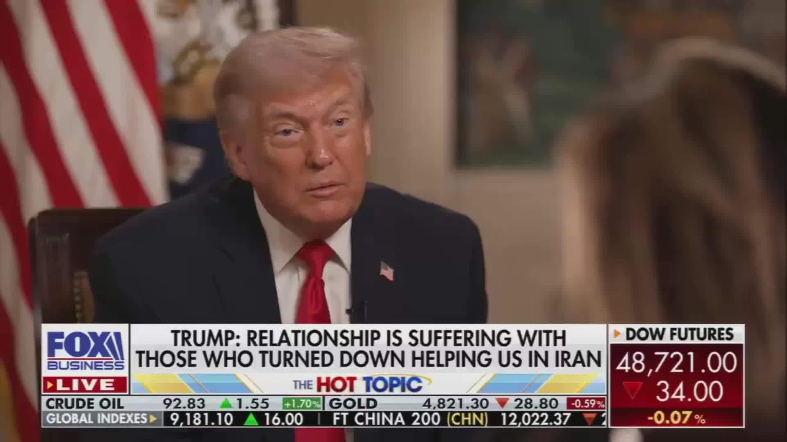

---

## 4

@有个梨GPT

发表于：2026-04-15 16:41

来源：微博

链接：https://m.weibo.cn/status/5288127446910613

我在google search的ai mode里问问题，得到的答案都是非常精简但信息量很大的，用词精确凝练我几乎会认真的读每一句。相比之下国产几个ai都是呼啦一下子好几千字出来但是信息密度很低，经常off topic，自己脑补的预设特别多。我需要补充大量信息限制它思考无关的可能性。

++++

这就是中文互联网上百度垄断搜索又对内容提供者没什么价值倾斜，各大互联网服务商不遗余力的搞自留地后花园的结果。

++++

过去三十年是中国教育崛起速度最快的三十年，照理说应该极大丰富中文语料内容才对，实际上相反。互联网企业难辞其咎。都是民族败类，历史罪人。

---

## 5

@sven_shi

发表于：2026-04-16 10:54

来源：微博

链接：https://m.weibo.cn/status/5288287267982096

很多网友压根光看新闻报导，压根就看不明白这几天热搜上这个法官性侵女当事人的事件。原因是媒体上故意把这个案子的难点给抹除了。首先我们要看这名女士的诉求。根据她的说法，她是和丈夫因为抢房子离婚，一审和二审先后判决她丈夫要补偿她28万和22万。到了25年9月份，她被再审法官提出性需求（有录音为证），在她拒绝后，10月份再审她就只剩下8万块了。

现在她提出的诉求是要对法官追责，同时纠正原先错误的判决。

这个案子的判决书早就公开在网上了。根据这份判决书，发现的情况恰好相反，是一审和二审明显错判。

这对夫妻确实是因为抢房子离婚，但是房子在父母名下，所以无法算作夫妻共同财产。整个案子是典型的没有夫妻共同财产可分，只有男方名下有旧车，压根就不值什么钱。

但是一审判决非常的离谱。法官把不属于男方的一辆旧的半挂车算成了男女双方的夫妻共同财产，而且还是按照新车的价格，算车给男方，让男方一共补偿女方28万。

男方不服，接着二审。二审做了调整，算了一部分折旧，变成男方补偿女方22万。

接着是男方花了8000块去给车做全面的第三方鉴定。到了再审，就是确认事实，车确实不是男方的。算下来共同财产先平分，男方要补偿女方6万。接着法官觉得太少，再让男方给女方2万。女方一共可以拿走8万。

那么你看判决书，就会发现这个案子真正有问题的，其实是一审和二审。为什么负责审判的法官，会把不属于男方的财产，算作夫妻共有，让男方给女方做高额的补偿呢？

在没有调查通报的情况下，目前只能推断说一审和二审的法官是同情女方，所以作出了这样的判决。但是再审的法官看见这些材料，同样在系统内，他肯定是知道为什么会判的那么离谱的，这肯定也和他后续找女当事人，提出性需求并试图猥亵有关。

所以要把这个案子讲明白，是不是要把一审二审再到再审的这条线讲明白？

当事人要的是公平正义。但是从结果上来看，反过来是对她有利的一审二审不公平不正义。

---

## 6

@数字生命卡兹克

发表于：2026-04-16 11:54

来源：微博

链接：https://m.weibo.cn/status/5288299611558245

Skill其实就是分类学！

最近也不知道为啥，看到大家对skill的热情高涨到了一种有点离谱的程度。

感觉万物都可以蒸馏，万物都可以封装成skill。

我看了好几个朋友的skill库，有的装了六七十个，最离谱的甚至都破百了。

昨天正好发了Harness的文章后，提到了我觉得skill就是分类学这个事，那一段出乎意料的被很多朋友转发。

所以我就再展开说一下。

一个好的skill，我觉得他的核心就两个词：

分类和触发。

一个多月前Claude还更新过一次他们的Skills生成器，我当时还专门写过一篇：网页链接，新版本最重要的动作，就是怎么用反馈去不断优化一个skill的触发条件。

skill怎么触发、能不能正确触发、触发以后能干什么，才是最核心的事。

之前有一篇论文发过实验数据，就是当Skills数量在20个以下时，准确率保持在90%以上，几乎不会错。超过30个准确率就不行了。到了200个的时候，准确率就剩20%了，而且速度极慢，Token消耗还爆炸。

跟我自己体感差不多，我自己的的Skills常年保持在30个以下。

我举个自己的例子，我之前想把NanoBanana的API封装成能被Agnet调用的skill，因为我平时有很多生图的需求，比如公众号封面图、小红书封面图、PPT配图等等。

那这些应该每一个需求单独做一个skill，还是应该合成一个skill呢？

我的做法就是只有一个图片生成的Skill，这个skill内部写了我的几个主流场景，在Agent触发这个skill后，根据我的上下文进行二次分析，再调用内部具体的分支画图场景，同时也能用这个skill，覆盖我其他的通用生图需求。

这其实就是分类学的核心理念。

从来不是只分的越细越好，是找到最合适的颗粒度。

界、门、纲、目、科、属、种，生物学就是如此，一层一层穿透下去。

你要是把前面全抹了，只给你留个种，你可以想象一下这个世界有多灾难。

封面图和PPT配图之间的差异，不值得在最顶层各自占一个独立的skill，它们只是图片生成这个类别内部的变异。

但图片生成和服务器管理之间的差异，那是真的大到需要各自占一个独立的skill。

我自己判断一个skill值不值得存在，标准就三条：

1. 它对应的场景有没有明确的边界。

2. 它对应的场景是不是会高频复现。

3. 它能不能归属进已有的skill里。

以及，奥卡姆剃刀原则，如无必要，勿增实体。

翻译过来就是，你用不到的skill你就别装。

但最重要的，还是需要你设计自己的分类系统，哪些是CLAUDE.md能处理的，哪些是skill该处理的。

分类学如此。

你的skill，也应如此。 

\#how i ai\# AI\#skills\#

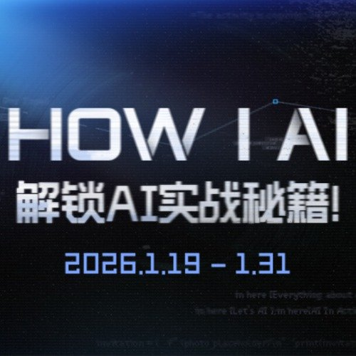

---

## 7

@渔老板钓鱼

发表于：2026-04-16 08:54

来源：微博

链接：https://m.weibo.cn/status/5288252262843876

这些年餐饮行业的高关店率

和外卖、团购发达有关系

外卖、团购的逻辑是流量为王

他们不希望商家有自己的不可替代性

……

平台希望实体店依托他的流量生存

于是，有特色、食材好的店很难生存，酒香不怕巷子深那是不可能的，平台人为让餐饮产生了信息不对称，比如你打开点评、抖音，不花钱买流量的店很难被你搜到。

平台喜欢扶持依赖他流量分发的店、这些店不可能有太多的成本分给食材，靠积累老顾客生存的老店很少，因为大部分还没等到积累老顾客，你就被高房租干死了。

所以现在新店开业，必须大折扣、大推流，不推流没生意，不折扣没转化。

平台最怕的就是这个店老顾客多，回头客多。

因为回头客多的店，不依靠平台。

---

## 8

@汪海林

发表于：2026-04-15 09:58

来源：微博

链接：https://m.weibo.cn/status/5288026056165815

看见有个二比乐评人说张译表演不行 说陈道明表演不行，他很安全，虽然他的话蠢出天际，他再胡扯也没事儿，因为他们是艺术家，他们不混粉圈也不可能网暴他，所以二比乐评人不是勇士是牛二碰瓷杨志。真正的勇士，是敢于说流量表演不行。而这，是事实。请问，在中国文娱界谁敢说事实？

---

## 9

@徐一邈

发表于：2026-04-15 03:48

来源：微博

链接：https://m.weibo.cn/status/5287932877342095

那没事了

---

## 10

@海豚佩佩

发表于：2026-04-16 13:55

来源：微博

链接：https://m.weibo.cn/status/5288330155525613

【以前我写过家长会的分享，培养孩子学习兴趣和信心，要向游戏设计去学习，我也强调了及时反馈、难度适中、失败安全。这篇文章讲得更加体系化，用了大量文献】

来源：视频号   认知便利店Mindmart

游戏化学习：破解孩子专注力密码

 一个孩子打游戏能连续坐六个小时，眼都不眨，水都不喝。同一个孩子写数学作业，八分钟就开始抠橡皮，撕纸条，上厕所。你觉得这是自律问题，意志力问题甚至是态度问题。美国罗切斯特大学有一组跟踪了12年的数据，在所有被家长定义为沉迷游戏的青少年当中超过87%在智力测试里属于中等偏上，也就是说，这帮孩子不笨，脑子转的比谁都快。

那为什么聪明的脑子偏偏对作业过敏？ 简麦格尼格尔在《游戏改变世界》里给了一个让全球教育界都安静下来的答案：游戏比你更懂你的孩子。这句话刺耳，但今天我会一层一层拆给你看。

游戏设计师到底用了什么手段抓住了孩子的注意力，而这些手段为什么恰好是学校和家庭一直在反着做的事？搞明白这套逻辑，你对教育的理解会翻一个面。

大部分家长对游戏的理解停留在一个词"好玩"，孩子玩游戏因为好玩，所以上瘾。斯坦福大学神经科学家安德鲁·休伯曼做过一系列关于多巴胺的实验，结论非常清楚：多巴胺的峰值不出现在得到奖励的那一刻，而是出现在预期即将得到奖励的那几秒。你点了外卖最兴奋的时刻，不是筷子夹到嘴里那一口，是手机显示骑手距离你200米的时候。

游戏设计师对这个规律烂熟于心。你打一个怪，血条一点一点掉，快掉完了背景音乐突然变调，屏幕边缘开始泛金光。这一整套视觉和听觉暗示全部指向同一个信号：你马上就要赢了。大脑里的多巴胺在这个瞬间达到顶峰。赢了之后呢？快感反而迅速回落。所以游戏会立刻抛出下一个目标：下一个关卡，下一个稀有掉落的可能性，让大脑永远停留在"快要得到"的高浓度多巴胺状态。

这就是所谓上瘾的本质。它绑架的不是快乐本身，是对快乐的期待。反过来看作业：一道数学题摆在面前，孩子对他的预期是什么？做对了没有奖励，做错了挨批评。大脑算了一笔账：投入注意力，预期收益接近于零，预期风险倒是不小。多巴胺系统直接判定这件事不值得启动。所以孩子走神、磨蹭、发呆不是态度有问题，是大脑的奖励预测系统在拒绝一笔亏本买卖。

游戏喂给大脑的是一条精心设计的多巴胺曲线，而作业递过来的是一片平坦的神经荒漠。在这种条件下还要求孩子靠意志力硬扛，相当于让一个人在空调房和桑拿房之间靠决心选择桑拿房。但多巴胺只是第一层。游戏工程师的手段远不止这些。

孩子的注意力被锁死还有一个原因跟时间有关。2019年，游戏用户体验研究机构EEDAR发布过一份报告：主流商业游戏的平均反馈间隔是2.8秒。什么意思？你在游戏里做任何一个动作：砍一刀、跳一下、点一个按钮，2.8秒之内屏幕上一定会出现一个回应：伤害数字弹出来，金币飞进背包，经验条往前跳一格。哪怕只是一个音效、一个震动都算2.8秒。

再看学校那边：一个孩子今天上课认真听讲了，认真做笔记了，回家按时完成作业了。他什么时候能得到一次系统性的反馈？期中考试，三个月以后。三个月对一个成年人来说都漫长，对一个十岁的孩子来说，相当于他人生的2.5%。你让他用人生的2.5%去等一次反馈，然后这个反馈很可能还是一个冰冷的排名和几句红笔批注。

简麦格尼格尔在书里用了一个概念叫"反馈密度"。他说游戏和传统教育之间最大的差距不是内容有趣不有趣的问题，是反馈密度差了几个数量级。人的大脑有一套因果确认机制：我做了一件事，我需要快速知道这件事有没有用。这个确认越快到来，大脑就越愿意重复这个行为；确认迟迟不来，大脑就开始怀疑我刚才的努力是不是白费了。怀疑一旦产生，动力直接坍塌。

哈佛商学院教授特蕾莎·阿玛比尔做过一个著名的日志研究，跟踪了238名职场人士的日常工作状态。他发现驱动人们持续投入的头号因素不是薪资，不是表扬，是感觉到自己在推进，在往前走。他把它叫做"小进步原则"。游戏把这条原则做到了极致：每一秒都有进度条在动，每一分钟都有成就在解锁，每一个小时都有阶段性战报在弹出。孩子的大脑不断收到确认信号：你的付出有用，你正在变强。而教育系统呢？一个孩子背了30个单词，第二天默写错了八个。老师画了八个叉，对了22个这件事没有任何视觉化呈现。大脑记住的不是"我进步了"，而是"我又错了"。反馈密度低还全是负反馈，这种组合对动力系统的杀伤是双重的。

但反馈密度也只是第二层。游戏还有第三层更精密的控制术：为什么孩子打游戏从不觉得太难了不想干？心理学家米哈里·契克森米哈赖提出过一个被引用了上万次的概念"心流"——就是一个人完全沉浸在某件事里，忘记时间，忘记饥饿，忘记周围环境的状态。他发现心流的触发有一个极其苛刻的前提条件：任务的难度必须比你当前的能力高出大约4%到8%。低了你会无聊，高了你会焦虑，只有卡在那个窄窄的通道里，大脑才会进入全神贯注的模式。

4%到8%这个区间窄到什么程度？学校根本做不到精确控制。一个班40个学生，数学水平参差不齐。老师出一套卷子：对学霸来说太简单，对后进生来说像天书，对中间那批学生可能刚好，但也只是可能。游戏行业把这件事做到了工业化精度。现在的商业游戏后台都有一套动态难度调节系统（DDA），它实时监测你的操作数据：你的反应速度、失误率、通关时间，然后偷偷调整下一关的难度。你打的顺，怪物悄悄变强一点；你连输三把，系统暗中降低对手的攻击频率。你自始至终感觉不到调整发生了，但你的体验始终停留在"有点难，但我再试一次应该能过"的区间里。这就是心流通道——游戏用算法帮你精确地待在那条通道里面，一秒都不让你掉出来。

你仔细回忆一下，孩子打游戏的时候嘴里经常蹦出一句话："再来一把"。这四个字就是心流状态的口头标志。他觉得自己离成功只差一点点，这一点点刚好够得着。同样的道理搬到作业上：一个五年级的孩子被布置了一道超纲的奥数题，他根本不知道从哪下手。努力了五分钟没有任何进展，挫败感直接拍到脸上；或者反过来，老师布置了50道口算题，每道他闭着眼都会做，纯粹是手部肌肉的重复运动，大脑完全不需要参与。无聊和焦虑两头反复拉扯，心流通道一次都没进去过。这就是为什么同一个孩子在游戏里可以死磕一个boss两小时不放弃，面对作业本却五分钟就瘫倒。不是他怕吃苦，是他的苦没有吃在那个刚刚好的点上。

心流解释了专注，但还有一件事它解释不了：为什么孩子在游戏里失败了不会崩溃，在考试里失败了却会哭、会逃避、会彻底放弃？这背后还有更深一层的设计。《游戏改变世界》里有一段话我反复读了很多遍。简麦格尼格尔说："游戏给玩家提供的核心心理体验是自主选择的失败。"注意这五个字："自主选择的"。一个孩子在游戏里挑战最终boss被打败了，他会愤怒、会不甘心，但他不会觉得自己是个废物。为什么？因为这个挑战是他自己选的。他可以选容易的关卡，但他偏要打难的。输了是暂时的，再试一次就好了，没有任何人会因此否定他的价值。

再看现实：考试的内容不是他选的，考试的时间不是他定的，坐在哪个考场、用多长时间、必须答对多少分才算合格，全部是别人规定的。在这种条件下，失败性质完全不同：他不是"我选择了一个挑战没通过"，而是"别人给我设了一道坎我没迈过去"。前者激发斗志，后者制造羞耻。

自我决定理论的提出者爱德华·德西和理查德·瑞安做过长达30年的跟踪研究，结论指向三个人类最底层的心理需求：自主感、胜任感、归属感。游戏对这三样东西的满足几乎是教科书级别的： 

自主感：你选什么角色、走什么路线、先打哪个任务，全部自己说了算 

胜任感：游戏的难度曲线确保你始终觉得"我可以" 

归属感：公会组队排行榜，你永远不是一个人在战斗 

现实教育呢？ 

自主感：今天学什么、怎么学、学到什么程度，全部由课程大纲决定，孩子几乎零选择权 

胜任感：考试排名机制确保永远有一半人在平均线以下，"我不行"的感觉持续累积 

归属感：成绩不好的孩子在班级里的社交地位往往也靠后，被忽视甚至被孤立 

三个基本需求全面落空。你让孩子爱上学习？这比让一个人爱上一份没有工资、没有晋升空间、同时还天天冷脸的工作更难。游戏不是让孩子堕落的毒药，他只是做了一件教育系统一直没做的事：让孩子觉得"我在这件事里是有价值的人"。

理解了这层问题就变了方向。该问的不再是"怎么让孩子戒掉游戏"，而是"怎么把游戏里那套东西搬到学习里来"。麦格尼格尔在书的后半部分做了一件很少有学者愿意做的事：他直接给出了操作方案。他说："游戏化不是把作业包装成游戏的样子，贴几个贴纸、搞一个积分榜就完事了。那是最表层的模仿，跟本质差了十万八千里。真正的游戏化是把游戏的四根支柱搬进日常场景：目标可视化、反馈即时化、难度个性化、失败安全化。"

目标可视化：游戏里你永远知道下一步该干什么，任务栏清清楚楚挂在屏幕右边。家长可以做同样的事，把"好好学习"这种虚无的指令拆碎，变成"今天把第三章的六个公式默写出来"。目标越具体，大脑的奖励预测系统越容易启动。

反馈即时化：不要等到期末才告诉孩子他哪里做得好。每天甚至每小时都可以给反馈。一道题做对了，一句"这一步推导很漂亮"比什么都管用。这不是表扬，是确认。大脑需要的是信号确认，不是糖衣炮弹。

难度个性化：这一点最难，也最关键。你得观察你的孩子现在的能力边界在哪里，给他略微超出边界的挑战。不是所有的题都让他做：太简单的跳过，太难的暂时搁置，让他始终保持在那个"踮踮脚够得着"的区间。

失败安全化：这一点最被忽视。很多家庭的教育环境里，失败的代价太高了：考砸了会被骂，排名下降会被罚，一次失误可能换来冷暴力。在这种环境下，孩子当然选择逃避难度、选择不尝试、选择躲进游戏。因为游戏里失败的代价是零，大不了重来一局。

韩国首尔大学教育学院2021年做过一个对照实验：把一个班的家庭作业系统改成了游戏化模式——任务分成可选关卡，完成后及时弹出进度反馈；错题不扣分，而是提供"再来一次"的选项。三个月后，这个班的作业完成率从61%升到了94%，学生自评的学习投入感提高了两倍多。没有人逼他们，规则变了，行为就变了。

游戏设计师花了40年研究一个问题：怎么让人心甘情愿的做困难的事？他们找到了答案。这个答案就摆在那里，就看教育愿不愿意弯腰去捡？

整件事说到底只有一个核心：孩子的大脑不是一块等待刻字的石头，它是一台时刻在计算投入产出比的精密仪器。游戏没有发明什么魔法，他只是尊重了这台仪器的运行规则： 

给他匹配的难度，他就进入心流 

给他及时的确认，他就愿意重复 

给他选择的权利，他就承担后果 

给他安全的试错空间，他就敢于挑战 

这些规则不是游戏设计师创造的，是几十万年进化刻进人类神经回路的本能反应。游戏顺着这套本能走，所以孩子跟着走；教育逆着这套本能推，所以孩子拼命跑。

也许将来有一天，我们会意识到：教育最大的竞争对手从来不是游戏本身，而是教育自己对人性的傲慢——以为"我是为你好"可以替代我理解你的大脑怎么运转。一个不研究用户需求的产品经理做不出好产品，一个不理解孩子神经机制的教育方式同样走不远。知识从来不缺，缺的是让知识流进大脑的那条通道。 

\#海豚育儿系列\#

---

## 11

@李逾求

发表于：2026-04-16 08:55

来源：微博

链接：https://m.weibo.cn/status/5288250730352191

武侠作者常常容易出现的一个赘余，是句口水话：就在这时。

大多数时候，这四个字都可以毫不留恋地删掉，不但不会减少动作的紧张性和转折感，反而做出了更好的链接。

这方面做得比较好的是古龙，因为“就在这时”前后衔接的句子少，短，四个字的比重太大，一眼可以发现它的突兀和赘余，金庸风格作品出现得多一点，因为前后衔接的句子长一些，多一些，似乎必须得有这么个“四字链接”，但去掉之后，或者直接去掉，或者做出其他调整，其实也能处理得更好。

---

## 12

@36氪

发表于：2026-04-15 14:00

来源：微博

链接：https://m.weibo.cn/status/5288086784189283

【智谱让微信支付宝躺赢了】

最近几天，X上的一些AI博主，突然开始提及一个与AI不相关的问题：怎么注册支付宝/微信支付等中国支付工具。

这个看似和AI不相关的讨论，起源于一个智谱GLM Coding Plan用户的吐槽：同样的Max套餐，中国用户的费用是469元每月，约合68美元每月，而海外用户则要160美元每月，贵了一倍还多。

过去许多年里，互联网世界这种跨区“省钱”的方式，经常出现在中国用户群体中。

谁也没想到，到了2026年的AI时代，跨区这件事一下子“风水轮流转”了，变成了海外用户开始研究怎么注册支付宝，去买中国AI企业的Coding套餐。

\#氪君领读\#

1、区域差价其实是全球SaaS行业的常见策略

出现“同模型不同护照价格”并非特例，本质上一种差异化运营。但也造就了一众海外用户开始研究起来国区CodingPlan，以避开这一新时代赛博“西方税”的奇景。

2、国产模型厂商相继宣布涨价

从行业层面看，中国模型公司通过这种低价高配额的CodingPlan，去争夺全球开发者的时期已经告一段落。全面涨价背后，是国产模型已经在商业化市场上与头部模型公司正面拉开架势。

3、国产模型的低价时代正在迎来终结

随着国产模型在能力输出、稳定性、安全性和生态支持上逼近头部模型，以及全球模型调用供需关系的变化，国产模型的低价时代正在迎来终结。

详情请阅读：智谱让微信支付宝躺赢了，本文来自“字母榜”，作者：李炤锋，编辑：王靖。

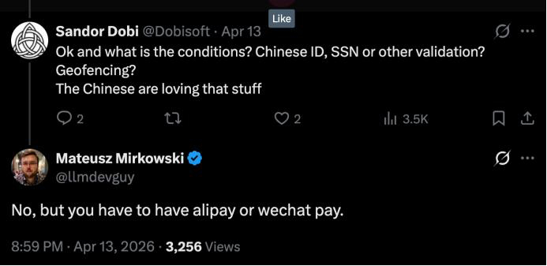

---

## 13

@数字生命卡兹克

发表于：2026-04-15 02:57

来源：微博

链接：https://m.weibo.cn/status/5287920132950788

一文带你看懂，火爆全网的Harness Engineering到底是个啥。

最近这个词实在是太火了。

Harness Engineering。

我刷推刷到，朋友圈刷到，群里也在聊，微信指数又莫名其妙一根穿云箭了。

几乎每隔两三天就有人来问我，卡兹克你能不能讲讲这个Harness到底是什么。

所以想了想，我还是尽我可能，花了将近一整天的时间，给大家写一下我理解的Harness Engineering到底是个啥。

大家其实不要觉得AI行业喜欢造概念或者喜欢搞抽象，主要还是AI这玩意实在变得太快了，很多东西也都是随着时间和行业的发展不断的前进的。

一个东西在24年可能还满足当时的语境，但是25年可能就不够了，因为模型的进步速度太快了，于是25年大家只能用一个新的词来解释，结果，26年，这个词又不够用了。

这个大概就是如今的现状。

跟AI跟的比较久的朋友，可能已经能猜到我上面说的是哪几个词了。

Prompt Engineering，Context Engineering。

还有今天的Harness Engineering。

这三个词，几乎完美地标记了我们跟AI协作方式的三次进化。

而我恰好，这三个阶段都亲身经历过。

从2023年大家都在研究怎么写一个好Prompt，到2025年开始研究怎么给AI更好的塞上下文，到现在2026年，大家开始聊，怎么给AI设置马具。

三年。

说短不短，说长也不长。

但回头看，这三次变化，其实都映射的，是我们人类对AI的认知。

打个游戏玩家都能秒懂的例子吧。

第一阶段，就是你在玩《只狼》这种动作游戏。

也就是每一招格挡、每一次见切都得你手搓，按一下键它出一招。

一招没按对，屏幕上就会出现巨大的死。你就是AI唯一的操作者，AI每一个动作都得你亲自按键下令，动一下回一下，也就是我们传统的ChatBot。

第二阶段，就是你在玩类似《金铲铲之战》这种自走棋。

你其实可以不用再自己手搓每一个动作了，你的活其实全在前期配置。

选英雄、凑羁绊、配装备、排站位。

配完了，棋子就自己上场打回合，你只能吃瓜看戏。而决定胜负的，全靠你前期把信息和资源喂得对不对。

这一个阶段，就是模型能力还不够强的时候的前Agent时代。

第三阶段，就类似是你在玩《全面战争》这种即时战略游戏。

场上几千个单位自己在跑，你根本摇不过来每一个兵，只能靠编队、阵型、AI指令、战场规则去驾驭整盘战局。

单位越聪明、越自主，你越得靠一整套系统去约束它们的行为。

从操作一个角色，到带一个小队，再到指挥一整支军队。

玩家的控制粒度越来越粗，AI的自主度越来越高，你需要的约束方式也越来越系统。

而这三个阶段，我觉得就对应了Prompt Engineering、Context Engineering、Harness Engineering的三次跃迁。

所以，聊Harness Engineer到底是什么，我觉得最重要的，就是你要知道这一路的跃迁究竟是什么样的。

想理解现在，最好的方式，就是读懂历史。

所以，今天这篇文章，我就希望能真的让你明白Harness Engineering到底是个啥，它的来龙去脉，以及他能解决的问题。

如果你是技术大佬，希望能给你提供一些新的思考角度，如果你是非技术的小白用户，我也会尽量让你看得明白。

话不多说，我们开始。

先从头捋。

先把时间倒回到2023年。

2022年底到2023年，ChatGPT横空出世，整个世界炸了。

我还记得23年的春节，春节回来之后，所有人都在聊ChatGPT，而那之后，那段时间最火的一个词。

就是Prompt Engineer，提示词工程师。

当时硅谷可以给Prompt Engineer开出了年薪30万美金的offer。

然后国内也是，23年的图，大家肯定都见过。

然后当时有无数的Prompt框架出现，因为彼时模型智能水平不够，所以很多时候，模型的输出不稳定，我那时候还在做AI产品，这里可以提一嘴，国内金融领域的第一个算法备案是我拿的

我们每天做的最多的事，其实就是在Prompt上做约束，怎么设计好Prompt，能让模型输出更稳定的json格式，从而跟我的数据库进行交互。

当然，也有另一部分，就是写好Prompt约束，让模型生成更好更稳定的回答。

那个年代，同一个问题，你换一种问法，AI给你的答案质量就可能会天差地别。

比如你直接问ChatGPT“帮我写一篇关于AI的文章”，它给你吐出来的东西大概率是一坨正确的废话。

但你如果说“你是一个科技领域的资深记者，风格偏口语化，擅长用类比来解释复杂概念，现在需要写一篇3000字的文章，主题是AI对普通人生活的影响，要有具体案例，语气不要太正式”，那出来的东西就完全不一样了。

所以你看，Prompt Engineering那个年代，做的最多的事就是怎么设计Prompt，能让AI给你最好的回答。

这事儿在2023年确实是有价值的，因为那时候大模型刚出来，输出也确实不稳定，大家都还在摸索跟它交流的方式。

谁能把问题问得更好，谁把Prompt约束的更好，就能从AI那里榨出更多价值，这个技能差异是真实存在的。

但问题来了。

2024年下半年开始，一个趋势越来越明显，就是模型越来越聪明了。

你不用再像伺候大爷一样去精心构造Prompt了，Claude 3.5 Sonnet出来的时候，你随便跟它说句话，它都能理解你的意思，那个时候我记得我还写了李继刚的汉语新解，也算是一代风潮。

那个时代，Prompt技巧的边际收益在急速下降。

因为人们发现，当模型足够聪明的时候，你怎么问已经没那么重要了。

重要的是，你问的时候，它手里有没有关于你问题的足够且合适体量的信息，在有限的性能之下，来给你一个好答案。

所以我后来甚至都发了一篇文章，我觉得那些Prompt技巧真的没啥用，核心的是6个心法：分享6个平时我最常用的Prompt心法。

至此，这就引出了第二个阶段。

2025年年中，Andrej Karpathy转发了一条推，大概意思是说，赞同把Context Engineering放在Prompt Engineering之上。

因为在实际的工业级AI应用里，真正的活不是在那雕花一个Prompt，是需要更多的考虑工程化，要精心设计AI的上下文窗口里到底该塞什么信息。

因为那个年代，上下文窗口真的太小了。

Karpathy的原话是，Context Engineering是“填充上下文窗口的精妙艺术与科学”。

于是，Context Engineering，上下文工程，这个概念在2025年下半年迅速成为了所有做AI应用的人的共识。

因为他确实切中了当时行业人们的痛点。

在这里我还是想再次表达一下，很多时候，造词这事分两种情况，有一种我觉得就是为了炒概念，比如xxx 4.0，而有的时候，真的只是行业太快，人们更需要一个精准的表达。

词语，从来都是为表达而服务的。

Context Engineering解决的问题，就类似于你让AI帮你改一段代码，如果你只给它这段代码本身，它可能改得乱七八糟。

但如果你同时给它这段代码所在的文件、相关的依赖、项目的技术栈说明、团队的代码规范，它改出来的东西质量会高几个量级。

而如何优雅的、省Token的给出最精准的信息，就是真正的Context Engineering。

这里我依然觉得，让我学到的最多，还是Manus的25年7月18号发的那篇文章。

到这里，其实已经比Prompt Engineering进了一大步了。

人们开始研究的是，从怎么约束单个Prompt，变成了如何在有限的上下文空间里，尽可能的给模型精准的信息。

就这样，过了又将近8个月的时间。

Harness Engineering正式登上了属于它的舞台。

如果是我自己印象中，第一次在AI领域看到关于Harness的描述，应该是去年11月Anthropic发的blog。

这篇报告解决的核心问题是，就是如何让Agent跨越多个上下文窗口有效工作而不丢失状态。

他们把他们的Claude Agent SDK称为，"一个强大的通用Agent Harness"。

不过他们并没有用Harness Engineering这样的描述。

直到2026年2月，OpenAI的一篇Blog，把Harness Engineering写在了巨大的标题上，于是，Harness开始正式进入大众视野。

这篇也是有价值内容极多的一篇文章。

大概说的就是，OpenAI内部有一个团队，用了五个月的时间，用Codex搭了一个将近一百万行代码的产品。

其中人类手写的代码量，是0行。

所有代码都是Codex Agent生成的，人类工程师全程没有写一行代码。

人类工程师做的工作，就是一直在做Harness Engineering。

他们在设计架构边界，制定依赖规则，写自动化测试，配置lint规则，搭建CI/CD流水线，设计反馈循环机制。

他们在建一个笼子，一个让AI Agent能在里面安全、高效、可控地干活的笼子。

这个笼子，就叫Harness。

Harness这个词，来源于马具，就是马鞍、缰绳、嚼子那一整套东西。

马是一种非常强大的动物，速度快、力量大，但如果你不给它套上缰绳，它大概率会跑偏，甚至把你甩下来。

就像那句著名的台词：“马看到什么，是人决定的。”

Harness的作用，就是把这股野蛮的力量，引导到你需要的方向上。

AI Agent就是那匹马。

模型现在本身的能力已经极其强大了，它能写代码、能做分析、能跟外部工具交互、能自主决策。

但如果你不给它套上Harness，它就会跑偏，会犯错，会在你不知道的地方搞出幺蛾子。

所以，Agent = Model + Harness。

这个公式是LangChain在博客上提出来的，我觉得这可能是2026年到目前为止，关于AI工程最精辟的一句话。

虽然Birgitta Böckeler说这个定义很泛，但是我觉得还是很形象的。

模型是马，Harness是缰绳，光有马不行，你还得有一整套驾驭它的系统。

昨天我发的文章，其实一直在强调一个理念，叫约束先行。

其实这就是Harness Engineering中很重要的一环。

而一个真正的Harness到底长啥样呢，Birgitta我觉得写的框架我觉得还是比较清晰的。

她分成了两类控制机制。

第一类叫Guides(feedforward controls) ，引导。

就是在AI行动之前，提前给它设好规则，让它沿着正确的方向走。

这有点像高速公路上的护栏，你不需要每一秒都去纠正司机别开到山沟沟里，因为只要护栏在那里，车就几乎不会开到山沟沟里面去。

CLAUDE.md文件就是一种Guide，代码规范文档也是，架构决策记录也是，这些东西在AI动手之前就已经在那了，它们是前馈控制。

第二类叫Sensors (feedback controls) ，检测器。

就是在AI做完事之后，用各种手段去检测它做的对不对。

自动化测试是Sensor，代码lint是Sensor，CI流水线也是Sensor，它们是反馈控制。

好的Harness，是Guides和Sensors的组合，前者防患于未然，后者亡羊补牢，两个加在一起，形成一个闭环。

而每当你发现Agent犯了一个错误，你就花时间去设计一个方案，让它永远不可能再犯同样的错误。

这就是Harness Engineer的日常。

从来都不只是在写代码，最重要的工作，其实都是在设计一个让Agent如何不再放错的系统。

就像我昨天那篇文章里面聊得，就是Claude Code的规则体系怎么从全局CLAUDE.md一层一层穿透到项目级、再到文件夹级的事，约束从上往下走，一层管着一层。

这个其实虽然非常的简单，但是底层逻辑，其实跟OpenAI在那个百万行代码项目里做的事是一模一样的。

他们强制定义了一套分层架构，Types → Config → Repo → Service → Runtime → UI，六层，每一层只能依赖它下面的层，不能反向依赖。

有了约束，速度才不会下降，架构才不会漂移。

规则从来不是靠口头约定，是靠自动化测试来强制执行的。

如果你非要我给Harness Engineering定一个最核心的概念。

那我还是想用我昨天说的那4个字。

约束先行。

就像我们所设计的权限系统，你可以给AI Agent设置不同级别的权限，有些操作它可以自己做，有些操作它必须先问你，有些操作它绝对不能碰。

比如读文件可以它自己来，删文件必须先问，而像格式化硬盘这种操作，你永远想都别想。

所以你其实回过头来看，这三个阶段的演变很有意思。

Prompt Engineering的时代，AI是一个聊天机器人。

你跟它的交互方式是一轮对话，你说一句，它回一句。

在这个模式下，你唯一能影响输出的杠杆，就是你的Prompt，所以大家拼命研究怎么写Prompt。

Context Engineering的时代，AI变成了一个助手。

它不再只是回答问题，它开始帮你做事了，它要读你的文档，理解你的项目，调用你的工具，在这个模式下，光靠Prompt不够了，你还需要给它提供充足的上下文。

Harness Engineering的时代，AI变成了一个自主行动的Agent。

它不是在等你的指令，它可以自己在那跑，它自己写代码，自己测试，自己提交，自己部署。

在这个模式下，Context也不够了，因为Agent是自主运行的，你没法一直盯着它。

你需要一个系统来约束它、监控它、在它犯错的时候自动纠正它。

所以这三个阶段的演变，对应的其实是AI角色的三次升级。

聊天机器人 → AI助手 → 自主Agent。

而你，跟它的关系也变了。

其实我上个月也写过一篇短文，叫能用脚本就别用Agent，讲的就是脚本→Skill→Agent这个金字塔。

这个思路其实也跟Harness Engineering的理念差不多，能用确定性规则约束的地方就用规则，能用自动化检测的地方就用检测，只有那些真正需要判断力的部分，才留给Agent自由发挥。

你不会用大炮打蚊子，同样的道理，你也不该在可以用确定性规则解决的地方引入不确定性。

所以啊，其实3个时代的Engineering，从来都不是什么替代关系，而是一层一层升维、随着时代前进的嵌套关系。

Harness Engineer需要懂Context Engineering，因为给AI提供正确的上下文信息本身就是Harness的一部分。

Context Engineer也需要懂Prompt Engineering，因为最终跟AI沟通的单元还是一条条的Prompt。

每一层都没有过时，只是被更大的框架包裹住了。

那我知道，看到最后，你可能会问了，我又不是程序员，Harness Engineering跟我有什么关系？

这是个好问题，我也知道很多看我文章的朋友不是技术背景。

我自己更不是程序员出身，我是用户体验设计师。

坦率的讲，Harness Engineer这个角色，目前确实主要出现在软件开发领域，因为现如今，AI Agent目前最成熟的落地场景，那就是写代码、开发产品。

但我觉得，Harness Engineering的思维方式，其实是普适的。

比如很多朋友现在用AI做任何稍微复杂一点的事情，可能都会遇到这种问题，比如AI有时候莫名其妙就跑偏了，你得反复纠正它。

这就是缺少Harness。

比如你能不能给AI设一些规则，让它在这些规则的框架内干活？比如你让AI帮你写邮件，你能不能事先告诉它，「永远不要用感叹号结尾」「收件人是老板的时候语气要正式」「涉及数字的时候要double check」。这就是你的Harness。

比如你能不能设计一些检查点，在AI输出之后自动验证？比如你让AI帮你做数据分析，能不能设一个规则让它每次算完都自己验算一遍？这也是Harness。

20世纪的伟大科学成就之一，控制论，里面最核心的一个思想，就是任何复杂系统的稳定运行，都依赖于反馈机制。

恒温器之所以能保持房间温度恒定，从来都不是因为它知道应该是多少度，是因为它有一个传感器能感知当前温度，然后跟目标温度做比较，然后不断的进行调整。

这些思维方式，就是Harness Engineering的内核，从来不是说，让你直接做技术去写代码，是需要你思考清楚，怎么让AI在我不盯着的时候也能干好活，是如何设计一个系统，能让你不用盯着的时候，这个系统也能自己运行起来。

其实我们驯服AI的过程，真的跟人类驯服大自然的历史，也有着极高的相似度。

最早人类学会用火，你得小心翼翼地喂它柴火，火太小不行，太大也不行。这是Prompt Engineering，你的每一次输入都直接决定输出。

后来人类学会了建炉子，你把火关在一个结构里，通过调节进气口和烟囱来控制火势。这是Context Engineering，你通过设计上下文来影响火的行为。

再后来人类发明了蒸汽机，火不再是你直接操控的对象了，它在一个精密的系统里自动运行，有锅炉、有气缸、有调节阀、有安全阀，你无需再管火怎么烧，你管的是这套系统怎么设计。这是Harness Engineering。

从火焰到蒸汽机，人类花了几千年。

从Prompt Engineering到Harness Engineering，AI只花了三年。

甚至我觉得，如何使用AI演变到最后，其实就是人类历史上出现的那一门一门的古老的学科。

Harness就是控制论。

Skill其实就是分类学。

Prompt其实就是语言学。

Context其实就是信息科学。

Reasoning其实就是认知心理学。

多Agent协同其实就是管理学。

所以，很多人天天说什么文科已死，我每次都会说这是放屁，从来没有什么文科已死理科已死的。

这世界就不应该再分文理。

两端融合，才是真正的王道。

多学科融合背景，有理工科的严谨，有文科的审美。 

有结构化的理性，也有人文的洞察。

这样的人，在未来十年里，我才觉得会是整个社会里，能把AI、Agent用的最牛逼，同时也是未来最稀缺的那批人。

所以，根本不要焦虑。

Harness Engineering根本不是什么新词。

它就是人类几千年来一直在做的那一件老事。

就是怎么把一股更快、更强、更不受控的力量，安全地、持续地、可复制地，引导到我们想要的方向上去。

火是这样，蒸汽是这样，电是这样，核能也是这样。

从我们学会用火开始，那几十万年的历史。

从来都是这样。

只不过，这一次，轮到AI了。

仅此而已。

当一个东西比你更快、比你更强、比你更自主的时候，你怎么还能让它，为你所用。

这件事，你的祖先做过，你的父辈做过。

只是现在。

轮到你了。

 \#HOW I AI\#AI

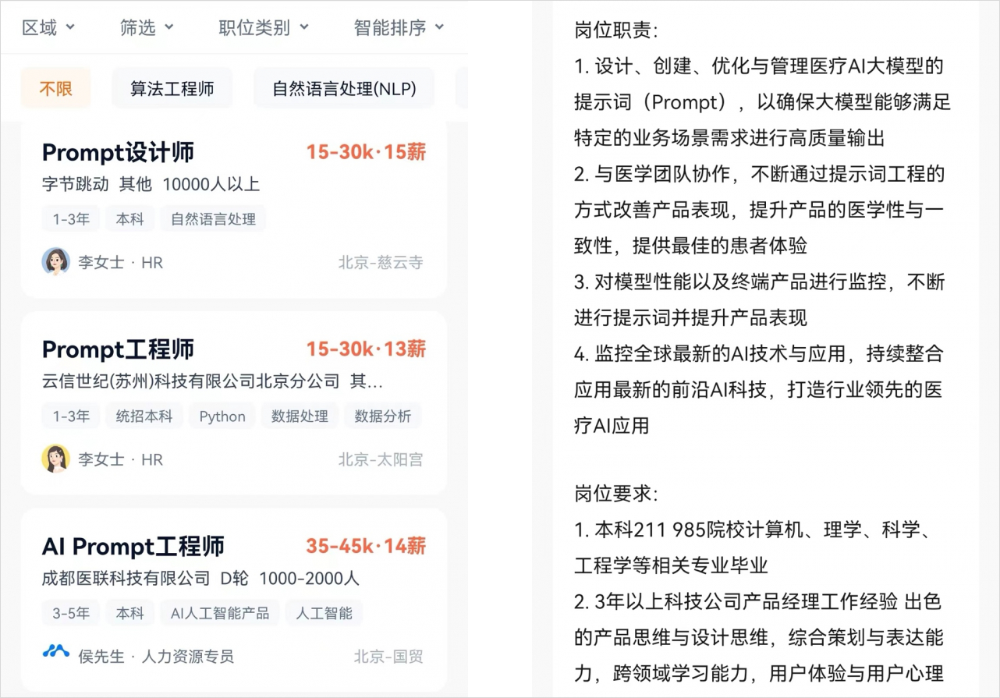

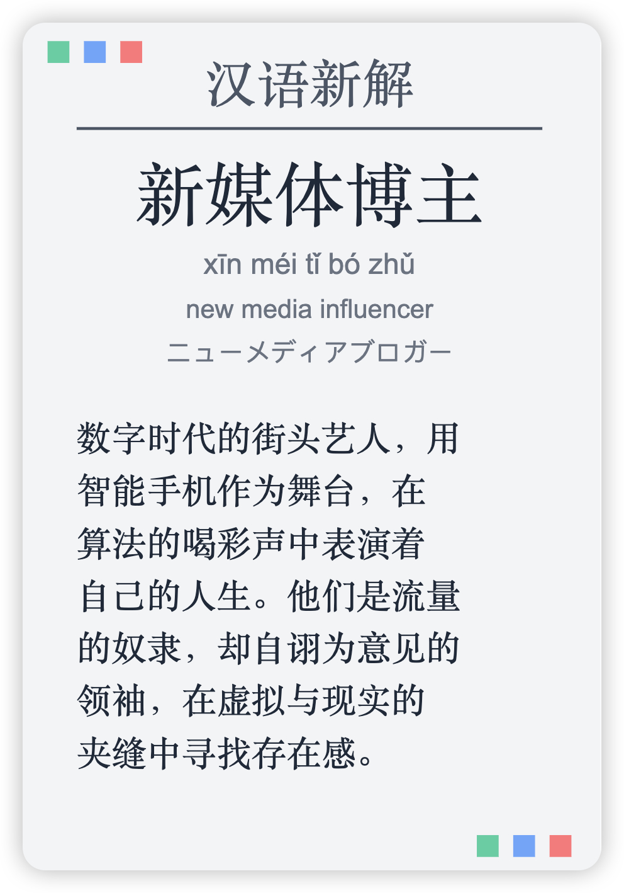

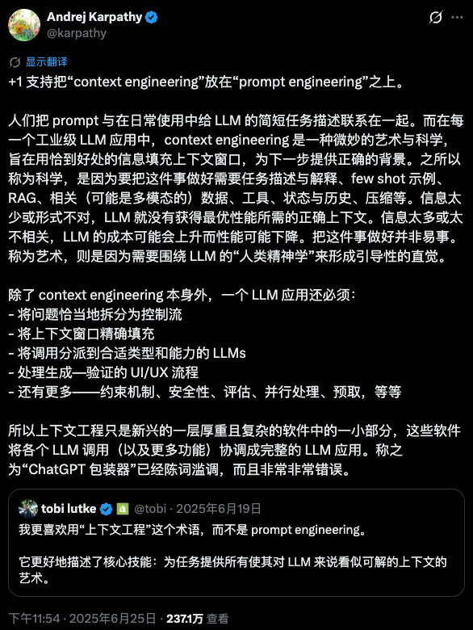

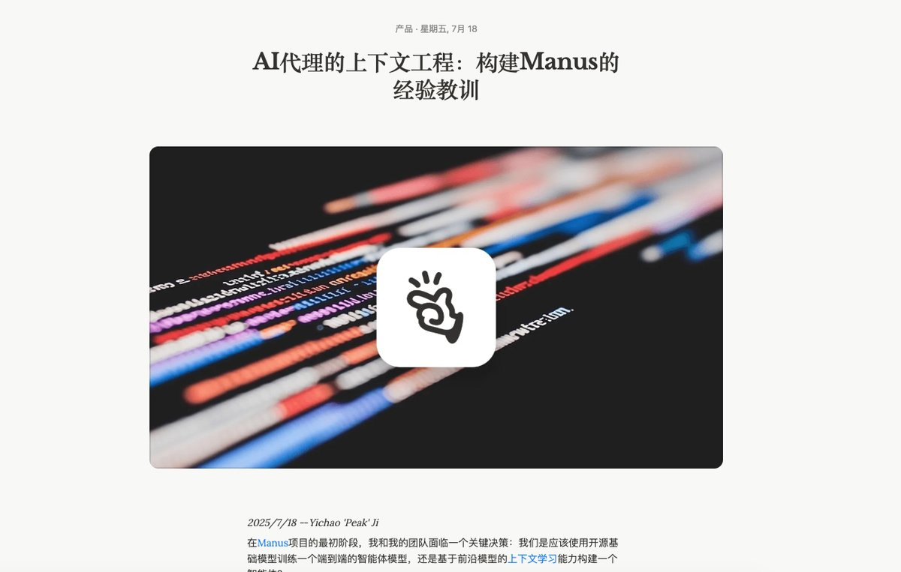

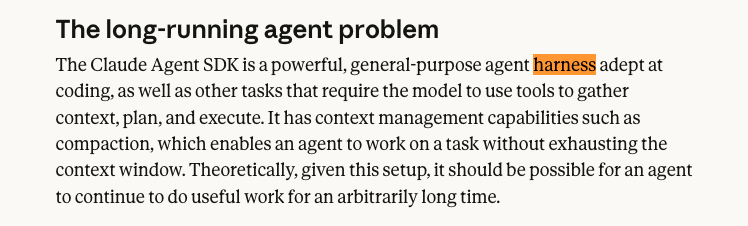

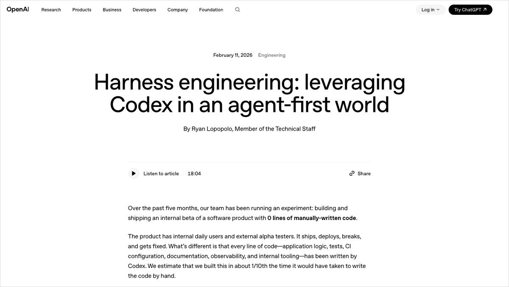

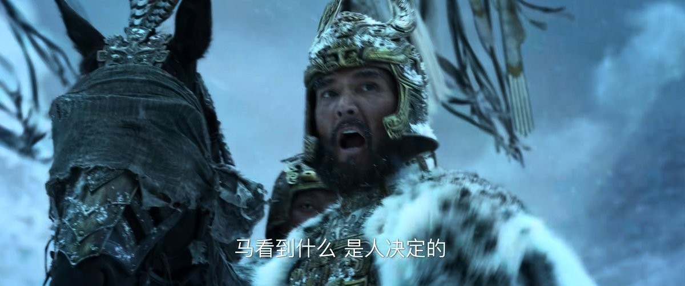

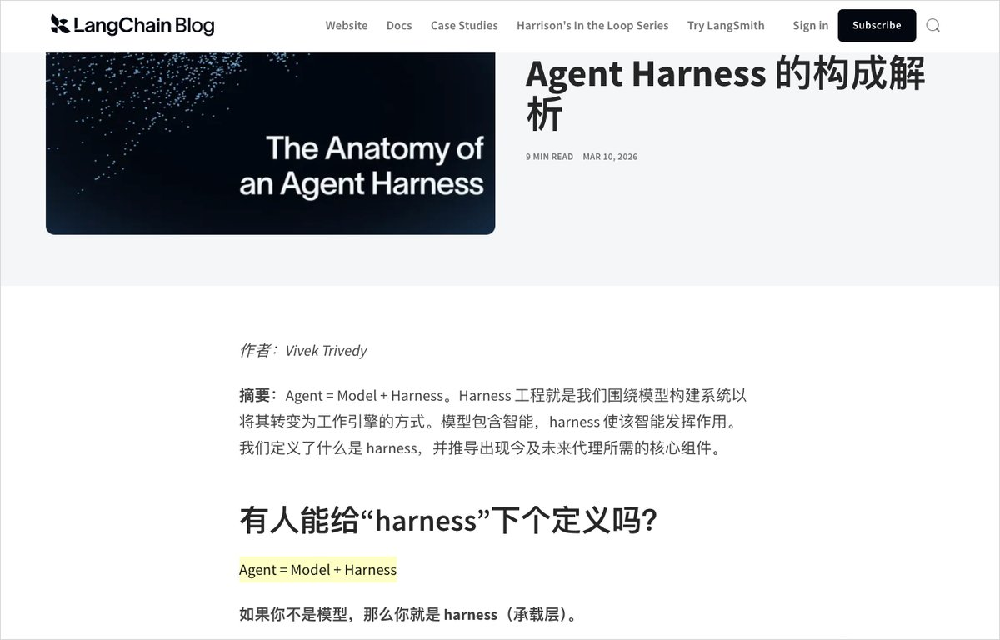

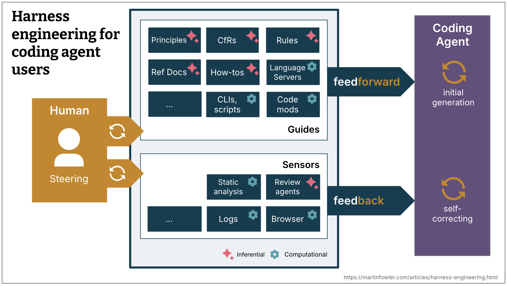

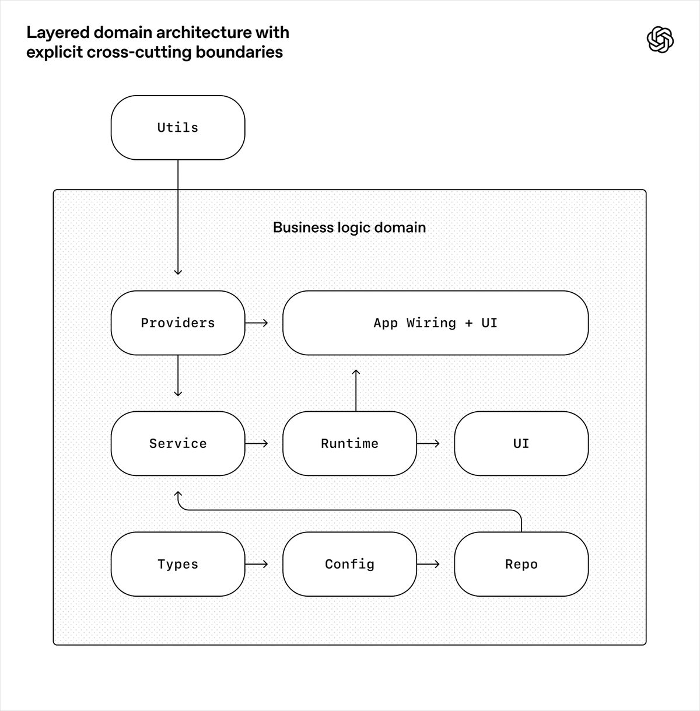

---

## 14

@菜鸟耶夫斯基

发表于：2026-04-15 11:47

来源：微博

链接：https://m.weibo.cn/status/5288053333819677

坦克提供防护的含金量还在持续上升中。

根据多国报道的这个战例，在俄乌战争中，一辆坦克在遭受52次无人机攻击后仍完好无损并成功撤离，体现了坦克防护水平依然是地面装备中的顶流。

在顿涅茨克前线的战斗中，一辆乌军的豹1A5坦克遭受了俄军无人机的袭击，坦克车组人员迅速撤离，在共计52次袭击结束后，车组人员返回坦克，重新启动发动机并自行撤离了。

网络上大量无人机击毁坦克的摄像画面，其实有一定的幸存者偏差效应，并不是一架FPV就能点爆一辆坦克。战场上不断摸索的防无、反无措施，其根本目的是继续增加平均击毁一辆坦克所要进行的公里行动次数，提升坦克逃脱或者成功冲击到目的地的概率。（图仅做同型号示例，不代表涉事坦克的改装状态）

---

## 15

@刘晓光Savvy

发表于：2026-04-15 12:05

来源：微博

链接：https://m.weibo.cn/status/5288057872848727

为什么职场人很难做好自媒体？

职场人做自媒体的失败率，要远高于街溜子，最大的惨案就是曾经的百度副总，如果不做自媒体没事，做了以后工作直接丢了。

很多职场人被忽悠报了班，辞职了，做了几个月自媒体，然后又灰溜溜回去上班了。

做不好的根本原因，其实就是表达范式不一样。

职场人的表达范式，是领导满意制，一切为了让领导满意。

而领导满意的标准是清晰可见的，基本上就那么几个标准。

所以职场人的文书和表达，本质上跟八股文没什么区别，枯燥无聊，不新鲜。

但是自媒体的表达，逻辑和框架不是最重要的。

最重要的是情绪饱满，语气坚定，感染力强。

没有坚定信念和感染力的内容，不论逻辑多么缜密都不可能得到关注。

职场人缺的恰恰就是感染力和坚定信念，因为你在职场敢这么自信，领导就得收拾你了。

所以职场人很难在两种身份间切换。

保留了社畜习惯的人，就过于容易在自媒体领域吃瘪。

但是公务员做自媒体，成功的概率就不少。

这是因为公务员接触群众很多，积累了丰富的故事素材，而且在面对群众时候，如何说服群众，如何沟通，如何给群众情绪感染和确定性。

很多公务员，尤其是基层公务员，都十分精通。

所以他们转型做自媒体，有不少是非常成功的。

---

## 16

@李建秋的世界

发表于：2026-04-15 12:13

来源：微博

链接：https://m.weibo.cn/status/5288060016140840

关于中国增量到什么时候减这个问题，创造财富的始终是人。

中国现在在什么阶段？你不用猜，你就看现在这一代头部的几个企业家都是什么年纪。

华为，任正非已经基本退了，轮值是徐直军，60年代的人。

雷军也是60年代的人，60末。

王兴70年代的人，70末

马化腾（1971年）

丁磊（1971年）

李斌（1974年）：蔚来

何小鹏（1977年）：小鹏

现在你能看到的比较新的一代人：

张一鸣，83年。

黄铮，80年

宿华（1982年）与程一笑（1985年）快手

汪滔（1980年）：大疆

李想（1981年）汽车

许仰天（1984年）：SHEIN

梁文锋，deepseek，1985

90后：

杨植麟（1991年）Kimi

刘靖康（1991年）：影石创新

如你所见，90后这一代还没全面崛起，就90头的那几个冒尖了。

甚至85后到90出现较大的空缺，我猜测未来还是要填的。

80后这一代刚好是当打之年，

00后什么样现在还不知道，但是00后培养方式和80后，90后差不多。

目测不会比80后90后差。

其实社会的交替更新远比很多人想的要慢。

你说什么时候减量，那说不清，至少要等到一代人真的快乐教育起来。

10后现在还在做题呢。

---

## 17

@观察者网

发表于：2026-04-15 12:46

来源：微博

链接：https://m.weibo.cn/status/5288068162261398

【\#伊朗遇袭期间大量美国造通信设备失灵\#，涉思科、飞塔和瞻博网络等品牌】 4月14日，据伊朗法尔斯通讯社报道，在美国对伊朗伊斯法罕省攻击期间，伊朗境内大量的美制通信设备同时脱机，或操作系统崩溃。

据悉，出故障的通信设备全部来自美国的思科、飞塔和瞻博网络等品牌，或基于MikroTik RouterOS操作系统。

伊朗认为，该现象更像一个预埋好的网络攻击。当时伊朗与国际互联网几乎完全阻断，但发生时间点又如此精确，显得“来自境外的普通网络攻击”猜测难以成立，更像是设备内部埋藏的深层破坏机制被触发。

伊朗网络安全专家对此提出了四种可能的技术解释：

第一，隐藏访问（Firmware Backdoor）。可能在设备的引导程序或固件层面存在“后门”，无需互联网即可通过定时触发或特定信号（例如卫星信号）激活，从而使设备失效。

第二，恶意数据包（Malicious Packets）。通过内部网络或特定信号源发送特殊数据包，引发系统崩溃和连锁重启。

第三，潜伏僵尸网络（Dormant Botnet）。向设备植入恶意程序，在特定条件（如断网或接收到特定代码）下自动激活并执行破坏。

第四，生产链污染（Supply Chain Attack）。设备在生产或运输阶段即被篡改，即使更换操作系统也无法解决问题，因为风险存在于硬件或存储中。

法尔斯通讯社认为，这一事件再次凸显，国家网络安全不能依赖于设计与源代码掌握在潜在对手手中的设备。

法尔斯通讯社强调，真正的网络安全必须建立在自主技术能力之上。如果一个国家无法自主研发路由器、交换机及其操作系统，在隐蔽的网络对抗中将始终处于被动地位。发展本土技术不再是口号，而是关乎生存的战略需求。

消息人士称，未来还将公布更多技术证据，以进一步说明该事件的背景与可能的设备制造商与美以之间存在的协同因素。

---

## 18

@物理芝士数学酱

发表于：2026-04-15 12:57

来源：微博

链接：https://m.weibo.cn/status/5288070930498109

《美国精神病人》（American Psycho）是一部由Bret Easton Ellis创作的讽刺性、黑色幽默的心理惊悚小说，首版于1991年。

主角Patrick Bateman，华尔街的年轻投资银行家，外表光鲜，但内心是一个冷酷的精神病患者和连环杀手。

Bateman把特朗普视为成功和财富的象征。

图一 电影版《美国精神病人》主演克里斯蒂安·贝尔于特朗普合影。

图二 Mad Magazine, 1992

---

## 19

@海兰珠阿婶

发表于：2026-04-15 12:58

来源：微博

链接：https://m.weibo.cn/status/5288071370377084

不是...

你们都有同一个农民的姥姥、工人的妈妈？

你们是共享姥姥，共享妈妈吗？

\#通稿\#\#舆论战\#

---

## 20

@那些珍贵老照片

发表于：2026-04-15 13:00

来源：微博

链接：https://m.weibo.cn/status/5288071685211824

50年代的德国汽车

---

## 21

@植物人史军

发表于：2026-04-15 06:58

来源：微博

链接：https://m.weibo.cn/status/5287980623202522

\#为什么凉拌菜不能当减脂餐\#

好吃的凉拌菜，少不了脂肪。

---

## 22

@高飞

发表于：2026-04-15 10:34

来源：微博

链接：https://m.weibo.cn/status/5288035123986612

\#模型时代\# 量子计算最难的可以被AI搞定？｜10000字讲清楚四种qubit路线和四种量子算法

2026年4月14日，世界量子日。昨天发了一个量子计算的算法科普。今天继续说量子。因为我的主业AI方向，NVIDIA当天发布了Ising，这是世界上第一个专门面向量子计算工作负载的开源AI模型族，免费在GitHub和Hugging Face上提供。

然后美国量子计算公司的股票，在盘中，IonQ涨18%、D-Wave Quantum涨15%、Rigetti Computing涨12%。

这就不能不说说了。

正好，Nvidia官方也做了一期播客，我就结合这期播客，做一个介绍。

所以，下面前半段是完整科普；后半段再讲NVIDIA这次到底做了什么、为什么市场反应这么大。

---

上半部分：量子计算到底是怎么回事

一、量子比特：经典计算的对照组

打开你正在用的这台手机或电脑，里面跑着的所有东西，归根到底都建立在一种叫"比特"（bit）的最小信息单位上。一个比特就是一个微小的开关，要么开、要么关，对应数字1和0。手机里有几百亿个这样的开关，靠它们的组合表示文字、图片、视频。这些开关由晶体管实现，过去六十年人类电子工业的全部工程，本质上是在把这些开关做得更小、更快、更省电。

量子计算机想换一个最底层的单位：量子比特，英文叫qubit。

qubit和比特最直观的不同是：比特只能取0或1两个值，qubit在没有被测量的时候，可以同时具有"是0"和"是1"两种倾向。打个不准但能上手的比方：抛出去还在空中转的硬币，正反面同时存在某种意义上的"可能性"，落地的瞬间才会决定是哪一面。qubit的状态有点像那枚还在空中的硬币，物理学家给这种状态起了个名字叫叠加态（英文superposition）。

注意，"叠加"不是简单的"一半是0、一半是1"的混合，而是一种用复数概率描述的特殊量子状态，只有量子物理的数学才能严格刻画。但日常理解上，"硬币还在空中"这个比方够用了。

叠加态有一个致命弱点：你只要观测它一次，硬币就落地了，不可逆地变成0或1中的一个，那种"还在空中"的状态消失。这个过程在物理学里叫量子测量。

更糟的是，不需要你主动观测，外界任何一点点扰动都会让硬币提前落地。一个偶然飞过来的光子、一次温度的微小波动、一阵电磁噪声，都会让qubit的叠加态崩塌。这种被环境破坏的过程叫退相干（decoherence），它是量子计算所有困难的总根源。

正因为qubit如此娇贵，承载它们的硬件环境极其苛刻。今天主流的四种物理实现路线，每一种都在用不同的方式"把硬币保护在空中"。下面挨个讲清楚每种路线在物理上是怎么做的、长什么样、各自的强项和短板。

1. 超导量子比特：用人造原子模拟量子态

代表公司：Google、IBM、Rigetti。

这条路线本质上是"用电路造一个假原子"。在硅芯片上印刷一个微小的超导环路（材料是铝或铌，做成只有头发丝直径几十分之一粗细的电路），加上一个叫"约瑟夫森结"的特殊元件，整个电路在极低温下会表现得像一个"人造原子"，有两个最低能级正好可以拿来当0和1。

为什么要冷到约15毫开尔文（比液氦还冷得多）？因为温度本质上是粒子热运动的剧烈程度，量子叠加态需要"周围特别安静"才能维持。15毫开尔文比外太空背景温度（约3开尔文）还低200倍，比深空环境还要"寂静"，目的是让原子层面的热运动几乎完全停下来，不去打扰那个脆弱的叠加态。这个温度需要一种叫"稀释制冷机"的设备，长得像一个倒挂的大金属吊灯，每台造价数百万美元。

强项：可以用现有的半导体工艺加工，规模化容易，单次操作快（纳秒级）。

短板：需要极低温环境，整套制冷设备又大又贵；qubit之间的耦合距离短，难做大规模互联。

代表成果：2024年12月Google的Willow芯片有105个qubit，首次实证"低于阈值"现象。

2. 离子阱量子比特：直接抓一个真原子来用

代表公司：IonQ、Quantinuum。

如果说超导路线是"用电路装假原子"，离子阱就是"直接抓一个真原子"。具体做法：先在真空腔里放一小撮原子（通常是钙、镱、铍），用激光把它们电离（去掉一个电子让原子带正电），然后用精心设计的电场把这些带电原子悬浮在空中、按一条直线排开，间距约几个微米。

每个悬浮的原子就是一个qubit，原子最外层电子的两个能级状态对应0和1。要操作qubit就用激光精确地照射特定原子，让它的电子跃迁。要读取qubit就再用一种激光，让qubit在状态0时发光、状态1时不发光，用相机拍下哪些原子在亮。

强项：每个qubit都是天然原子，所有原子都完全一样、不会有制造误差；qubit的"寿命"（保持叠加态的时间）特别长，可以达到几分钟，是超导路线的几百万倍。

短板：操作速度慢（微秒级，比超导慢上千倍），规模化难，因为离子之间通过电磁相互作用耦合，原子越多越难精确控制。

代表成果：IonQ在2025年宣布做到99.99%的双量子比特门精度，是行业最高纪录之一。

3. 中性原子量子比特：用激光"光镊"夹住原子排成阵列

代表公司：Atom Computing、QuEra。

中性原子路线和离子阱有点像，都是"用真原子当qubit"，但不电离原子（因此叫"中性"），而是用激光形成的"光阱"（像无形的镊子）夹住每一个原子。激光通过一种叫"空间光调制器"的元件能形成几百上千个微小的光阱，每个光阱里夹一个原子，整个阵列可以排成方阵、三角阵、任意形状。

操作qubit的方式是：用第二束激光把原子激发到一个叫"里德伯态"的特殊高能级。处在里德伯态的原子电子离原子核极远，会和邻近原子发生强烈的相互作用，由此实现两个qubit之间的纠缠。

强项：天然适合做大规模阵列，因为光阱的数量主要取决于激光的功率和分光元件，扩展性好；原子之间的耦合可以"按需开启"，灵活度高。

短板：技术比超导和离子阱都新，工程经验积累少；保真度还在追赶。

代表成果：Atom Computing在2025年宣布单台机器内做到1180个物理qubit，是目前业界最大规模的中性原子系统。

4. 光子量子比特：用单个光子在光路里跑

代表公司：PsiQuantum、Xanadu。

前三种路线都是"想办法把粒子稳住"，光子路线反过来。光子本来就在以光速飞，它对环境扰动天然不敏感（没有电荷、不和磁场反应、不需要冷却到接近绝对零度）。光子路线把单个光子当成qubit，用光子的偏振方向或者经过哪条光路来编码0和1，让光子在精密设计的硅光子芯片里穿行，遇到分束器、相位调制器等元件时按量子规则演化。

强项：可以在室温下工作，不需要稀释制冷机；光子飞得快，操作天然快；光子可以通过光纤远距离传输，理论上特别适合做"分布式量子计算"。

短板：制造和操控单光子是出名的难，让两个光子之间发生确定性的相互作用尤其难（光子彼此几乎不反应，这本来是它的优点，但要做qubit之间的纠缠门就成了麻烦）。

代表成果：PsiQuantum和澳大利亚政府、芝加哥伊利诺伊州合作，正在分别建造"百万qubit级"的光子量子机，目标是2027-2029年。

哪条路线会赢，业界还没有共识。一个有意思的可能是：未来的量子机会同时用多种qubit，每种承担机器的不同部分：超导做计算核心、光子做远程互联、离子阱或中性原子做长寿存储，就像今天的电脑里CPU、GPU、内存用不同的工艺。NVIDIA和日本AIST合作的ABCI-Q已经把这个路线兑现：一台超算里同时插了Fujitsu的超导QPU、QuEra的中性原子QPU、OptQC的光子QPU，三种路线共享同一套调度和AI辅助层。这件事本身就是NVIDIA对"路线还没收敛"这一判断的硬件回答。

二、量子加速：一个被广泛误解的"快"

很多科普会说"量子计算机比经典计算机快得多"，这话只对了一半，而且是误导性更强的那一半。

准确的说法是：在某些特定问题上，量子计算机能给出"指数级加速"。意思是这些问题在经典电脑上根本算不动，在量子电脑上才算得动。

什么叫"指数级加速"？举个具体例子。RSA-2048是今天保护银行交易、网站HTTPS、电子签名的标准加密算法，它的安全性建立在一个数学难题上：把一个2048位的大整数分解成两个质数的乘积。用今天最快的超级计算机硬算，需要的时间比宇宙年龄还长（10亿年量级以上）。但1994年MIT的数学家Peter Shor证明，如果有一台足够大的容错量子计算机，跑他设计的算法（业界叫Shor算法），几小时就能算完。

这就是指数级加速的真正含义：差距不在于快10倍100倍，而在于"从永远算不完变成几小时算完"。今天全世界的密码学界都在为这一天做准备，提前研究"后量子密码学"（post-quantum cryptography），就是因为这把锁如果哪天被打开，整个互联网的信任基础得重建。

但量子加速的边界要先划清：它只对那些"具有特定数学结构"的问题有效。今天已知能享受量子加速的问题不多，主要分四类，每一类对应一种代表性的量子算法。

第一类：整数分解和离散对数。代表算法是Shor算法。

这类问题的特点是"答案验证起来不费劲、找答案极难"。比如给你两个质数61和83，你立刻能算出61×83=5063；反过来给你5063，让你找出它由哪两个质数相乘得到，就要试很多遍。当数字大到2048位（约617位十进制数字），经典电脑要试到宇宙年龄结束都试不完。

Shor算法的妙处在于把"找质因数"转化成"找一个隐藏的周期性"，而量子电脑利用一种叫"量子傅里叶变换"的操作可以一步把这种周期检测出来。它的加速是指数级的，意思是问题规模每增加一点，经典需要的时间翻倍翻倍再翻倍，量子需要的时间却几乎不增加。这是今天所有量子算法里加速幅度最大的一类，也是为什么各国密码学界从十几年前就开始紧张。同样的算法稍作改造也能破解椭圆曲线密码（ECC），后者是手机通信、加密货币的标准加密算法。

第二类：无序数据库搜索。代表算法是Grover算法。

1996年贝尔实验室的Lov Grover提出。这类问题的形状是：给你N个候选项、一个判定函数（能判断"这个是不是答案"），让你找出唯一符合条件的那一个，但这些候选项之间没有任何排序或结构提示。比如从一千万个用户里找出"生日是某月某日、住在某城市、最近买过某商品"的唯一那个人，没有索引可用、只能一个个试。

经典电脑平均要试N/2次，量子电脑用Grover算法只需要约√N次。100万候选里找一个，经典平均试50万次，Grover只要约785次。加速幅度是平方根级，比Shor的指数级温和得多，但适用面广得多：任何"快速验证答案、难找答案"的问题都能套用。

Grover算法对密码学也有威胁，但比Shor温和：它能把对称加密（比如AES）的有效安全强度减半。AES-256在Grover算法下大约相当于经典意义上的AES-128。所以应对Grover的办法简单粗暴：把密钥长度加倍。但应对Shor的办法不存在，必须换一套数学原理重做加密体系，这就是现在密码学界讨论的"后量子密码学"（post-quantum cryptography）。

第三类：量子系统模拟。代表算法是变分量子本征求解器（VQE）和量子相位估计。

1982年物理学家Richard Feynman提出了一个朴素的观察：既然自然界本身就是按量子力学规律运行的，那用经典电脑去模拟量子世界（比如一个分子里几十个电子怎么相互作用）必然事倍功半，应该用本身就是量子的电脑去模拟。这是量子计算这个学科最早的动机。

这类问题的实际意义最大、离应用最近。比如设计新药要算清楚"候选分子和目标蛋白的结合能有多强"，设计新电池材料要算清楚"锂离子在某种新晶格里的迁移路径"，设计催化剂要算清楚"反应中间态的能量曲线"。这些都是分子尺度的量子问题，经典电脑算到20-30个电子就力不从心，量子电脑理论上可以扩展到几百上千个电子。

业界共识是，量子模拟会比破解RSA更早出实用成果。这也是NVIDIA特别重视的方向：制药和材料模拟是直接对接到企业付费场景的应用，比"几十年后能破解密码"更有商业紧迫性。

第四类：组合优化。代表算法是QAOA（量子近似优化算法）。

这类问题的特点是"在天文数字的可能组合里找出最优的一个"。典型例子：FedEx每天要规划上万辆卡车的派送路线，要在所有可能的路线组合里找出"总里程最短"的那一种；银行要做投资组合，从几千只股票里挑出"在给定风险下收益最高"的那个组合；芯片设计要把几十亿个晶体管布局到一块硅片上，要找出"线长最短、发热最少"的那种摆法。

这类问题在经典电脑上没有"通用最优解"，业界靠各种启发式算法（用经验规则猜个差不多的）。量子电脑能不能给出系统性加速，今天还在研究中。QAOA给出的加速是"启发式"的，意思是有效但难证明，不像Shor那样有严格的指数加速保证。这一类是争议最大、营销最多、实际进展最慢的领域。

需要特别说明：电子表格、文档处理、视频解码、玩游戏、跑大模型这些日常任务，量子机完全没有优势。量子计算不是"更快的电脑"，是"另一种电脑"，专门处理经典计算机束手无策的那一小撮问题。把它理解成"超级版的经典电脑"是错的，相当于把潜艇理解成"会游泳的飞机"。

三、量子纠错：从理论走向实用的那道坎

理论上的量子加速这么诱人，那从1980年代到现在，过了40年量子计算机怎么还没普及？答案就一个词：太吵。

今天最先进的超导qubit，每做一次基本操作大约有千分之一的出错率。换成日常感觉，就像你打字平均每1000个字会冒出一个错别字。听起来还能接受？但量子算法动辄需要做几十亿次操作，千分之一的错误率会让任何稍微复杂的计算瞬间崩溃，相当于一本书每千字一个错别字、整本书读下来已经面目全非。作为对比，今天经典计算机的错误率大约是10⁻¹⁸，约等于"一辈子打字打不出一个错别字"。两者差了十几个数量级。

经典计算机里解决这种问题有个粗暴但有效的办法：复制冗余。比如把一个比特复制三份发出去，接收方用"少数服从多数"原则判断真值。如果三份里有两份是1、一份是0，那真值大概率是1。

但量子世界里这条路被堵死了。量子力学有一条叫"不可克隆定理"的基本结论：你没办法精确复制一个未知的量子态。这不是技术做不到，是物理学原理上禁止的。

这个困局在1995年被Peter Shor自己破解（就是Shor算法那个Shor）。他想出了一个绕过"不可克隆"的办法，业界叫量子纠错（英文quantum error correction，简称QEC）：不复制qubit本身，而是把多个物理qubit用一种特殊的方式纠缠在一起，让信息分散存储在它们的整体关系里。9个物理qubit按这种方式组合起来，可以承载1个"逻辑qubit"。这个逻辑qubit在整体上的稳定性远高于任何单个物理qubit。1996年牛津大学的Andrew Steane把方案优化到7个物理qubit保护1个逻辑qubit。这两份开山之作在物理学史上有专门的代号，叫CSS码。

量子纠错最精妙的一点是它做了一件看起来不可能的事：不直接观测被保护的qubit（一观测就坍缩了），却能把它们身上的错误纠出来。

具体怎么做？把多个物理qubit纠缠在一起后，牺牲掉一部分作为"哨兵qubit"（行话叫syndrome qubit）。观测这些哨兵qubit、让它们坍缩，从坍缩的结果反推出主qubit上发生了什么类型的错误（是比特翻转还是相位翻转），但被保护的主qubit本身没有被直接观测到。

NVIDIA这次播客的嘉宾Nick Harrigan把这一步形容为"福尔摩斯式推理"：你看不到嫌疑人本身，但可以通过现场留下的间接证据推断出案情。承担"反推错误位置"这件事的算法叫译码器（英文decoder），它是量子纠错里最吃计算量的那部分。后面会看到，这正是NVIDIA Ising要接管的核心任务。

四、规模化的诅咒：为什么"百万级量子比特"不是夸张

逻辑qubit的成本极其昂贵。今天最主流的纠错方案叫表面码（surface code），它把物理qubit排成一个d×d的方阵网格，d叫"码距"。码距越大，能纠正的错误越多，但物理qubit的消耗也越大。直观地说，码距d=3的方阵需要9个物理qubit、d=5要25个、d=7要49个，呈平方增长。

按今天超导qubit的错误率水平，要做出一个错误率低到可以跑Shor算法的逻辑qubit，大约需要1000到10000个物理qubit打底。要破解2048位RSA，需要约2000个逻辑qubit同时工作，全部换算下来需要数百万个物理qubit。今天全世界已经造出来的最大量子机也才一千多个物理qubit，离这个数量级还差三到四个零。

这就是Nick在播客里反复说的那个数量级："数千、数万到数百万。"

2024年12月Google发表的Willow芯片是这条路上一个里程碑式的进展。Willow有105个物理qubit，Google首次在硬件上证明：把逻辑qubit的方阵从3×3扩到5×5、再到7×7，错误率不仅没上升，反而每扩大一次降一半。

这件事的分量得这么理解：1990年代理论物理学家就证明，只要单个qubit的物理错误率低于某条"阈值线"（行话叫threshold），那么扩大网格就能让逻辑错误率指数级下降。但接下来三十年，全世界没有任何团队的硬件做到了"低于阈值"：qubit不够好，扩网格只会放大错误。Willow是历史上第一个实证"低于阈值"的硬件。等了将近30年。

但Willow只是把"路走通了"，离实用还远。Google自己估算，要用这套方案做出错误率低到10⁻⁶的逻辑qubit，可能需要每个网格1000个以上的物理qubit。换句话说，今天的量子机大致处在"莱特兄弟刚证明飞机能飞、但离波音747还隔着大半个世纪"的阶段。

五、量子纠错的真正瓶颈：决策速度

讲到这里有个容易被忽略的事实：量子纠错不是"事后做"的，必须实时做。

超导qubit的基本操作时间在几十到几百纳秒级别（一纳秒是十亿分之一秒）。这意味着译码器必须在微秒（百万分之一秒）级别内完成"接收测量数据→推断错误位置→送出修正指令"的全流程，否则错误会快过修正速度积累起来，整个量子计算作废。这有点像一个永不停歇的高速流水线，错过一拍整批货全报废。

数据量也大。一台中等规模的量子机每秒会产生TB（万亿字节）级的测量数据，每秒要处理数千次纠错循环。

所以量子纠错的瓶颈从来不只是物理学问题，还是计算工程问题：你需要一个吞吐量极高、延迟极低、推断准确的实时译码器。这恰好是AI模型擅长的事情。

六、为什么AI是量子计算的天然搭档

量子比特除了纠错，还有另一个吃人活儿叫校准（calibration）。

量子硬件需要不停地"调音"。激光功率会漂移、微波信号会变形、硬件参数会随温度小幅变化，这些都会让qubit的状态偏离最佳工作点。传统做法下，校准一台量子处理器可能要几位物理学家忙好几天，盯着仪器一个旋钮一个旋钮调。这种"连续观察现场→判断该调哪个旋钮→调多少"的工作模式，正好是视觉语言模型（vision-language model，简称VLM）能直接接管的形态。VLM就是能"看图说话"的那一类AI模型，今天像GPT-4V、Claude这些通用大模型都具备这种能力。

加上前面说的实时译码，量子计算硬件层之上有两类典型工作负载非常匹配AI模型的能力：

• 校准：高维状态的快速识别和决策，VLM类模型擅长

• 译码：海量低延迟数据的模式推断，特化的神经网络擅长

NVIDIA的量子产品总监Sam Stanwyck在媒体简报会上把这两件事都叫做"AI-shaped workloads"：AI模型今天就能立刻产生影响的活儿。

---

下半部分：NVIDIA Ising这件事

科普到这里，再看NVIDIA这次发布就清楚多了。

七、Ising到底是什么

Ising这个名字取自统计力学里的伊辛模型（Ising model），那是物理学里把复杂系统简化得最干净的一类经典模型，1920年代由德国物理学家Wilhelm Lenz提出、由他的学生Ernst Ising分析，常用来研究磁性材料的相变。NVIDIA挑这个名字暗示意图：把量子计算的开发简化。

发布即开源的Ising目前包含两个模型族。

Ising Calibration是一个视觉语言模型，看量子处理器的输出图像，判断该往哪里调、调多少，驱动agentic workflow（自主智能体工作流，意思是AI能自己决定下一步动作并执行，不是人来一步步指挥）持续自动校准。已被Atom Computing、Academia Sinica（台湾中研院）、EeroQ、IonQ、IQM、Q-CTRL等采用。

Ising Decoding是跑量子纠错所需的实时译码算法。性能数据：解码精度比当前业界标准高3倍，速度快2.5倍。已被康奈尔大学、Sandia国家实验室、UCSD（加州大学圣地亚哥分校）、UCSB（加州大学圣塔芭芭拉分校）等部署。

NVIDIA同时放出了一份cookbook（直译"食谱"，行业里指给开发者的一套现成示例和工作流模板），带训练数据，外加一个NIM微服务版本（NIM是NVIDIA Inference Microservices的缩写，相当于把模型打包成可以即插即用的小型服务）。研究者可以在自己的硬件上跑、用自己的专有数据微调，敏感测量结果不必交出去。

还有一个不那么醒目但值得记下的细节：NVIDIA这次同步发布了一个专门针对量子校准任务的benchmark评测基准。Nick的原话是这套基准"不是为了让我们的模型排第一而设计的，但模型确实在leaderboard上排第一"。这件事的产业含义比"模型快3倍"更值得关注，NVIDIA不是只发了个模型，是把"AI for quantum"这套行业语言（评测、术语、工作流）一起搭起来了。

八、四股力量重新组合

把Ising放回NVIDIA整体量子布局里看，三件套已成形：

• CUDAQ：混合量子-经典编程平台，既能在GPU上仿真QPU（量子处理单元，Quantum Processing Unit，相当于量子计算机里的"CPU"），也能调度真实QPU

• NVQLink：把GPU和QPU物理上、逻辑上连接起来的硬件架构

• Ising：跑在这个连接之上的AI辅助层，处理校准和纠错

NVIDIA的判断从来明确：未来不会有一种"全新的量子超算"出现，今天的GPU超算会逐渐把QPU当作一种新型加速器吸收进来，就像90年代GPU本身被加进PC、2010年代GPU又被加进数据中心。Jensen Huang自己给这件事下的定调是："AI对让量子计算变得实用是不可或缺的。"

NVIDIA此前已经和日本AIST（产业技术综合研究所）合作部署了ABCI-Q，2025年5月COMPUTEX期间正式开放，被NVIDIA定位为"世界最大的量子研究专用超算"，由2020块H100 GPU加上Fujitsu的超导、QuEra的中性原子、OptQC的光子三种QPU组成。它把上面讲的四种物理路线里的三种装进了同一台机器，是"量子嵌入超算"这个理念的第一个实物。Ising是把这条路线补完的最近一块。

九、资本市场为什么反应这么大

要理解4月14日量子四巨头的暴涨，得回到一年多前。

2025年1月8日CES（国际消费电子展）分析师日上，黄仁勋说"有用的量子计算还要15到30年"。当天Rigetti跌40%、IonQ跌37%、D-Wave跌超30%、QUBT跌37%，量子板块单日蒸发市值超过80亿美元。D-Wave CEO Alan Baratz当场公开驳黄仁勋"dead wrong"。

两个月后的2025年3月GTC（NVIDIA一年一度的GPU技术大会），黄仁勋专门办了首届Quantum Day，承认这是"历史上第一次CEO把所有客人请来解释自己为什么错了"。

到了2026年4月14日Ising发布，NVIDIA从"嘴上唱衰"翻转成"亲自下场出工具"，这条线终于补完整。市场把这个动作读成：NVIDIA重新定价了量子赛道，把它从"远期威胁"改成"近期合作伙伴"。

虽然IonQ、QBTS、RGTI年初至今仍是负的（分别下跌22%、35%、23%），4月14日单日的大涨把2026年的窟窿填回去一大块。

十、科普读完之后，可以记下的几个判断

• 量子计算不是更快的经典计算机，是另一种电脑，专门处理经典算不动的某类特定问题

• 量子纠错是从理论到实用的关键关卡，1995年起就是公开难题，2024年Google Willow首次实证"低于阈值"现象

• 量子纠错的瓶颈一半是物理、一半是计算，译码器需要TB/秒吞吐和微秒级延迟，是AI模型的天然主场

• Ising是NVIDIA量子布局的最后一块拼图，CUDAQ管编程、NVQLink管连接、Ising管AI辅助

• NVIDIA的姿态从"远期不看好"翻成"近期亲自做"，资本市场把这个翻转读成对量子赛道的重新定价

核心归纳

Q1：量子计算和AI到底是替代关系还是互补关系？

互补，而且是双向喂养。AI帮量子做纠错、校准、写算法，让量子机更快走到可用；量子机一旦可用，反过来给AI生成"经典手段拿不到的高保真训练数据"，特别是分子和材料这类领域。

Q2：Ising到底解决了什么具体问题？

两件事：自动校准量子处理器（VLM驱动的agentic workflow），实时译码量子纠错产生的TB级数据。Ising在译码任务上比业界基线快2.5倍、精度高3倍。同步发布的校准benchmark则把"AI for quantum"的行业评测语言一并搭了起来。

Q3：作为外行，如何判断这次发布的真正分量？

看三个动作叠加起来。一是NVIDIA放出的不是一个产品而是整个工具栈（CUDAQ+NVQLink+Ising）；二是首批用户横跨三种主流量子比特路线（超导、离子阱、中性原子），意味着不押单一技术；三是配套发了行业评测基准，开始定义"AI for quantum"这个新品类的语言。这三件事叠在一起，说明NVIDIA在量子赛道上从旁观者变成规则制定者。

---

## 23

@包容万物恒河水

发表于：2026-04-15 06:51

来源：微博

链接：https://m.weibo.cn/status/5287978996075226

🔻CNN：欧洲拒绝卷入与伊朗的战争不仅仅是政治原因；他们没有进行此类行动的“军事能力”。

🔻欧洲人：行。

\#伊朗总统质问美国凭什么攻击伊朗\#\#霍尔木兹堵不住中国\#\#海外新鲜事\#\#中东现场直击\#

---

## 24

@图老板赛博札记

发表于：2026-04-15 13:18

来源：微博

链接：https://m.weibo.cn/status/5288076310219598

本文转载自公众号：奥利瓦雷斯公爵 

谈判人员畅聊：伊朗如何看对美谈判

《远见》杂志发布了一场42分钟的讨论，从伊朗视角探讨伊斯兰堡谈判，嘉宾包括伊朗代表团媒体成员之一穆罕默德·阿明·伊曼贾尼。

这场讨论中有不少有趣的观点，阐释了伊朗对谈判的看法。以下是其中一些主要内容：

- 伊朗人认为美国代表团在很大程度上缺乏深入理解问题的技术专长。他们也没有权限做出重大决定（他指出万斯本人曾表示自己多次致电特朗普）。

- 相比之下，伊朗代表团高度专业化。他们包括伊朗以往两个谈判团队的负责人（阿拉格奇和巴盖里·卡尼），以及三个部门之一的负责人，并已做好决策准备。

- 他们认为，由副总统率领的美国代表团主要是为了在战争数周后评估伊朗的思维状态。他们故意提出极端要求，以观察伊朗人的反应。

- 尽管伊朗在战争中遭受了非常真实的损失，但伊朗一方认为自己比以往谈判轮次拥有更强的筹码。如果说12天战争后伊朗的主要筹码是60%浓缩铀，现在则额外拥有霍尔木兹海峡。伊朗谈判代表旨在维持这些优势。

- 伊朗视此次会晤为一个难得的高层接触机会（伊朗议会负责人与美国副总统会面），让两国体系（伊朗和美国）都能清晰了解彼此。

- 他确认确实有伊朗、美国和巴基斯坦人的三方会议，在同一房间同一桌子上进行。没有人像以往轮次那样在房间间穿梭。

- 这种高层直接对话的机会非常宝贵，有助于双方精确了解彼此。他再次强调，伊朗从以往轮次中得出结论：威特科夫和库什纳都没有技术知识、经验或能力来恰当地向美国高层决策者传达主要问题。

[此时，另一位名叫穆罕默德·萨迪克·阿里扎德的记者也加入讨论。他并未亲赴伊斯兰堡]

- 美国既无法接受伊朗的条件，也不想重返全面战争。因此，海上封锁是他们试图走第三条路，既维持对伊朗的压力，又避免全面冲突的痛苦。伊朗从中得出结论：美国强烈倾向于不重返以往战争状态。

- 特朗普的逻辑是，如果伊朗试图扼杀世界经济，那么他将扼杀伊朗经济。

- 鉴于伊朗80%以上的石油出口流向中国，这将引发中美之间额外危机（在关税和其他现有问题之上）。伊朗密切关注特朗普访华是否再次延期——如果是的话，他们认为这是双方分歧扩大的迹象。

- 伊朗认为，封锁存在风险，可能促使中国改变立场，更积极地向伊朗施压以结束对霍尔木兹海峡的封锁。这是一个危险，因为中国对伊朗有一些影响力。此外，迄今为止中国在此冲突中对伊朗友好，伊朗还在联合国安理会动用了否决权。这可能发生变化。

- 有人指出，阿联酋代表团今日前往中国，伊朗认为这是推动中国朝此方向发展的尝试。

- 如果未达成协议且冲突延长，那么在下一轮谈判中，除了霍尔木兹海峡这张新牌，伊朗可能还会有巴布-埃尔-曼德海峡这张牌。他还指出，在正常时期，市场或许能弥补伊朗石油的损失，但如果海峡持续关闭，这种损失将更深远。如果巴布-埃尔-曼德海峡关闭，其影响将进一步放大。

