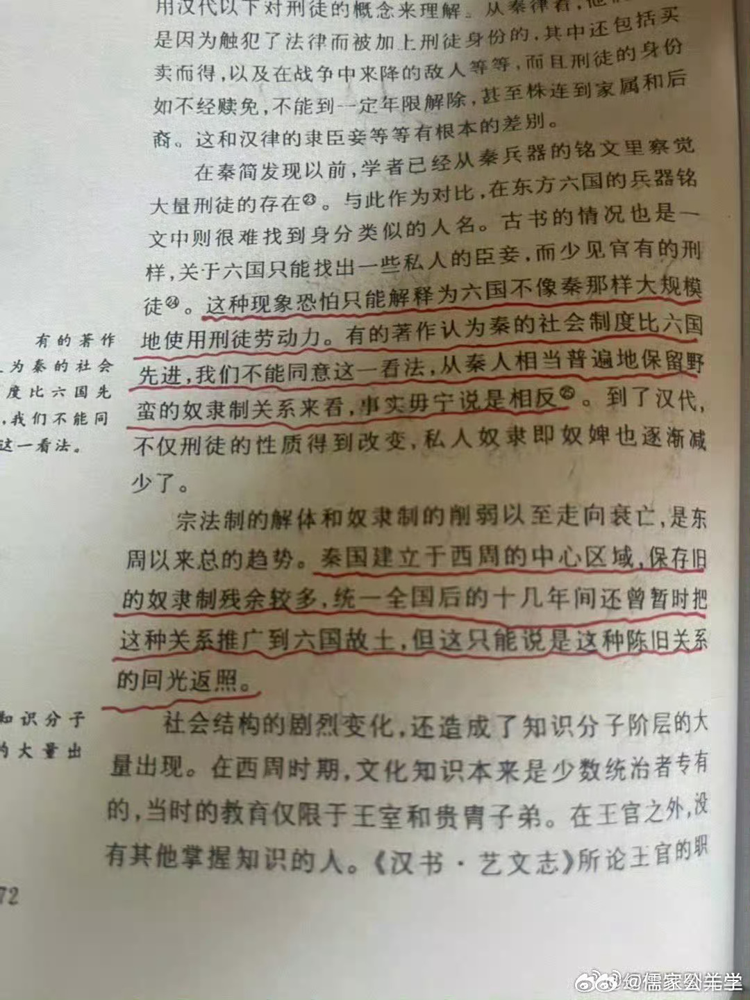

@幻想狂劉先生
发表于：2026-04-16 14:53
来源：微博
链接：https://m.weibo.cn/status/5288342233287193

秦国—秦朝奴隶制度的一个特点是，庞大的刑徒群体作为“国家奴隶”参与了生产，在兼并战争的中期以后，秦国以涸泽而渔的手段对国家人力资源进行了过度榨取，有计划的使用严刑峻法和超经济剥削，成规模的将国民转换为刑徒，以适应兼并战争带来的巨大损耗。秦始皇陵赵背户村出土秦代刑徒墓的瓦铭身上刻有文字，内容是地名+人名+刑罚，从这些瓦铭来看，在大规模兼并战争告一段落后，大量通过军功爵制实现“阶层上升”的秦军将士也被变成了刑徒，参与国家工程（如秦陵）的修建。如果不是要抵御刘、项，这个群体中的大部分人的结局毫无疑问都会和赵背户村的枯骨一样。国家的功臣被国家变成了奴隶，这绝对是中国历史上最黑暗的一幕。

---

