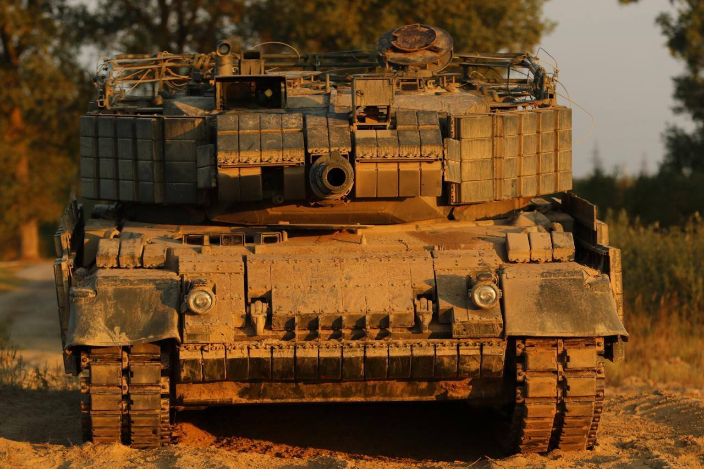
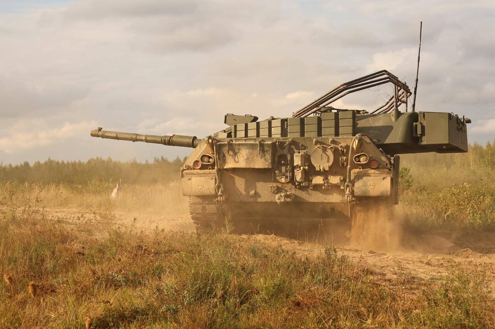

@菜鸟耶夫斯基
发表于：2026-04-15 11:47
来源：微博
链接：https://m.weibo.cn/status/5288053333819677

坦克提供防护的含金量还在持续上升中。

根据多国报道的这个战例，在俄乌战争中，一辆坦克在遭受52次无人机攻击后仍完好无损并成功撤离，体现了坦克防护水平依然是地面装备中的顶流。

在顿涅茨克前线的战斗中，一辆乌军的豹1A5坦克遭受了俄军无人机的袭击，坦克车组人员迅速撤离，在共计52次袭击结束后，车组人员返回坦克，重新启动发动机并自行撤离了。

网络上大量无人机击毁坦克的摄像画面，其实有一定的幸存者偏差效应，并不是一架FPV就能点爆一辆坦克。战场上不断摸索的防无、反无措施，其根本目的是继续增加平均击毁一辆坦克所要进行的公里行动次数，提升坦克逃脱或者成功冲击到目的地的概率。（图仅做同型号示例，不代表涉事坦克的改装状态）

---

