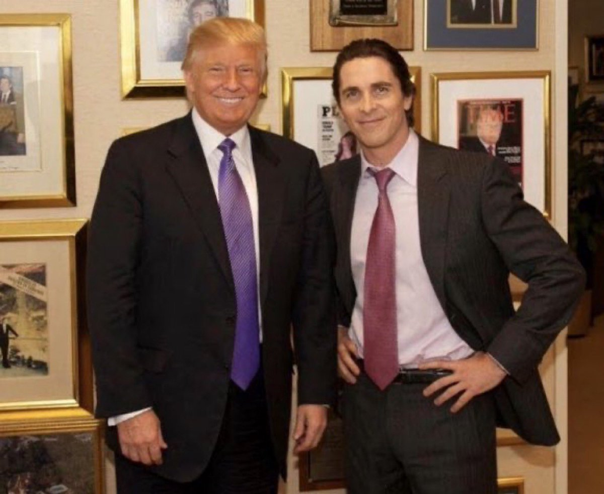

@物理芝士数学酱
发表于：2026-04-15 12:57
来源：微博
链接：https://m.weibo.cn/status/5288070930498109

《美国精神病人》（American Psycho）是一部由Bret Easton Ellis创作的讽刺性、黑色幽默的心理惊悚小说，首版于1991年。

主角Patrick Bateman，华尔街的年轻投资银行家，外表光鲜，但内心是一个冷酷的精神病患者和连环杀手。

Bateman把特朗普视为成功和财富的象征。

图一 电影版《美国精神病人》主演克里斯蒂安·贝尔于特朗普合影。

图二 Mad Magazine, 1992

---

