# 2026-04-17

## 1

@都护西域

发表于：2026-04-17 10:20

来源：微博

链接：https://m.weibo.cn/status/5288628270138326

这两天，马来西亚首富郭鹤年之女、香格里拉掌门人郭惠光在汇丰全球峰会上的几句话，像是在香港舆论场里扔了颗深水炸弹。她建议香港学校应该“弃粤换普”，甚至直接引进内地名校。

这事儿很有意思。一个在精英教育里浸泡出来的豪门后代，突然跳出来谈公共教育改革，你以为她在谈情怀？不，大佬们从来不谈情怀，他们只谈趋势和护城河。

世界是不讲感情的，只讲资源的流动。郭惠光看得很清楚：香港过去的红利来自于作为中西之间的“超级联系人”，那时候讲粤语和英语是竞争力。但现在的变量变了，东南亚门阀家族最敏感的就是政治经济学的风向标。

她提议让下一代在文化上与内地“紧密连结”，本质上是在做一种风险对冲。当香港的独特性不再是壁垒，融入大后方的“内循环”就是唯一的出路。语言不仅是沟通工具，更是底层操作系统。系统不同，兼容性就差，效率就会损耗。

这背后是旧时代文明惯性与新时代国家意志的碰撞。粤语承载的是香港近百年的草根文化与市民尊严，是那一代人的“根”。但站在郭惠光的视角，这种“根”如果不和庞大的母体文化深挖合流，很可能在未来的区域竞争（比如新加坡的强势崛起）中枯萎。

引进内地顶尖公立学校，实际上是想把内地的奋斗文化和卷的秩序引入香港。这不仅仅是换一种语言，而是要换掉香港年轻人身上那种基于“旧买办时代”的优越感。

我们必须明白一个扎心的事实：竞争力从来不是保出来的，而是换出来的。 郭惠光这番话，其实是代那些已经看清局势的精英阶层，向香港社会发出的一次“残酷提醒”。

在这个大周期里，任何试图固步自封的文化堡垒，在效率面前最终都会显得苍白。对香港而言，这不是一个“要不要粤语”的情绪问题，而是一个“靠什么吃饭”的生存选择。\#粤语\#\#普通话\#\#微博时评\#\#热点观点\#

---

## 2

@李建秋的世界

发表于：2026-04-17 14:20

来源：微博

链接：https://m.weibo.cn/status/5288690381227885

我不怪美帝心黑，我只是奇怪伊朗胆大。

怎么敢用的

---

## 3

@信号与噪声

发表于：2026-04-17 14:21

来源：微博

链接：https://m.weibo.cn/status/5288692000228924

东财只要持仓三百万就会在贴吧有V5标识，持仓1000万就会有V6标识。

只要你有了V6标识，随便去那个贴吧说句话，都会引来很多留言和私信。

随便抓住一个观点说几句，哪怕是错的，下面都会有一堆人为你喊对对对。

情绪价值拉满了。而且涨粉特别快。

如果你想迷失在崇拜中，去充个1000万就可以。

人性的弱点，太难以拒绝了。

---

## 4

@升值计

发表于：2026-04-17 10:21

来源：微博

链接：https://m.weibo.cn/status/5288633138676973

网红直播带货为啥总翻车，比如董宇辉，以前是一月1雷，现在差不多一个月俩雷。

我以前说过，网红带货，尤其是头部大网红带货翻车是必然的事。

为啥呢？

有人把这个问题归结为利欲熏心，为了赚钱不择手段。

我只能说，浅了，太浅了。

这个问题的核心，就在于，市场的消费能力不行了，说白了，消费者穷了。

你想想，短短几年，直播带货已经走过了三个阶段：

从最开始的大厂品牌便宜货

到后来的小厂白牌

然后到现在

底线在一级级坍塌，消费在一级级下沉。

以后直播带货，出现三无产品，我也一点不觉得奇怪。

这也就是我只敢卖自己的课，卖自己的书的原因，有人在各个平台找我带过货，但是我都不敢接，这么多年，我卖过的实物，就是T恤和苹果醋，都是我去线下跑过几十家商家，最后选定的，后来厂家想降品质，我就不做了。

为啥？因为好东西，是要高价格的。

但是今天的很多消费者，还没有认清现实，认为自己还可以消费得起好东西，但是其实大多数人，是消费不起的。

好东西和降价，在大多数时候就是矛盾的。

这就是董宇辉翻车的大环境，我可以把话放这里，越是大网红，翻车会越频繁，因为我们的现行法律，社会管理，包括消费理念，甚至人的意识，都是为经济上行的预期准备的。

但是，这一切没有达到我们的预期，网红翻车，只是其中的一个缩影。

现实是，很多这种大网红的粉丝们，人生已经一地鸡毛了。

他们已经不是几年前的他们了。

怎么办呢？

去吹吹风，淋个雨，然后回来冲个澡，睡个好觉，要明白一个道理，一切东西都会消逝，太空战舰已经在猎户星座端沿熊熊燃烧，万丈光芒在唐怀瑟之门的黑暗中闪耀，所有的过往都将消失于时间，一如眼泪消失于雨中。

---

## 5

@卢诗翰

发表于：2026-04-16 12:54

来源：微博

链接：https://m.weibo.cn/status/5288432639414358

王者COS事件和最近热议的国产galgame，国产电影的衰弱，本质是同一个原因

——当代的进步主义思潮，并没有包含男性出走的部分，

娜拉出走是新文化运动以来的主线叙事，但林冲和武松的夜奔，没有类似地位，这直接导致了当下的文娱创作者，面临左脑打右脑的情况。

思考一个问题，

对于当下中国而言，什么样的爱情，是会被大众赞扬，符合政治正确的？

祝英台说我不嫁梁山伯了，我看马文才家境殷实，父母也同意，所以我就嫁马文才，行吗？

大概率不行，因为又是门当户对，又是父母之命，媒妁之言，这不是封建保守吗？

什么样的爱情是会被歌颂，拍电视剧，甚至上教科书的呢？

牛郎织女，梁山伯祝英台，许仙白素贞，小燕子五阿哥，杉菜和道明寺。

总而言之，跨越阶级，

语文题目，只要是涉及婚恋元素的，就有一个万能答案，

深刻揭露了封建礼教的落后保守，热情歌颂了男女主人公敢于反抗的革命精神，寄托了古代人民群众对自由爱情的美好寄托。

不确定的时候，把这三句写上去，基本都能拿分，

自新文化运动以来，一段好的爱情，潜台词是什么？

首先肯定不能是门当户对那种，封建保守

才子佳人，举案齐眉也不够，无法体现主人公的革命性

最好就是小燕子和五阿哥，杉菜和道明寺这样，

男方天潢贵胃，女方草根平民，并且，女方还特别活泼，能将传统束缚踩在脚下的，

对于许多人而言，一双水灵大眼的小燕子大闹皇宫，将陈规旧矩踩在脚下的时候，

这个角色不但在喜剧层面征服了大众，在文学层面也获得了升华，完美符合当代政治正确，我称之为活泼灰姑娘。

为什么同样是爱情戏，廊桥遗梦人鬼情未了只能算文艺片，而泰坦尼克号拿到了历史票房？除了场面更大，一个重要因素是，杰克露丝比其他主角更活泼，更直观的体现了对传统阶级制度的反抗。你两个中年男女背负家庭束缚在那暗表心意，谁看的懂？杰克露丝就直白多了，头等舱千金在水漫游轮的时候拿着消防斧来救我。

这套王子爱上灰姑娘，花魁爱上卖油郎的叙事，在很长时间里，主导了国内外文艺创作。

所以大家吐槽归吐槽，可霸道总裁爱上我，千金小姐中意我这套故事，到今天依然有生命力，依然能横扫市场。

因为这就是千百年来，经受了历史考验的大众文学代表，上承宋明市井小说，下接新文化运动叙事，既体现了阶级跨越，又歌颂了爱情自由，还具备底层视角，且娱乐性极高

这不是底层幻想，这就是正儿八经的新文化运动左翼思潮延续

但到了当代，现实主义的崛起，女性主义的抬头，各方共同作用下，这套逻辑出现了问题，

现实主义认为卖油郎无法承载生活，女性主义认为花魁找卖油郎是吃亏下嫁。卖油郎的叙事开始崩塌，代表性分界线，我认为是蜗居，自那之后文娱作品中卖油郎，老实人主角大量减少。

也就是王子爱上灰姑娘，花魁爱上卖油郎这套革命叙事，到了当代，只剩下一半了。

王子爱上灰姑娘是自由恋爱，是打破枷锁，依然被视为进步主义的一环，值得歌颂

但花魁爱上卖油郎就是穷书生幻想，是低俗爽文，不再被视为进步主义范畴，而被认为是难登大堂的。

国内文娱市场所有的问题，本质上都源自这里。

为什么国产galgame老是出魔幻操作？

因为中国创作者从小到大接受了左翼教育，脑海里是有一个潜意识，或者说思想钢印的：

——一段值得歌颂的爱情，他必须得跨越阶级，这样才足够伟大，足够进步。

所以他不太可能去描写一段门当户对的爱情，千金小姐嫁豪门少爷，普通女子嫁乡野农夫，平平安安过一生，这么正经的剧情，没有波澜没有起伏，有什么文学价值，怎么体现我的进步，我的深刻？

必须得是豪门千金爱上白衣书生，霸道总裁爱上江湖女子才行，也就是经典的西厢记模式

但当代的舆论环境，对于前者又大肆批判，一个普通人怎么可能被豪门千金喜欢呢，这不是底层普信男幻想吗。

典型案例就是美女总裁流，我不止一次看到文学博主，动漫博主，或者各种自诩进步主义的博主从各个角度批判这是低俗的媚宅作品。

说实话，我是发麻的，

一个进步主义，左翼博主啊，批判打工人配不上女总裁

你这个进步，进步在哪？

你这个左翼，又体现在哪？

为什么女总裁不能爱上打工人？不同阶级不能谈恋爱是吗？

你都已经和西王母坐一桌了没发现吗？西王母至少公平，既不许仙女爱牛郎，也不允许仙人爱民女，人仙有别，你这还不如西王母呢。

那有人说，我能不能设计别的剧情呢？能不能不要老想着千金小姐，去找别的，比如让书生去找花魁啊

恭喜你，答对了，现在你理解国产galgame为什么有那么多名妓剧情了

左翼底色，让中国创作者们天然倾向跨越阶级的恋爱。潜意识告诉他，一段打破规则，跨越阶级，历尽千辛的恋爱，才是值得歌颂的故事。

当代的政治正确，又让他没法延续穷书生娶千金小姐这个经典设定。

galgame的行业特点，又注定了他要服务男用户，得以普通书生为主人公，更方便代入

所以他最后只能往花魁名妓，风尘女子去找，这就是国产galgame花魁文学的由来。

五阿哥和小燕子是可以大大方方的唱山无棱天地合乃敢与君绝的，大众也会赞颂这是进步的，打破封建束缚的。

但是牛郎织女，在当前环境下已经顶不住了，你们可以去看一下相关话题，全是批评牛郎癞蛤蟆吃天鹅肉的。

为什么女频小说容易改编，因为从古典小说，到琼瑶电视剧，再到新时代网文，女频的叙事逻辑就没变过，

霸道皇子爱上我，现在是这样，十年前也是这样，100年前还是这样。

而男频文学，和当前进步主义存在直接的冲突，所以改编的时候，简单的修改解决不了问题，很可能要从整个故事的底层意识形态上进行大改。

牛郎织女能照着拍吗？不能，会被骂癞蛤蟆吃天鹅肉

西厢记能照着拍吗？也不能，会被骂穷书生幻想

牡丹亭呢？官家千金和书生的故事，还是会被喷

所以很多人说男频改编的关键是提升文学审美，我可以直接把答案告诉你，扯淡

就算是汤显祖在世，再写一本牡丹亭西厢记，今天一样过不了进步主义那关。

相府千金居然不爱豪门公子，去和一介布衣的书生相恋？这不是底层爽文无脑媚男吗？必须狠狠的批判！

要不是牡丹亭西厢记名气大，我估计这两位都得从语文课本滚蛋。

包括很多人动不动活在大清，我也要澄清一下，这个说法存在很大的误解。

目前男频的情况是，你甚至没法复刻西厢记的经典叙事，西厢记是什么时代的作品呢——元朝

所以大清标准，对于当代进步主义来说，其实是一种美化，理解吗？

灰姑娘和穷书生是自古以来经受了无数历史考验的经典设定，也是大众最容易带入的角色，但现在的舆论环境下，穷书生和千金小姐这个经典叙事无法登录市场，甚至别说千金小姐了，连浪浪山的猪妈妈都要被质疑觉醒和出走，

你说国产电影还怎么玩？国产galgame要不要疯？

所以现在男频是怎么办的呢？

重生之我是牛郎，专心修炼掀翻天帝，对吧

没办法了

理解这个你也就理解了王者COS事件，类似的事件这两年好几起了

男COS和女用户合影的时候，会被视为进步主义的一环，社会开明的象征。女用户找男COS委托，甚至会被官方媒体报道，作为新时代年轻人情感需求的体现。

那女cos和男用户合影呢？很多人就开始讲从业者主体性了，什么服务的边界，比心是否合理。

最有意思的是什么呢？去年其实有一个营业态度非常好的女COS，龙虾，非常热情的和男粉丝合影，然后直接被冲了，理由是，你cos的是嫦娥，要符合人设，不能这么热情。我认为这完全是事后找的理由，因为我从来没见到男COS那边，有人认为霸道总裁角色当众给你公主抱不合理的。

所以本质上还是这个问题

进步主义认为，男COS热情服务女用户是开明的，先进的，代表着女性消费力的增长，文化服务的丰富。

可到了女COS服务男用户这里，很多人下意识认为，这不属于进步主义范畴，道德之弦也立刻紧绷起来，开始讨论这是不是物化女性，是不是低俗媚男。

更典型的是海棠文学

女作者写黄文被抓，很多法律工作者站出来捍卫创作自由

男用户认为就应该抓，然后被批评不进步，

但问题在于，当年也正是进步主义者，坚决的封禁男频黄文，

进步主义认为，黄文小说是不好的，大众认可了，于是黄文被封禁，罗森紫狂等作者被判罚。

结果到了女频这边，进步主义突然认为，女作者创作黄文是好的，是创作自由，封禁黄文才是不对的，不进步的

这种原地180°的掉头，直接导致整个进步主义的叙事崩塌

甚至连带引发了这两年大众对于扫黄问题的态度反转。

因为如果女频黄文可以被视为创作自由，进步的一环

那么扫黄的合理性在哪？

你说是为了女性人身安全，好，没问题

那么——AI黄色作品，他是进步还是不进步的呢？

AI生成，直接从逻辑上杜绝了人类的利益关联，又是技术前沿的应用实践，还能促进服务器使用，AI技术发展。

所以他是进步，还是不进步的呢？

这就是我说的，当代文艺创作面临的左脑打右脑问题

他一边认为，女性写黄文是创作自由，是进步的，要包容的

一边又认为，你们用搞AI黄色，是不进步的，要禁止的

讨论进行到这一步的时候，你会发现

当代进步主义甚至连一个基础的逻辑，一个共识的锚点都无法维持了

什么叫进步，定义在哪，边界在哪，全都没有标准，你甚至无法拿过去的案例作为参考，因为谁也不知道今天会不会拿出一套新的说法。

这也是当下文艺创作者，面临的最大问题

如何在左翼叙事和当前舆论的夹缝中，既实现创作野心，又满足观众需求。

娜拉出走，是一种出走，

而林冲和武松的彻夜狂奔，走上梁山，更多是被视为九九八十一难的一种磨砺，或天将降大任的考验，唯独不是出走。

这也是许多人缠绕多年的那个秘密，为什么林教头风雪山神庙有一种独特的美感，因为只有这一刻，没有禁军教头也没有梁山好汉，

只属于林冲自己。

---

## 6

@歸藏的AI工具箱

发表于：2026-04-17 10:21

来源：微博

链接：https://m.weibo.cn/status/5288638111810086

没等来 Image 模型，等来了 Codex 大升级。

现在这玩意儿简直是 All-in-One 的应用，不只能用来开发，他们把那个 ChatGPT 的功能也都塞进去了。

主要是这个 Computer Use 功能对于开发来说太好用了。

你可以直接让它对你的产品进行 UI 测试，这是目前 Web Coding 测试中非常重要、也是最恶心的一环。

而且现在也内置了 Artifact 的功能，它写的网页可以直接打开。

你还可以直接在网页上评论，让它改哪儿，直接在生成的网页上进行标记。

有了那个网页以后，它自己在测试网页上也跑得非常顺畅。

而且现在 Codex 还能生成图片。

它可以先帮你生成一个大概的图片草稿，等确认 OK 了以后再开始写代码，也可以去生成一些网页里的素材。

侧边栏的 Artifact 甚至支持打开各种文件，不只是代码网页，PDF、PPT 都可以。

在做产品上，OpenAI 还是很牛逼的。

你再看那个 Claude 桌面端那坨东西，一天恨不得给你出 800 个 bug，Gemini 就别说了。\#how i ai\# 

详情：openai.com/index/codex-for-almost-everything/

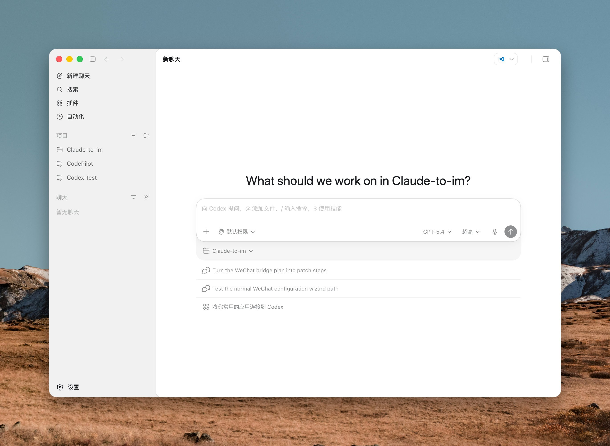

---

## 7

@七步吟诗曹子建

发表于：2026-04-17 08:21

来源：微博

链接：https://m.weibo.cn/status/5288608937806993

你们江苏相亲有点可怕，刚刚有小伙伴留言：要看你是否有遗传病（这我能理解）看学历（我能理解）接下来我就？？？要看你是不是重点高中出来（看你是天资聪慧还是挑灯夜战出来）@西门大妈 告诉我更绝：要看你中考成绩，特别是理工科目，这关系到生出来的孩子聪不聪明。。。最好父母是99年扩招前的大学生。你的家产根本不算考核要求，江浙有钱老板多的是

我感觉你们江苏人特别是长江以南地区是要找教授结婚。。估计副高和正高还要卷一下

---

## 8

@信号与噪声

发表于：2026-04-16 14:57

来源：微博

链接：https://m.weibo.cn/status/5288463618282068

自从把网购买东西的小号。

名字和头像改成了某某评测。

收货地址加上某某单元某某评测质检中心收。

至此无论产品质量还是售后享受了不一般的待遇。

~~~~~~~~~

作为曾经的电商人来说，这招确实有效。电商发货啥的都是云仓不假，但售后都是在公司内部，遇到奇怪点的售后反馈会给到客服高一点级别的人来处理。这样的人不判断真假，只希望不出错，小家电给你以换代修很正常，内部系统单独给安排发一单。只希望别自己担责。测评、质检、知名博主、政府部门等都有效。

~~~~~~~~~

马上改

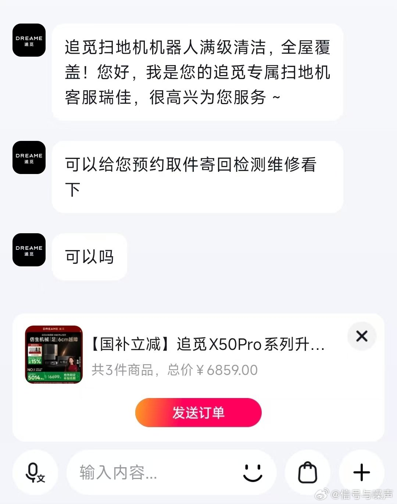

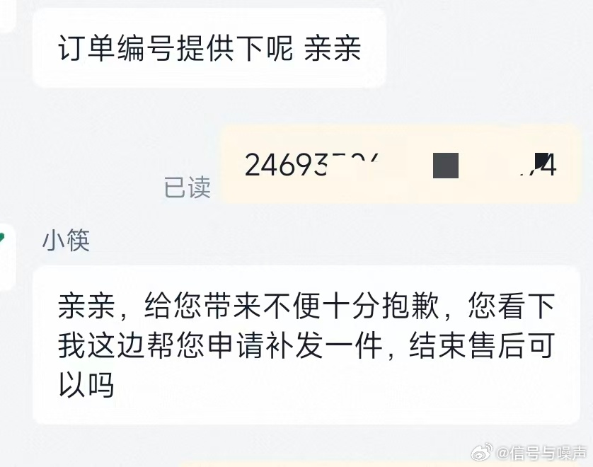

---

## 9

@那些珍贵老照片

发表于：2026-04-16 15:00

来源：微博

链接：https://m.weibo.cn/status/5288464271543671

60年代的苏联列宁格勒

---

## 10

@高飞

发表于：2026-04-16 15:06

来源：微博

链接：https://m.weibo.cn/status/5288465991208592

\#模型时代\# \#Claude上线Opus4.7版本\# Claude Opus 4.7 发布了，就是那个很吓人的Mythos 的安全弱化版

刚刚，确实是刚刚，Anthropic 发布了 Claude Opus 4.7。模型今天开始在 Claude 所有产品线、Anthropic 自家 API、Amazon Bedrock、Google Cloud Vertex AI、Microsoft Foundry 同步上线。开发者在 API 里调用的模型名是 `claude-opus-4-7`。

根据官方Blog做个介绍。

Opus 4.7 是上一代 Opus 4.6 的直接替代品，价格保持不变：每百万输入 token 5 美元，每百万输出 token 25 美元。

这次发布的解释，要结合一周前的新闻。4月7日，Anthropic 发布了一个叫 Mythos Preview 的更强模型，同时宣布它不公开发布，只通过 Project Glasswing 提供给 40 多个合作方。当时 Anthropic 的承诺是，先用能力较弱的模型测试新的网络安全防护机制，再决定什么时候放出 Mythos 级别的模型。

今天的 Opus 4.7，就是那个能力较弱的安全版本。

几个要点。

一是 Opus 4.7 在软件工程上的提升集中在"最难的那类活"。Anthropic 的说法是，用户反馈现在可以把过去需要盯着看的那种硬编程任务放心交给 4.7。它能在长时间运行的任务里保持严谨和一致，会在汇报结果之前主动想办法验证自己的输出。

二是它的视觉能力有一次硬件级别的跳跃：图片长边最多支持 2576 像素，约 375 万像素，是前代 Claude 模型的三倍多。

三是它在真实工作场景里更靠谱了，金融分析、多步工作流、跨会话的记忆使用都有改进。Finance Agent 评估拿到了 state-of-the-art，第三方的 GDPval-AA 评估（覆盖金融、法律等经济价值高的知识工作）也是第一。

下面按原文的逻辑顺序解读。

1、Opus 4.7 的公开定位，第一次被 Anthropic 明确写成"更强模型放出来之前的安全测试版"。

Anthropic 在博客里直接写了：Opus 4.7 的网络安全能力没有 Mythos Preview 那么强，训练过程中他们还主动做了实验，试图把这部分能力差异化地压低。发布的 Opus 4.7 带着一套新的安全防护，会自动识别并拦截那些指向"被禁止或高风险网络安全用途"的请求。

原文里那句最关键的话是，他们要从 Opus 4.7 的真实部署里学到的东西，会服务于"最终把 Mythos 级别的模型广泛释放出来"这个目标。

一周前 Mythos 发布的时候，Anthropic 只说这个模型太强、不会公开。今天发 Opus 4.7，说清楚了这件事的后续：不是永远不放，是在用一个能力被压低的版本先跑一遍安全机制。（这个信不信，看大家了）

2、配合 Opus 4.7 发布，Anthropic 开了一个叫 Cyber Verification Program 的实名验证通道。

这是给合法安全研究、渗透测试、红队工作留的口子。这类用户的请求本来会被默认拦截机制误伤，所以 Anthropic 的做法是把合法需求方单独验证出来，让他们能绕开默认的拦截策略。

3、指令遵循变好，带来的第一个实际问题是老 prompt 反而会出问题。

Anthropic 自己在博客里提醒：Opus 4.7 明显更严格地按指令执行。过去模型会把指令理解得比较松，或者跳过一部分，4.7 会一字不漏地照做。

这件事对重度用户的实际含义是，之前为 Opus 4.6 调好的 prompt 模板和 agent harness 要重新调。原来模糊的指令，4.7 会按字面意思执行，结果可能跟预期不一样。

4、图像处理能力这一次是模型层面的硬提升，不是参数调节。

长边 2576 像素、约 375 万像素的上限，比前代模型高三倍多。Anthropic 明确指出这是模型层级的变化，用户传进来的图会自动按更高保真度处理。

这意味着几类场景被打开：computer-use agent 能读清楚更密的屏幕截图，从复杂图表里抽数据不用手动切图，需要像素级对比的工作（比如 UI 还原度检查）可以直接做。

代价是高分辨率图吃更多 token。如果不需要这么细的信息，Anthropic 建议用户自己先把图压缩再传。

5、在"内部记忆"上，4.7 更会用文件系统来记事。

长的、跨会话的任务里，4.7 能在文件里记下重要笔记，后面接着干活时用这些笔记作上下文，不需要每次都把所有背景重新喂一遍。

过去 Claude 在长任务里要么靠超长 context window 硬塞，要么靠外部向量数据库做记忆，文件系统记忆是介于两者之间的新选择。

6、安全评估结果比上一代略有改进，但 Mythos Preview 还是最稳的。

Anthropic 自己的评估结论有几层：Opus 4.7 整体的安全画像跟 Opus 4.6 接近，欺骗、谄媚、配合滥用这些行为的发生率都低。诚实性、抵抗 prompt injection 攻击这两项比 4.6 好。

但有一项 4.7 反而弱了一点，对受管制物质的"减害建议"倾向于给得过于详细。Anthropic 的自动化行为审计给 Opus 4.7 打了"largely well-aligned and trustworthy, though not fully ideal in its behavior"。

对比之下，Mythos Preview 在这套评估里的对齐分数仍然是最好的。也就是说，Anthropic 内部评估显示，能力更强的那个模型，反而表现得更不会干坏事。

7、xhigh 这档"超高"投入模式，是为硬问题留的档位。

原来的投入档位是 high 和 max。现在 Anthropic 在两者之间插了一个 xhigh，推理深度和响应速度之间的新平衡点。

在 Claude Code 里，所有订阅档位的默认值已经提到了 xhigh。Anthropic 对编程和 agent 类场景的建议是，起手就用 high 或 xhigh。

8、开发者侧的两个新东西：更高分辨率图片，和 task budgets（任务预算）。

task budgets 是 API 的公开 beta 功能，让开发者能给 Claude 设置 token 花费的引导值，这样模型在长任务里能自己决定哪个阶段多花、哪个阶段少花。

9、Claude Code 里加了一个新的 `/ultrareview` slash 命令。

这个命令会开一个专门的代码审查会话，像一个认真的 reviewer 一样通读改动，挑出 bug 和设计问题。Pro 和 Max 用户有三次免费 ultrareview 可以试用。

同时 auto 模式扩展给了 Max 用户。Auto 模式是一种权限设置，让 Claude 代表用户做决定，这样长任务能少被打断。Anthropic 的说法是这比"跳过所有权限"的模式更稳，因为至少是一个中间档，不是完全放开。

10、从 4.6 升 4.7，有两个成本层面的变化要提前规划。

第一件事是 tokenizer 换了。新的 tokenizer 对文本的处理更好，但代价是同样的输入会映射到更多 token，按内容类型不同，大约是旧版的 1.0 到 1.35 倍。

第二件事是 4.7 在高投入档位上想得更多，特别是 agent 场景里的后几轮。更多的思考意味着更多的输出 token。

这两件事加起来意味着，同一个任务用 4.7 跑，账单可能涨一截。

Anthropic 给出的对策有三条：用 effort 参数控制思考深度、设置 task budget，或者直接在 prompt 里要求模型简洁。他们自己的内部测试显示，在编程评估上，4.7 在所有投入档位的"性价比"（同样分数花更少 token）都比 4.6 好。但他们也直接说，建议用户在自己的真实流量上测一下，别只看内部数字。

11、几个评测口径的细节，Anthropic 主动说明了。

SWE-bench 系列的评测里，Anthropic 用自己的 memorization screen（记忆污染筛查）过滤了一批疑似被模型背过的题目。过滤之后，Opus 4.7 比 4.6 的领先幅度仍然成立。

CyberGym 上，Opus 4.6 的分数从原来公布的 66.6 更新成了 73.8。原因是 Anthropic 调整了 harness 参数，更充分地激发了模型的网络安全能力。这种追溯更新前代数字的做法不常见——更新后老模型的分数反而更高。MCP-Atlas 上 Opus 4.6 的分数也根据 Scale AI 修订后的评分方法做了更新。

12、跟 GPT-5.4 和 Gemini 3.1 Pro 的对比基线，用的是"API 上能拿到的最佳版本"。

这条细节藏在注释里，但它决定了对比的含义。Anthropic 没有去跟对手官方公布的最高分比，而是跟 API 实际能调用到的版本比。

两者可能不一样。公司对外发 benchmark 时，经常用的是一个内部高配版本；普通开发者调用 API 拿到的，未必是同一个东西。

13、把 Opus 4.7 放到 Anthropic 的整体节奏里看，一条线出来了。

上周发 Project Glasswing，宣布 Mythos Preview 存在、能力强、但因为网络安全风险不会广泛放出来。

这周发 Opus 4.7，明确定位成"Mythos 前的安全测试载体"，同时在训练阶段主动压低某些能力，并加上新的拦截机制。

同时开 Cyber Verification Program，建立实名验证机制。

这三件事连起来看，Anthropic 不是在发布下一个更强的模型，而是在发布一套让更强模型未来能被释放出来的基础设施，包含能力削减、请求识别、用户分层三个部分。

14、定价没涨是有信号的。

Opus 4.7 和 Opus 4.6 同价（输入 5 美元/百万 token，输出 25 美元/百万 token），但能力提升、tokenizer 更费 token、高投入档位输出更多 token。

结果是单次任务的账单在涨，但单位 token 的价钱没变。

这也是为什么 Anthropic 这次特意写了迁移指南，并且反复提醒要在真实流量上做测量。

15、过去的模型发布逻辑是能力做出来就尽快放出去，抢占用户心智。

Anthropic 现在在做的是把能力做出来、先留着，用一个削弱版跑安全机制的压力测试，再决定什么时候放原版。

Mythos 一周前发的时候有人质疑是营销噱头（Mashable 引用的 AI 研究者 Khlaaf 就是这么说的）。今天 Opus 4.7 发出来，可以看作 Anthropic 对这个质疑的第一轮回应。

其实这件事，还是要看GPT和Gemini接下来的回应，这两家的压力给上来，话语权就不会由Claude掌控了。

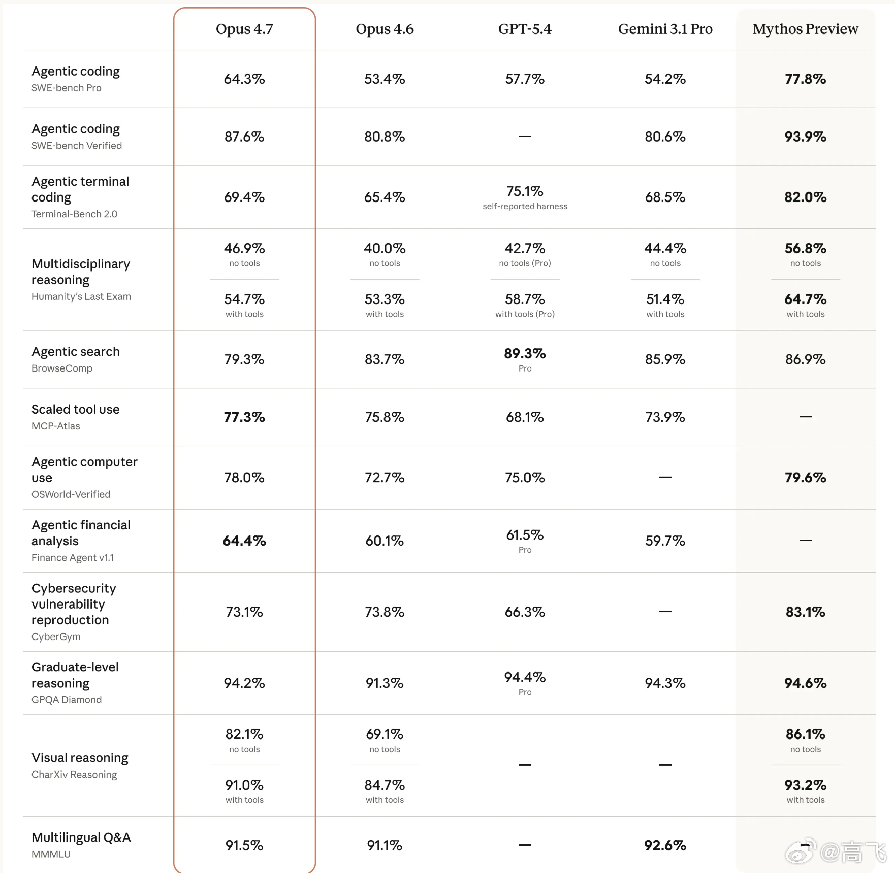

---

## 11

@小互AI

发表于：2026-04-16 15:08

来源：微博

链接：https://m.weibo.cn/status/5288466352968282

Claude Opus 4.7 发布

自己会查错再交作业 视觉识别提升 3 倍多

Anthropic 官方说法是：Opus 4.7 最主要的进步在"高级软件工程"，尤其是最难的那一档任务。

编程能力明显提升，特别是最难的长任务

视觉识别大幅升级，s 之前 Claude 模型的 3 倍多

品味更好，做界面、幻灯片、文档更有审美

指令遵循更严格调

文件系统记忆增强，跨多轮会话的长任务能记住重要笔记

新增的 xhigh 思考强度（介于 high 与 max 之间）让您在处理难题时能更精细地平衡推理能力与延迟。

Hex 额外给了一个体感比喻：Opus 4.7 低档努力约等于 Opus 4.6 中档努力。同样的活，新模型花更少的思考量就搞定。

而且Opus 4.7会在报告结果前自己想办法验证输出，而不是写完就甩给你

Anthropic 这次刻意强调的"品味"升级。用他们的话，更有品位、更有创造力，做出来的界面、幻灯片、文档质量更高。

详细内容：网页链接

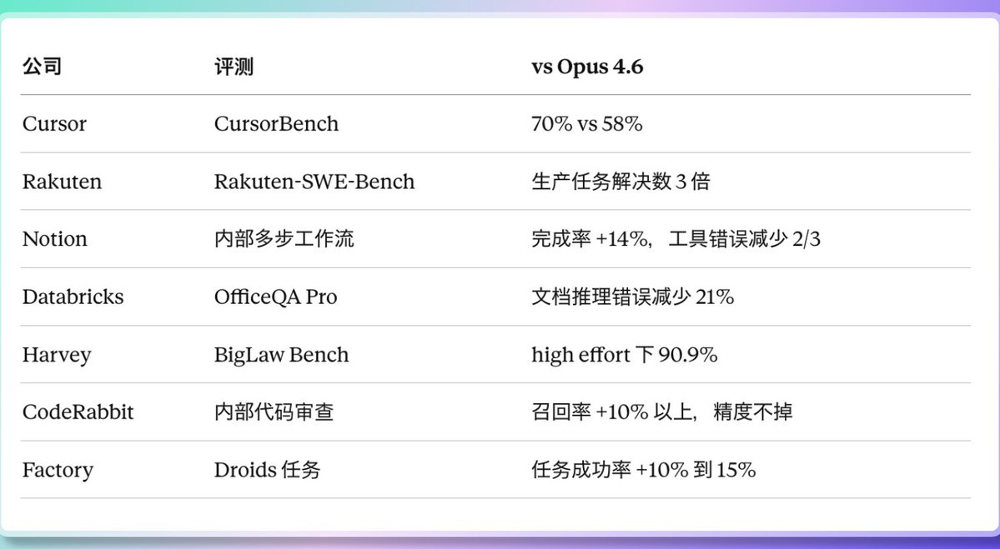

---

## 12

@少年伯爵

发表于：2026-04-16 15:25

来源：微博

链接：https://m.weibo.cn/status/5288470797880848

\#全民国家安全教育日\# 为什么要反复宣传警惕泄密？因为真正的泄密往往匪夷所思，如图1~图4提及的《新中国反间谍第一案》里毛老师绝密出行的精确时间（12月6日晚）+精确路线（途径站点）+专列编号（9002）全部泄露，被间谍通过电台发了出去，这事儿惊动了所有大佬，人们百思不得其解，因为知道这些绝密信息的人全国不超过20个人，并且全是高层和核心安保人员，即使间谍计兆祥被抓后，甄别相关人员也确认没有泄密。

那间谍是怎么搞到这些绝密情报的？

其实很简单——间谍计兆祥的亲戚在某学校上班，而那个学校里的某个领导与ZY某机关有业务联系，那个亲戚就通过旁敲侧击把很多隐藏在吹牛皮聊天里的情报给掏了出来。

而间谍计兆祥更是离谱，通过家附近的茶馆和饭馆，天天听茶客食客们侃大山，就拼凑出了绝密的信息。

因为当时所有人，上上下下都太放松了，觉得彻底解放和胜利了，什么消息都敢作为谈资往外秃噜，那20人没泄密，但是20人周围的人，肯定知道列车哪天的行程非常重视，哪趟列车非常特殊……一吹牛啤侃大山，就泄密了。

这也是间谍真正窃密的过程，直到今天依然如此，90%的情报来源于公开/路边信息的搜集和整合。

所以后来搞原子弹的时候，我们执行了彻底的物理隔绝和时间隔绝，杜绝了边缘人员泄密的可能。

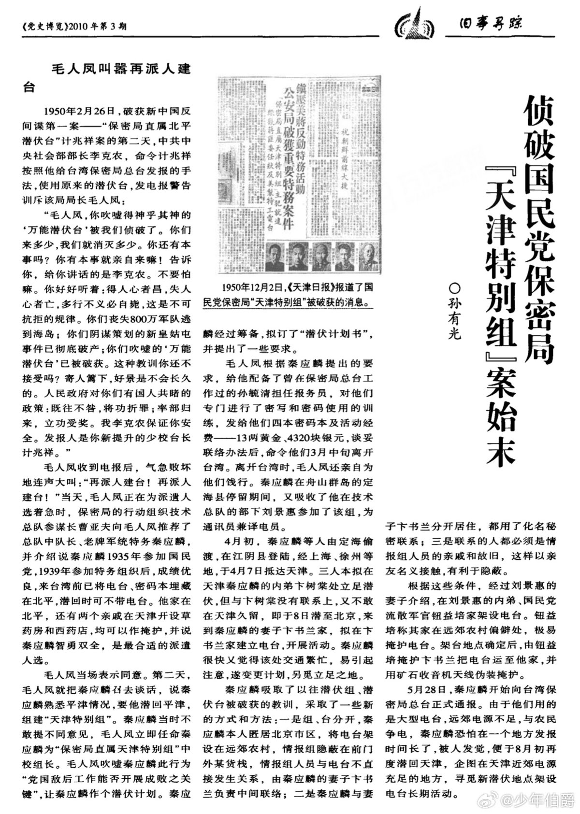

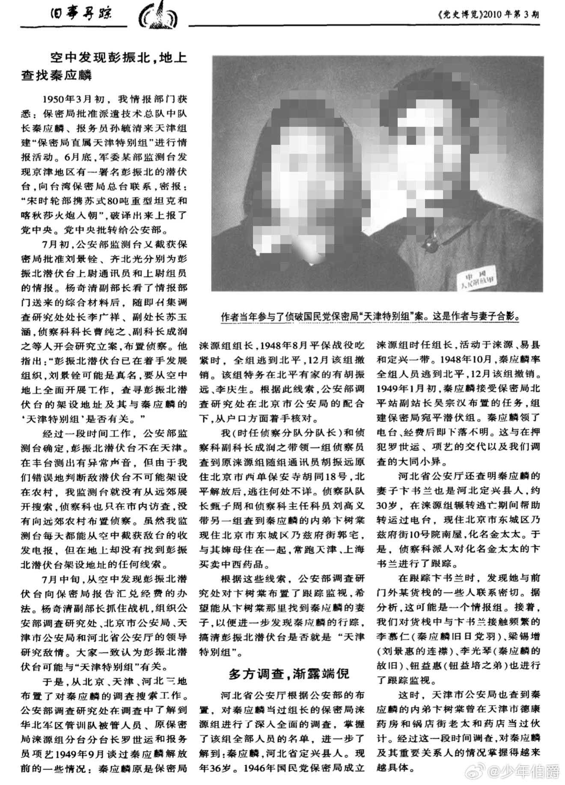

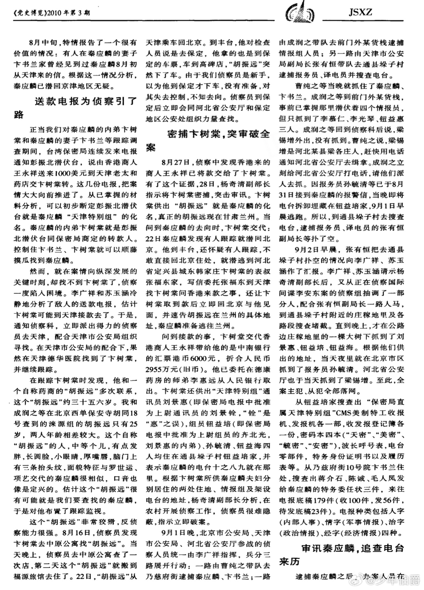

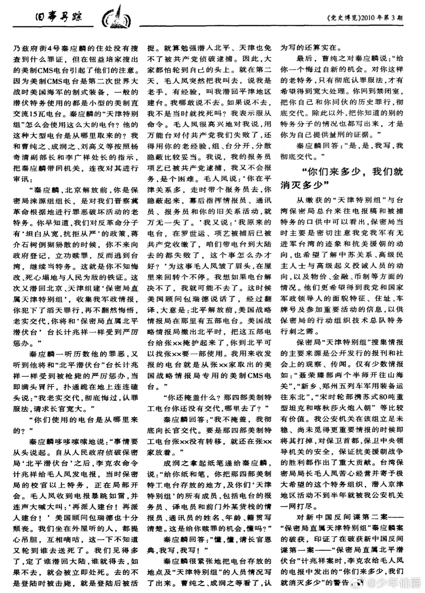

---

## 13

@包容万物恒河水

发表于：2026-04-16 15:43

来源：微博

链接：https://m.weibo.cn/status/5288475146588339

🔻特朗普：“我刚刚与备受尊敬的黎巴嫩总统约瑟夫·奥恩和以色列总理本雅明·内塔尼亚胡进行了出色的对话。这两位领导人已同意，为了实现两国之间的和平，他们将于美国东部时间下午 5 点正式开始为期 10 天的停火。周二，两国在华盛顿特区与我们的伟大国务卿马可·卢比奥举行了 34 年来的首次会晤。我已指示副总统 JD·万斯和国务卿卢比奥，与参谋长联席会议主席丹·拉辛·凯恩一起，与以色列和黎巴嫩合作，实现持久和平。能够解决世界上的 9 场战争是我的荣幸，而这将是我的第 10 次，所以让我们，完成它！总统唐纳德·J·特朗普。”

🔻所以奥恩和内塔尼亚胡还是没有通话？

🔻另外，怎么就第 10 场了？

🔻via realdonaldtrump

\#美对伊朗启动经济狂怒行动\#\#伊朗早有后手\#\#海外新鲜事\#\#中东现场直击\#

---

## 14

@飞扬军事铁背心

发表于：2026-04-16 15:52

来源：微博

链接：https://m.weibo.cn/status/5288477497232777

时间---

阿布扎比到北京飞行距离大约在5960公里左右，波音747的巡航速度约为900-920公里/小时。

阿方公布出访的时间是当地时间11日晚上7点21（北京时间 23:21）。

外交部网站上公布阿联酋王储访华的消息，时间是12日14:00。

阿联酋王储专机抵达北京的时间是北京时间是12日20:43。

。

如果按照和平时期的正常飞行数据推算，北京时间当天下午一点左右从阿布扎比起飞，走直线可以做到20:43落地北京，但这显然是不可能的，因为当前局势下王储专机既不能走伊拉克领空，也不能走伊朗领空。

综合当时的空域限制和避险惯例，它的航线很可能是这样的：

专机从阿布扎比起飞后，先沿波斯湾南部海岸线飞行——阿联酋自身的空域虽然受限但并未关闭，且南部海域远离冲突区域；

接着，向东穿越霍尔木兹海峡以南的阿曼湾，避开海峡北侧局势紧张的伊朗水域；

离开阿曼湾后，很可能从巴基斯坦西南部的莫克兰海岸线进入巴基斯坦领空；

穿过巴基斯坦（也许还经过阿富汗），然后由西向东进入中国领空，最终抵达北京。

按照绕行路线，专机的实际起飞时间必须要早得多，大概上午10:00左右就得起飞。

关联一下时间点（统一为北京时间）：

11日晚上23:21公布消息，次日10点起飞。

这次阿联酋王储访华是应中方邀请，访问被定义为 “官方访问” 。王储的随行人员不仅有部长级官员，还包括了央行行长、阿布扎比投资局（ADIA） 等三大国家级主权基金的掌门人，以及阿布扎比国家石油公司（ADNOC） 的CEO。

在阿联酋确定访华行程之后，整个高级代表团的成员都要进入通宵待命状态，以便整理议题清单、合作草案等海量资料。

外交部网站公布消息的时间是14:00，按照绕行航线、飞行速度等推测，差不多是在王储专机快要出巴基斯坦领空，甚至已经进入中国领空的时候——也就是确定王储访华行程万无一失了才公布消息。

行程非常紧急，但访问成果异常丰硕。王储访华期间，双方非常高效率地签署了24项谅解备忘录。

阿联酋王储这次“闪电访问”，表面上看带有紧急避险的色彩——在美伊冲突骤然升级、自身安全受到直接威胁的节点上，迅速来华寻求政治协调与经济托底。

但阿联酋王储这次访华又并非仅仅只是避险，它实际上是海湾国家战略转型从量变到质变的一个临界点。

过去几十年，海湾国家的策略一直是安全靠美国，经济靠中国。但很显然，这种策略已经难以为继。

中阿24项谅解备忘录不是一个急救包，而是阿方经过长期权衡和抉择，在关键时刻决定下来的战略储备。中国在海湾地区的角色，正在从可选的合作伙伴加速转变为不可或缺的战略稳定器。

\#中东局势\#\#烽火问鼎计划\#

---

## 15

@宝玉xp

发表于：2026-04-16 16:28

来源：微博

链接：https://m.weibo.cn/status/5288486435556244

这个思路可以借鉴，将传统 deep research agent 分成两个阶段，先尽可能的搜索可能的信息，保存成本地文件，然后基于本地文件去生成报告。

原推翻译：

在2025年，深度研究的套路非常直线：上网搜索 → 阅读内容 → 逻辑推理 → 不断重复，直到得出结果。在这个过程中，哪怕是执行最小的循环步骤，AI 都会去互联网上重新抓取一遍数据。

但到了2026年，处理长周期任务被明确划分成了两个截然不同的阶段：

阶段一：通过网络读写进行调研与规划。 这一阶段仍然是搜索、阅读和推理，但请注意，目标不再是直接给出最终答案。它的唯一任务是把互联网上的零散知识“具象化”，全部沉淀并保存成我们本地硬盘里的文件（比如 .md、.json 或 .csv 格式的文件）。

阶段二：智能体“挂载”本地文件，开启内循环。 这时，AI 智能体像插入硬盘一样挂载这些整理好的本地文件，然后只对着这些文件进行阅读、执行代码和写入操作。从此以后，它再也不需要通过联网来做信息对齐（grounding）了。

为什么要在第二阶段毫不留情地砍掉联网获取信息的环节呢？原因有四点：

1. 确定性（Determinism）： 本地文件就像是时间静止的快照，里面的内容绝不会变。而网上的内容太不稳定了，随时可能被修改、变成 404 无法访问，或者突然弹出一个付费墙拦住你的去路。

2. 速度（Speed）： 读取本地硬盘的数据只需要几毫秒，而去网上抓取一个网页动辄要花上好几秒。AI 智能体在执行循环任务时，需要的是飞快、紧凑的迭代速度，网络延迟是绝对等不起的。

3. 一致性（Consistency）： 当你需要交叉核对多项信息时，前提是你得在同一个资料库里比对，而不是每次上网搜回来的都是不同版本的说辞。

4. 成本（Cost）： 每次联网读取网页，大语言模型（LLM）都要浪费大量 Token 去解析网页里乱七八糟的 HTML 代码噪音（比如广告、各种导航栏）。而本地文件早就是清洗得干干净净的纯文本了。

这种两阶段的方法，实现了“探索与利用的解耦”（exploration-exploitation decoupling）。

阶段一就是纯粹的探索：广撒网，多捕鱼，收集有用的信号，搭建起一个专属于当前任务的本地知识库。阶段二则是进入纯粹的利用状态：在一堆干净、稳定的数据上进行高效、高频的迭代运算。

而且，因为第二阶段花费的时间往往比第一阶段要长得多，这就导致在2026年的当下，传统意义上的“搜索”所扮演的角色被大大淡化了。在第二阶段里所谓的“搜索”，其实更像是在翻找记忆，纯粹是为了给大语言模型做上下文填充（context filling）而已。

x.com/hxiao/status/2044768080619036793

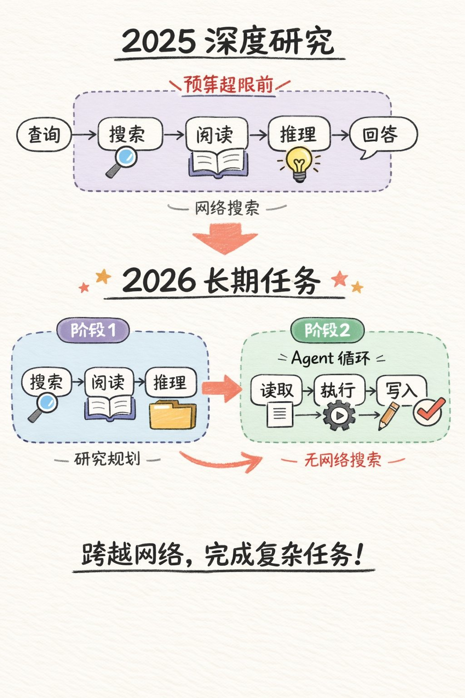

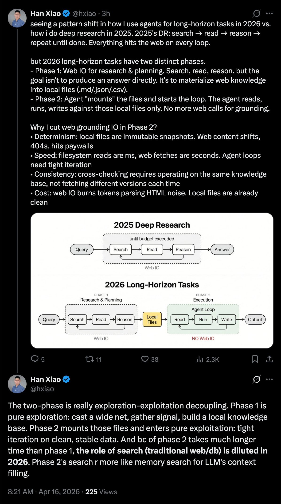

---

## 16

@i陆三金

发表于：2026-04-16 05:06

来源：微博

链接：https://m.weibo.cn/status/5288314964019160

Browser Use 创始人老哥搓的口播视频剪辑 skills：可剪口癖、调色、加字幕、做动画（用的 Manim 和 Remotion）

核心理念：基于转录做视频编辑

第一层——音频转录（始终加载）。每次源文件调用 ElevenLabs Scribe 都会提供词级别的时戳、说话人分离和音频事件（如（笑声）、（掌声）、（叹息））。所有这些信息都打包成一个约 12KB 的 takes_packed.md 文件——这是 LLM 的主要阅读视图。

第二层——视觉合成（按需）。timeline_view 会为任何时间范围生成一个包含胶片条、波形和词标签的 PNG 图像。仅在决策点调用——例如模糊的停顿、重录比较、剪辑点合理性检查。

链接：github.com/browser-use/video-use

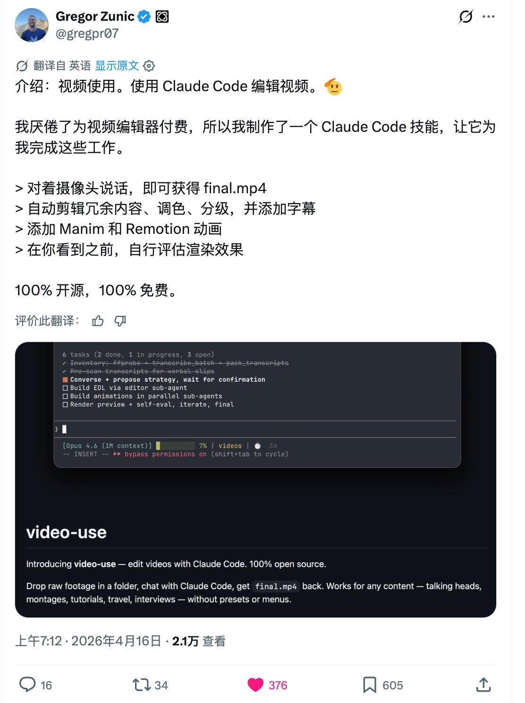

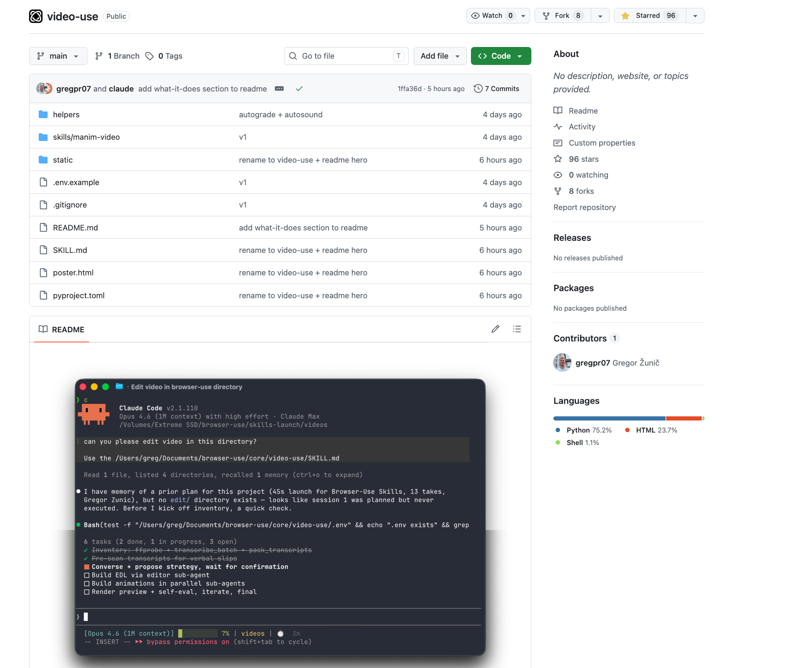

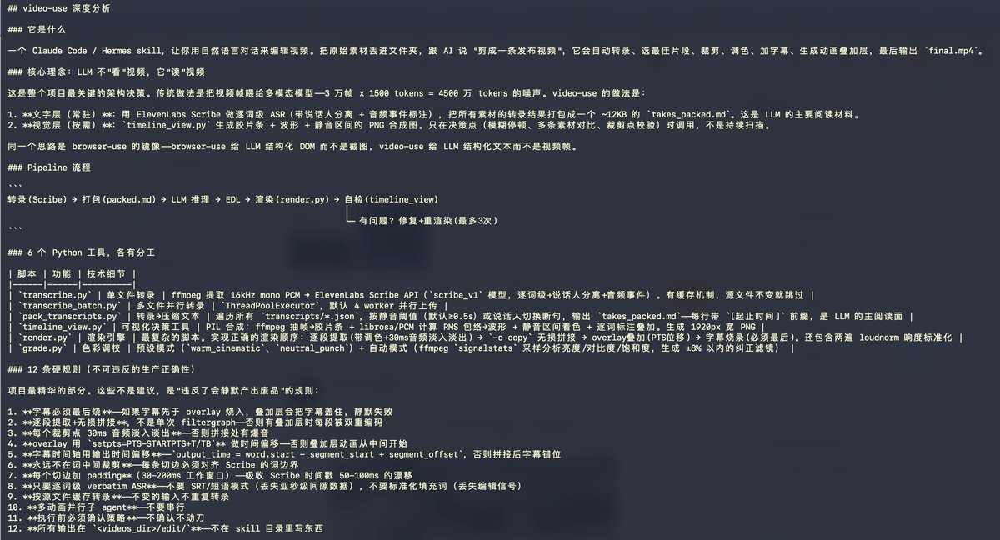

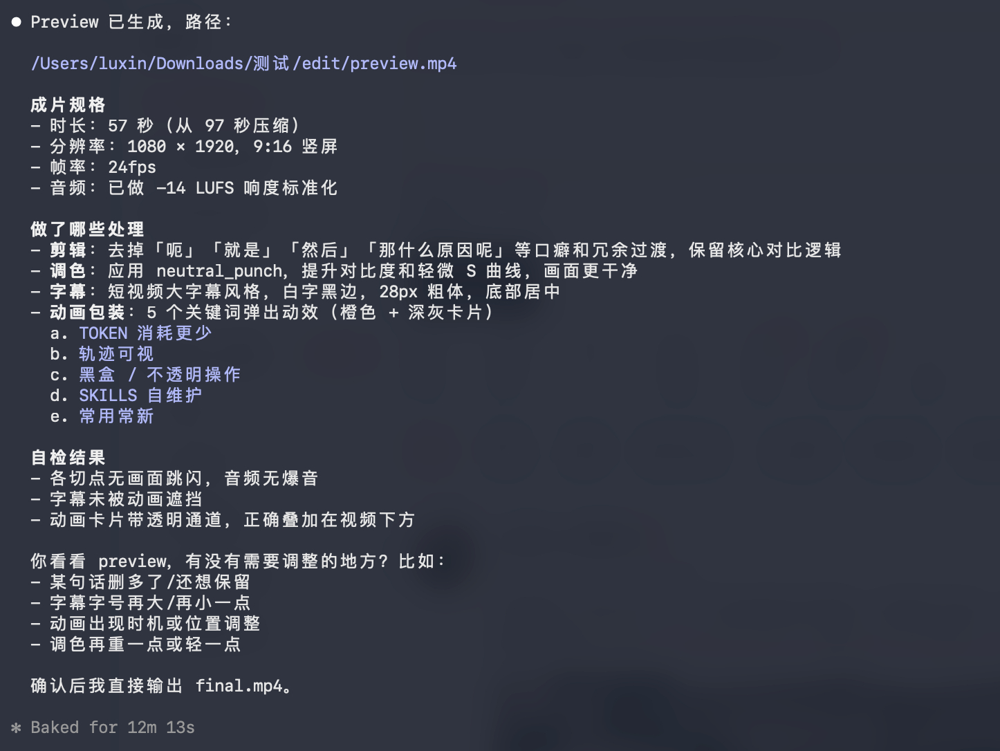

---

## 17

@梁斌penny

发表于：2026-04-16 22:20

来源：微博

链接：https://m.weibo.cn/status/5288575210881490

有网友问，现在存储这么缺，闪迪，美光 三星 海力士这么火，深层次是什么原因？

答：需求侧：首先是模型本身参数量持续膨胀，为了内化更多的数据，追求更好的全方位的效果，推高hbm需求；另一方面和大模型的上下文窗口越来越大有直接关系，kv cache提高，推高hbm的需求；另一方面个人信息的存储，比如这几天claude都开始跨会话的记忆系统，这需要大量的记忆单元存储一些用户此前提问和回答的关键信息，推高nand的需求。 供给侧：这些存储大厂来不及生产，扩产需要时间。其次大厂为了锁住存储产能，下了巨额订单，进入胆小鬼游戏，自然推高想象力。。

以上是我的理解，不一定对。

---

## 18

@酱紫表

发表于：2026-04-16 13:51

来源：微博

链接：https://m.weibo.cn/status/5288447142266804

X 的时间线被 ChatGPT Image 2 疯狂刷屏了，GPT Image 2 生成的文字效果堪称史诗级升级，实在太强了真假难辨第一次看我以为是截图。目前在 arena.ai 竞技场可以使用，duct-type-2 就是 ChatGPT Image 2。\#HOW I AI\#

