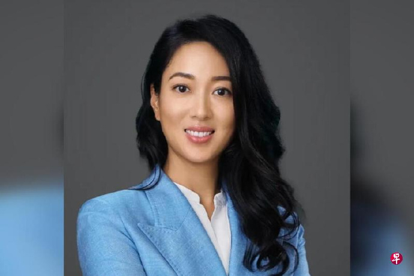
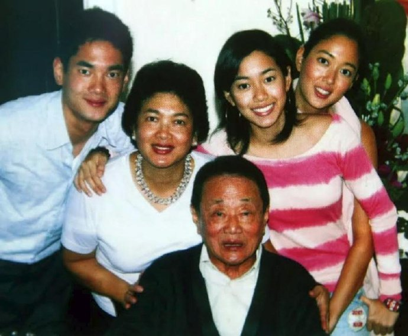

@都护西域

发表于：2026-04-17 10:20

来源：微博

链接：https://m.weibo.cn/status/5288628270138326

这两天，马来西亚首富郭鹤年之女、香格里拉掌门人郭惠光在汇丰全球峰会上的几句话，像是在香港舆论场里扔了颗深水炸弹。她建议香港学校应该“弃粤换普”，甚至直接引进内地名校。

这事儿很有意思。一个在精英教育里浸泡出来的豪门后代，突然跳出来谈公共教育改革，你以为她在谈情怀？不，大佬们从来不谈情怀，他们只谈趋势和护城河。

世界是不讲感情的，只讲资源的流动。郭惠光看得很清楚：香港过去的红利来自于作为中西之间的“超级联系人”，那时候讲粤语和英语是竞争力。但现在的变量变了，东南亚门阀家族最敏感的就是政治经济学的风向标。

她提议让下一代在文化上与内地“紧密连结”，本质上是在做一种风险对冲。当香港的独特性不再是壁垒，融入大后方的“内循环”就是唯一的出路。语言不仅是沟通工具，更是底层操作系统。系统不同，兼容性就差，效率就会损耗。

这背后是旧时代文明惯性与新时代国家意志的碰撞。粤语承载的是香港近百年的草根文化与市民尊严，是那一代人的“根”。但站在郭惠光的视角，这种“根”如果不和庞大的母体文化深挖合流，很可能在未来的区域竞争（比如新加坡的强势崛起）中枯萎。

引进内地顶尖公立学校，实际上是想把内地的奋斗文化和卷的秩序引入香港。这不仅仅是换一种语言，而是要换掉香港年轻人身上那种基于“旧买办时代”的优越感。

我们必须明白一个扎心的事实：竞争力从来不是保出来的，而是换出来的。 郭惠光这番话，其实是代那些已经看清局势的精英阶层，向香港社会发出的一次“残酷提醒”。

在这个大周期里，任何试图固步自封的文化堡垒，在效率面前最终都会显得苍白。对香港而言，这不是一个“要不要粤语”的情绪问题，而是一个“靠什么吃饭”的生存选择。\#粤语\#\#普通话\#\#微博时评\#\#热点观点\#

---

