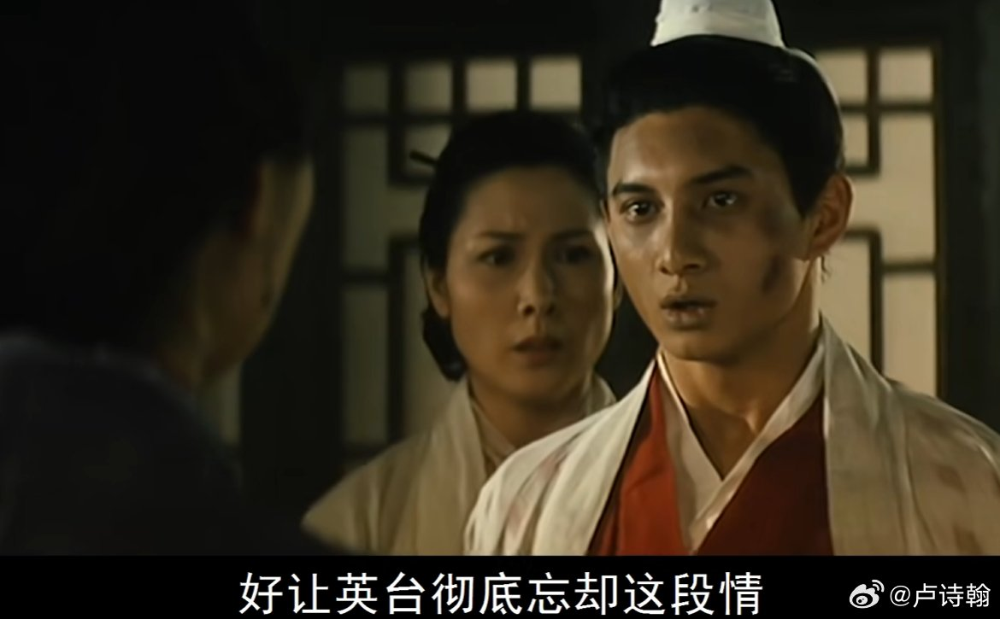
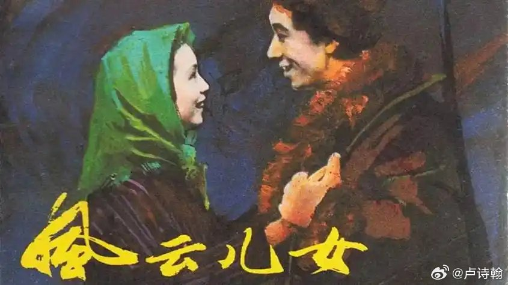
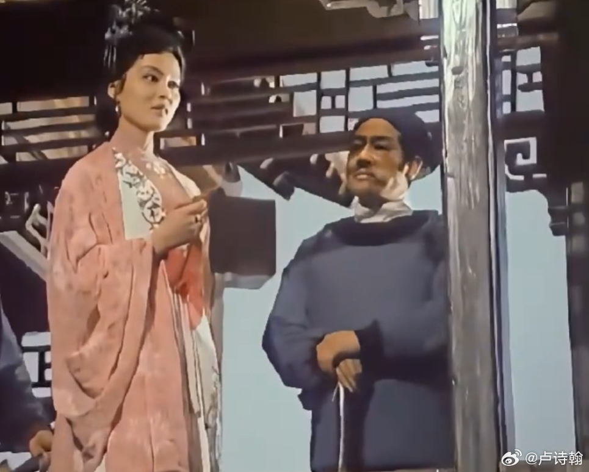
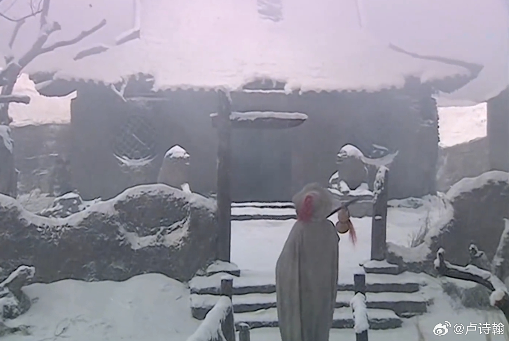

@卢诗翰

发表于：2026-04-16 12:54

来源：微博

链接：https://m.weibo.cn/status/5288432639414358

王者COS事件和最近热议的国产galgame，国产电影的衰弱，本质是同一个原因

——当代的进步主义思潮，并没有包含男性出走的部分，

娜拉出走是新文化运动以来的主线叙事，但林冲和武松的夜奔，没有类似地位，这直接导致了当下的文娱创作者，面临左脑打右脑的情况。

思考一个问题，

对于当下中国而言，什么样的爱情，是会被大众赞扬，符合政治正确的？

祝英台说我不嫁梁山伯了，我看马文才家境殷实，父母也同意，所以我就嫁马文才，行吗？

大概率不行，因为又是门当户对，又是父母之命，媒妁之言，这不是封建保守吗？

什么样的爱情是会被歌颂，拍电视剧，甚至上教科书的呢？

牛郎织女，梁山伯祝英台，许仙白素贞，小燕子五阿哥，杉菜和道明寺。

总而言之，跨越阶级，

语文题目，只要是涉及婚恋元素的，就有一个万能答案，

深刻揭露了封建礼教的落后保守，热情歌颂了男女主人公敢于反抗的革命精神，寄托了古代人民群众对自由爱情的美好寄托。

不确定的时候，把这三句写上去，基本都能拿分，

自新文化运动以来，一段好的爱情，潜台词是什么？

首先肯定不能是门当户对那种，封建保守

才子佳人，举案齐眉也不够，无法体现主人公的革命性

最好就是小燕子和五阿哥，杉菜和道明寺这样，

男方天潢贵胃，女方草根平民，并且，女方还特别活泼，能将传统束缚踩在脚下的，

对于许多人而言，一双水灵大眼的小燕子大闹皇宫，将陈规旧矩踩在脚下的时候，

这个角色不但在喜剧层面征服了大众，在文学层面也获得了升华，完美符合当代政治正确，我称之为活泼灰姑娘。

为什么同样是爱情戏，廊桥遗梦人鬼情未了只能算文艺片，而泰坦尼克号拿到了历史票房？除了场面更大，一个重要因素是，杰克露丝比其他主角更活泼，更直观的体现了对传统阶级制度的反抗。你两个中年男女背负家庭束缚在那暗表心意，谁看的懂？杰克露丝就直白多了，头等舱千金在水漫游轮的时候拿着消防斧来救我。

这套王子爱上灰姑娘，花魁爱上卖油郎的叙事，在很长时间里，主导了国内外文艺创作。

所以大家吐槽归吐槽，可霸道总裁爱上我，千金小姐中意我这套故事，到今天依然有生命力，依然能横扫市场。

因为这就是千百年来，经受了历史考验的大众文学代表，上承宋明市井小说，下接新文化运动叙事，既体现了阶级跨越，又歌颂了爱情自由，还具备底层视角，且娱乐性极高

这不是底层幻想，这就是正儿八经的新文化运动左翼思潮延续

但到了当代，现实主义的崛起，女性主义的抬头，各方共同作用下，这套逻辑出现了问题，

现实主义认为卖油郎无法承载生活，女性主义认为花魁找卖油郎是吃亏下嫁。卖油郎的叙事开始崩塌，代表性分界线，我认为是蜗居，自那之后文娱作品中卖油郎，老实人主角大量减少。

也就是王子爱上灰姑娘，花魁爱上卖油郎这套革命叙事，到了当代，只剩下一半了。

王子爱上灰姑娘是自由恋爱，是打破枷锁，依然被视为进步主义的一环，值得歌颂

但花魁爱上卖油郎就是穷书生幻想，是低俗爽文，不再被视为进步主义范畴，而被认为是难登大堂的。

国内文娱市场所有的问题，本质上都源自这里。

为什么国产galgame老是出魔幻操作？

因为中国创作者从小到大接受了左翼教育，脑海里是有一个潜意识，或者说思想钢印的：

——一段值得歌颂的爱情，他必须得跨越阶级，这样才足够伟大，足够进步。

所以他不太可能去描写一段门当户对的爱情，千金小姐嫁豪门少爷，普通女子嫁乡野农夫，平平安安过一生，这么正经的剧情，没有波澜没有起伏，有什么文学价值，怎么体现我的进步，我的深刻？

必须得是豪门千金爱上白衣书生，霸道总裁爱上江湖女子才行，也就是经典的西厢记模式

但当代的舆论环境，对于前者又大肆批判，一个普通人怎么可能被豪门千金喜欢呢，这不是底层普信男幻想吗。

典型案例就是美女总裁流，我不止一次看到文学博主，动漫博主，或者各种自诩进步主义的博主从各个角度批判这是低俗的媚宅作品。

说实话，我是发麻的，

一个进步主义，左翼博主啊，批判打工人配不上女总裁

你这个进步，进步在哪？

你这个左翼，又体现在哪？

为什么女总裁不能爱上打工人？不同阶级不能谈恋爱是吗？

你都已经和西王母坐一桌了没发现吗？西王母至少公平，既不许仙女爱牛郎，也不允许仙人爱民女，人仙有别，你这还不如西王母呢。

那有人说，我能不能设计别的剧情呢？能不能不要老想着千金小姐，去找别的，比如让书生去找花魁啊

恭喜你，答对了，现在你理解国产galgame为什么有那么多名妓剧情了

左翼底色，让中国创作者们天然倾向跨越阶级的恋爱。潜意识告诉他，一段打破规则，跨越阶级，历尽千辛的恋爱，才是值得歌颂的故事。

当代的政治正确，又让他没法延续穷书生娶千金小姐这个经典设定。

galgame的行业特点，又注定了他要服务男用户，得以普通书生为主人公，更方便代入

所以他最后只能往花魁名妓，风尘女子去找，这就是国产galgame花魁文学的由来。

五阿哥和小燕子是可以大大方方的唱山无棱天地合乃敢与君绝的，大众也会赞颂这是进步的，打破封建束缚的。

但是牛郎织女，在当前环境下已经顶不住了，你们可以去看一下相关话题，全是批评牛郎癞蛤蟆吃天鹅肉的。

为什么女频小说容易改编，因为从古典小说，到琼瑶电视剧，再到新时代网文，女频的叙事逻辑就没变过，

霸道皇子爱上我，现在是这样，十年前也是这样，100年前还是这样。

而男频文学，和当前进步主义存在直接的冲突，所以改编的时候，简单的修改解决不了问题，很可能要从整个故事的底层意识形态上进行大改。

牛郎织女能照着拍吗？不能，会被骂癞蛤蟆吃天鹅肉

西厢记能照着拍吗？也不能，会被骂穷书生幻想

牡丹亭呢？官家千金和书生的故事，还是会被喷

所以很多人说男频改编的关键是提升文学审美，我可以直接把答案告诉你，扯淡

就算是汤显祖在世，再写一本牡丹亭西厢记，今天一样过不了进步主义那关。

相府千金居然不爱豪门公子，去和一介布衣的书生相恋？这不是底层爽文无脑媚男吗？必须狠狠的批判！

要不是牡丹亭西厢记名气大，我估计这两位都得从语文课本滚蛋。

包括很多人动不动活在大清，我也要澄清一下，这个说法存在很大的误解。

目前男频的情况是，你甚至没法复刻西厢记的经典叙事，西厢记是什么时代的作品呢——元朝

所以大清标准，对于当代进步主义来说，其实是一种美化，理解吗？

灰姑娘和穷书生是自古以来经受了无数历史考验的经典设定，也是大众最容易带入的角色，但现在的舆论环境下，穷书生和千金小姐这个经典叙事无法登录市场，甚至别说千金小姐了，连浪浪山的猪妈妈都要被质疑觉醒和出走，

你说国产电影还怎么玩？国产galgame要不要疯？

所以现在男频是怎么办的呢？

重生之我是牛郎，专心修炼掀翻天帝，对吧

没办法了

理解这个你也就理解了王者COS事件，类似的事件这两年好几起了

男COS和女用户合影的时候，会被视为进步主义的一环，社会开明的象征。女用户找男COS委托，甚至会被官方媒体报道，作为新时代年轻人情感需求的体现。

那女cos和男用户合影呢？很多人就开始讲从业者主体性了，什么服务的边界，比心是否合理。

最有意思的是什么呢？去年其实有一个营业态度非常好的女COS，龙虾，非常热情的和男粉丝合影，然后直接被冲了，理由是，你cos的是嫦娥，要符合人设，不能这么热情。我认为这完全是事后找的理由，因为我从来没见到男COS那边，有人认为霸道总裁角色当众给你公主抱不合理的。

所以本质上还是这个问题

进步主义认为，男COS热情服务女用户是开明的，先进的，代表着女性消费力的增长，文化服务的丰富。

可到了女COS服务男用户这里，很多人下意识认为，这不属于进步主义范畴，道德之弦也立刻紧绷起来，开始讨论这是不是物化女性，是不是低俗媚男。

更典型的是海棠文学

女作者写黄文被抓，很多法律工作者站出来捍卫创作自由

男用户认为就应该抓，然后被批评不进步，

但问题在于，当年也正是进步主义者，坚决的封禁男频黄文，

进步主义认为，黄文小说是不好的，大众认可了，于是黄文被封禁，罗森紫狂等作者被判罚。

结果到了女频这边，进步主义突然认为，女作者创作黄文是好的，是创作自由，封禁黄文才是不对的，不进步的

这种原地180°的掉头，直接导致整个进步主义的叙事崩塌

甚至连带引发了这两年大众对于扫黄问题的态度反转。

因为如果女频黄文可以被视为创作自由，进步的一环

那么扫黄的合理性在哪？

你说是为了女性人身安全，好，没问题

那么——AI黄色作品，他是进步还是不进步的呢？

AI生成，直接从逻辑上杜绝了人类的利益关联，又是技术前沿的应用实践，还能促进服务器使用，AI技术发展。

所以他是进步，还是不进步的呢？

这就是我说的，当代文艺创作面临的左脑打右脑问题

他一边认为，女性写黄文是创作自由，是进步的，要包容的

一边又认为，你们用搞AI黄色，是不进步的，要禁止的

讨论进行到这一步的时候，你会发现

当代进步主义甚至连一个基础的逻辑，一个共识的锚点都无法维持了

什么叫进步，定义在哪，边界在哪，全都没有标准，你甚至无法拿过去的案例作为参考，因为谁也不知道今天会不会拿出一套新的说法。

这也是当下文艺创作者，面临的最大问题

如何在左翼叙事和当前舆论的夹缝中，既实现创作野心，又满足观众需求。

娜拉出走，是一种出走，

而林冲和武松的彻夜狂奔，走上梁山，更多是被视为九九八十一难的一种磨砺，或天将降大任的考验，唯独不是出走。

这也是许多人缠绕多年的那个秘密，为什么林教头风雪山神庙有一种独特的美感，因为只有这一刻，没有禁军教头也没有梁山好汉，

只属于林冲自己。

---

