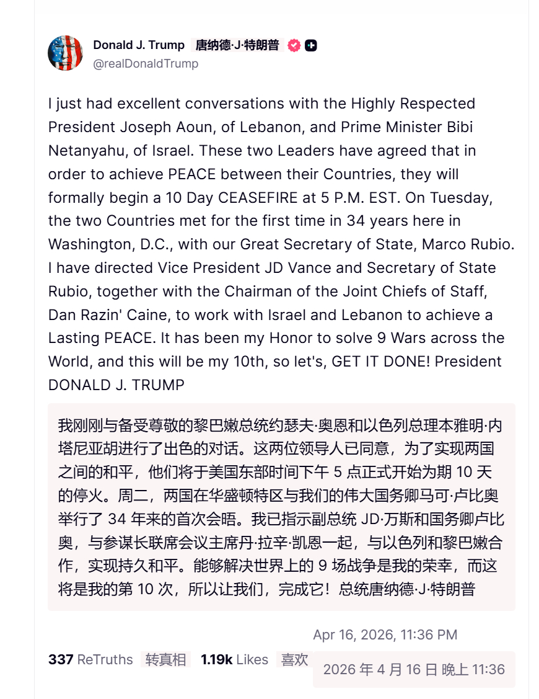
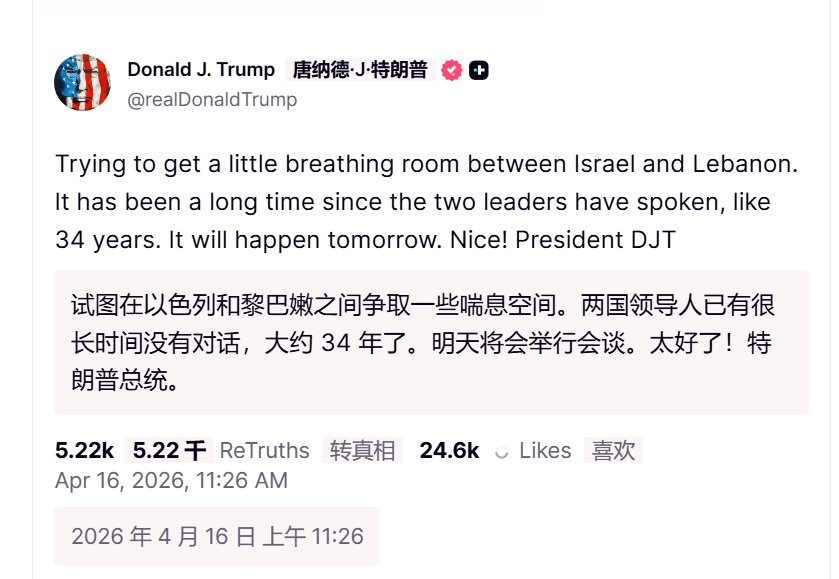

@包容万物恒河水

发表于：2026-04-16 15:43

来源：微博

链接：https://m.weibo.cn/status/5288475146588339

🔻特朗普：“我刚刚与备受尊敬的黎巴嫩总统约瑟夫·奥恩和以色列总理本雅明·内塔尼亚胡进行了出色的对话。这两位领导人已同意，为了实现两国之间的和平，他们将于美国东部时间下午 5 点正式开始为期 10 天的停火。周二，两国在华盛顿特区与我们的伟大国务卿马可·卢比奥举行了 34 年来的首次会晤。我已指示副总统 JD·万斯和国务卿卢比奥，与参谋长联席会议主席丹·拉辛·凯恩一起，与以色列和黎巴嫩合作，实现持久和平。能够解决世界上的 9 场战争是我的荣幸，而这将是我的第 10 次，所以让我们，完成它！总统唐纳德·J·特朗普。”

🔻所以奥恩和内塔尼亚胡还是没有通话？

🔻另外，怎么就第 10 场了？

🔻via realdonaldtrump

\#美对伊朗启动经济狂怒行动\#\#伊朗早有后手\#\#海外新鲜事\#\#中东现场直击\#

---

