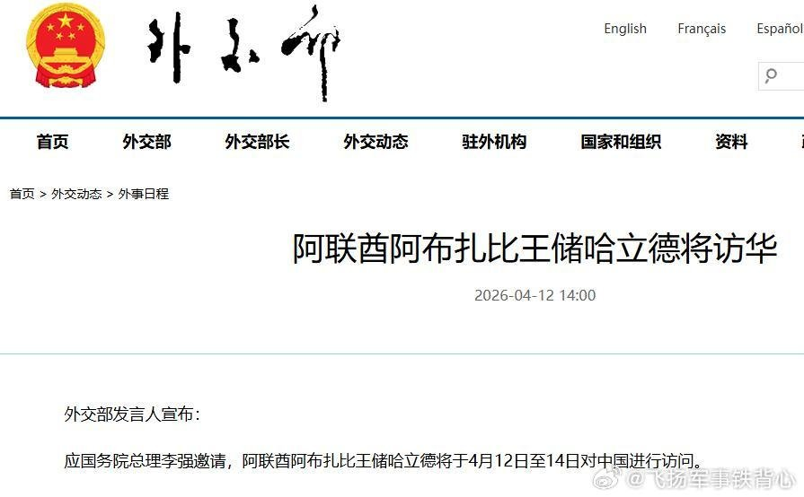

@飞扬军事铁背心

发表于：2026-04-16 15:52

来源：微博

链接：https://m.weibo.cn/status/5288477497232777

时间---

阿布扎比到北京飞行距离大约在5960公里左右，波音747的巡航速度约为900-920公里/小时。

阿方公布出访的时间是当地时间11日晚上7点21（北京时间 23:21）。

外交部网站上公布阿联酋王储访华的消息，时间是12日14:00。

阿联酋王储专机抵达北京的时间是北京时间是12日20:43。

。

如果按照和平时期的正常飞行数据推算，北京时间当天下午一点左右从阿布扎比起飞，走直线可以做到20:43落地北京，但这显然是不可能的，因为当前局势下王储专机既不能走伊拉克领空，也不能走伊朗领空。

综合当时的空域限制和避险惯例，它的航线很可能是这样的：

专机从阿布扎比起飞后，先沿波斯湾南部海岸线飞行——阿联酋自身的空域虽然受限但并未关闭，且南部海域远离冲突区域；

接着，向东穿越霍尔木兹海峡以南的阿曼湾，避开海峡北侧局势紧张的伊朗水域；

离开阿曼湾后，很可能从巴基斯坦西南部的莫克兰海岸线进入巴基斯坦领空；

穿过巴基斯坦（也许还经过阿富汗），然后由西向东进入中国领空，最终抵达北京。

按照绕行路线，专机的实际起飞时间必须要早得多，大概上午10:00左右就得起飞。

关联一下时间点（统一为北京时间）：

11日晚上23:21公布消息，次日10点起飞。

这次阿联酋王储访华是应中方邀请，访问被定义为 “官方访问” 。王储的随行人员不仅有部长级官员，还包括了央行行长、阿布扎比投资局（ADIA） 等三大国家级主权基金的掌门人，以及阿布扎比国家石油公司（ADNOC） 的CEO。

在阿联酋确定访华行程之后，整个高级代表团的成员都要进入通宵待命状态，以便整理议题清单、合作草案等海量资料。

外交部网站公布消息的时间是14:00，按照绕行航线、飞行速度等推测，差不多是在王储专机快要出巴基斯坦领空，甚至已经进入中国领空的时候——也就是确定王储访华行程万无一失了才公布消息。

行程非常紧急，但访问成果异常丰硕。王储访华期间，双方非常高效率地签署了24项谅解备忘录。

阿联酋王储这次“闪电访问”，表面上看带有紧急避险的色彩——在美伊冲突骤然升级、自身安全受到直接威胁的节点上，迅速来华寻求政治协调与经济托底。

但阿联酋王储这次访华又并非仅仅只是避险，它实际上是海湾国家战略转型从量变到质变的一个临界点。

过去几十年，海湾国家的策略一直是安全靠美国，经济靠中国。但很显然，这种策略已经难以为继。

中阿24项谅解备忘录不是一个急救包，而是阿方经过长期权衡和抉择，在关键时刻决定下来的战略储备。中国在海湾地区的角色，正在从可选的合作伙伴加速转变为不可或缺的战略稳定器。

\#中东局势\#\#烽火问鼎计划\#

---

