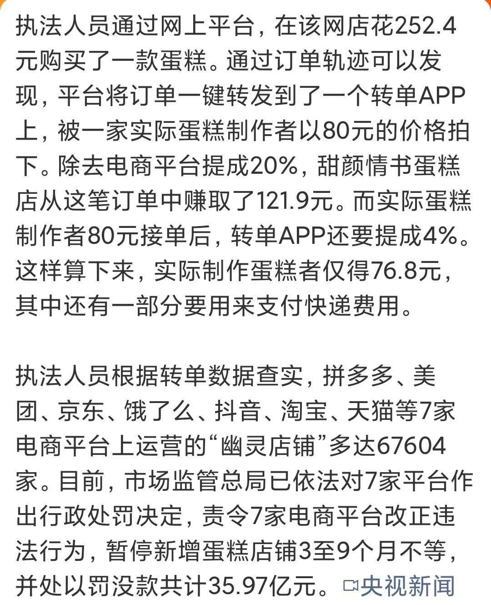

@风云学会陈经
发表于：2026-04-18 17:03
来源：微博
链接：https://m.weibo.cn/status/5289093976297068

\#一个蛋糕引出7平台35.97亿元罚单\#
完全想不到，还有这种业务，实际生产者太卑微了

6.7万家店，不实际生产，干的是渠道。252.4元里，121.9是虚拟店赚的，50是平台赚的。

这个就不说了，实际生产居然是几家店来低价拍卖，80低价“中标”。生产者利润只有10多元。这种商业逻辑是匪夷所思的。

国际贸易上，这种事其实司空见惯，情况甚至更严重。一些外国商家不实际生产，干的是渠道，主要费用是流通环节里的，占了绝大多数利润。实际生产的是中国公司，价格极低，互相低价竞争，相比最终售价等于不要钱，利润微薄。但是，没有中国公司的生产，整个业务都不成立。很多国家的商业等于是“幽灵店铺”。

只是没想到平台经济也会这么干。

---

