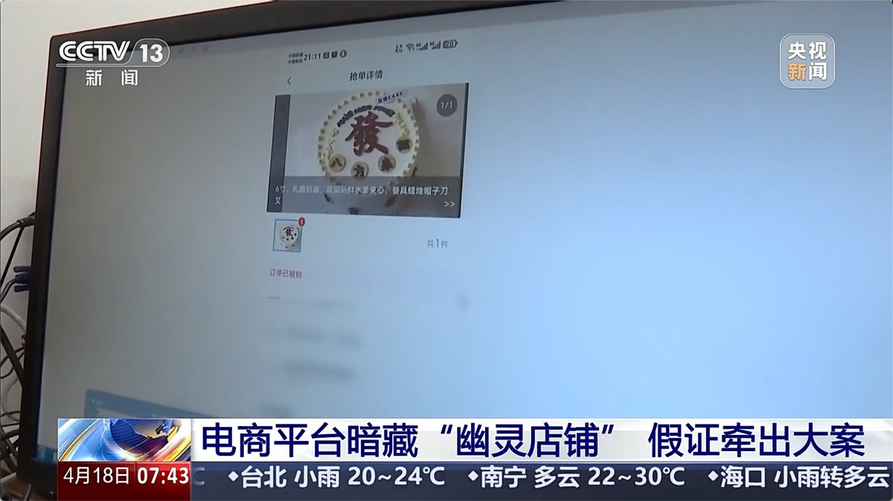

@新浪热点

发表于：2026-04-18 10:03

来源：微博

链接：https://m.weibo.cn/status/5289000195851453

【\#200多元买蛋糕制作者仅得76.8元\#】\#一个蛋糕引出7平台35.97亿元罚单\# 去年8月，北京市海淀区市场监督管理局在例行检查中发现，某电商平台APP上一家名为“甜颜情书”的蛋糕店铺疑点重重。该网店称，北京市内共23家实体店铺，但其中10家店铺的食品经营许可证编号完全相同。进一步调查显示，这家店铺宣称“全国连锁、共378家店铺”，实则没有线下实体店铺。

执法人员通过网上平台，在该网店花252.4元购买了一款蛋糕。通过订单轨迹可以发现，平台将订单一键转发到了一个转单APP上，被一家实际蛋糕制作者以80元的价格拍下。除去电商平台提成20%，甜颜情书蛋糕店从这笔订单中赚取了121.9元。而实际蛋糕制作者80元接单后，转单APP还要提成4%。这样算下来，实际制作蛋糕者仅得76.8元，其中还有一部分要用来支付快递费用。

执法人员根据转单数据查实，拼多多、美团、京东、饿了么、抖音、淘宝、天猫等7家电商平台上运营的“幽灵店铺”多达67604家。目前，市场监管总局已依法对7家平台作出行政处罚决定，责令7家电商平台改正违法行为，暂停新增蛋糕店铺3至9个月不等，并处以罚没款共计35.97亿元。（央视新闻）央视新闻的微博视频

---

