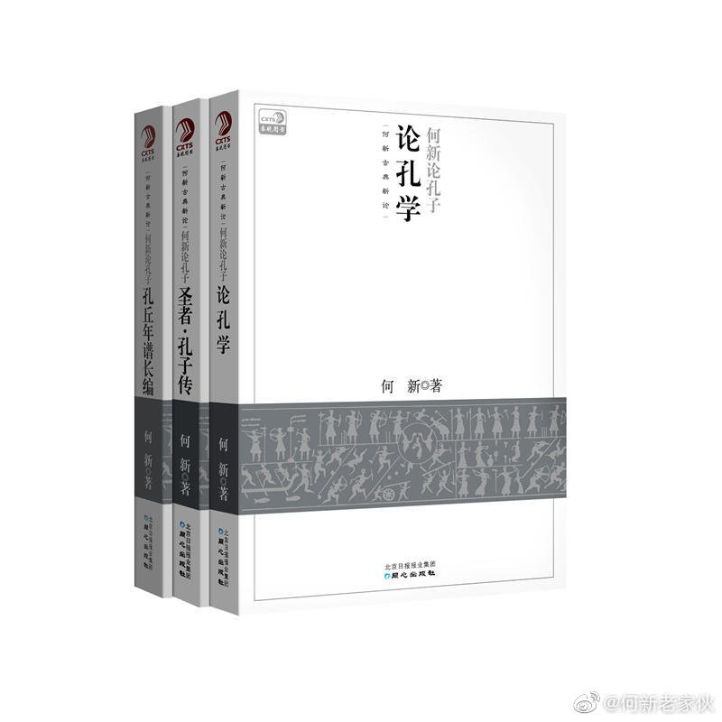

@何新老家伙

发表于：

来源：微博

链接：https://m.weibo.cn/status/4401342690641112

老何：我不说谁知道——孔子是杰出的军事家

在当代的主流讲坛上，孔子只是个教书匠人，很多人认为他是个冬烘的书呆子。很少有人知道，孔子其实不是文人而是一位杰出的军事家。

据历史记载，孔子身高体壮（个子两米以上），有力气，善射箭，善于驾驭马车（春秋时的单驾马车都是战车），而且精于技击（武术），这些都是春秋时期作为武士所必修的武道。

孔子精于武道，或与其出身有关，他的父亲孔纥生前就是一位武士。

但是不仅如此，孔子还精于兵道，即精通军略与军事。孔门下弟子出了多位军事家，其中很著名的一位猛将是冉有。

冉有即冉求，鲁国人，曾经跟从孔子流亡。后鲁国有乱，被孔子派遣回国，任鲁国权臣季氏的家臣。

鲁哀公十一年（公元前484年），齐国军队来攻鲁国。鲁国以三军为抵御——孟公子孺人帅右军，鲁公子帅中军，冉有任左师帅，统领季氏的家族军甲士七千人及奴隶（徒）五百人参战。

冉有乘三人战车，持长矛立战车上之左位，孔门的另一个弟子樊迟持戟同车立右位（当时惯例，将帅所乘兵车：将帅居左，御马者居中，卫者执戟居右）。

开战后，鲁国的右军及中军一触即溃，败退。于是樊迟驱战车，知难而进，冉有持矛，率左军勇猛冲击，击败齐军，鲁军遂转败为胜。

战后，季氏问冉有曰：你的兵法——“学之乎？性之乎？”冉求答曰：“学之于孔子”。

——冉有说：我会打仗是孔子教我的。

于是季氏决定招回孔子——邀请流亡在外已多年的孔子回国，请孔子回来帮助鲁国抵御外敌。

在孔子流亡时期，曾经有多位国君问军事作战于孔子，但孔子均谦卑地推辞说我不懂军事。

其实孔子是很懂兵法的，他曾经对子贡说，治国之道唯有两件大事，这就是足食与足兵。做到这两个，就可以得到百姓的信任。

——所谓足食与足兵，也就是要富国与强军。

（《论语·颜渊》“子贡问政,子曰:足食,足兵，民信之矣。”）

孔子曾经说：“我战则克，好谋而成。”

所谓“我战则克”，是指孔子亲自指挥的一场鲁国平叛之战，即季武子台之战。

鲁定公十三年（前497年）夏，季氏家臣公山不狃发动叛乱，率私军袭击鲁国国都。鲁定公和季孙斯仓皇逃跑，登上季氏府邸中的季武子台避难。

叛军进攻武子台，射出的箭直飞到鲁君的身边。

孔子指挥弟子抵抗叛军，孔门弟子申句须、乐颀击败叛军，叛军退出国都。鲁军乘势追击，在姑蔑击灭叛军，公山不狃逃奔齐国。

这一战是孔子指挥的。所以孔子说——我战则克，因为我懂得兵道。

【子 曰：“我战则克，祭则受福。盖得其道矣。“（《礼记》）】

有意思的是，中国先秦时期军事家以“孙吴”为最著名，孙即孙子，吴是吴起。

吴起是战国初期一位杰出的军事家、政治家和改革家。

吴起是卫国左氏（今山东曹县）人。曾经执政于鲁、魏、楚三国。他通兵家、法家、儒家，指挥作战多胜利。晚年在楚国主持变法。周安王二十一年（公元前381年），因变法得罪贵族而被害。著作有《吴子兵法》传世，与兵圣孙武的兵法并称“孙吴兵法”。唐肃宗时，吴起被封为武庙十哲之一。

 吴起出于儒门，他是孔子隔代弟子，曾参和子夏都曾经是吴起的老师。 

【详论及史料，可参看何新著作《孔丘年谱长编》。】

---

