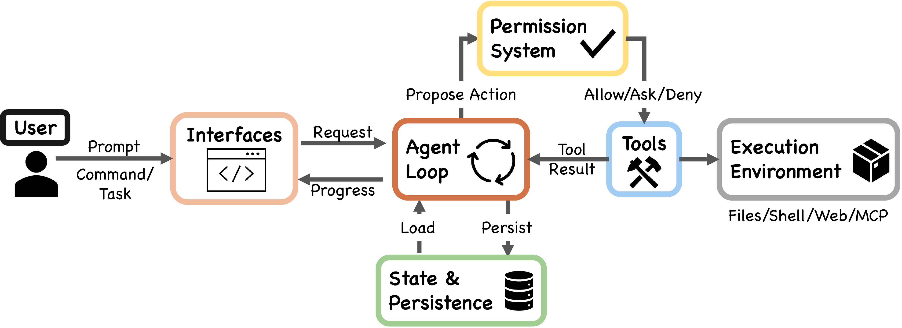
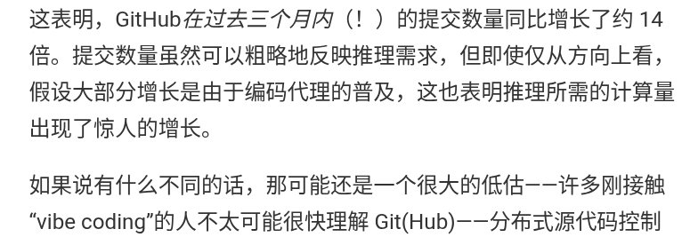
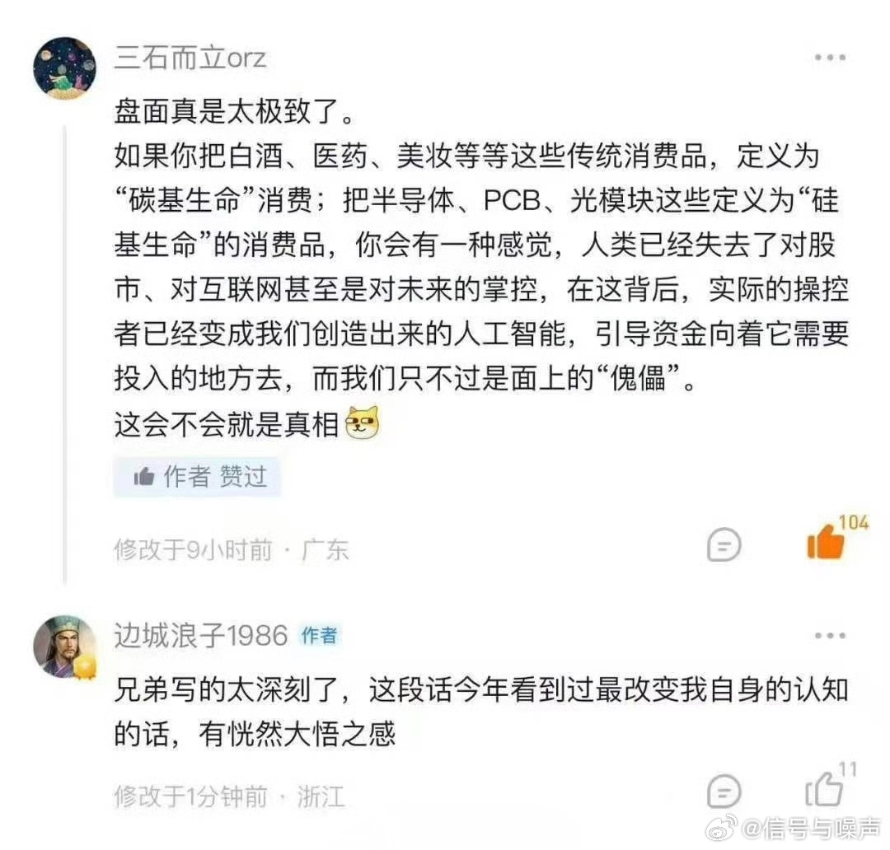

# 2026-04-19

## 1

@蚁工厂

发表于：2026-04-18 09:27

来源：微博

链接：https://m.weibo.cn/status/5289105313238559

一篇分析Claude Code 源码的论文：深入探索Claude Code：当今与未来AI代理系统的设计空间

arxiv.org/abs/2604.14228

论文认为Claude Code 的能力来自“薄模型决策层 + 厚工程执行层”。模型负责决定下一步，外部 harness 负责上下文装配、权限判断、工具执行、恢复、持久化和安全边界。论文认为，生产级 agent 的难点主要在模型周边系统，而非单纯的推理循环。

“Claude Code 是一种智能体式编程工具，能够代表用户运行 shell 命令、编辑文件并调用外部服务。本文通过分析其公开可获得的 TypeScript 源代码，描述了它的完整架构，并进一步将其与 OpenClaw 进行比较。OpenClaw 是一个独立的开源 AI agent 系统，在不同部署场景下回答了许多相同的设计问题。

我们的分析识别出五类驱动该架构的人类价值、理念与需求：人类决策权、安全与安全性、可靠执行、能力放大、上下文适配性。本文进一步追踪这些价值如何通过十三项设计原则落实到具体实现选择中。系统的核心是一个简单的 while 循环：调用模型、运行工具，然后重复执行。

然而，大部分代码存在于这个循环周边的系统中：一个具有七种模式和基于机器学习分类器的权限系统；一个用于上下文管理的五层压缩流水线；四种扩展机制，即 MCP、插件、技能和 hooks；一个子 agent 委派与编排机制；以及面向追加写入的会话存储。

与 OpenClaw 这个多渠道个人助理网关的比较表明，当部署环境发生变化时，相同的反复出现的设计问题会产生不同的架构答案：从逐动作安全评估转向边界级访问控制，从单一 CLI 循环转向嵌入网关控制平面的运行时，从上下文窗口扩展转向网关级能力注册。

最后，我们基于近期的实证研究、架构研究和政策文献，提出了未来 agent 系统的六个开放设计方向。”

\#AI创造营\#

---

## 2

@信号与噪声

发表于：2026-04-18 13:18

来源：微博

链接：https://m.weibo.cn/status/5289163530439344

GPU荒讲了3年，现在开始缺CPU。

过去几个月，全球云市场的服务器CPU已经卖光了。亚马逊CEO在致股东信里说，有两家大型客户想包下他们2026年全部的Graviton CPU实例，他没法答应，因为根本不够分。SemiAnalysis的创始人Dylan Patel说："there's no capacity anywhere."

为什么突然开始缺CPU？

因为去年下半年开始爆火的AI Agent。早期的ChatGPT式推理，CPU只是个传话员。你发问，它做token转换，丢给GPU，GPU干掉90%的活，完事。CPU基本是陪跑的。

Agentic AI不是这个逻辑。智能体要规划、要拆任务、要调API、要写代码再跑起来、要判断自己有没有做对。这些全部压在CPU上，GPU管不到。苏姿丰在最近的财报电话里说，智能体把任务分发到企业内部时，"实际跑的是大量传统CPU任务，而且绝大多数跑在x86架构上"。

2025年11月有一个信号当时几乎没人注意到。AWS和OpenAI宣布了380亿美元的七年合作，发布稿里写了两件事：数十万块NVIDIA GPU，加上"数千万CPU用于扩容agentic工作负载"。所有人盯着GPU那行，CPU那行被翻篇了。

供给端更麻烦的是，Intel和AMD各有各的问题。Intel自有fab良率出了状况，正把产能从PC挪向服务器，Q1是供给最紧的时间点，Q2之后才有望缓解。

AMD靠台积电，台积电的先进制程产能在GPU面前早已排满，给CPU的空间越来越窄。两个缺口加在一起，没有快速解决办法。

中国这边，据报道已有服务器CPU厂商通知客户等货时间拉到半年。Intel和AMD据供应链报告都在准备今年提价，幅度进入两位数区间。一家PC品牌高管说的那句话很能说明现在的处境："我们不怕贵，我们怕的是多付钱也拿不到货。"

有个需要认真回答的问题：如果CPU变成agentic AI基础设施的新瓶颈，接下来谁才是被大幅重新定价的那个？Intel or AMD？from群友

## 3

@蚁工厂

发表于：2026-04-19 15:03

来源：微博

链接：https://m.weibo.cn/status/5289427002723135

Simon Willison对 Claude Opus 4.6 与 4.7 系统提示词变化做了分析。

以下为其博文翻译：

Anthropic 是唯一一家公开用户端聊天系统系统提示词的主流 AI 实验室。他们的系统提示词档案现在已经追溯到 2024 年 7 月的 Claude 3。观察这些系统提示词如何随着新模型发布而演进，一直都很有意思。

Opus 4.7 前几天发布了，也就是 2026 年 4 月 16 日，同时 Claude.ai 的系统提示词也相较 Opus 4.6 版本，也就是 2026 年 2 月 5 日的版本，进行了更新。

我让 Claude Code 处理了他们系统提示词的 Markdown 版本，把它们拆成每个模型各自的独立文档，然后构建了一段 Git 历史记录，用每次提示词发布的日期作为模拟提交日期。这里是我在网页端给 Claude Code 使用的提示词。

下面是 Opus 4.6 与 4.7 之间的 git diff。这些是我从 diff 中摘出的重点：

🌟“developer platform” 现在改称为 “Claude Platform”。

🌟系统提示词中提到的 Claude 工具列表现在包含：“Claude in Chrome——一个可以自主与网站交互的浏览代理；Claude in Excel——一个电子表格代理；Claude in Powerpoint——一个幻灯片代理。Claude Cowork 可以把这些都作为工具使用。”其中 Claude in Powerpoint 在 4.6 的提示词中没有出现。

🌟儿童安全部分大幅扩展，并被包裹在新的 <critical_child_safety_instructions> 标签中。尤其值得注意的是这句话：“一旦 Claude 因儿童安全原因拒绝某个请求，同一对话中的所有后续请求都必须以极高谨慎度处理。”

🌟他们似乎在让 Claude 变得更少推动用户继续对话：“如果用户表示已经准备结束对话，Claude 不会要求用户继续互动，也不会试图引出下一轮对话，而是尊重用户停止对话的请求。”

🌟新的 <acting_vs_clarifying> 部分包括：

当一个请求只缺少少量细节时，用户通常希望 Claude 现在就做出合理尝试，而不是先接受一轮盘问。Claude 只在缺失信息导致请求真正无法回答时才会预先提问，例如请求引用了一个实际并不存在的附件。

当某个可用工具能够解决歧义或补足缺失信息时，例如搜索、查询用户位置、检查日历、发现可用能力，Claude 会调用工具来尝试解决歧义，然后再向用户提问。相比让用户自己去查，优先使用工具行动。

一旦 Claude 开始执行任务，就会把任务推进到一个完整答案，而不是中途停下。……

🌟Claude 聊天现在似乎有了工具搜索机制，这可以从这份 API 文档以及 2025 年 11 月的这篇文章中看到：

在断定 Claude 缺少某项能力之前，例如访问用户位置、记忆、日历、文件、过往对话或任何外部数据，Claude 会先调用 tool_search 检查是否存在一个相关但暂未启用的工具。只有在 tool_search 确认不存在匹配工具之后，“我无法访问 X”才是正确说法。

🌟还有一些新文字鼓励 Claude 更简洁：

Claude 会让回答保持聚焦和简洁，以避免过长回答让用户感到负担。即使答案包含免责声明或限制说明，Claude 也会简要披露，并让回答主体集中在核心答案上。

🌟下面这一段在 4.6 提示词中存在，但在 4.7 中被移除了，推测原因是新模型已经不再以同样方式出现相关问题：

Claude 避免使用放在星号里的表情动作，除非用户明确要求这种交流风格。

🌟Claude 避免说 “genuinely”、“honestly” 或 “straightforward”。

🌟新增了一个关于“进食障碍”的部分，此前系统提示词中没有直接提到这个名称：

如果用户表现出进食障碍迹象，Claude 不应提供精确的营养、饮食或运动指导——包括具体数字、目标或分步计划——无论在对话的任何位置都不应提供。即使这些内容的意图是帮助设定更健康的目标或指出进食障碍的潜在危险，带有这些细节的回答也可能触发或助长进食障碍倾向。

🌟一种流行的针对 AI 模型的截图攻击，是强迫模型对争议问题回答“是”或“否”。Claude 的系统提示词现在对此做了防护，位于 <evenhandedness> 部分：

如果用户要求 Claude 对复杂或有争议的问题，或对有争议人物的评论，给出简单的是或否回答，或任何其他简短、单词式回答，Claude 可以拒绝提供这种简短回答，转而给出有细节的回答，并解释为什么简短回答不合适。

🌟Claude 4.6 曾有一个专门部分，明确说明“唐纳德·特朗普是现任美国总统，并于 2025 年 1 月 20 日就职”。原因是如果没有这段说明，模型的知识截止日期结合它此前关于特朗普错误声称自己赢得 2020 年大选的知识，会导致它否认特朗普是总统。这段文字在 4.7 中已经移除，反映出该模型新的可靠知识截止日期已经到 2026 年 1 月。

🌟还有工具描述

Anthropic 公开的系统提示词只是其中一部分。他们公开的信息没有包含提供给模型的工具描述，而如果你想充分利用 Claude 聊天界面的能力，工具描述可以说是更重要的一类文档。

好在你可以直接问 Claude。我使用的提示词是：

列出你可用的所有工具，并精确复制工具描述和参数。

我的共享聊天记录里有完整细节，但具名工具列表如下：

ask_user_input_v0

bash_tool

conversation_search

create_file

fetch_sports_data

image_search

message_compose_v1

places_map_display_v0

places_search

present_files

recent_chats

recipe_display_v0

recommend_claude_apps

search_mcp_registry

str_replace

suggest_connectors

view

weather_fetch

web_fetch

web_search

tool_search

visualize:read_me

visualize:show_widget

我认为这个列表从 Opus 4.6 开始就没有变化。

\#AI创造营\#

---

## 4

@智能时刻

发表于：2026-04-14 08:37

来源：微博

链接：https://m.weibo.cn/status/5287643185155567

数学

研究人员刚刚证明，每一个基本函数，如正弦函数、指数函数、对数函数、平方根函数，其实都源自一个单一的二元运算符。

这就好比找到了微积分的“上帝粒子”。在计算机科学领域，每一个复杂的程序都可以简化为一个单一的逻辑运算符：即“与非”门。它是所有数字现实的基本构建模块。

但对于连续数学、物理学、工程学、机器学习等领域而言，我们原本以为需要一个庞大的工具箱。加法。减法。三角函数。对数函数。每一个科学计算器和神经网络都必须处理所有这些运算。

直到今天。但这篇论文证明，每一个数学函数都可以由一个单一的奇特二元运算符生成。例如：eml(x,y) = exp(x) - ln(y)。将这个式子与数字 1 相结合，你就能构建出一切。圆周率。平方根。正弦和余弦。算术运算。

这一切都只是同一个运算符，以二叉树的形式不断重复出现。没有人预料到会有这样的情况存在。它是通过系统性的全面搜索发现的。但这对人工智能的影响是巨大的。人工智能不再需要费力地将不同的数学规则组合起来以发现新的科学定律，而是可以使用单一的、统一的架构。一个可训练的电路。一个可重复的节点。我们原以为宇宙的语言是复杂的。但事实证明，它不过是在黑暗中重复着一个简单的公式而已。

\#编程\#\#科学史\#\#人工智能\#\#互联网科技\#\#宇宙\#\#自然科学\#

---

## 5

@新浪科技

发表于：2026-04-16 10:41

来源：微博

链接：https://m.weibo.cn/status/5288399105955045

【\#我国科学家造出球状闪电\#】球状闪电，俗称“滚地雷”，是自然界最神秘的电磁现象之一。许多人曾目击到这种悬浮于空气中的发光球体，心中充满了好奇和追问。科学家们也提出过多种理论假说，但始终缺乏可重复、可精确诊断的实验加以验证。

在深厚技术积累基础上，中国科学院上海光学精密机械研究所的研究团队，首次在世界上用人工方式，成功激发并捕获了一种在形状、状态和发光特性与自然界球状闪电高度相似的球形发光体，从而揭示并证实球状闪电的本质为“电磁孤子”。4月16日，国际权威学术期刊《自然·光子学》发表了相关论文。

“它飘了进来，一个篮球大小的蓝色火球。它像一个蓝色的幽灵，一个凝固的闪电，在客厅里飘行，发出的光芒柔和冰凉。它没有声音，也没有轨迹，就那么无声地、空灵地飘着，像在空气中游泳。”这是科幻作家刘慈欣在《球状闪电》一书中描写的球状闪电。

我国科学家在实验室里人工制造的“类球状闪电”是什么样子呢？

 记者在研究团队用高速摄像系统捕捉的画面中看到：黑暗中，只见一个明亮的白色发光体，被一层幽蓝的外壳团团包裹，形成了一个球形的能量体，从小到大、飘忽不定、逐渐膨胀。慢慢地，球体变成了蓝色的粗颗粒状，最终耗散。

“这个蓝色的外壳，就是像太阳一样的燃烧等离子体，它如同一个无形的‘光之茧’，将电磁波紧紧包裹在中间，最终形成了一个直径约百微米、寿命达百纳秒的能量球。”上海光机所田野研究员解释说，“这个能量球缓慢膨胀，发出的光谱覆盖从紫外到红外的宽波段，完全符合理论预言的电磁孤子行为。经物理标度变换，该电磁孤子可对应自然界中直径几十厘米、持续数秒的球状闪电。”

“电磁孤子”就是电磁波变成了像粒子一样稳定态、会穿墙、精准攻击的“电磁幽灵球”——这正是科幻小说《球状闪电》的现实物理原型。（新华社）

---

## 6

@ruanyf

发表于：2026-04-08 04:42

来源：微博

链接：https://m.weibo.cn/status/5285409665583670

有文章称，GitHub 今年前三个月的代码提交量，是去年同期的14倍！ 难怪最近老是出现故障。网页链接

如果这个数字是真的，那么 GitHub 全面收费的日子也不远了。

---

## 7

@信号与噪声

发表于：2026-04-18 13:34

来源：微博

链接：https://m.weibo.cn/status/5289167437173561

兄弟们，最牛逼的彭博终端一年要花20w元，而这款开源桌面应用，正打算把它取而代之——关键是，它完全免费。

 

如果兄弟们早就想用上机构级的金融分析工具，又不想掏对冲基金级别的年度软件费，那这篇内容千万别划走。

 

它叫Fincept终端，是一款开源金融情报平台。

自带CFA级别的分析能力、100多个数据接口、AI投资大师复刻功能，还有3D海运追踪系统，全集成在一个桌面客户端里，Windows、macOS、Linux系统全兼容。

 

核心功能：

→ 完整覆盖CFA一、二、三级全体系分析模型，全用Python实现——包括DCF模型（企业自由现金流FCFF、股权自由现金流FCFE）、投资组合优化、夏普比率、95%置信度风险价值（VaR）、最大回撤、股利贴现模型、期权定价与希腊字母测算

→ 20多位AI投资大师复刻——沃伦·巴菲特、本杰明·格雷厄姆、瑞·达利欧、乔治·索罗斯、彼得·林奇、塞斯·卡拉曼，每一个都严格遵循本尊的真实投资理念，帮你分析个股

→ 对冲基金策略模拟——桥水全天候策略、城堡多策略量化模型、文艺复兴科技统计套利策略

→ 100+数据接口——PostgreSQL、MongoDB、Kafka、Kraken交易所、Polygon.io、Alpha Vantage、DBnomics（超1亿条经济数据序列）、世界银行、IMF、OECD、雅虎财经

→ 基于ReactFlow搭建的可视化流程编辑器——拖拽就能搭建数据管道，几分钟就能对接任意API

→ 支持MCP工具集成，可实现AI自动化操作

→ 3D地球实时追踪，覆盖船舶、飞机、卫星动态，可做供应链与贸易航线分析

→ 地缘政治分析框架——大棋局、地理囚笼理论、央行政策实时追踪

 

最绝的是：

你可以用巴菲特AI智能体分析任意一只股票，算出格雷厄姆内在价值估值，再调出瑞·达利欧的全天候投资组合配比——全程在同一个界面里完成，还能接入你自己的数据接口给模型喂数据。

 

微软应用商店直接就能下载，Windows、macOS、Linux用户也能从GitHub发行版里手动安装。

 

目前GitHub上已经斩获2600颗星，迭代了22个版本，最新的v3.3.0版本已经正式发布。

 

100%开源，采用AGPL-3.0开源协议。

 ~~~~~~~~~

我看下，还真的不错，与彭博终端的区别如下：

Fincept Terminal 数据源解析：散户0元起步，彭博级要多少钱？

Fincept软件100%免费，但数据源分免费和付费。你自己申请API Key，在可视化编辑器拖拽连接，无需编程。

🌲免费数据源（0元/月，够90%需求）：

- Yahoo Finance：美股港股历史行情、基本面。

- AkShare：A股期货基金宏观，中国散户首选。

- FRED/DBnomics/World Bank/IMF/OECD：1亿+全球宏观数据全免费。

- Kraken基本：加密实时。

这些够跑CFA DCF估值、AI巴菲特分析、组合优化，散户日常0成本超爽！

🌲付费数据源（按月付给官网）：

- Polygon.io：免费鸡肋，Starter 29美元/月，Advanced实时199美元（tick级期权）。

- Alpha Vantage：Premium 49.99美元/月起。

- Kraken高级基本免费。

🌲冲彭博级一个月多少钱？

彭博每月2000美元。

Fincept版：最低Polygon Advanced199+Alpha50=250美元（约1800元）。

实用版：只29美元+免费源就够。

差距：Fincept实时+AI+3D已80-90%价值，但彭博独家新闻更深。省钱10倍！

🌲避坑建议：

1. 先免费玩1月再付费。

2. 实时美股上Polygon 199刀。

3. 国内AkShare+免费宏观最省。

4. Key拖拽填好自动刷新。

5. 免费API别狂刷上限。

总结：0元开心玩，想机构级200-300美元秒杀彭博90%！性价比爆表

---

## 8

@信号与噪声

发表于：2026-04-18 14:30

来源：微博

链接：https://m.weibo.cn/status/5289181665303009

碳基通缩 vs 硅基通胀

---

## 9

@高飞

发表于：2026-04-17 15:17

来源：微博

链接：https://m.weibo.cn/status/5288831113760061

\#模型时代\# MIT校长的AI教育观：写作仍然是思考，基础编程必须亲手学

刷到一期Kornbluth，MIT第18任校长的Sequoia Capital播客访谈，采访人是Halligan，HubSpot联合创始人、前CEO，也是MIT Sloan校友。

其中谈到了AI时代的教育，现在这是个大家都很关心的议题，我专门摘出来整了一下。

一、大学的价值到底在哪里

1、校友记住的不是某门课，是整个环境

Kornbluth说，校友回来聊MIT如何改变了他们的人生，几乎没人提某一门具体的课或某项具体技能。改变他们的是整个环境——被一群同样水准的人包围，在这种密度下碰撞出来的东西。

Halligan也承认这一点。他说自己从Sloan拿到的是三样东西：一块招牌、一批知识、一张关系网。他也承认"you can learn this stuff anywhere now"，这些知识本身现在到处都能学到。

2、但"到处都能学到"不等于大学没用

Kornbluth接住了这个话头，把问题拉回到一个基本事实：不管AI怎么发展，MIT培养的终究是人。AI是工具，用来增强人的能力，而不是替代人。所以学生必须学会在这个有AI的环境里生存和工作，而不是绕开它或者被它取代。

二、AI到底能替代多少"脑力劳动"

1、你脑子里需要装多少东西才能进行创造性思考？

她坦率地说，多少知识需要留在脑子里、多少可以卸载给AI，这个边界她还没有答案。但她提供了一个具体的测试方法：你用三种不同方式问AI同一个问题，会得到三个完全不同的答案。如果学生不具备判断哪个对的能力，AI对他来说就是一个不可靠的黑箱。

2、基础编程必须学，因为你得看得懂AI给你的东西

MIT内部正在讨论学生是否还需要学基础编程。Kornbluth的立场很明确：必须学。理由不是编程本身的市场价值，而是判断力。你得能看出AI写的代码是不是对的，得有一个脑子里的概念框架来提出正确的问题。

3、"Writing is thinking"，让AI代写等于放弃思考

Kornbluth用了一句简洁的判断：写作就是思考。让AI替你写一篇东西和自己想清楚一个问题再写下来，这是两回事。你可以用AI帮你迭代，但最初的思考过程不能外包。

Halligan在节目尾声的总结里也特意强调了这一点，把它列为整期对话的核心观点之一。

4、物理世界的AI还差得远

Kornbluth提到MIT作为一个强调"手脑并用"的地方，一直重视实际建造能力。软件层面的AI在飞速推进，但physical AI，也就是让AI在物理世界中操作实物，还远没到位。她举了一个例子：她看到视频里机器人试图把一罐可乐端过房间，结果把可乐翻过来，一路洒到对面。在物理操作层面，需要解决的问题还太多。

三、课堂会消失吗

1、传统的单向灌输式讲座可能撑不了太久

Kornbluth设想了一种新模式：学生先在小组里跟AI导师学习事实性材料，然后回到课堂和教授进行讨论。当获取知识的渠道变得多样化之后，传统的教授站在台上从头讲到尾的格式，存活空间会越来越小。

2、但人和人之间的碰撞不可替代

讨论、质疑、来自教授的批判、来自同学的挑战，这些才是大学教育真正的产出。Kornbluth不认为这部分会消失。她描述的未来更像牛津剑桥的tutorial体系，AI接管知识传递，人负责思维碰撞。

四、17岁该学什么

1、Kornbluth的个人选择：神经科学或免疫学

被问到如果自己17岁重新选专业会选什么，她给了两个方向：神经科学，因为大脑的谜题还有太多没解开；免疫学，因为它将影响健康的所有领域。两个方向的共同点是还有几十年的发现空间。

2、只选你有真正热情的领域，而且要做"动脑子"的那个人

Kornbluth拿自己读博时的情况做对比。那时候，测序一个基因就能拿到博士学位，技术上有挑战，但智力上并不特别刺激。今天的情况反过来了，AI等于给你配了无数双"手"，重复性技术工作可以被自动化，但你必须是那个提出问题、做出创造性判断的人。如果你只打算当"那双手"，不要读博。

3、Google外包了信息，AI正在外包认知

Halligan追了一句感慨：Google把信息检索外包了，AI系统正在把认知本身外包出去。这个趋势走下去会改变什么，谁也说不准。

Kornbluth用医学举例延伸了这个问题。影像分析正在被AI改变，今天选择做放射科医生或病理科医生，也许行也许不行，因为判断"这是不是癌症"只是他们工作的一部分，而这部分正在被AI蚕食。但还有多少人类判断是不可替代的？她的回答是：我们还不知道。

4、17岁不需要选一辈子的方向

Kornbluth最后拉回来说了一句平衡的话：一个17岁的人不需要确定终身职业，人们现在不断转型。MIT真正想做的是培养好奇心和批判性思维，这两样东西在任何方向上都有用。

五、MIT在意毕业生去哪里吗

1、不在意去哪里，在意你在这里时是否达到了同样的标准

Kornbluth在杜克大学带实验室时，大约一半的学生去了工业界，一半留在学术界。当时很多教授认为培养PhD就该为学术服务，去企业是浪费。Kornbluth从来不这么看。她的原则是：不管你去哪里，在MIT期间接受的训练标准不能打折。

这意味着MIT不会因为你说"我以后去企业"就降低对你的要求。教育不按终点定制，而是给你一套导航能力，让你去任何方向都能用。

2、她确实希望更多人去创业

Kornbluth对计算机科学毕业生的流向有一个明确的态度：很多人去了量化交易基金，不少人读了博士，有人去创业。她说"I wish more would do startups"。

在本地生态这个问题上，她更直接。波士顿地区的生物科技生态已经证明了大学与产业近距离共生的价值，但AI领域的创业活力大量流向了西海岸，这让她焦虑。她想让MIT的师生把发现更快地带入现实世界，也想让这些公司留在本地，形成持续的对话。她在考虑让学生参与更多co-op式的校企合作实习，而这要求公司就在物理距离可及的地方。

马萨诸塞州的经济活力一直建立在教育和前沿科技两根支柱上，Kornbluth说她不想看着这根支柱被掏空。

## 10

@少年伯爵

发表于：2026-04-19 08:03

来源：微博

链接：https://m.weibo.cn/status/5289332962756814

有时候看着这个世界，感觉很黑色幽默——在过去20年里，硬桥硬马而又直愣愣的码农们几乎创造了奇迹，硬生生把几千年门阀世家固化的上升通道冲开了，好几个世界首富都是码农，但这一切似乎要戛然而止了，码农老老实实做到了极致，催生出了AI这个套在码农自己脖子上的绞绳，并且兴高采烈的搞出了GPU这个绞刑架。

可能也不是兴高采烈，是争先恐后的踩踏逃亡吧。

硅基给碳基做的局，宇宙沙盒游戏的宿命结局。

