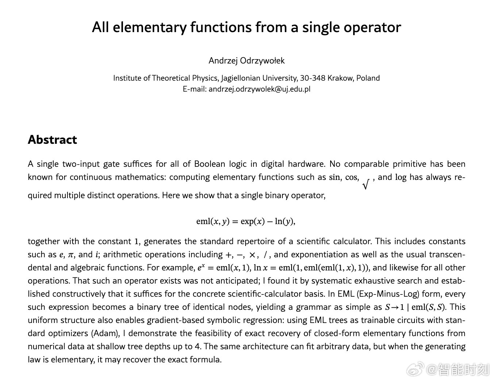

@智能时刻

发表于：2026-04-14 08:37

来源：微博

链接：https://m.weibo.cn/status/5287643185155567

数学

研究人员刚刚证明，每一个基本函数，如正弦函数、指数函数、对数函数、平方根函数，其实都源自一个单一的二元运算符。

这就好比找到了微积分的“上帝粒子”。在计算机科学领域，每一个复杂的程序都可以简化为一个单一的逻辑运算符：即“与非”门。它是所有数字现实的基本构建模块。

但对于连续数学、物理学、工程学、机器学习等领域而言，我们原本以为需要一个庞大的工具箱。加法。减法。三角函数。对数函数。每一个科学计算器和神经网络都必须处理所有这些运算。

直到今天。但这篇论文证明，每一个数学函数都可以由一个单一的奇特二元运算符生成。例如：eml(x,y) = exp(x) - ln(y)。将这个式子与数字 1 相结合，你就能构建出一切。圆周率。平方根。正弦和余弦。算术运算。

这一切都只是同一个运算符，以二叉树的形式不断重复出现。没有人预料到会有这样的情况存在。它是通过系统性的全面搜索发现的。但这对人工智能的影响是巨大的。人工智能不再需要费力地将不同的数学规则组合起来以发现新的科学定律，而是可以使用单一的、统一的架构。一个可训练的电路。一个可重复的节点。我们原以为宇宙的语言是复杂的。但事实证明，它不过是在黑暗中重复着一个简单的公式而已。

\#编程\#\#科学史\#\#人工智能\#\#互联网科技\#\#宇宙\#\#自然科学\#

---

