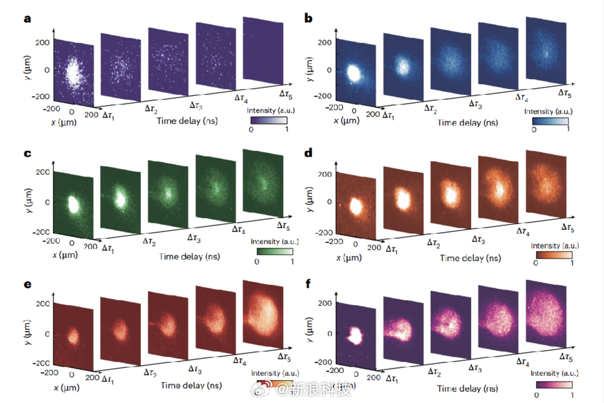

@新浪科技
发表于：2026-04-16 10:41
来源：微博
链接：https://m.weibo.cn/status/5288399105955045

【\#我国科学家造出球状闪电\#】球状闪电，俗称“滚地雷”，是自然界最神秘的电磁现象之一。许多人曾目击到这种悬浮于空气中的发光球体，心中充满了好奇和追问。科学家们也提出过多种理论假说，但始终缺乏可重复、可精确诊断的实验加以验证。
在深厚技术积累基础上，中国科学院上海光学精密机械研究所的研究团队，首次在世界上用人工方式，成功激发并捕获了一种在形状、状态和发光特性与自然界球状闪电高度相似的球形发光体，从而揭示并证实球状闪电的本质为“电磁孤子”。4月16日，国际权威学术期刊《自然·光子学》发表了相关论文。
“它飘了进来，一个篮球大小的蓝色火球。它像一个蓝色的幽灵，一个凝固的闪电，在客厅里飘行，发出的光芒柔和冰凉。它没有声音，也没有轨迹，就那么无声地、空灵地飘着，像在空气中游泳。”这是科幻作家刘慈欣在《球状闪电》一书中描写的球状闪电。
我国科学家在实验室里人工制造的“类球状闪电”是什么样子呢？
 记者在研究团队用高速摄像系统捕捉的画面中看到：黑暗中，只见一个明亮的白色发光体，被一层幽蓝的外壳团团包裹，形成了一个球形的能量体，从小到大、飘忽不定、逐渐膨胀。慢慢地，球体变成了蓝色的粗颗粒状，最终耗散。
“这个蓝色的外壳，就是像太阳一样的燃烧等离子体，它如同一个无形的‘光之茧’，将电磁波紧紧包裹在中间，最终形成了一个直径约百微米、寿命达百纳秒的能量球。”上海光机所田野研究员解释说，“这个能量球缓慢膨胀，发出的光谱覆盖从紫外到红外的宽波段，完全符合理论预言的电磁孤子行为。经物理标度变换，该电磁孤子可对应自然界中直径几十厘米、持续数秒的球状闪电。”
“电磁孤子”就是电磁波变成了像粒子一样稳定态、会穿墙、精准攻击的“电磁幽灵球”——这正是科幻小说《球状闪电》的现实物理原型。（新华社）

---

