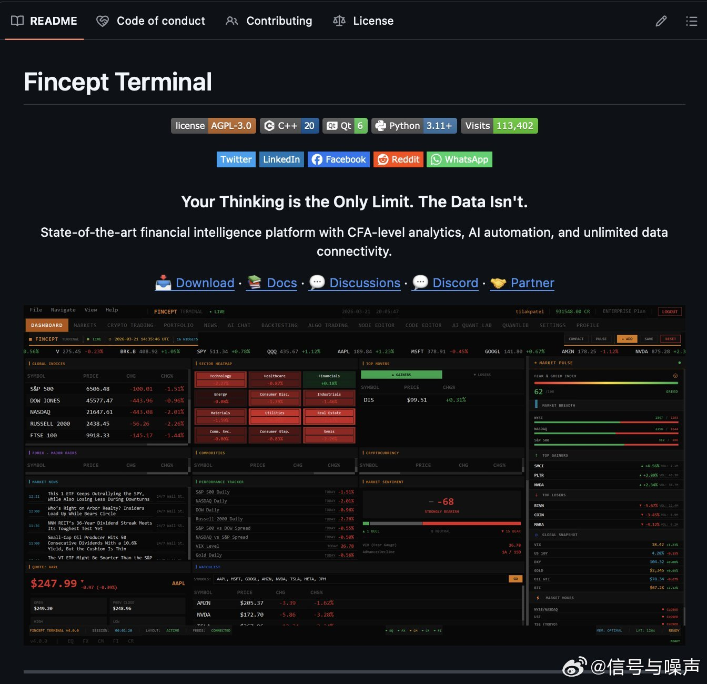
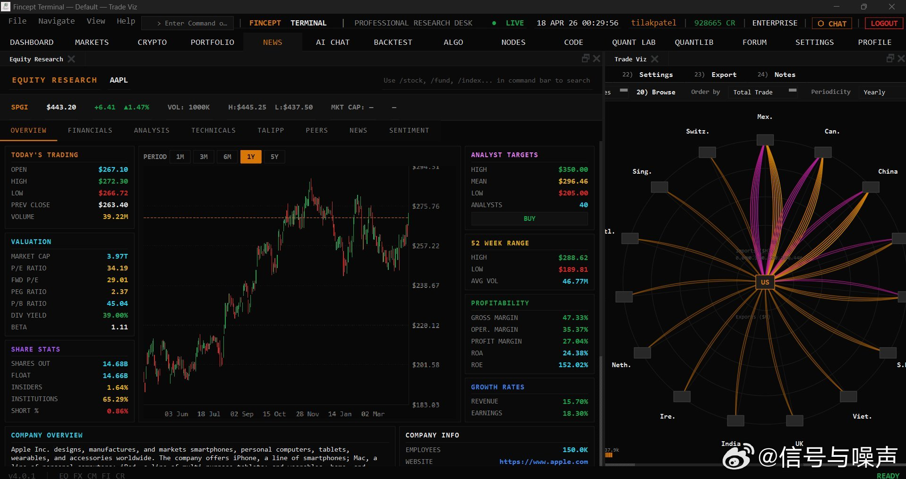

@信号与噪声
发表于：2026-04-18 13:34
来源：微博
链接：https://m.weibo.cn/status/5289167437173561

兄弟们，最牛逼的彭博终端一年要花20w元，而这款开源桌面应用，正打算把它取而代之——关键是，它完全免费。
 
如果兄弟们早就想用上机构级的金融分析工具，又不想掏对冲基金级别的年度软件费，那这篇内容千万别划走。
 
它叫Fincept终端，是一款开源金融情报平台。

自带CFA级别的分析能力、100多个数据接口、AI投资大师复刻功能，还有3D海运追踪系统，全集成在一个桌面客户端里，Windows、macOS、Linux系统全兼容。
 
核心功能：
→ 完整覆盖CFA一、二、三级全体系分析模型，全用Python实现——包括DCF模型（企业自由现金流FCFF、股权自由现金流FCFE）、投资组合优化、夏普比率、95%置信度风险价值（VaR）、最大回撤、股利贴现模型、期权定价与希腊字母测算

→ 20多位AI投资大师复刻——沃伦·巴菲特、本杰明·格雷厄姆、瑞·达利欧、乔治·索罗斯、彼得·林奇、塞斯·卡拉曼，每一个都严格遵循本尊的真实投资理念，帮你分析个股

→ 对冲基金策略模拟——桥水全天候策略、城堡多策略量化模型、文艺复兴科技统计套利策略

→ 100+数据接口——PostgreSQL、MongoDB、Kafka、Kraken交易所、Polygon.io、Alpha Vantage、DBnomics（超1亿条经济数据序列）、世界银行、IMF、OECD、雅虎财经

→ 基于ReactFlow搭建的可视化流程编辑器——拖拽就能搭建数据管道，几分钟就能对接任意API

→ 支持MCP工具集成，可实现AI自动化操作

→ 3D地球实时追踪，覆盖船舶、飞机、卫星动态，可做供应链与贸易航线分析

→ 地缘政治分析框架——大棋局、地理囚笼理论、央行政策实时追踪
 
最绝的是：
你可以用巴菲特AI智能体分析任意一只股票，算出格雷厄姆内在价值估值，再调出瑞·达利欧的全天候投资组合配比——全程在同一个界面里完成，还能接入你自己的数据接口给模型喂数据。
 
微软应用商店直接就能下载，Windows、macOS、Linux用户也能从GitHub发行版里手动安装。
 
目前GitHub上已经斩获2600颗星，迭代了22个版本，最新的v3.3.0版本已经正式发布。
 
100%开源，采用AGPL-3.0开源协议。
 ~~~~~~~~~
我看下，还真的不错，与彭博终端的区别如下：

Fincept Terminal 数据源解析：散户0元起步，彭博级要多少钱？

Fincept软件100%免费，但数据源分免费和付费。你自己申请API Key，在可视化编辑器拖拽连接，无需编程。

🌲免费数据源（0元/月，够90%需求）：
- Yahoo Finance：美股港股历史行情、基本面。
- AkShare：A股期货基金宏观，中国散户首选。
- FRED/DBnomics/World Bank/IMF/OECD：1亿+全球宏观数据全免费。
- Kraken基本：加密实时。

这些够跑CFA DCF估值、AI巴菲特分析、组合优化，散户日常0成本超爽！

🌲付费数据源（按月付给官网）：
- Polygon.io：免费鸡肋，Starter 29美元/月，Advanced实时199美元（tick级期权）。
- Alpha Vantage：Premium 49.99美元/月起。
- Kraken高级基本免费。

🌲冲彭博级一个月多少钱？
彭博每月2000美元。
Fincept版：最低Polygon Advanced199+Alpha50=250美元（约1800元）。
实用版：只29美元+免费源就够。

差距：Fincept实时+AI+3D已80-90%价值，但彭博独家新闻更深。省钱10倍！

🌲避坑建议：
1. 先免费玩1月再付费。
2. 实时美股上Polygon 199刀。
3. 国内AkShare+免费宏观最省。
4. Key拖拽填好自动刷新。
5. 免费API别狂刷上限。

总结：0元开心玩，想机构级200-300美元秒杀彭博90%！性价比爆表

---

