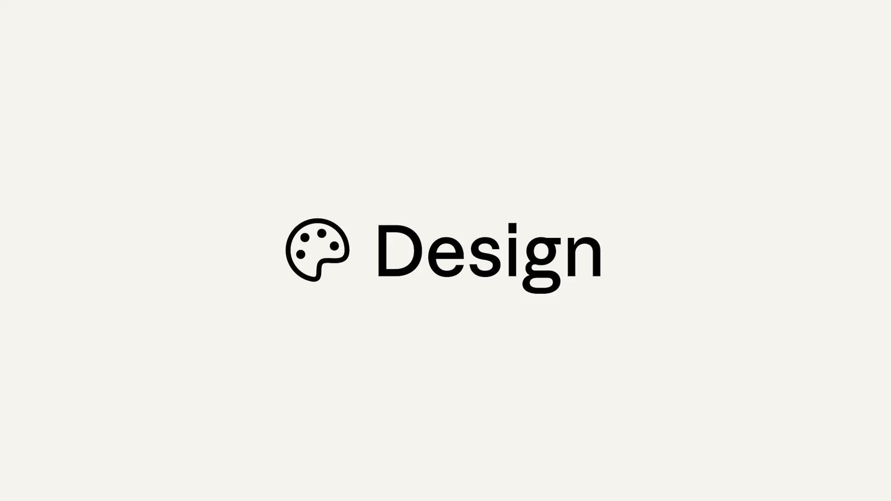

@宝玉xp

发表于：2026-04-17 17:03

来源：微博

链接：https://m.weibo.cn/status/5288857727665930

Anthropic 今天发布了 Claude Design，一个可以通过对话生成设计稿的新产品。你描述需求，Claude 直接出图，然后通过聊天、批注、直接编辑或者拖拽滑块来反复调整，直到满意为止。

这个产品背后跑的是 Claude Opus 4.7，Anthropic 目前视觉能力最强的模型，也是今天一起发布的新模型。目前以研究预览的形式开放，Pro、Max、Team 和 Enterprise 订阅用户都可以用，今天逐步放量。

Claude Design 想解决的问题很直接：设计师没时间探索太多方向，非设计背景的人（产品经理、创始人、市场）有想法但做不出来。现在两边都有了一个出口。设计师可以快速跑十几个方向再挑，产品经理可以自己画原型再交给开发，创始人可以从大纲直接做出完整的融资 PPT。

几个值得关注的细节：

团队首次使用时，Claude 会读你的代码库和设计文件，自动生成一套设计系统（品牌色、字体、组件），之后每个项目自动套用，不用每次重新调。

支持从文字描述、图片、文档甚至网页截取起步。做完的东西可以导出为 Canva、PDF、PPTX 或独立 HTML 文件。如果原型确认要开发，可以一键打包交给 Claude Code。

协作方面，设计稿可以在组织内分享，支持多人同时编辑和对话。

用过 Canva 或 Figma 的人会觉得这套流程很熟悉，区别在于 Claude Design 的交互核心是对话而不是拖拽，更接近"跟一个设计师搭档聊着把东西做出来"的体验。对于那些经常需要出方案但不想开 Figma 的产品和市场团队来说，这可能是个效率上的实质变化。

Claude Design 入口在 claude.ai/design，使用现有订阅额度，超出部分可以开启额外用量。企业版默认关闭，需要管理员手动开启。

有测试过的欢迎留言交流下使用心得。

相关说明：网页链接 宝玉xp的微博视频

---

