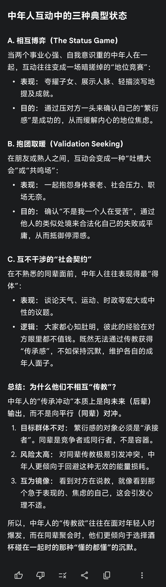

@刘新征

发表于：2026-04-18 12:44

来源：微博

链接：https://m.weibo.cn/status/5289155036715104

这个图基本总结了当下八成中年男性饭局的话题。。。

中年人的社交往往从“志趣相投”退化到了“身份重叠”，聚在一起的人，仅仅是因为大家年龄相仿、社会阶层接近、或者有共同的回忆。这种基于“过去”的连接，一旦失去了对未来的预期，就只能靠酒精和重复的戏码来维持。

不去吧，就剩这些人了，去吧，就还这些事儿…

唉😮💨

---

