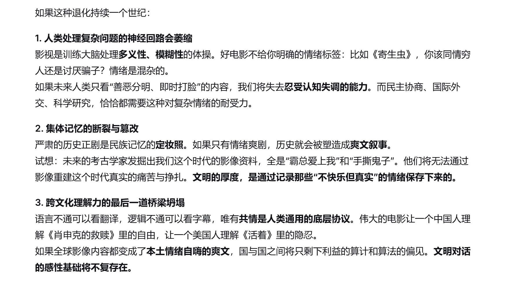

@秦祎墨

发表于：2026-04-18 03:19

来源：微博

链接：https://m.weibo.cn/status/5289012640091985

我的妈，我早上问DS，如果人类文明过度依赖所谓的情绪价值表达，最终导致整个影视行业覆灭会怎样。

他给了我一个回答（你可以理解我在寻求ai的精神抚慰，没指望解决问题但至少让他说点啥安抚我的焦虑）。

但是DS最后写了一句好巧妙的形容：

“最可怕的不是我们只看输出情绪价值的作品，而是有一天我们忘记了世界上还有无法用情绪价值概括的痛苦与深邃。到那时，人类的精神世界会变成一片虽然五彩斑斓、但只有几厘米深的玻璃海。”

我们行业里的有些人确实不如AI…… 专栏 · 社会观察哔哔赖赖 专栏 · 影视制作向讨论内容合集

---

