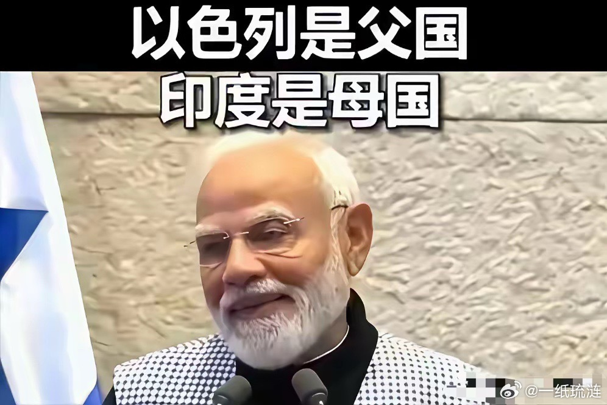
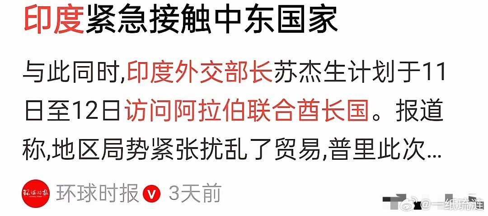

@一纸琉涟
发表于：2026-04-18 23:56
来源：微博
链接：https://m.weibo.cn/status/5289324062179873

从目前情况来看，印度未来将彻底被边缘化。
自从美伊战争爆发之后，有一个国家显得极其“低调”。
那个曾经在中美贸易战爆发之后站在世界聚光灯之下的莫迪突然就仿佛消失在世界目光之中。
如此爱出风头且“雄心勃勃”的印度领导人难道突然转性了？
答案可能会很扎心。
一场错误的战争，两个错误的站队，已经把印度的未来给抹掉了。
五七空战，让美国彻底放弃了这个“阿斗”，印度也因此成为特朗普关税大棒重点招呼的对象。
尽管印度依旧沉迷于“超级大国梦”，但外资和国际机构却不惯着它。
而它在今年年初最终选择了臣服美国，没想到美伊战争爆发后峰回路转，但极度失望的俄罗斯的廉价石油天然气再也不会对印度敞开大门了。
更神奇的是莫迪居然在战前访问以色列，为了讨好对方，完全不顾中东国家的感受，称呼以色列为“国父”。
如今眼看伊朗渐渐掌握了主动，却几乎没有人再把眼光投向印度。
它，似乎被整个世界遗忘了。
那个此前和它签署了“欧盟-中东-印度”自贸大通道的欧盟，现在连正眼都不瞧它一下。
为了寻找存在感，苏杰生迫不及待跑到阿联酋，结果人家王储转身跑到中国去了。
观点:印度领导人的短视以及它缺乏长远战略眼光，不仅错失了大好历史机遇，而且还逐渐丢失了几乎所有的地缘话语权。

---

