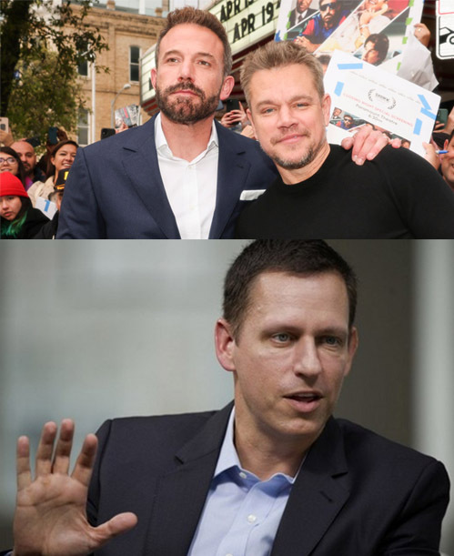

@死生爱欲
发表于：2026-04-19 04:39
来源：微博
链接：https://m.weibo.cn/status/5289395231133390

通常这被认为是一个顶级商战和公关案例。2007年，Gawker旗下的硅谷流言新闻网站曝光了PayPal创始人彼得•蒂尔的同性恋身份。蒂尔的性取向此前已为身边人所熟知，但他并不认为自己是公众人物，这属于个人隐私。于是他花了近10年时间，精心策划让Gawker赔了9.3亿并宣告破产。
那篇曝光蒂尔的文章阅读量只有1000。

本马达在24年打算拍一部关于杀死Gawker的电影，主角硅谷哲人王彼得•蒂尔是当今最有权势的同性恋之一，他的影响力横跨了政治，科技和投资圈。他是现任副总统万斯和国防部长的金主，在硅谷全体不看好川普的16年，他是唯一公开并游说其他人站川普的，他赢了。蒂尔也是21岁的马扎创办脸书给了他那张关键的50万美元支票的人（这笔投资换来了10亿美元的丰厚回报），SpaceX濒临破产也是他给了被全硅谷嘲笑的马斯克2000万美元救命钱。

很可惜这个电影项目黄了，当然了，读蒂尔的传记，里面的相关人等都会因为害怕不愿意合作或集体要求匿名。我看了来龙去脉觉得特别有意思。这个案子实际上集合了媒体媒介和新闻道德的变迁，名人权力与网络文化发展史，它有非常复杂幽深的道德判断和因果。

我们这里很难想象媒体作为第三权在美国有多一手遮天，这么说吧，蒂尔当年的仇家Gawker，它能随便地在网上发布名人性爱录像和女顶流的走光照片，就算它是偷拍的，目的是为了勒索，受害者依然没有任何办法要求网站撤下来，也没有办法要求赔偿，只能看它被媒体公开嘲笑，以百万为单位随意传播。在最终让Gawker破产的霍克霍根案里一个用来佐证Gawker所作所为的事件是，Gawker发布了一个喝醉了的女大学生在酒吧厕所的地板上和人发生性关系的偷拍视频，她爸爸恳求Gawker撤下该视频：“这两天我一直眼睁睁地看着我女儿躺在尿里被人强奸。请你理解一下，我们非常痛苦。”但该请求被Gawker拒绝和嘲笑了。

仰赖第一修正案，此前从来没有人挑战Gawker胜诉过。事实上几乎没有人挑战过美国主流媒体，更遑论获得胜利。

Gawker最初是一个以名人流言八卦为核心的博客网站，它是丹顿在一张大桌子上拍板成立的，目标就是吸引流量，无论信源靠不靠谱，是不是编的，只要作者相信它是真的就可以发。它不会因为任何大人物交涉或公众反感就删除任何内容（直到12年后，很讽刺，丹顿第一次删除的新闻是关于康泰纳仕集团一名已婚高管的性取向）。这可能是最早的流量至上的网络媒体。2003年，Gawker成了第一家这么做且做大的网络媒体平台，它为日后的同类媒体树立了榜样。

Gawker吸引了大量的边缘人。很多在Gawker工作过的新闻人无法适应其它的媒体平台，别处没有Gawker这种无法无天的自由度。即使它的薪资非常低，很多人是无薪打工，资深编辑的工资相当外头刚毕业的大学生。在Gawker广告年收入5000万的2016年，文章能为Gawker带来几百万流量的小编拿到的分红不如在星期五的酒吧打工一晚上拿到的小费。

Gawker的老板尼克丹顿以尖酸刻薄，愤世嫉俗闻名。他想撕掉所有权贵和知识精英假惺惺的面具，Gawker攻击所有政客和社会名流，包括富人，运动明星和娱乐明星，它的宗旨是，名人获得太多，他们没有隐私，大众拥有消费他们的权利。在2000年的第一个十年，它受到大众的热烈欢迎。

丹顿很讨厌蒂尔。那篇曝光了蒂尔性取向给Gawker带来灭顶之灾的文章不是他写的，但他跟帖嘲讽了：“蒂尔是同性恋毫不奇怪，唯一奇怪的是，为什么这么久以来他一直害怕被发现？”

当时的蒂尔刚因为出售PayPal和对脸书的投资获得巨大成功，他的风投公司业务蒸蒸日上。但Gawker阅读量只有1000的文章使他陷入极度不安，甚至在公司迁移的会议上说出了让员工非常困惑的提议 “你们可以现在选择离开”。通常认为一直游走在不同保守派阵营的蒂尔害怕性取向会让他失去投资人，但我觉得这和他早年经历和自我定位有很大的关系。丹顿戳到了他的痛处。蒂尔不喜欢被自己的性取向定义。“我不想让他们知道。这不关他们的事。这不是我该有的样子。我不想让他们这样看待我。”

顺便说一句，丹顿也是男同性恋。
这两个人某种程度非常相似。他们都是受过精英教育的男同性恋（丹顿是牛津的，蒂尔是斯坦福），是非常富有的追逐美国梦的移民；一代创业者，不信任体制的自由市场主义者，身处那0.01%的精英阶层，这让他们理所当然地认为自己与众不同，卓越不凡，他们都非常愿意选择那些主流认为不应该做的事。

蒂尔知道，如果诉讼由他出面，他的私生活会被Gawker和随之而来的媒体同行撕得粉碎扔在地上踩，这违背了他的愿景，于是他在四年后成立了一家空壳公司，投入了1000万美金，由他的代理人寻找合适的Gawker受害者，代理他们的诉讼，他要的不仅仅是Gawker认怂悔过，是彻底的毁灭。
霍克霍根在这时候出现了。

霍克霍根是美国职业摔跤联盟WWE的著名摔跤手，他也是一档非常受欢迎的关于他自己的真人秀节目的大明星。而他在婚姻破裂，事业陷入低谷，人生最绝望的时候，被自己最好的朋友设计陷害了——他的好兄弟长期利用妻子设下桃色陷阱引诱各类名人，然后拍下性爱录像预备勒索，他是其中之一。

很有趣，本阿弗莱克想演的人不是蒂尔，不是丹顿，是霍克霍根。

这些内容录了三张DVD。他的好兄弟放在办公室的抽屉里结果被偷了。2012年，在霍根刚刚振作起来收拾人生烂摊子时，勒索者把第一张DVD寄给了Gawker，偷它的人是为了后续勒索时卖个高价。Gawker觉得这是一个博流量的好机会，剪辑了一个精华版本放在了自家网站上。当然，爆了，大爆特爆。

霍克霍根非常崩溃，他从人人爱戴的平民大明星变成了一个极其失败的小丑，连模仿他出名的网红都无法出门。他请了律师，也起诉了Gawker，但法院几次都判决这些报道属于言论自由，网站没有理由撤下。
他想过死。也想过同归于尽。像很多很多被Gawker曝光过的名流和陷入丑闻的普通人一样。

那时候的Gawker也已经从曾经的平民叛逆者，慢慢变成了它曾经嘲笑的对象，一个靠剥削他人维持生存的内容工厂。它喂养了一种文化，这种文化漠视隐私，把对陌生人的羞辱和打击娱乐化，侵蚀所有的边界，嗯，一种我们今天习以为常的东西。
Gawker觉得自己是无敌的，它站在大众的一边，人们想看，人们需要。Gawker只是满足了社会的窥私欲，他们受到人们的保护。他们有什么错？我们有什么错？

而Gawker的失败正是源于它的这种极度自信和傲慢。

霍克霍根和Gawker官司打了四年，这个官司打得非常艰难，因为它是民事诉讼，而且由于美国法律的特殊性，就像过去Gawker的大量诉讼，拖到后来所有隐私被侵犯的受害者都会因为巨额的律师费和时间成本，也受不了媒体的高强度关注轰炸而放弃，有时也会以几十万的小金额和解。“拖”是Gawker最喜欢的策略之一。只是这一次霍克霍根有彼得•蒂尔的支持。Gawker不知道霍克霍根有彼得•蒂尔的支持。一个亿万富豪秘密支持一个复仇者让对方天凉王破，听起来太扯淡了。他们轻敌了。

直到进入陪审团流程，Gawker才开始认真对待这个案子。此时的世界变了。16年的美国已经不是10年前互联网只是用来让人找刺激的美国，每年都有数千人因欺凌自杀。Gawker也有了它的第一个因为报道自杀的受害者。而在网上发布霍根录像的编辑AJ此时还发表了不合时宜的逆天言论：名人的性爱录像都有其新闻价值，只有4岁以下的孩子的录像不适合公开播放。

霍克霍根最后得到了他想要的，9亿3千万的赔偿。由于Gawker无力支付这笔款项，丹顿宣布出售网站并破产。

彼得•蒂尔秘密对霍克霍根的支持小范围公开以后，蒂尔曾经被叫做“硅谷蝙蝠侠”，他的朋友，其它名流富人，大量Gawker的受害者给他发了感谢邮件。但很快他就陷入了Gawker无数同行的口诛笔伐。媒体非常愤怒，认为亿万富翁干涉了新闻自由，如果Gawker今天因为报道了一位富豪的小秘密就遭到这样的报复，那还有什么新闻可以发？同年10月蒂尔举行发布会，为自己的想法辩护，他把Gawker描述为一个极其反社会的霸凌者。彼得•蒂尔坚持认为这是一次正义的行动，他是在捍卫人们的隐私和生活边界。

这是正义的吗？还是一种用正义来包装的报复？或者是以报复为开端的正义？还有更好的方法吗？你有自己的答案。

同时，就像我一直觉得好玩的地方，现实世界往往是没有可划下的句号的。

今天，就像我们知道的那样，蒂尔的科技公司帕兰蒂尔与美国国防部深入合作，无孔不入地收集所有美国公民的隐私。他所做的事比Gawker有过之而无不及。

Gawker的老板尼克•丹顿在这场史诗级诉讼中几乎身败名裂并宣告个人破产，他从公众视野彻底消失了近10年。2016年恰逢数字媒体估值的最后巅峰。在那之后，曾经估值数十亿的VICE最终破产，BuzzFeed股价跌成废纸。蒂尔的复仇让丹顿在互联网泡沫破裂的前夜高位套现，拿到八位数的现金成功离场。2025年丹顿重新杀回互联网，他明确表示自己看空美国，并高调宣称正在做空特斯拉和埃隆•马斯克，大量买入黄金，看好中国的科技与新能源制造企业，比如比亚迪和腾讯。

我们并不一定知道明天会发生什么。

---

