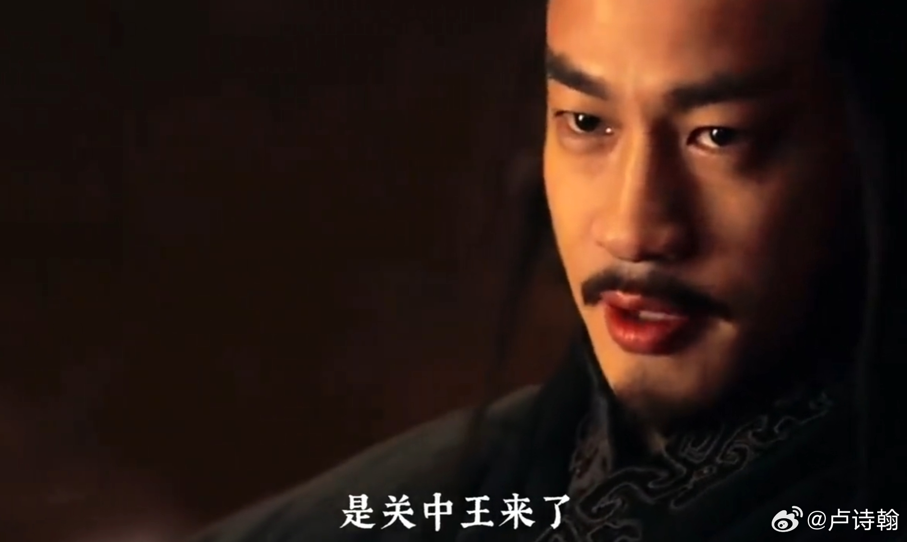

@卢诗翰
发表于：2026-04-19 11:37
来源：微博
链接：https://m.weibo.cn/status/5289500398064937

短视频时代，角色塑造的意义可能重于一切

何润东的项羽不是逐玉这波火的，早在去年，我就频繁刷到“啊，关中王来了”的相关视频，还有项羽十几骑兵冲刘邦千军万马的剪辑。
楚汉传奇在当时算不上高分剧集，但刘邦和项羽的角色塑造非常成功，所以在短视频时代，能靠着大量几分钟的角色剪辑火起来。

更典型的是大明风华
最简单的问题，大明风华女主角是谁？很多人答不上来
这部剧一样因为剧情关系被诟病过，但朱棣和金豆子几人的角色塑造非常完美，相关剪辑也非常多，很多用户没看过这部剧，但硬是靠着短视频上各种切片，把这部分剧情给看完了~

也就是在这个时代，传播的关键，可能是把角色塑造好。
因为只有角色可以在几分钟的短视频里吸引用户。而剧情，很难浓缩到几分钟的短视频里，你剧情再神，一段短视频很难表现。
所以就传播来说，只要关键角色立住了，哪怕剧情出现一点问题，也能带起来

反之，大导演强编剧，一整套专业班子，如果硬要带着一个小鲜肉去捧小鲜肉，反而会扑的天昏地暗

总结：
当前版本是4保1大核时代，王者大核配一堆白银辅助能上分
但白银大核加王者辅助不行

---

