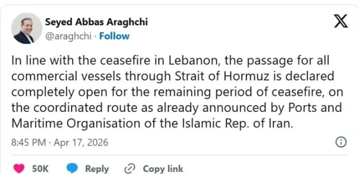
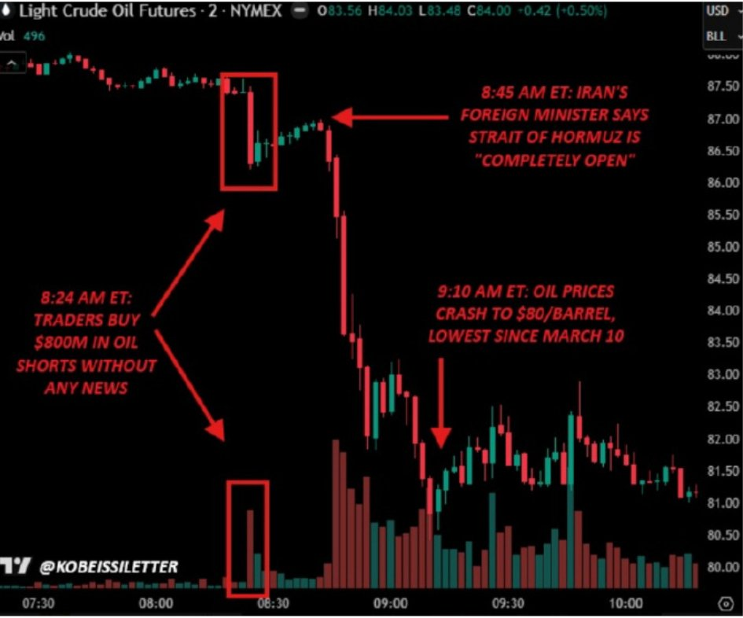

@正直的磊哥

发表于：2026-04-19 02:54

来源：微博

链接：https://m.weibo.cn/status/5289368866261606

我卡，竟然还有高人，其实周五引爆市场的不是特朗普连发十几条，而是伊朗外长这条所谓开放海峡的推文，他这条发出来之后，懂子就彻底高潮了。当时谁都不知道伊朗外长为什么要发这条，而且革命卫队还点名了外长发这条太草率了。实际上伊朗外长在发这条之前，伊朗方面一口气卖出了7990手期货，7.6亿美元成交。20分钟之后，外长在X上发了这条推文，原油期货价格暴跌15%

我靠，伊朗现在终于开窍了，也学会画K线赚钱了，原来动动嘴皮子就能赚钱啊

---

