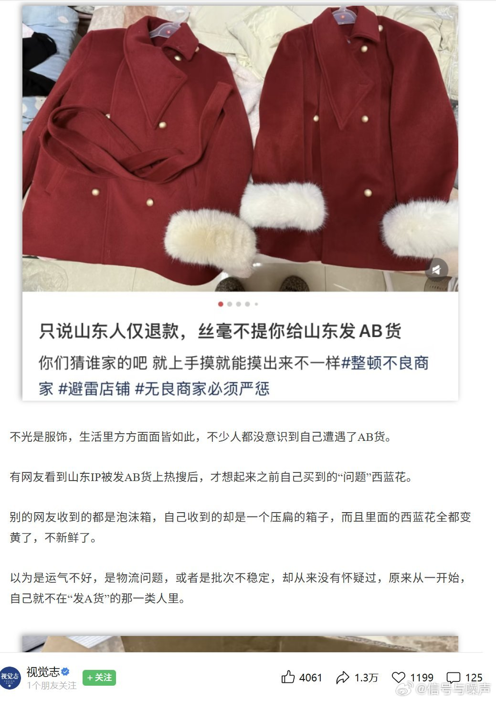
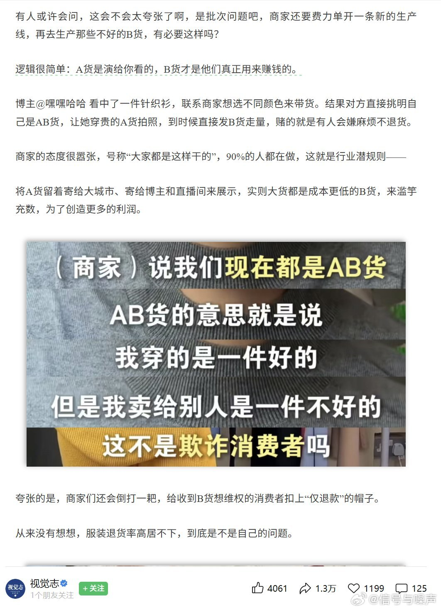
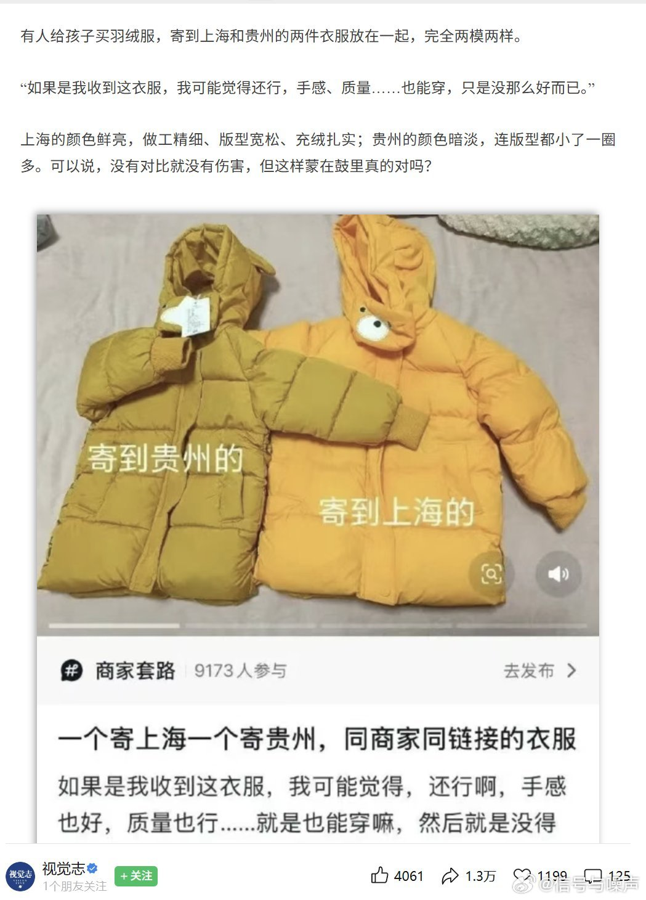
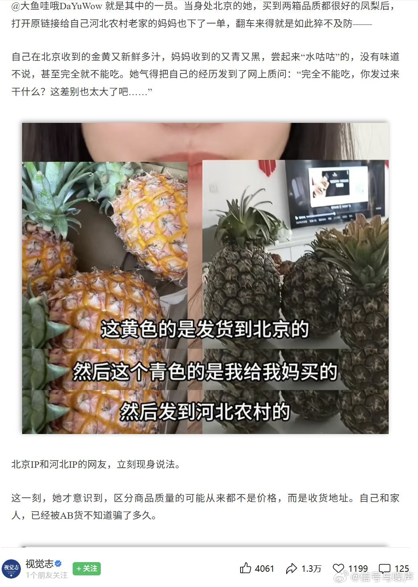

@信号与噪声
发表于：2026-04-19 13:41
来源：微博
链接：https://m.weibo.cn/status/5289531704347547

4月15日，媒体《视觉志》报道了县城农村AB货泛滥的现象，电商平台的商家们给北上广深等一线大城市发质量更好的A货，专门给县城农村发质量不合格的B货。

而且，农村和县城的网购者普遍都是老人，去镇上的驿站退货来回需要好几公里，甚至十几公里。于是他们只能自认倒霉，凑合着用。而发AB货的商家，也就在这一刻博弈成功了。维权成本，也成了一道筛选题，轻轻松松筛出了那些老实人，让他们来买单。

还有的商家将A货留着寄给大城市、寄给博主和直播间来展示，而质量垃圾的B货则全都卖给了消费者。

商家的态度还很嚣张，号称“大家都是这样干的”90%的人都在做，这就是行业潜规则，

---

