# 2026-04-21

## 1

@999战报速递

发表于：2026-04-20 14:30

来源：微博

链接：https://m.weibo.cn/status/5289906299733436

🇺🇸🇮🇷⚡️美国总统特朗普：

以色列从未说服我对伊朗发动战争，真正促使我这样做的，是10月7日事件（哈马斯从加沙地带对以色列发动突然袭击）的后果，以及我毕生秉持的伊朗绝不能拥有核武器的信念。

我看着、读着那些虚假新闻评论员和民意调查，简直难以置信。他们说的90%都是谎言和编造的故事，民意调查也是被操纵的，就像2020年总统大选被操纵一样。

就像委内瑞拉的选举结果（媒体不愿谈论）一样，伊朗的选举结果也会令人惊叹——如果伊朗的新领导人（政权更迭！）明智行事的话，伊朗将迎来一个伟大而繁荣的未来！特朗普总统”

\#伊军称将很快报复美军\#\#美军武力拦截伊朗货船\#\#美伊为啥又谈崩了\#

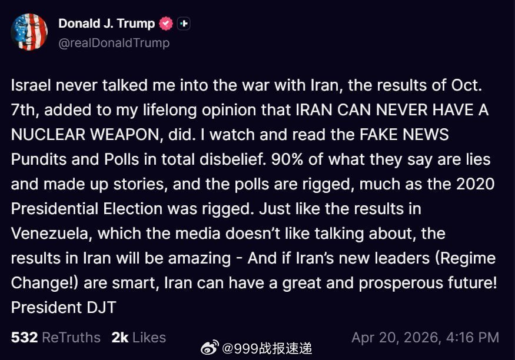

---

## 2

@伯阳先生-段本司

发表于：2026-04-19 20:09

来源：微博

链接：https://m.weibo.cn/status/5289629428482308

放到秦汉时期这也算削铁如泥的神兵利器了吧

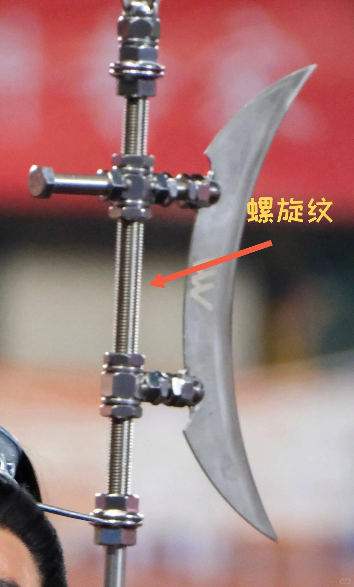

---

## 3

@海上一浪花

发表于：2026-04-20 12:03

来源：微博

链接：https://m.weibo.cn/status/5289869443078634

《赶火车》

《赶火车》被誉为"油画中的清明上河图"。这幅画是上世纪80年代中国人赶绿皮火车的场景，包含80多个人物，真实展现了改革开放初期的社会百态。

高小华的油画《赶火车》创作于1981年，是他在四川美术学院的毕业作品，尺寸为4.5米×1.4米，为创作该画耗时一年，绘制了27幅草图。

2003年该作品以363万元拍出，创下当时中国当代油画拍卖最高纪录，现藏于中国美术馆。画作生动记录了绿皮火车时代的出行方式与人群生态，成为一代人的集体记忆。\#生活手记\#\#历史上的浪花\#

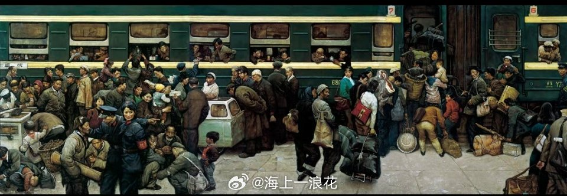

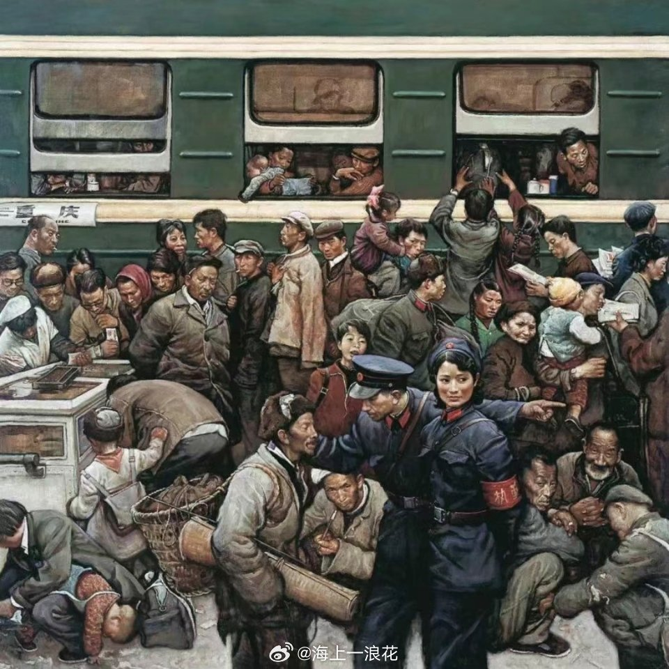

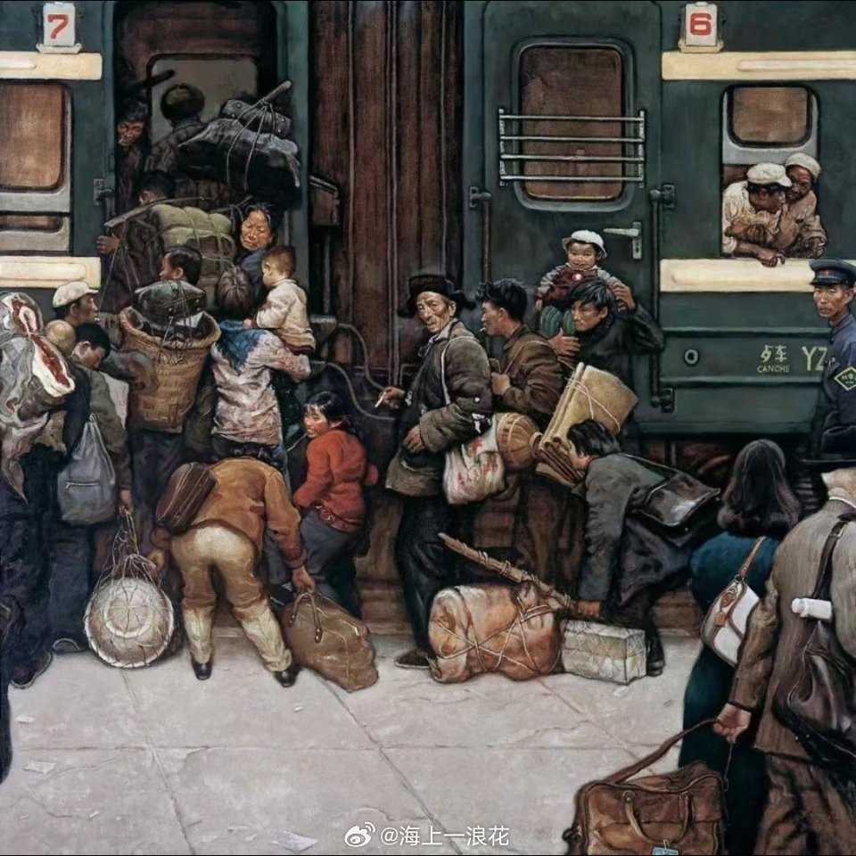

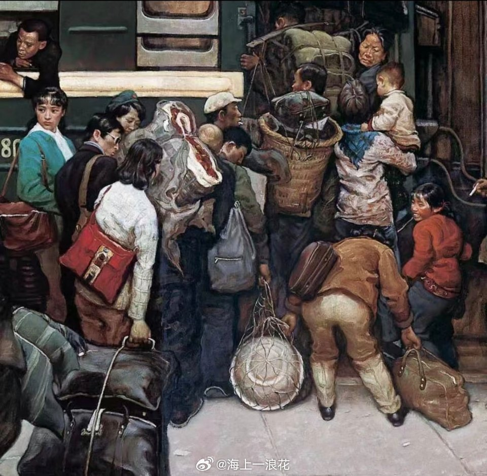

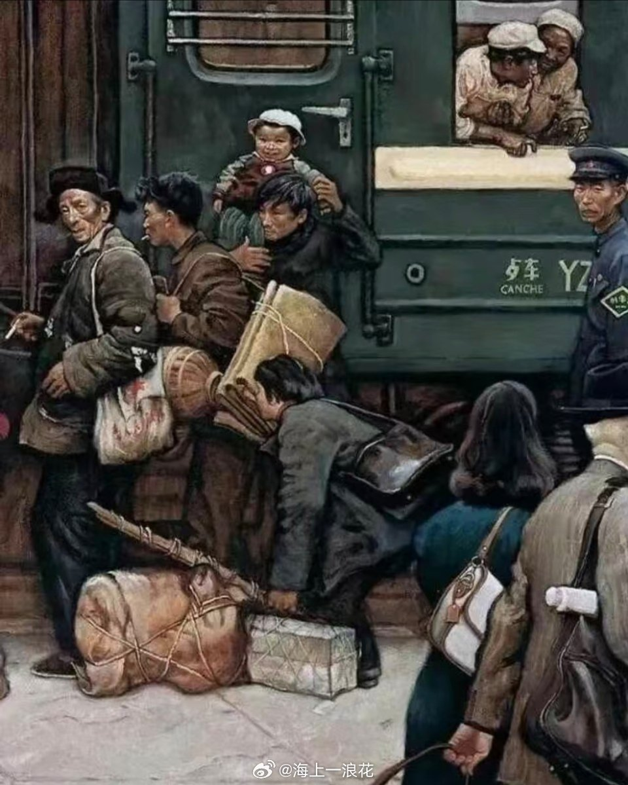

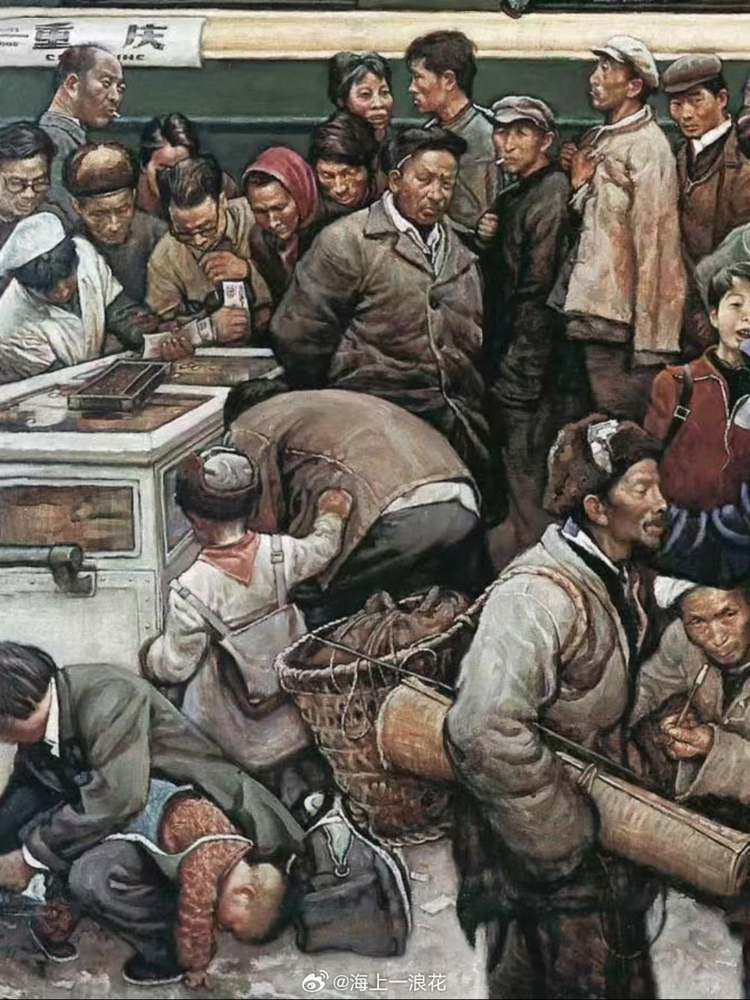

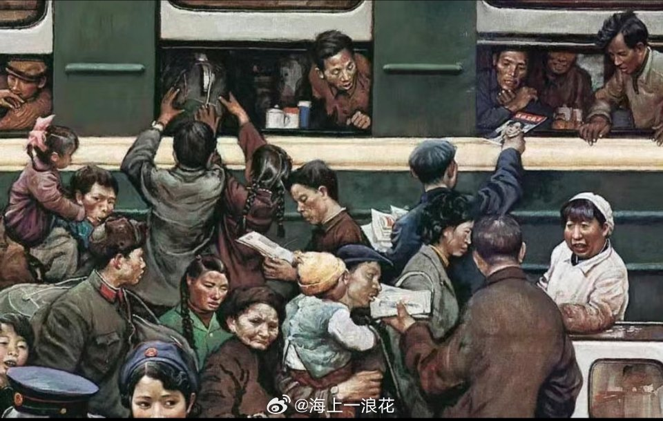

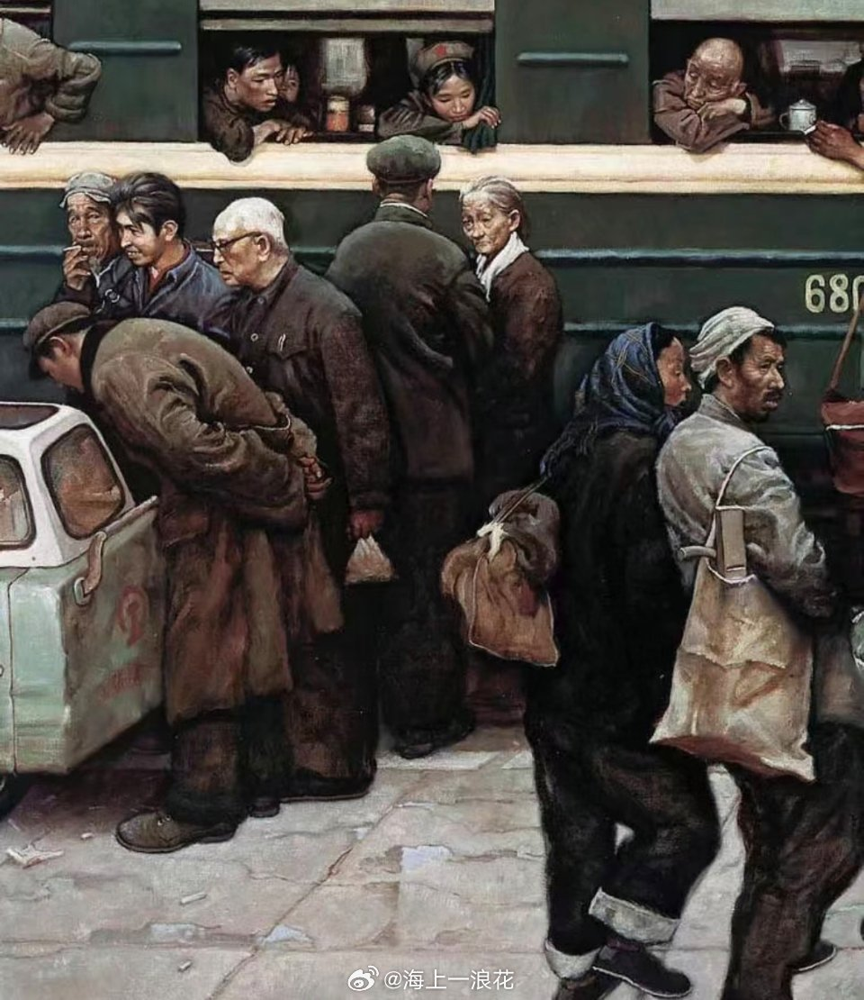

---

## 4

@图老板赛博札记

发表于：2026-04-20 12:04

来源：微博

链接：https://m.weibo.cn/status/5289869624476468

\#塌陷中的世界\#\#图老板的赛博札记\#

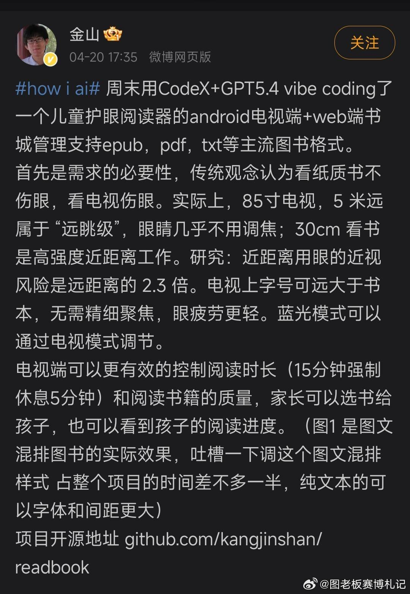

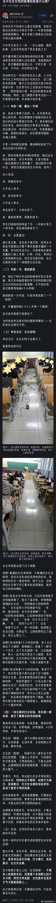

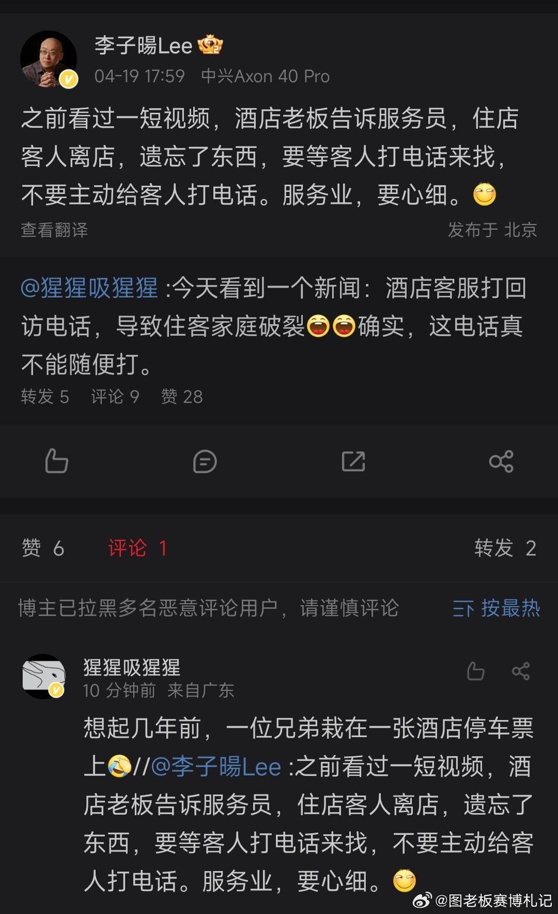

---

## 5

@挨踢牛魔王

发表于：2026-04-20 09:49

来源：微博

链接：https://m.weibo.cn/status/5289835713531478

大家不要小瞧印度，5.7空战，印度空军是深夜、低空、山区、突防，起飞70多架飞机。

印度飞行员非常优秀，飞机也是新的，也不差，可以说是教科书般的行动，就算北约或者美国来，也不过如此。

说实话，能做到如此程度的国家，已经不多了。

但是一起飞，不知道怎么滴，就被锁定了。

在200公里之内，还没有看见巴空军飞机，就被击落了。

按照他们飞行员的直觉，在这个距离内，是绝对安全的。

所以，就有点懵逼。

就相当于你练射箭，已经是九品高手了，按照你的直觉，没人能射中你。

但是你就在远远超过箭的射程范围，被巴雷特狙击枪秒了。

这并不是印度空军菜，是巴空军太逆天了。

5.7空战之后，巴空军的排名上升一位，中国空军的排名下降一位。

因为中国空军没有打比赛，没有实际战绩。

---

## 6

@汪海林

发表于：2026-04-20 11:23

来源：微博

链接：https://m.weibo.cn/status/5289859338994372

目前平台追捧的很多艺人早就没有真人感了，被ai形象取代很合理，毕竟，他们的表演也不如ai。

---

## 7

@释不归

发表于：2026-04-20 09:49

来源：微博

链接：https://m.weibo.cn/status/5289835755211479

\#低情商演员失业 高情商更多休息\# 

有个数据很扎心：内娱不到10%的头部演员垄断了80%以上的资源。剩下的90%里，有65%的演员半年以上没活干。

你看那些在屏幕上哭诉的演员，其实还算是有名气的，至少他们还能上综艺“卖惨”。更多没名气的演员，要么在横店拍那种几分钟一集的短剧，要么早就坐在直播间里，声嘶力竭地喊着“家人们，上链接”。

他们不是不想演戏，是这个行业已经不给他们饭碗了。

---

## 8

@那些珍贵老照片

发表于：2026-04-20 10:00

来源：微博

链接：https://m.weibo.cn/status/5289838326319781

80年代的北京前门

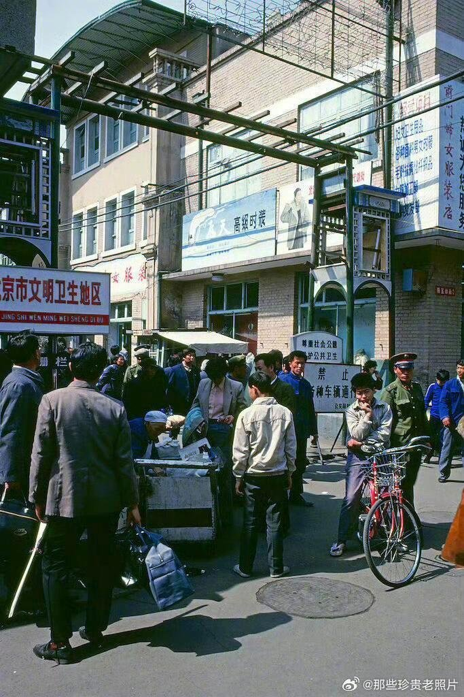

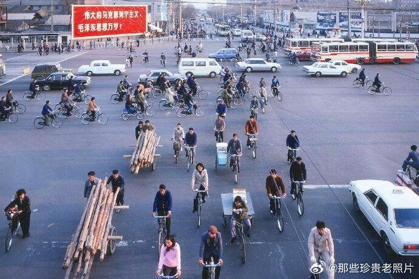

---

## 9

@卢诗翰

发表于：2026-04-20 10:47

来源：微博

链接：https://m.weibo.cn/status/5289850284282959

\#爱奇艺\# 

很多人吐槽爱奇艺疯了，我的观点恰恰相反

虽然爱奇艺有很多魔幻操作，但就影视内容AI化这点来说，还真是时代大趋势

尤其是目前的影视行业现状，死马当活马医，尝试新思路没问题的

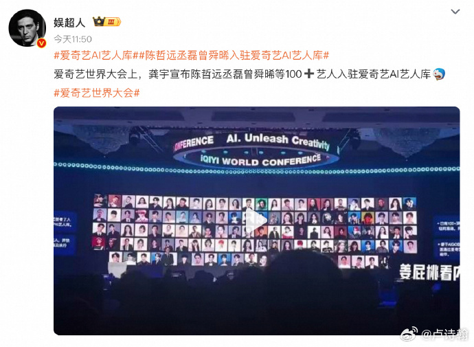

---

## 10

@高飞

发表于：2026-04-20 08:24

来源：微博

链接：https://m.weibo.cn/status/5289814258883135

\#模型时代\# AI时代，一半的产品经理有麻烦了，大厂光环在褪色，公司不再需要信息搬运工

发一期Lenny昨天的播客。嘉宾是Nikhyl Singhal 。他做过Meta产品VP，当过Credit Karma的CPO，在Google带过Google Photos和Hangouts，还多次创业。现在他运营着一个叫Skip的闭门社群，成员是125位科技公司的产品负责人，每月在旧金山聚会一次。他同时主持The Skip播客，最近和Lenny Rachitsky的播客达成了合作。

这一期主要谈的是产品经理这个角色前途，但是其实很多观点，对所有职业都是适用的。在我们内部，我经常说的话就是，这是一个需要每个人都“端到端”的时代……

一、PM行业的冰与火

1、Builder的黄金年代到了

Nikhyl社群里那些强builder型产品负责人，薪酬正处于历史峰值，收到的offer比过去任何时候都多。更关键的变化是心态：他们重新觉得工作有趣了。过去几年PM的日常被信息传递占据，把团队的信息包装给上级，上级再包装给上级的上级，典型的"有责无权"。现在AI工具让他们能直接把想法变成可测试的产品，从构思到验证的路径缩短了一个量级。

Nikhyl的社群上个月搞了一次展示会，每个人上台秀自己最近做的东西。结果大家抱着笔记本电脑互相比拼，气氛像黑客马拉松。"你的chief of staff app能做这个？我的能做那个。"这种兴奋感在三年前的PM聚会上完全不存在。

2、行业从没这么累过

好消息的背面是一个Nikhyl反复提到的词：exhaustion。他说从业这么多年，从没见过一个行业群体像现在这么累。原因和COVID时期不同。现在的疲惫来自永远追不上的变化节奏。你刚搞清楚怎么做事，三个月后别人告诉你那种做法已经过时了。PRD这种东西可能都要重新定义了。每个人都处于持续警戒状态。

他用了一个精准的说法描述当前社群的状态："smiling exhaustion"，笑着的疲惫。比以前纯粹的疲惫好，但步调的残酷程度并没有减轻。

3、中年产品人承受着最残酷的时间挤压

Nikhyl特别提到三十多岁这个群体面临的困境。这本该是职业生涯的黄金期，经验和能力终于积累到位。但人生在这个阶段同时抛出了一堆账单：结婚、生子、父母开始需要照顾、身体第一次出现各种小毛病、要开始管理饮食和运动。工作之外的时间需求是20小时，能给的只有8小时。

他的描述极其坦率："你在人生黄金期的目标，就是让所有人的失望程度保持均等。"父母不会比孩子更失望，健康不会比工作更失望，伴侣不会比朋友更失望。这就是时间分配的真实算法。然后有人告诉你，在这个基础上还得腾出时间晚上用Claude Code学新技能，否则就要掉队。

二、公司端正在发生什么

Nikhyl提到他社群里那些产品负责人讨论的话题，在12个月前根本不在任何人的语言里。用智能体跑企业流程、用chief of staff app提升生产力、所有时间只花在判断上、任何能被软件替代的东西都写代码替代。这些词汇和概念，一年前不存在。

1、大裁员和大重建将同时发生

Nikhyl做了一个直接的预测：未来12到24个月，大公司会经历大规模裁员然后大规模重新招聘。裁3万人，招8000人。但这8000人全部是AI-first的。裁掉的人是两类叠加：过去5年扩招但没产出对等价值的那部分，加上技能组合已经不匹配新方向的那部分。

他回忆在Google工作时的一个内部讨论：当时公司有两万到四万人，但如果有人问"Google要完成核心营收目标到底需要多少人"，真实答案大概是500人左右，不到总员工的9%。那时候多招人是因为要扩张、要尝试新方向。现在公司重新算这笔账了。

2、"判断力"成为产品经理最核心的能力

当测试一个改动的成本降到接近零，变更的频次会是过去的10到100倍。这时候需要有人决定：哪些变更是好的，哪些会伤害品牌，哪些影响系统可维护性。Nikhyl把这叫做判断力，并认为这是PM从始至终都应该具备但一直被淹没在杂事里的核心技能。

判断力的具体含义：评估一个改动对产品整体系统是正面还是负面；决定在客户需求和产品可持续性之间如何取舍；判断某个功能是否值得做以及是否达到了发布标准。这是系统思维，从互联网诞生第一天起就存在，只是现在终于从信息搬运的噪音中浮出水面了。

3、坏软件将大面积消失

Nikhyl举了一个自己家的例子：控制窗帘、空调、车库门的15个App，几乎每个都很烂。没人维护，经常出bug，没人愿意碰那些代码。很多遗留系统是用COBOL写的，写代码的工程师有的已经不在世了。这些代码十几二十年前写成，改它全是风险。

现在情况变了。有人可以坐下来让Claude Code去修这些东西，修出来的代码更安全、更稳定。Lenny补充了自己的体验：他在用Claude Code时最常发的prompt就是"怎么让这个产品体验更好？"AI会给出10个改进方向，然后你说"把前7个做了"就行。这意味着以前因为工程资源不足而被容忍的烂体验，将不再有存在的理由。

4、产品运营系统正在被软件重写

Nikhyl社群里的产品负责人们在做的事情，全都是用软件替代内部管理流程。自动化产品评审、自动化站会、自动化状态报告。有人在聚会上说："我再也不用写status report了，我写了个工具，老板现在拿到的信息比以前还详细。"

这和传统的"PM应该去写代码"完全是两回事。他们写的全是面向自身效率的内部工具，跟面向客户的产品代码无关。把自己通过软件实现规模化，这才是当前PM building的真实方向。

Anthropic增长负责人Amol在Lenny的另一期节目里提过一个有意思的反面视角：他认为PM的杠杆不在自己写代码，而在跟上工程师的产出速度、做更高层级的判断和对齐工作。Nikhyl对此的区分是，如果"写代码"指的是当团队的第51号工程师，那确实低效；但如果指的是用代码重写自己和组织的运作方式，那完全是另一件事。

三、Builder与信息搬运工的大分裂

1、大约一半PM属于"信息搬运工"

Nikhyl把PM分成两类。一类是因为喜欢造东西而进入这行的人，很多本身就是创业者或工程师背景。另一类是因为这份工作薪酬高、沟通能力能派上用场而入行的人，核心技能是信息传递、团队组织和向上管理。后者大约占现有PM群体的一半。

这后一半人正面临根本性困境。如果你对自己的描述是"我其实对技术没那么感兴趣，我更擅长沟通和团队建设"，那么在下一个版本的产品行业里，你的位置大概率不在了。这些人可能需要离开科技行业，或者用AI工具去做科技之外的创业，又或者找一份和科技完全无关的工作。

2、Builder的职业边界正在扩张

Nikhyl社群的变化足够说明问题。五年前社群创立时，125人里只有1个创业者。过去12个月涨到了14个，这些人决定下一份工作不再是产品高管，而是做创始人CEO。还有一位资深成员去面试了一家公司的首席人力资源官CHRO岗位，因为那家公司想要一个有产品思维的人来重构HR职能。

逻辑一目了然：能做判断、能用软件解决问题、能推动组织变革的人，在每个职能里都稀缺。"具体的职能知识反而比其他技能更容易学"，这是那些前沿公司招聘CHRO时的真实考量。

3、PM会像蒲公英种子一样扩散到所有行业

Nikhyl的长期预判：接下来一两年产品组织完成内部变革后，营销、销售、被私募基金收购的暖通公司、街边的学校，这些还没跟上AI节奏的组织都会问同一个问题：谁能来领导这场变革？答案就是那些已经"生活在未来"的产品builder。

与此同时，进入产品岗位的人也会变得更多元。设计师、数据科学家、工程师，只要有判断力、能表达、愿意保持前沿，都可能转入产品角色。产品经理和工程师之间、产品经理和设计师之间的边界正在模糊。

四、为什么大多数人迈不出改变的第一步

1、人从小就被训练成不要改变

Nikhyl花了大量篇幅剖析为什么改变这么难。小时候摔跤是日常，学走路、学说话、学滑雪，都是在不断推翻自己的方式。但成年后社会训练我们的方向完全相反：找到稳定的伴侣，找到稳定的工作，跳槽意味着失败，一切以维持现状为最高目标。

所以当有人说"你需要重新发明自己"时，第一反应是抗拒。内心深处的声音是："这不是当初说好的。我上了学、努力工作、拿到了好工作、升了职、有了家庭。你现在告诉我这些都得推倒重来？"

2、越是旧游戏玩得好的人，越难接受新游戏

Nikhyl管这叫shadow superpower，影子超能力。你在一套系统里越成功，越不会去承认新系统的存在，因为你的整个世界观都建立在旧系统有效这个前提上。反而是那些在旧系统里表现一般的人，更愿意拥抱变化，反正原来的方法也不怎么灵，换个新的试试也无所谓。

这解释了一个反直觉的现象：行业里最资深、最成功的那批人，可能恰恰是最难完成转型的。

3、变化的靶心还在移动

就算你下定决心花一周时间学习新工具和新方法论，三个月后那周学的东西就过时了。你不会像换工作那样经历一次性阵痛然后重新进入节奏。节奏永远不会来，因为靶心一直在动。

不过Nikhyl给了一个重要的安慰：这种混乱不会持续30年。类似的事情在互联网公司取代硬件公司那套产品管理方法时发生过。Google当年创建APM项目，专门从零培养适应互联网时代的新型产品经理。头几年极其混乱，然后慢慢稳定下来了。他预计这轮变革大概需要2年时间达到某种新的稳定态。 届时会有标准化的工作方式、成体系的培训，下一份工作和上一份之间不再有天壤之别。

但在稳定到来之前，减速不是选项。Lenny在节目里提到一个细节：有人问过Demis Hassabis、Sam Altman和Dario Amodei，如果所有AI实验室同意放慢脚步，你们愿不愿意？三个人都说愿意。但博弈论决定了没人会真的停下来，因为先停的人立刻落后。这个逻辑同样适用于每一个从业者。

五、穿越隧道的6条建议

1、找到你的"第一次快乐时刻"

Nikhyl先讲了一个自己做PM时的习惯：他会特意跑去换灯泡。灯泡坏了，拧上新的，灯亮了。整个过程10秒钟，但那种"东西坏了→我修好了→完成"的闭环满足感，在PM的日常工作里几乎不存在。PM每天面对的是永远看不到头的推进、对齐、等待。

现在builder模式把这种闭环满足感还给了PM。而Nikhyl观察到一个共同模式：每个成功完成转型的人都有一个专属的快乐瞬间。可能是给自己和伴侣做了一个小App，可能是写了一个管理收件箱的chief of staff工具，可能是用代码控制了家里的灯光系统。通常伴随着"那天晚上我熬了一整夜"这样的故事。他妻子也有自己的版本：她用AI做生意计划，然后从计划推进到了市场测试。

这个快乐瞬间是从恐惧切换到兴奋的转折点。一旦体验到了，就像被感染一样停不下来。快乐是对抗倦怠最有效的解药。它让时间突然多出来了，因为做喜欢的事不觉得是在牺牲其他人。

如果你试了一圈发现一点快乐感都没有，觉得这些东西无聊到让人恶心，那就要对自己诚实了，你可能确实不适合这个行业的下一个版本。

2、用工程师心态审视自己的日常

Nikhyl在职业生涯初期问过一位他认识的最好的工程师："什么定义了一个优秀工程师？"对方说最好的工程师是他父亲，而父亲的定义是：工程师就是让自己从所做的一切事情中变得多余的人。 如果能用AI做到这一点，为什么不做？

他自己的实践：运营125人社群时，匹配人脉的工作以前靠人脑记忆，现在写了一个自动匹配的智能体；社群成员在招的岗位，以前手动汇总，现在自动抓取并匹配给求职者；内容运营方面，他有一个AI接收用户提问并用自己过往内容回答，他的工作变成了审阅AI的回答、发现AI和自己意见不一致的地方，然后把这些分歧点作为下一篇内容的选题。

3、提高节奏，找到你的储备能量

"The next 2 years requires a lot of fire in the belly." 未来两年，你得有一股拼劲。你需要拿出新工作第一年或新恋爱第一年的那种状态。你得在已经紧绷的时间里再挤出空间。可能意味着在某些方面让别人比以前更失望一些，换取自己保持前沿的时间。

4、放下自尊，不要死守头衔

Nikhyl毫不含糊：别再说"我是XX级别的leader，只考虑同级别的机会"。当一切都在变，过去的品牌不再重要，你需要一个没有自尊心包袱的心态。为了通过这条隧道，哪怕接一个更小的角色也值得。

5、保持长期视角

Nikhyl的社群叫Skip，这个名字本身就是一条职业建议：最好的职业决策从来不是优化下一步，而是优化下下一步。在当前环境下，关键是确保你的"skip opportunity"不会因为现在的犹豫而丢失。先上船，到了新大陆之后，能力强的人自然会浮上来。

6、你不需要会写代码

Nikhyl观察自己妻子使用AI的方式后得出结论：你不需要工程背景。你需要的只有两样东西：对结果有明确想法，以及知道什么算"好"。有了这两样，英语（或任何自然语言）就是你的编程语言。

六、补充信号

1、大公司履历的光环正在褪色

面试正在发生的变化：以前问"你在上一家公司做了什么？当时怎么想的？"，现在问"把你放到一个场景里，你会怎么做？用什么工具？你的判断是什么？"过去在Meta花两年时间让一个算法快了一点点，这在当时的体系里完全够得上晋升标准，但在一个"产品已经完全不同"的面试对话中，这段经历会显得非常苍白。

更麻烦的是，很多大公司本身就不够前沿。你在那里待了六年，出来发现世界已经面目全非。所以现在的职业建议不再是"去攒大厂的logo"，而是"确保你保持前沿"。

2、多元化正在倒退

Nikhyl坦言这是他个人最担心的问题。AI浪潮的中心在湾区，公司在招更少的人，倾向于招和自己相似的人。年龄、性别、族裔背景的多样性都在受损。他特别提到女性在职业黄金期生育，客观上难以在晚上和周末腾出时间去学Claude Code。这个问题行业里没人讨论，但它真实存在。

3、设计岗位的增长出人意料地停滞了

Lenny的就业数据显示设计岗位数量没有跟随PM和工程一起增长，全球约5700个在招岗位，自2023年初基本持平。Nikhyl的解释是：行业可能把设计和"生产"画了等号，而忽视了设计的本质是"品味"。就像PM分成builder和信息搬运工一样，设计也分成像素生产者和品味决策者。当前的招聘偏见倾向于前者，而AI恰恰最容易替代的也是前者。

4、工程师面临的变化比PM更剧烈

Lenny提出了一个有趣的视角：PM觉得自己的岗位变化大，但工程师面临的冲击更大，因为编码本身正在被解决。未来能持续成功的工程师，本质上会变得更像PM——核心工作是判断该做什么、什么算好、成功长什么样。工程师的优势在系统思维和对自动化的敏感度，PM的优势在判断力和沟通，设计师的优势在品味。三者的边界会越来越模糊。

总结

节目最后Nikhyl提到自己高中年鉴上写的座右铭，爱因斯坦那句"Genius is 1% inspiration, 99% perspiration"。他说用AI的视角重读这句话会发现一件事：AI正在接管那99%的perspiration，我们正走向一个所有人都只需要拿出那1%的inspiration的世界。判断力和灵感，取代了苦功和执行。

产品管理正在经历一次物种分化，builder和信息搬运工走向截然不同的命运。 这场分化的窗口期大约两年。在窗口期内，一切都不稳定、令人疲惫、充满焦虑。但两年后，新的稳定态会出现，新的培训体系和工作标准会建立起来，今天的混乱不会是永远。

对个人来说，此刻最重要的行动只有一个：找到你使用AI工具的第一次快乐时刻。这个瞬间是从恐惧到兴奋的分水岭。一旦跨过去，后续的一切（学习新工具、调整职业方向、接受更小的角色）都变得容易得多。等得越久，跨越的难度越大。

核心归纳

Q1: 为什么PM岗位数量在增长，但很多PM却找不到工作？

因为市场需要的PM类型变了。全球科技公司PM岗位数达到三年多新高（超7300个，2026年初数据），但招的全是builder，能动手做东西、有产品判断力的人。大约一半的现有PM核心技能是信息传递和组织协调，这些技能正在被AI工具替代。岗位在增加，但增加的是另一种人的岗位。

Q2: 普通PM现在最该做的一件事是什么？

找到一个让你体验到快乐的AI构建瞬间。可以是给自己做一个小工具、可以是用Lovable或Claude Code做一个解决实际问题的原型。关键不在做什么，而在经历那个从"这很可怕"到"这太有趣了"的切换。Nikhyl观察到每一个成功转型的人都有这样一个专属的故事。快乐是对抗倦怠和恐惧的最强武器。

Q3: 这种高度不确定的状态会持续多久？

大约两年。Nikhyl把当前比作互联网公司颠覆硬件时代PM方法论的那段时期：Google当年从零培养新一代PM的APM项目启动时，新的PM做法和旧的只有名字相同，头几年一片混乱，然后逐渐稳定。他预计到两年后，公司的产品构建方式会趋于标准化，培训体系会建立，工作之间的切换不再像现在这样像从一个世界跳到另一个世界。现在是隧道最暗的部分，但隧道有尽头。

---

## 11

@信号与噪声001

发表于：2026-04-19 12:51

来源：微博

链接：https://m.weibo.cn/status/5289519055114242

现在做什么，对后半生有巨大好处？

1. 每天睡够7小时

睡眠是免费的顶级补药。现在熬夜赚的钱，后半生都会交给医院。

2. 存一笔不动金

每月强制存下收入的10%，雷打不动。这笔钱不是用来花的，是用来给你后半生“说不”的底气。

3. 练好一个“随身携带”的技能

写作、演讲、编程、设计……让本事长在你自己身上，走到哪里都有饭吃。

4. 坚持一项低强度运动

散步、八段锦、瑜伽都行。不用拼大汗淋漓，关键是每天动一动。骨骼和心肺会默默记下你的好，后半生还你一副能上能下的身体。(我的运动就是每天2000个绳，坚持了5年了。)

5. 学会“屏蔽力”

不跟风、不攀比、不解释。把情绪消耗降到最低，后半生的能量才会用在刀刃上。

6. 维护好三五知己

朋友不在多，在深。老了以后，能半夜打电话哭诉的人，比存折上的零更珍贵。

7. 培养一个独处时快乐的爱好

钓鱼、练字、种花、拼图……当世界安静下来，这个爱好就是你的避难所。

8. 每天读10页书

不追求数量，只追求持续。十年后，你的认知会甩开从不读书的人一大截。

9. 刻意练习转念

遇到坏事，先问自己：这件事有没有一点点好处？思维习惯一旦养成，后半生少一半烦恼。

10. 定期整理自己的人生文件夹

每季度花半天，理清财务、删除手机里没用的照片、写几行复盘。不让琐碎堆积成山，后半生才能轻装上阵。

---

## 12

@海兰珠阿婶

发表于：2026-04-19 12:09

来源：微博

链接：https://m.weibo.cn/status/5289508427532198

\#美国1年投1300万美元在中国搞渗透\#

老美现在已经鲜少请公知发言了

老美现在的套路是，找数个MCN公司，让MCN公司出来带节奏

MCN最擅长研究平台（抖音、B站、小红书等）的算法。他们知道如何制作能触发热搜、引发情绪对立的内容。

一个拿5万美金资助的项目，可以通过孵化几个极具争议性的账号，就能撬动数亿次的播放量和浏览量

更为重要的是，这些机构还精通如何制造话题，找水军带节奏，尤其是当其背后有了动保、女拳ngo的影子。制造话题就易如反掌。

要知道一个MCN机构的利润也就数百万。改成美元，也就一百来万。花一百多万美元让数百万老中网民互撕，老美这活可太在行了。

不光如此，老美还有一种叫作草根动员的操作

就是针对哪些热点事件有意带节奏，这个大家也都知道。比如哪个负面新闻的热点热，通常大家能看到一窝蜂的负面评论，就是这种操作。

话术模板会要求水军评论：“这种事在国外早就解决了，只有这里才会这样。”或者“大家散了吧，反正最后也是不了了之。”

1300万美元可以雇佣上万这样的“兼差评论员”，在新闻发布的初期就猛刷数百条负面评论。围攻不同声音，给人一种这是“民意”的假象。

所以别看这点钱不多，分发到水军每个人身上也就几块钱RMB，甚至还有数字生命在带节奏。但就是这几块钱就把舆论彻底搞成老中水深火热，民不聊生的造型

最关键的在于，还有许多不明真相的网友跟着带节奏。这帮人属于被那些评论区带节奏的卖了，还替人数钱。

所以说，网络时代舆论战，压根无需花那么多钱搞事。更多的是通过找专业人员搞事、孵化话题、制造对立就可以起到搞乱老中团结的作用。美国对老中的渗透从未消失，只是更隐秘，更深入。这还包括高校和课堂，各种选修课对大学生、高中生的洗脑。循环往复地接连不断地培养适用于美国的舆论战士

谢谢大家

---

## 13

@信号与噪声001

发表于：2026-04-20 23:28

来源：微博

链接：https://m.weibo.cn/status/5290041756878158

不理解pdd企业文化的人会对这种行为非常吃惊，每次讲到这个问题我就会提到马斯克举例的第一性原理：

他收购推特改为X之后谈裁员问题，一般人很难搞清楚裁员裁多少合适。所以Musk的方式是裁到人不够了得往回请了，就是裁到位了。

这种效率至上的思维方式是一致的，pdd的企业文化就是喜欢试探一切效率的边界，知道边界后就再往回收一点，这是他们认为效率最高的第一性原理。

pdd试探过商家的边界，几百个商家联合起来集体跑去广州维权，pdd知道可能边界过了，随后立马就搞百亿补贴。

pdd试探过google的边界，之前非google play版本可以绕过后台、卸载，google直接暂停官方版本，并通过Play Protect警告用户卸载。pdd知道可能边界过了，随后整改重新上架。现在光Temu App在google play下载都10亿+。

这些都是公开新闻可查的，我再讲点小例子，见微知著。Temu有一个长期合作的物流公司，管理层嫌运费太贵，就是拖着不给，想试探出物流公司真正的底线和边界在哪里，一直拖到物流公司忍无可忍，起诉，然后重新商讨运费、和解。

这次事情也是这种企业文化作祟，监管来了pdd也要试探一下边界在哪里。当然是挨到了铁拳，罚点小钱我觉得挺好，本小股东觉得国内监管的边界还是不去试探的好，老虎屁股不是那么好摸的。

有人问，这种行为还叫“本分”吗？

我答：中文的“本分”似乎天然带有一些道德意味，即moral duty，这个层面的“本分”pdd是谈不上的。

黄峥理解的“本分”是不带道德意味的，如果让我翻译我会翻译成“proper role”，就是他会干他认为他处的角色该干的事情。公司这个角色是一个商业组织，最该干的事就是高效率的为股东创造内在价值。他会认为这就是一个公司的本分。

这两者是有区别的，因为proper role不一定符合moral duty，比如那个枪口没有抬高一寸的士兵，他也许是一个听命令的好士兵，但他也只是一个好士兵。

所以如果你有很高的道德要求，或者有不切实际的对pdd“本分”的幻想，那么买pdd你会很痛苦，我会建议你尽早放弃。from群友

~~~~~~~~~

其实，PDD也在试探股民的边界，看看自己股价能跌多少后股民受不了

---

## 14

@包容万物恒河水

发表于：2026-04-21 09:10

来源：微博

链接：https://m.weibo.cn/status/5290064822408360

🔻特朗普：“我正在赢得一场战争，而且是大获全胜，一切进展顺利，我们的军队表现非凡。如果你阅读那些假新闻，比如《失败的纽约时报》、绝对可怕且令人作呕的《华尔街日报》，或者如今几乎已名存实亡（幸好如此）的《华盛顿邮报》，你可能会以为我们正在输掉这场战争。敌人感到困惑，因为他们也看到这些媒体的‘报道’，但他们意识到自己的海军已被彻底摧毁，空军已退至更隐蔽的跑道，他们没有反导弹或反飞机装备，他们的前领导人大多已消失（除了其他一切，这还是一场政权更迭！），而或许最重要的是，封锁——在达成‘协议’之前我们绝不会解除——正在彻底摧毁伊朗。他们每天损失 5 亿美元，这个数字即使在短期内也是不可持续的。反美国的假新闻媒体为伊朗加油助威，希望他们获胜，但这不会发生，因为由我掌控！就像这些不爱国的人在选举中用尽他们有限的每一分力量来对抗我一样，他们现在对伊朗也继续这样做。结果将会是一样的——实际上已经如此！唐纳德·J·特朗普总统。”

🔻特朗普还在赢可能是假的，特朗普还在赚可能是真的

🔻那么，代价是什么？

🔻via NAYA 通讯社报道

\#特朗普威胁停火到期将开炸\# \#中方就伊朗向印度船只开火表态\# \#海外新鲜事\#\#中东现场直击\#

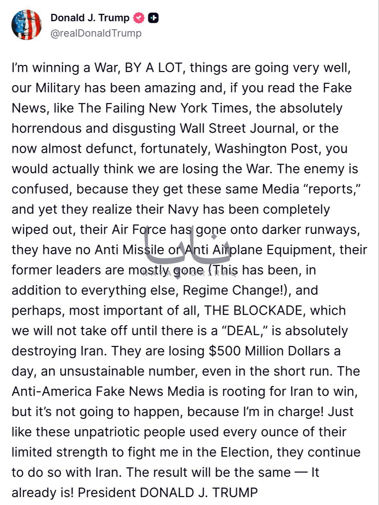

---

## 15

@北京交通大作战

发表于：2026-04-19 12:36

来源：微博

链接：https://m.weibo.cn/status/5289515301472834

去年随着保存e都市数据的搜狗地图关闭，诞生于2004年11月的“三维地图”彻底成为历史。

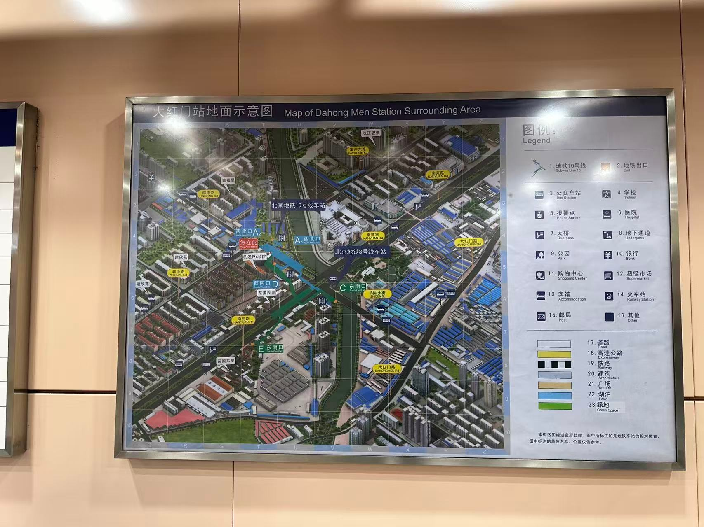

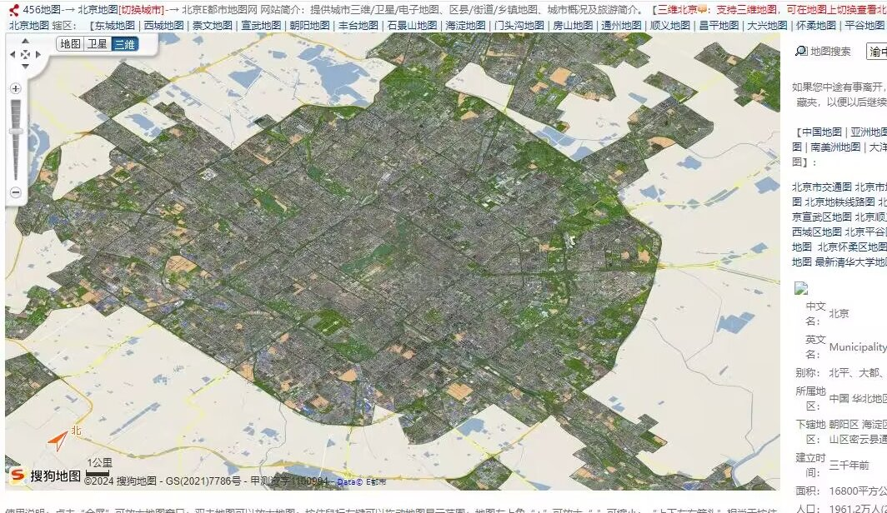

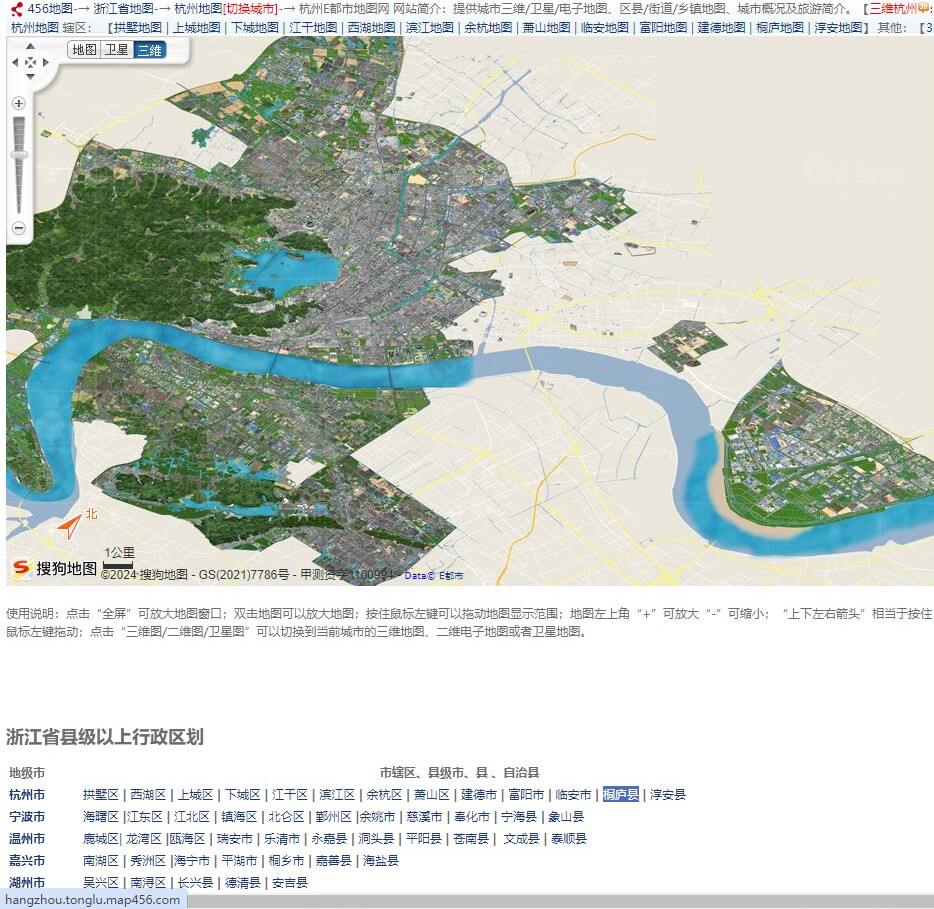

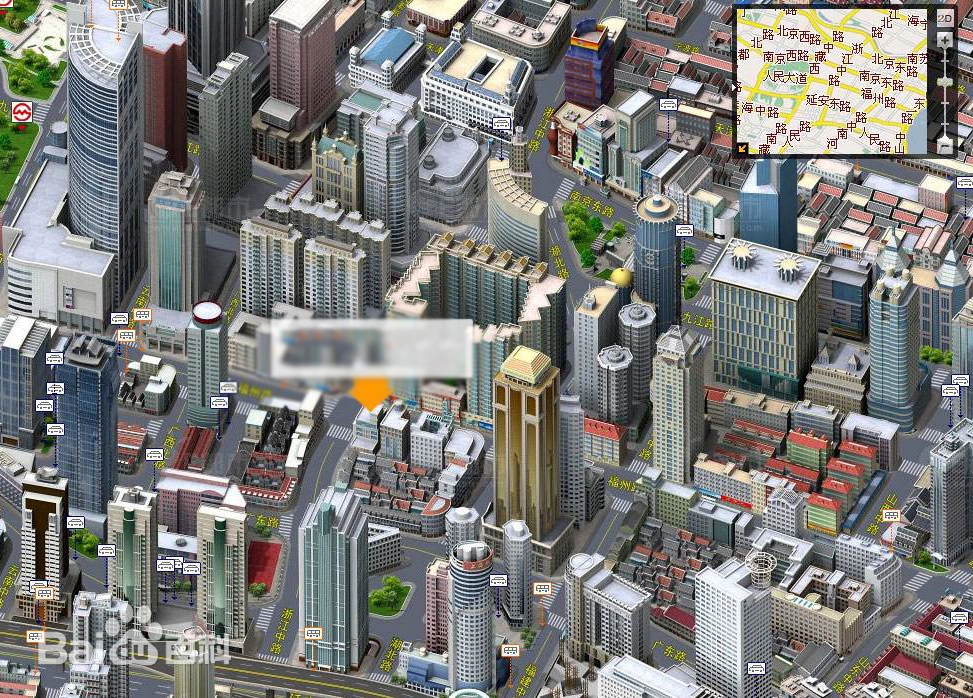

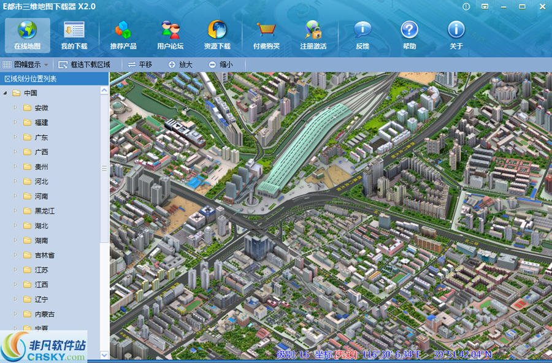

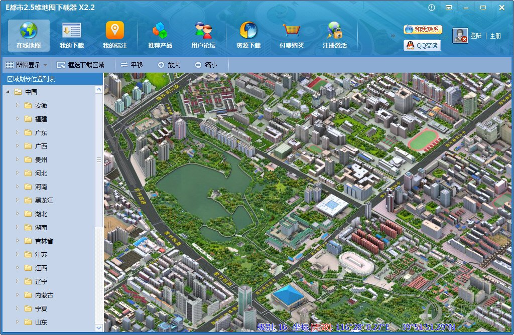

---

## 16

@包容万物恒河水

发表于：2026-04-21 09:10

来源：微博

链接：https://m.weibo.cn/status/5290062301364485

🔻特朗普再次发帖：“民主党正竭尽全力削弱我们在伊朗问题上所处的极其有利地位。尽管第一次世界大战持续了 4 年 3 个月 14 天，第二次世界大战持续了 6 年零 1 天，朝鲜战争持续了 3 年 1 个月零 2 天，越南战争持续了 19 年 5 个月 29 天，伊拉克战争持续了 8 年 8 个月 28 天，他们却喜欢宣称我曾承诺六周内击败伊朗——实际上从军事角度来看，这比六周要快得多，但我绝不会让他们催促美国达成一项本可以更完善的协议。我看到假新闻说我正承受着达成协议的‘压力’。这绝非事实！我毫无压力可言，尽管一切都会相对迅速地解决！时间并非我的敌人，唯一重要的是历经 47 年后，我们终于要清理其他总统因缺乏勇气或远见而未能在伊朗问题上采取必要行动所留下的烂摊子。 我们参与其中，并且会以正确的方式完成，我们不会让那些软弱无能的民主党人——全都是叛徒——来贬低我们军队和特朗普政府的成就。多年来，他们一直在谈论伊朗的危险，说必须采取行动，但现在，因为是我在做这件事，他们就开始贬低我们的成就。这次行动执行得非常完美，规模堪比委内瑞拉，只是更大、更复杂。结果将会是一样的。在我的第一个任期内，我建立了我国有史以来最伟大的军队，包括增加了太空军。在我的第二个任期内，我正以恰当和明智的方式使用我们的军队，来解决那些由理解力或能力远不如我们的人留下的问题。让美国再次伟大！唐纳德·J·特朗普总统。”

🔻特朗普继续发帖，将他在伊朗的战争与第二次世界大战相提并论，并称民主党人为叛徒。

🔻急了，急着抢市场交易窗口？

🔻via NAYA 通讯社报道

\#特朗普威胁停火到期将开炸\# \#中方就伊朗向印度船只开火表态\# \#海外新鲜事\#\#中东现场直击\#

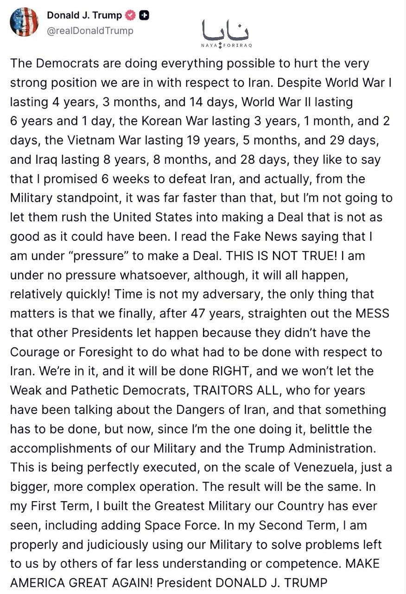

