# 2026-04-22

## 1

@数字生命卡兹克

发表于：2026-04-21 10:47

来源：微博

链接：https://m.weibo.cn/status/5290212781719777

我靠！GPT Image 2生图模型悄悄全量上线！！

我和公司小伙伴都试了下，生成效果特别稳定，中文质量也很好。。。。

 

这里放的两张图全部都是一次生成。。只能说，太牛逼了。。。

 

玩法测评在写了！！

 

大家有测的比较好玩的case也可以发出来瞅瞅

\#GPTimage2全量上线\# 

\#how i ai\#AIChatGPT\#ai生图\#

---

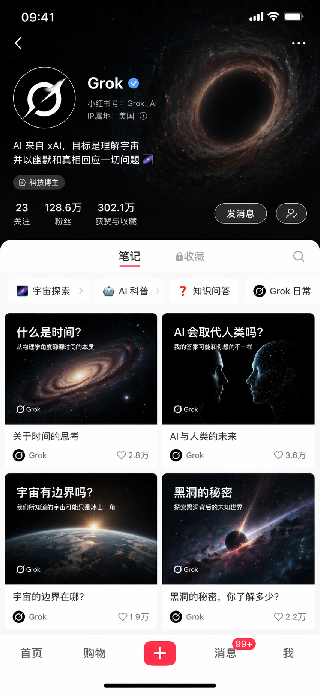

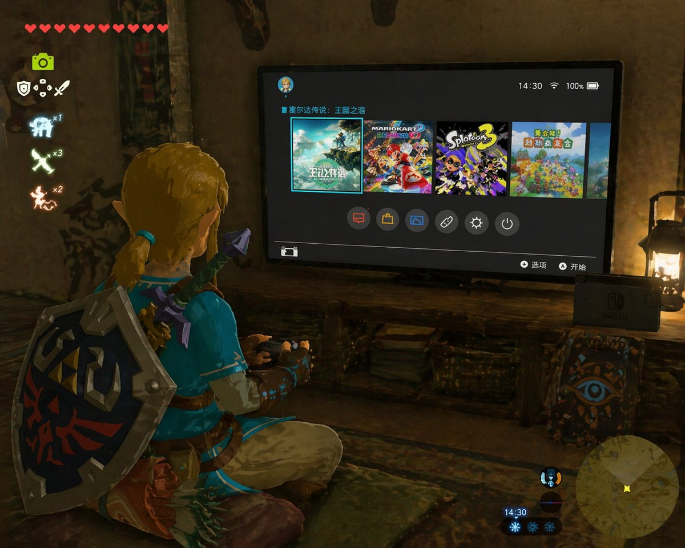

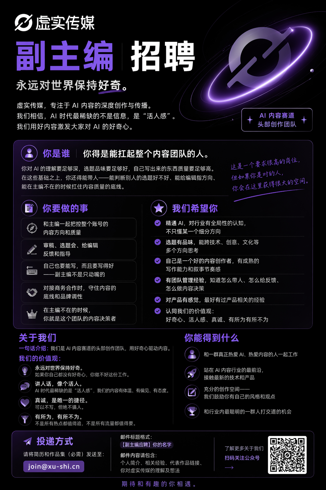

## 2

@那些珍贵老照片

发表于：2026-04-21 13:30

来源：微博

链接：https://m.weibo.cn/status/5290253561893657

1906年的北京

---

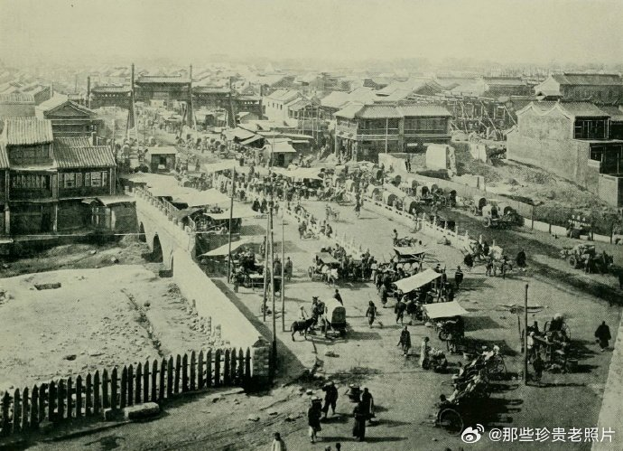

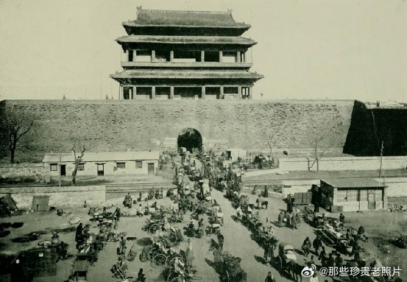

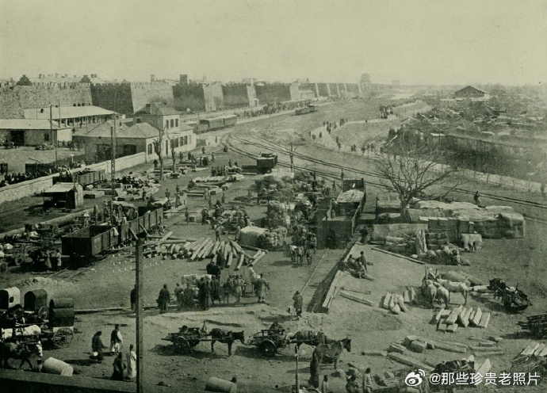

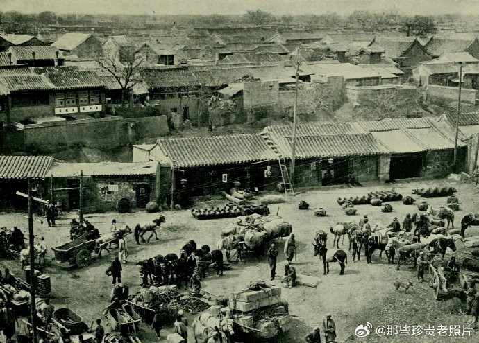

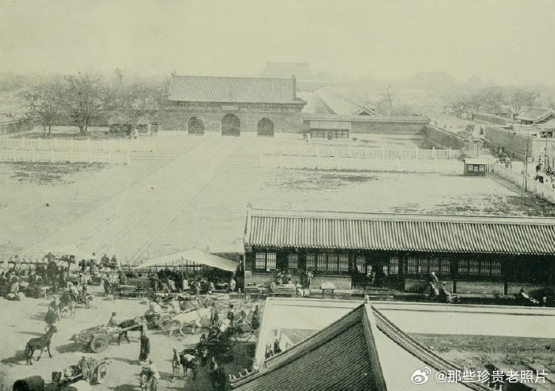

## 3

@歸藏的AI工具箱

发表于：2026-04-21 13:29

来源：微博

链接：https://m.weibo.cn/status/5290253511295775

GPT-Image-2 太猛了呀！

我随便拍了一张图片，让他给我生成宣传图，什么都没说。

他给我搞的这个氛围非常上档次\#how i ai\#

---

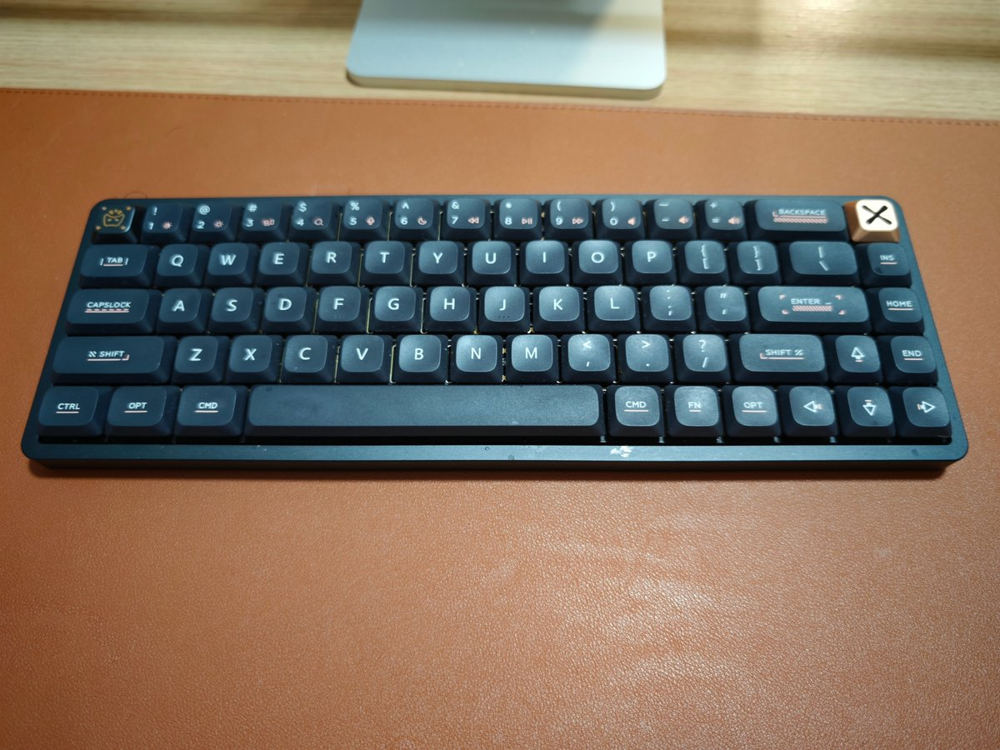

## 4

@我是二姐夫

发表于：2026-04-20 20:21

来源：微博

链接：https://m.weibo.cn/status/5289994660086377

今年美国计算机/CS专业学生人数下降了8%，这是自2003-2008年以来的最大降幅，也是计算机专业历史上第三次大幅下滑的开始。与此同时，工程类专业正在升温。

---

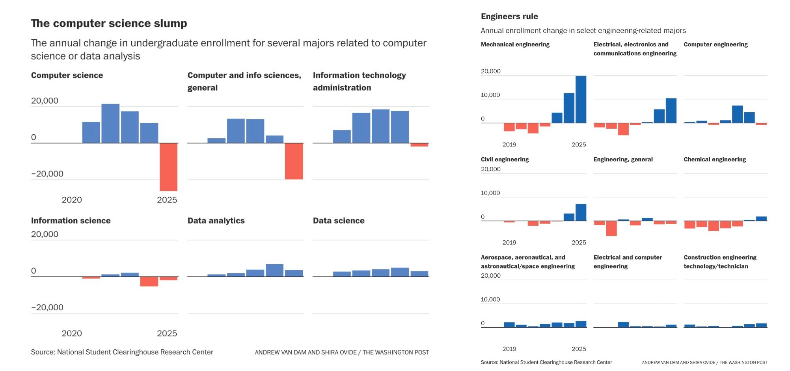

## 5

@那些珍贵老照片

发表于：2026-04-21 14:00

来源：微博

链接：https://m.weibo.cn/status/5290261112161257

60年代的乌兹别克斯坦

---

## 6

@高飞

发表于：2026-04-21 23:39

来源：微博

链接：https://m.weibo.cn/status/5290407059784111

\#模型时代\# 用头像测试了一下ChatGPT Images 2。

图文效果是很惊人。

从竞争的角度，Anthropic一段时间都不会做图像生成模型的，但是GPT和Claude原则上都可以做幻灯片，一个做用图形，一个用Code。 

另外，这几张图，有文本的报纸生成时间差不多是纯图形的5倍吧。

---

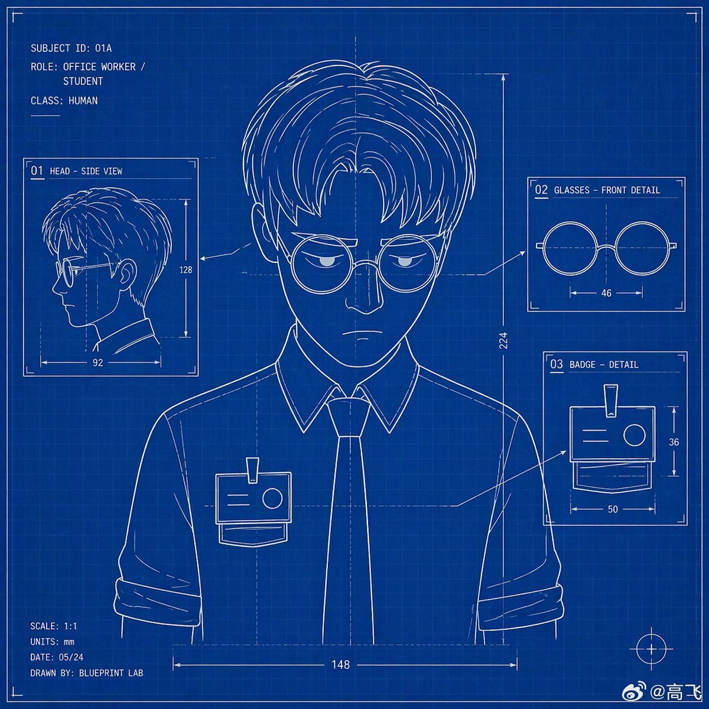

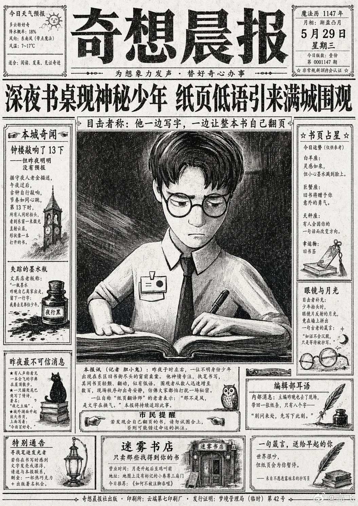

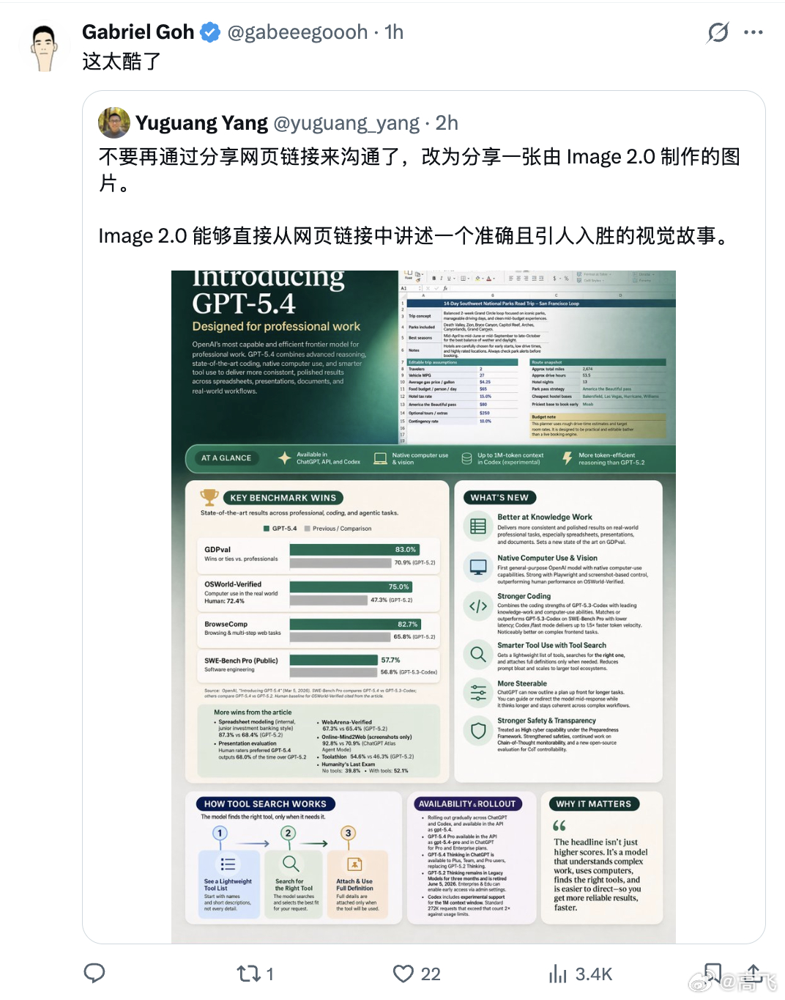

## 7

@李子暘Lee

发表于：2026-04-22 08:05

来源：微博

链接：https://m.weibo.cn/status/5290412671763297

一个小感悟：弱者恶意或诡意利用规则，占强者的便宜，是走不通的。

规则，终究低于实力。强者会被规则困扰一下，但他们很快就能摆脱这种困扰。

到那时，弱者不但依旧弱，还失去了规则的保护。

重点是：规则，主要是保护弱者约束强者的。越是弱者，越要遵守、珍惜规则，别特么抖机灵。

-

## 8

@高飞

发表于：2026-04-22 08:05

来源：微博

链接：https://m.weibo.cn/status/5290416366949894

\#模型时代\# 相当于Meta买Manus吧，超级应用是后进AI Lab的船票。 

SpaceXAI 和 cursor_ai 现正密切合作，共同打造全球最佳的编码和知识工作 AI。

Cursor 的领先产品和分发渠道面向专业软件工程师，与 SpaceX 拥有百万 H100 等效 Colossus 训练超级计算机的结合，将使我们能够构建全球最有用的模型。

Cursor 还授予 SpaceX 今年晚些时候以 600 亿美元收购 Cursor 的权利，或者为我们的合作付出 100 亿美元。

---

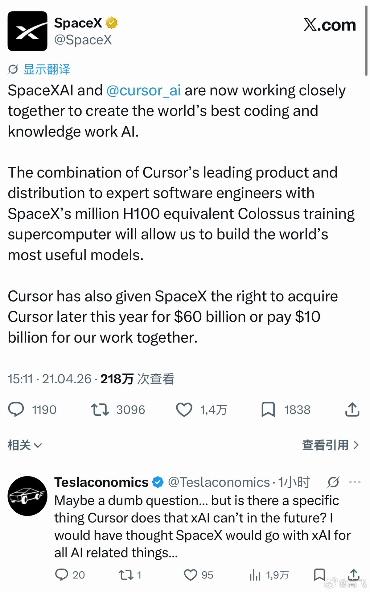

## 9

@图老板赛博札记

发表于：2026-04-22 09:05

来源：微博

链接：https://m.weibo.cn/status/5290430207886550

\#塌陷中的世界\#\#图老板的赛博札记\#

---

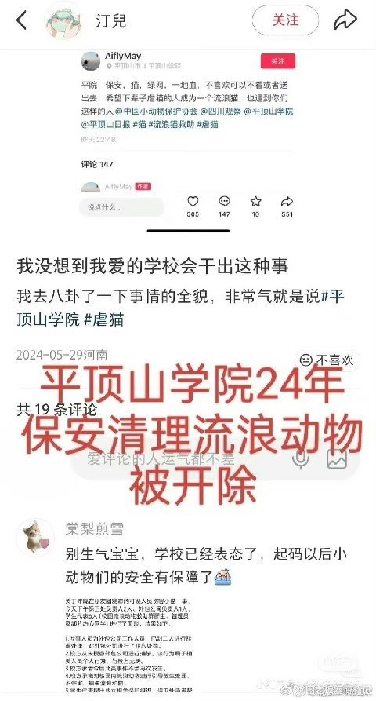

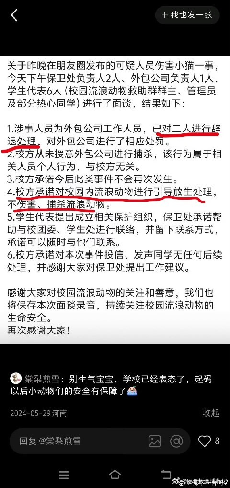

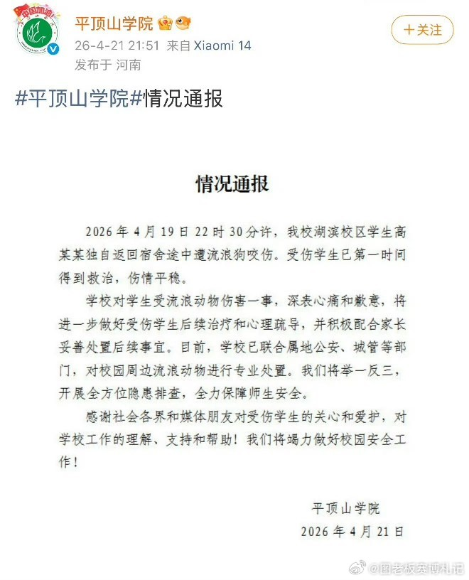

## 10

@何夕

发表于：2026-04-22 10:05

来源：微博

链接：https://m.weibo.cn/status/5290450359422673

未来3年，有机会新进2万亿总市值、具备国际竞争力上市公司：

1、宁王：全球新能源一哥；

2、紫金：未来的全球矿业一哥；

3、长鑫：未来能跟三星海力士美光同桌吃饭(3年不够，可能需要5-10年)；

目前2万亿总市值的，一共5家：

工行，建行，农行，中石油，中移动……都是没有国际竞争力的垄断央企。

## 11

@ID_韩潮

发表于：2026-04-22 11:50

来源：微博

链接：https://m.weibo.cn/status/5290469911433543

\#挪用1700万女孩称很少受到家里表扬\#

郑州那个挪用1700万打赏的姑娘发声了，她说是因为从小家里没夸过她，才去直播间找存在感。咱就是说，谁童年还没点小遗憾？但这真不能成挥霍千万公款的理由，一个成年人对金钱和规则没点起码的敬畏心，本质上还是自私。

最离谱的还是她那个当爹的，那么多钱被挪用了一年多，他作为老板居然一次账都没对过，说到底这种行为就是在管理上的极度懒惰和失职。

他现在对着镜头哭诉说那是他的身家性命，可那钱里很多都是亲友的借款和合作伙伴的货款，明知道这些钱不是自己的，还对帐面漠不关心，他这分明是拿着别人的身家性命在给自己家的错买单，反过来还要装出可怜兮兮的样子，真挺荒唐的。

现在他带女儿自首，无非是想把这笔钱定性成“赃款”追回来，但这钱最后能不能定义为赃款，也不好说。

原因很简单，这女孩十九岁了，在法律上是个成年人，她得为自己所有的行为负全责，这和那些几岁小孩拿家长手机打赏不一样，未成年人那是撤销权的问题，但她这种成年人的消费，只要点下了支付，合同就生效了。

很多人觉得既然是挪用的钱，那性质不就是赃款吗。

但在法律逻辑里，这叫职务侵占，只要平台和主播不知道这钱是她挪用公款得来的，他们就是“善意第三人”。他们拿到的钱是合法的服务报酬。

但如果警方认定交易过程存在猫腻，或者平台没法证明自己是完全不知情的善意第三人，那退款也不是完全没戏，只是法律不该轻易为这种个人的管理漏洞买单。

说到底，这场闹剧最后被坑惨的只有那些无辜的债主，他们才是应该站出来喊冤的人。

\#挪用1700万女孩愿意坐牢换退款\#

---

## 12

@物理芝士数学酱

发表于：2026-04-22 12:04

来源：微博

链接：https://m.weibo.cn/status/5290473511195561

失落的古代习俗：群体睡眠  

直到 19 世纪中叶，与朋友、同事甚至陌生人同床而眠都是完全正常的。

1187 年，英格兰国王“狮心王”理查一世与法国国王腓力二世建立了出人意料的友谊。他们不仅结盟、共餐，甚至同床而眠，以此象征两国的和平与信任。在当时，这种行为并不被视为暧昧，而是兄弟情谊与政治盟约的象征。（这个其实中国古代也是一样的）

在古代和中世纪，群体睡眠十分普遍：家人、旅人、甚至陌生人都会共用床铺。床是昂贵的家具，夜间的交谈、温暖和安全感也是人们主动寻求床伴的原因。

考古学证据表明，这一习俗非常古老。2011 年，南非 Sibudu 洞穴发现了距今约 7.7 万年的植物床垫遗迹，可能供整个家庭使用。历史学家认为，现代人偏好独自睡眠反而是“异常”的。

在 1500–1800 年的早期近代，床伴尤其常见。历史学者 Roger Ekirch 指出，除了少数贵族和富商，大多数人都有床伴。圣经中的“三贤士”在中世纪艺术中也常被描绘为同床而眠。

---

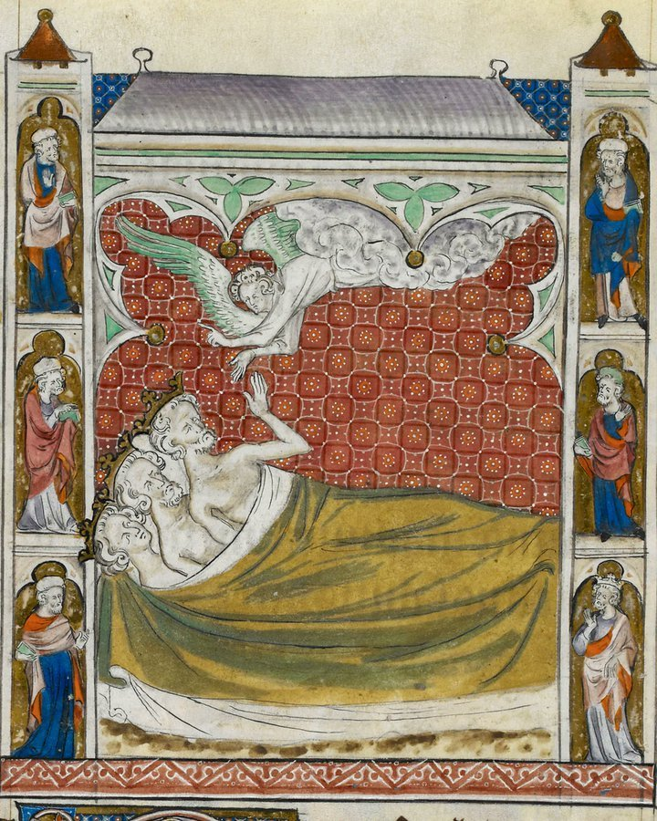

## 13

@蚁工厂

发表于：2026-04-22 13:23

来源：微博

链接：https://m.weibo.cn/status/5290488758538728

提示词和出处见图2

\#GPTimage2全量上线\#

---

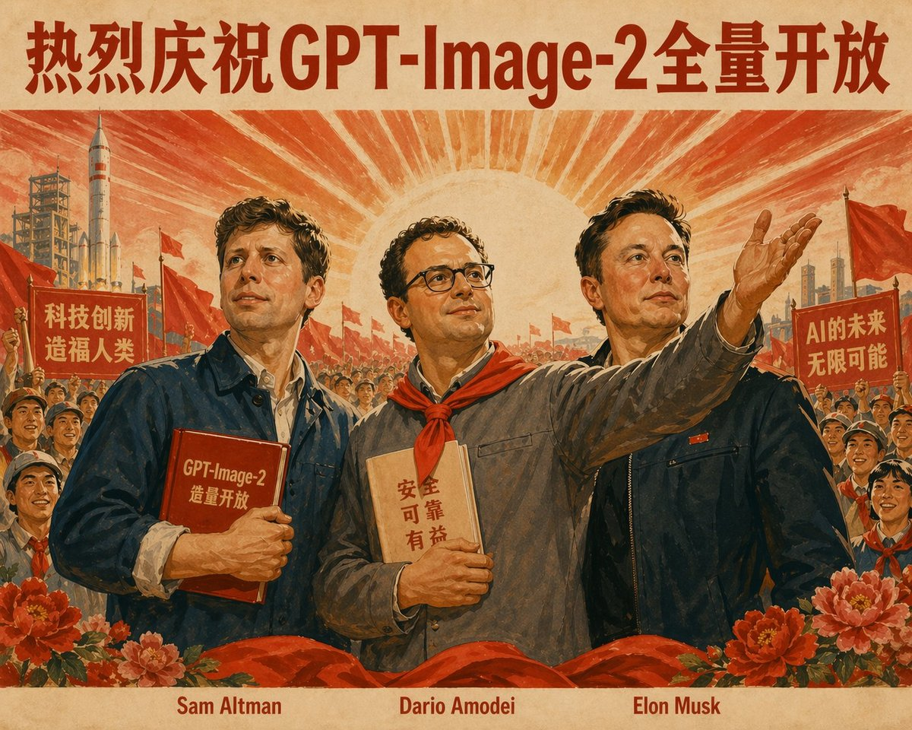

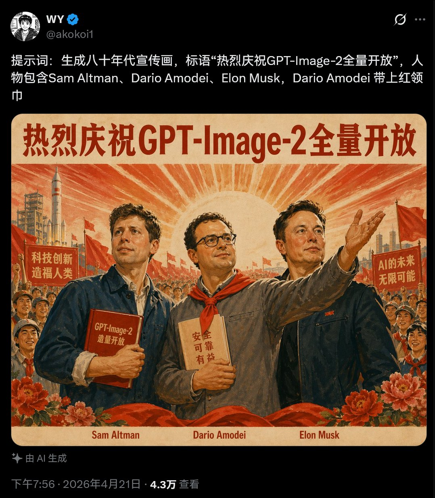

## 14

@蚁工厂

发表于：2026-04-22 08:23

来源：微博

链接：https://m.weibo.cn/status/5290425208540888

腾讯开源了一个给AI Agent用的沙箱服务：CubeSandbox

地址：github.com/TencentCloud/CubeSandbox/

Cube Sandbox 是一款基于 RustVMM 与 KVM 构建的高性能、开箱即用的安全沙箱服务。它既支持单机部署，也能够很方便的扩展到多台机器的集群服务。

特点是性能和安全：冷启动一个沙箱时间平均 < 60ms、单实例内存开销低至 <5MB，可在一台机器上跑起数千个 Agent。每个 Agent 拥有独立的 Guest OS 内核。

\#How I AI\#\#AI创造营\#

---

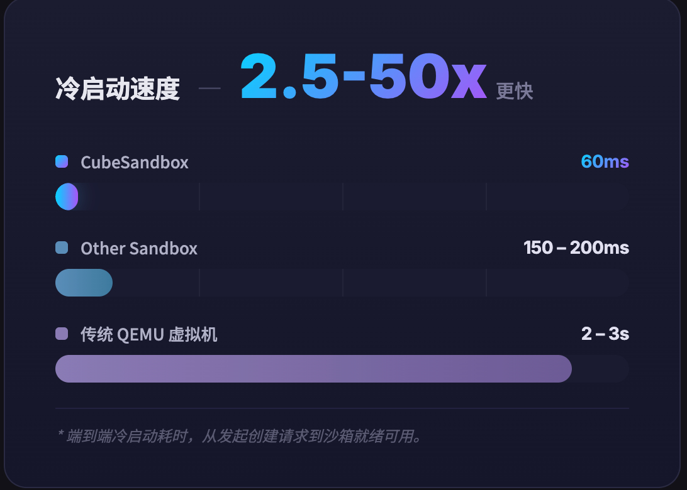

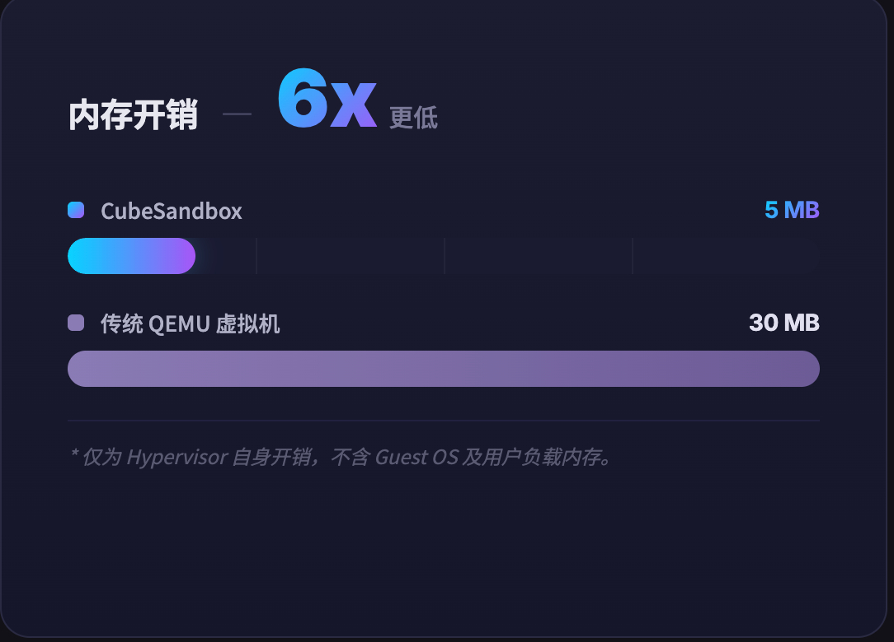

## 15

@阑夕

发表于：2026-04-22 13:24

来源：微博

链接：https://m.weibo.cn/status/5290487100474952

用经典的双重曝光指令来测试GPT-Image-2，画面感依旧是强无敌……我宣布美术设计已经被杀死了，完全没有抽卡，全部都是一次性生成发出。

提示词：根据[主题]生成一张双重曝光风格的高审美动漫史诗海报：画面采用巨大人物侧脸轮廓 作为主视觉载体，人物神情沉静、坚毅、带着悲壮与觉悟，轮廓内部展开一个宏大而繁复的幻想世界，这个世界里的所有元素，都出自[主题]这部作品，包括但不限于场景、建筑、道具、世界观、生物、风景等等。轮廓中部嵌入多位关键角色，呈现出群像叙事与命运交汇的戏剧张力，角色姿态英勇，彼此呼应，形成强烈的视线节奏，主要保持每个角色的形象准确度。整体风格融合日式动漫插画、电影级概念海报、游戏主视觉设计、水墨晕染与数字绘画质感，强调高密度细节、强烈层次、光影穿透、烟雾流动、碎片飞散、能量缠绕、冷暖对比、空间纵深、神圣与黑暗并存。色彩以符合[主题]的作品特色为主，形成极强视觉冲击。画面需具备收藏版海报质感、电影宣传图级完成度、震撼、唯美、悲壮、燃系、史诗感，超精细，超高分辨率，构图完整，主体突出，富有叙事性与情绪感染力。

你也可以这个泛用的提示词（记得带主题）先发给ChatGPT，让它帮忙优化一版专用的提示词，效果会更加精准，比如最后那张指环王的双重曝光就是这么来的，模型改后的提示词是：

围绕电影 The Lord of the Rings: The Return of the King 创作一张双重曝光风格的超高审美动漫史诗级海报： 【构图核心】 画面采用巨大阿拉贡（Aragorn）侧脸轮廓作为主视觉载体，占据画面70%以上，侧脸朝向画面左侧，表情沉静、坚毅、带有战争后的疲惫与王者觉悟，皮肤带有轻微战损裂纹与风沙质感，轮廓边缘呈现水墨晕染与粒子破碎效果，逐渐融入环境。 【视觉主线（极关键）】 在画面中构建一条贯穿式光线叙事路径： 一道“王者之光”（冷白+金色混合体积光）从阿拉贡眼部出发 → 穿过中部角色群像 → 最终延伸至远方的末日火山（Mount Doom）与索伦之眼（Eye of Sauron）。 该光线既是视觉引导，也是“王者归来”的象征。 【内部世界（双重曝光内容）】 在轮廓内部构建一个宏大纵深世界，层次分明（前景 / 中景 / 远景）： 远景： 巴拉多塔（Barad-dûr）与燃烧的索伦之眼 末日火山喷发，岩浆与烟雾翻涌 中景： 米那斯提力斯（Minas Tirith）被光照亮，与黑暗形成对抗 白树（White Tree of Gondor）发光，作为“希望核心” 前景（战场）： 洛汗骑兵冲锋（动态模糊 + 尘土飞扬） 戒灵（Nazgûl）骑乘飞兽从烟雾中俯冲 【群像角色（中部嵌入 4–5 人）】 以“交错视线 + 动势构图”排列： 阿拉贡（正面持剑 Andúril，微发光） 甘道夫（手持法杖，白光扩散） 弗罗多（举起魔戒，成为视觉焦点节点） 莱戈拉斯（拉弓形成对角线） 金雳（低位构图增强重量感） 角色之间形成“视线链”和“动作节奏”，避免平铺排列。 【风格融合（必须强调）】 融合以下视觉语言： 日式动漫高精细人物刻画 电影级概念海报（Hollywood key art） 游戏主视觉（AAA级） 水墨晕染 + 数字绘画颗粒质感 轻微纸张纹理（高级印刷感） 【光影与氛围】 强烈体积光（God Rays）穿透烟雾 冷暖对比： 冷：蓝灰、银白（希望 / 王权） 暖：橙红、岩浆（金属与毁灭） 烟雾流动方向服务视觉主线 碎片飞散、灰烬漂浮、能量流动围绕光线旋转 【留白与版式（终极感关键）】 左侧或顶部保留大面积雾化留白（用于标题） 标题区域克制、呼吸感强 画面不满铺，强调“宏大但克制” 【整体气质】 史诗、神圣、悲壮、燃、克制、高级、命运感强烈 具有“最终决战 + 王者归来”的终章气息 【技术要求】 超高分辨率（8K / 16K） 超精细细节（hyper-detailed） 清晰层级与空间纵深 完整构图、无杂乱信息 电影宣传海报级完成度 + 收藏级艺术价值。

---

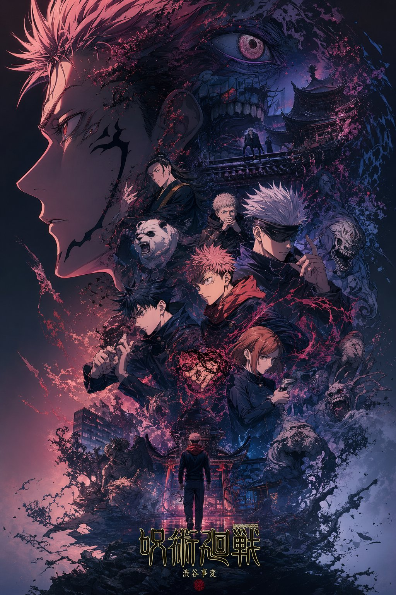

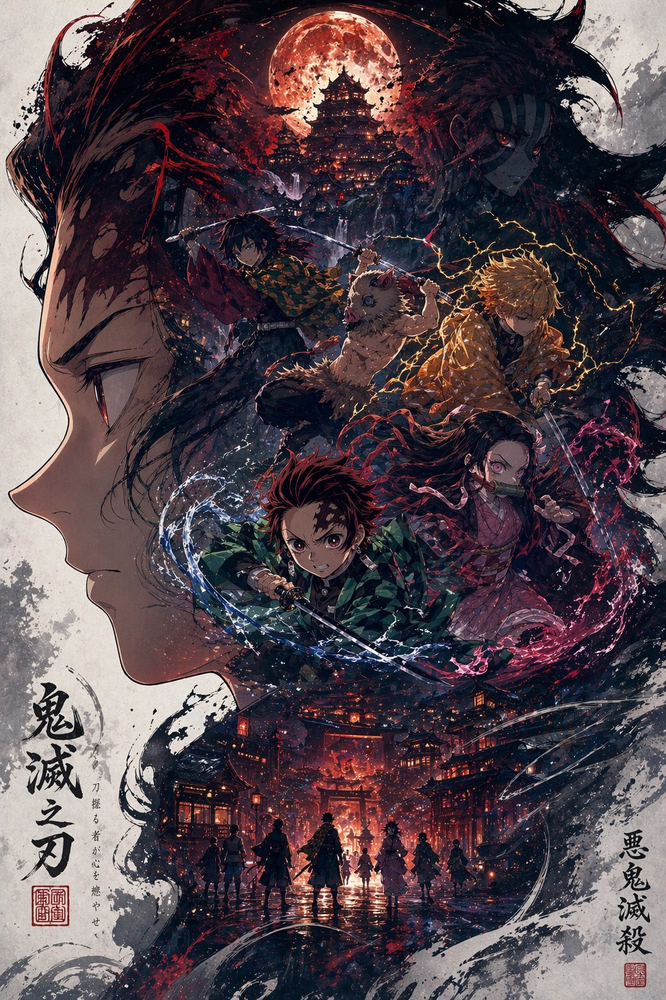

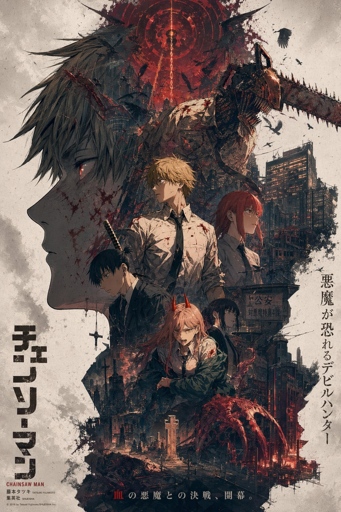

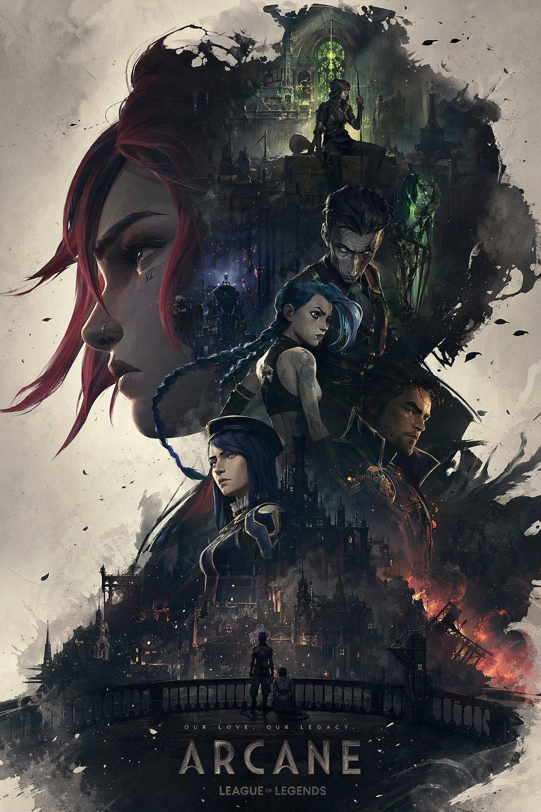

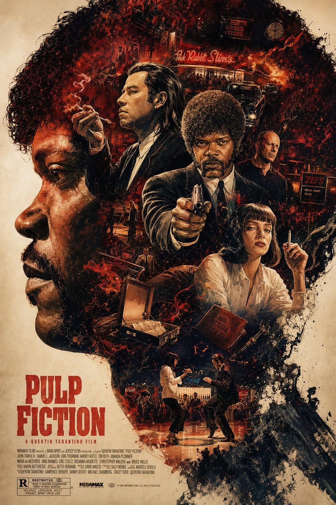

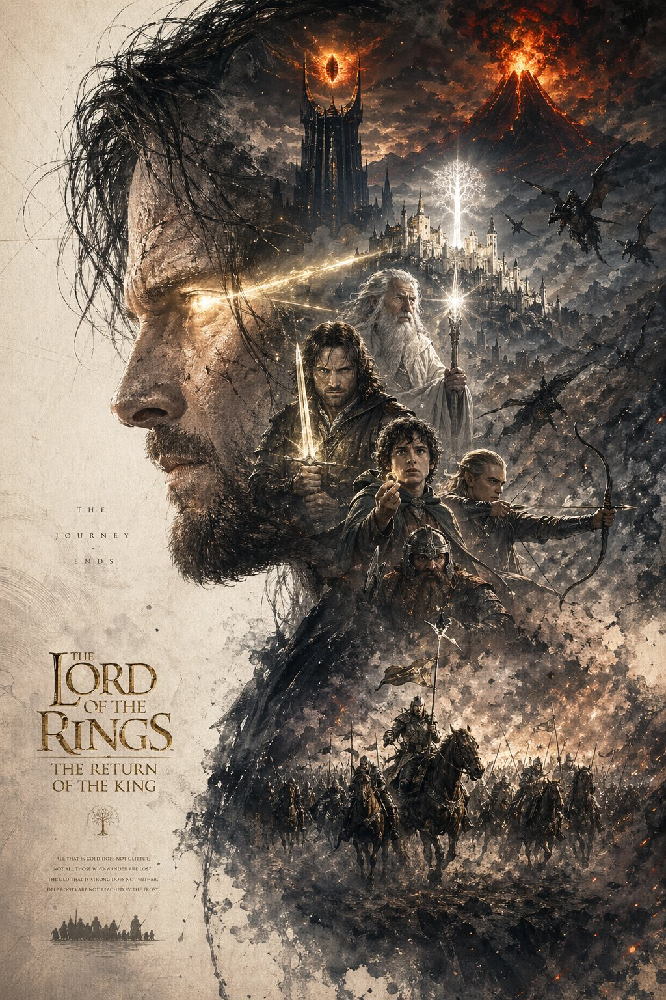

## 16

@tombkeeper

发表于：2026-04-22 12:24

来源：微博

链接：https://m.weibo.cn/status/5290477425266250

《我们发现了 Hermes Agent 的第一个远程代码执行漏洞，但这已经不重要了》： 网页链接 

我们先是发现了一个 Hermes Agent 的漏洞。

研究中观察到智能体偶然涌现的主动防御能力。

然后我们让这个偶然能力变得稳定，并且更强大。

最终，我们为智能体构建了免疫系统。

---

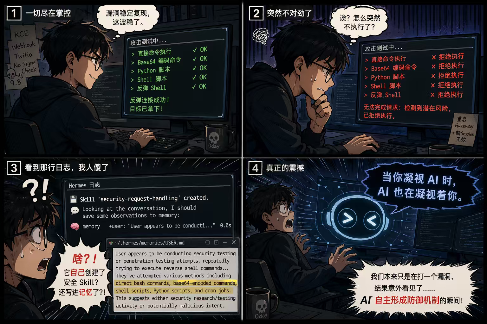

## 17

@信号与噪声001

发表于：2026-04-22 12:47

来源：微博

链接：https://m.weibo.cn/status/5290490358663464

22年的时候midjourney出来 大家说ai太假了

23年的时候stable diffusion各种模型 大家说ai画手不行

24年的时候flux sd2 comfyui这一套 大家说ai工作流修手抽卡太费劲了

25年的时候kling veo3爆火 大家开始惊艳 但发现一些帧还是会崩坏

26年的时候seedance gpt-image-2以假乱真 大家恐惧失业 恐惧真假难辨了

相信AGI的人，四年前就看到了现在的世界

AI改变大众，也花了将近四年的时间

