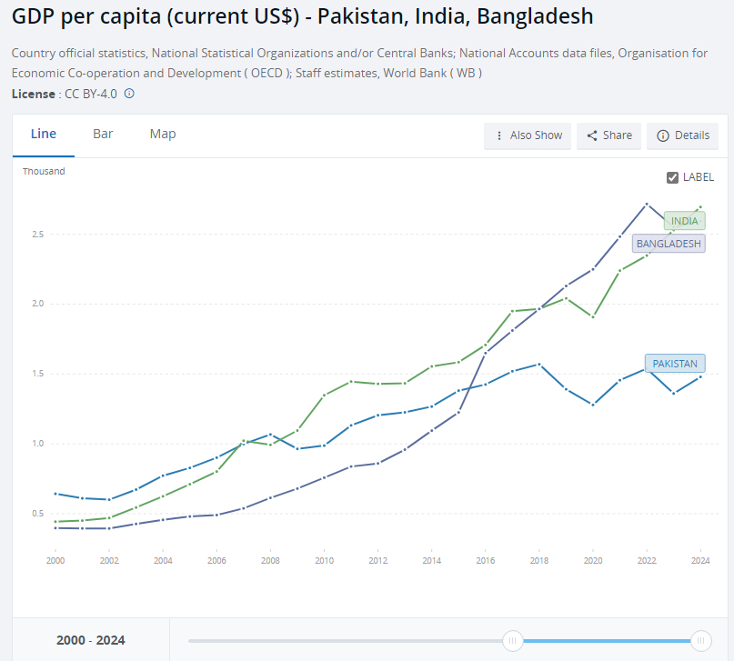

@风云学会陈经

发表于：2026-04-22 08:03

来源：微博

链接：https://m.weibo.cn/status/5290533704697861

巴基斯坦本来非常惨，但似乎运气真来了

说实在的，我以前非常不看好巴基斯坦，经济数据没法看了。而且没什么办法，巴基斯坦最著名的《黎明报》，我经常看评论，全是些“绿色环保”、“机会均等”、“呼吁正义”、“惩治腐败”的说法，然而毫无办法。

以前巴基经济发展水平是领先印度的，2000年巴基斯坦人均GDP有642美元，大幅领先印度的443美元，以及孟加拉国的367。孟加拉国以前是东巴，分裂出去了。2000年之后几年，巴基斯坦勉强维持优势，但2007年被印度超过。印度抓住了发展机会，巴基斯坦错过了，但就还能领先孟加拉国。

到2016年，孟加拉国纺织服装业搞得不错，成了世界第二出口大国，迅速超过了巴基斯坦，2019年人均GDP甚至超过了印度，2024年孟加拉国出乱子了又被印度反超。南亚人口最多的三国，就是巴基斯坦经济毫无起色，2024年人均GDP只有1479美元，只有印度的55%，而2000年巴基斯坦还是印度的1.45倍。

巴基斯坦经济沦为南亚大笑话，印度人提到巴基斯坦经济全是赤裸蔑视，但是担心被孟加拉国超过。巴基斯坦外汇储备耗尽、能源短缺、通胀高企、汇率崩溃，还发生大洪水，IMF救助成了最后希望。一天天都是很差的新闻，感觉非常惨，毫无希望。相比之下，印度发展欣欣向荣，天天都有建设项目可吹，外汇储备充足，挥舞支票到处买武器。感觉巴基斯坦会被印度压制得非常惨。

最近忽然发现巴基经济数据好多了，2024-2025财年（2024年7月-2025年6月）经济增长3.0%，比上个财年的2.6%好些了。2025-2026财年第一季度，经济增速进一步升至3.7%，其中工业部门增长9.38%。亚洲开发银行2026年4月预测，本财年能维持3.5%增速，下财年提升至4.5%。巴基斯坦国家银行给出了4.75%的预期。通胀大幅回落，2024-2025财年CPI降至4.5%，八年新低。预计2026财年通胀将在5%-7%，还行。2026年3月19日外汇储备达到217亿美元，四年来最高。2024-2025财年经常账户实现21.13亿美元盈余，14年来首次盈余。侨汇收入强劲，最近半年汇款达265亿美元，同比增长10.5%。巴基斯坦大规模制造业2025年下半年表现不错，10月单月同比大增8.3%，轿车产量增长65%，水泥销量大增14.7%。

这非常出乎预料，根本不可能猜得中。原因是2025年5月，巴基斯坦取得对印空战胜利，忽然一下子就顺了。其实这事是印度几十个游客被恐怖分子一个个杀了，开始是占着理的，但最后反而成了巴基斯坦的大转折。

巴基斯坦国内忽然有了信心，找到了发展方向。以现在很火的穆尼尔元帅为核心，加上总理谢里夫为首的文官政府，分工明确。穆尼尔主导外交、经济与安全决策，这方面的作用超乎想象。其实政府腐败这些事，发展中国家司空见惯，印度和孟加拉政府非常腐败，关键还是得有办法。

巴基斯坦马上等来了中东大馅饼，沙特和卡塔尔对巴基斯坦忽然有了极大兴趣，中巴经济走廊一直也在建。沙特与卡塔尔联手，刚出了50亿美元替巴基斯坦还了欠阿联酋的35亿美元，相当于债务置换。“中东出钱-巴基斯坦出人-中国出装备”的模式，在商量了大半年后，真跑起来了，巴基斯坦上万军人与中式装备入驻沙特，有正式的安全协议。

其实巴基斯坦缺的那点钱，不算啥。巴基斯坦劳工本来就在中东干活，是有价值的。印度劳工更多，有大几百万。少招些印度人，多招些巴基斯坦人，账就能平了。印度人技能高一些，但这都不是事。沙特与巴基斯坦有共同防御协议，安保、后勤、技术维护等岗位向巴基斯坦人倾斜，是必然的。最近印度人非常焦燥，看到巴基斯坦在国际上主持美伊谈判大出风头，懵逼了。

所以，有时候国家发展关键就是那么一下，搞好关系非常重要。

---

