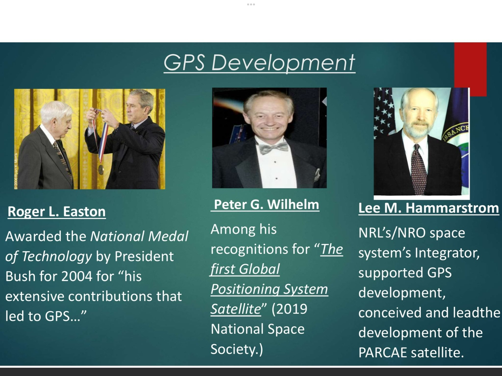

@物理芝士数学酱

发表于：2026-04-02 15:33

来源：微博

链接：https://m.weibo.cn/status/5283399326764127

\#今天要来点物理吗？\# \#卫星定位\# 

1905年，爱因斯坦发表了狭义相对论 。1915年，他又发表了广义相对论 。爱因斯坦只是想理解宇宙。但如果没有爱因斯坦，现代卫星导航地图每天都会制造11公里的误差。不出一周，导航就完全没有了意义。

用GPS举例，它如何定位的？（三边测量法）

GPS（全球定位系统）是一套广播系统，我们的手机不会与定位卫星“对话”，它只会监听。每颗卫星都在持续广播一个信息：“我是卫星‘A’，当前时间为14:23:00.000000。”

GPS卫星的轨道高度约为20200km，运行速度约为 14000 km/h。

手机同时接收来自4颗卫星的信号。由于光速是固定的，信号到达时间上的微小差异就能精确地告诉手机它与每颗卫星的距离。

“A”卫星告诉你：你位于半径为20000公里的球体上的某个位置。

“B”卫星：该球体与另一个球体相交——现在你处于一个圆上。

“C”卫星：该圆与第三个球相交——现在你被确定在两个点上。

3颗卫星的球面相交会产生2个点。但其中一个点通常位于外太空或地球深处，可以直接被系统排除。因此，理论上3颗卫星就能确定你的三维位置（经度、纬度、海拔）。

那么第4颗卫星是干什么用的？

“D”卫星：……对时！

GPS 卫星上搭载的是极其昂贵的原子钟（精度极高），但一般手机里只有一个廉价的钟。手机的时钟是不准的，这会导致计算出的光到达时间有偏差，从而让所有的“球体”都大了一圈或小了一圈。第4颗卫星提供了一个额外的方程，帮助手机反向计算出自身时钟的误差，从而实现精准定位。

狭义相对论：运动的钟走得慢

爱因斯坦在1905年提出，当一个物体的运动速度越快，它所经历的时间流逝就越慢（时间膨胀）。

GPS 卫星以 14000 km/h 的速度绕地球飞奔，相对于地面上静止的你来说，它们运动得非常快。因此，卫星上的时钟每天会比地面上的时钟慢约 7.2 微秒。

广义相对论：引力越弱，时间越快

十年后的1915年，爱因斯坦进一步提出，引力本质上是质量对时空的弯曲。引力场越强（离地球越近），时空被压缩得越厉害，时间流逝得就越慢。

GPS卫星位于两万公里高空，那里的地球引力比地面弱得多。因此，在弱引力场中，卫星上的时钟每天会比处于强引力场（地面）的时钟快约 45.9 微秒。

总效应可以写成一个统一公式：

                  Δt/Δt'≈1+Φ/c^2−v^2/2c^2

Φ=- GM/r是引力势。

 

虽然没涉及固有时、协调时之类的概念，但这一行公式也同时包含了引力效应（GR）和速度效应（SR）。

如果没有广义相对论的修正，想象你在地图上定位。手机接收到 4 颗卫星的信号，它认为自己到卫星 A 的距离是 R。但因为卫星 A 的时钟比地面快了38.7微秒，信号发出的时间戳比实际“提前”了。

你的手机通过计算会认为：“信号跑了更长的时间才到我这里”，从而误以为你离卫星更远。原本应该交汇在你头顶的那几个“定位球体”，半径都算错了（多算了 11 公里），它们的交点会漂移到荒郊野外。

这里误差会累积：光速约为 300000 km/s。38.7 微秒的时间差乘以光速，等于 11.6 km。

第 1 天：误差 11 公里（你在隔壁城市）。第 2 天：误差 22 公里（你已经在省界线了）。第 3 天：误差 33 公里……

既然相对论的净效应是卫星时钟每天会变快 38.7 微秒，工程师们是怎么解决的呢？

GPS 系统使用的基础时钟频率是 10.23 MHz（即每秒振荡 10230000 次）。在卫星发射升空之前，工程师会在地球上人为地将原子钟的频率调低一点点，设定为 10.22999999543 MHz。

这就好比你预判了某块手表每天会走快1分钟，所以你故意把它调慢。当这颗卫星被发射到两万公里的高空后，在狭义相对论和广义相对论的共同作用下，它的频率刚好被“加速”回了完美的 10.23 MHz，从而与地球上的时间保持完美的同步。

配图 发明了GPS系统的人

---

