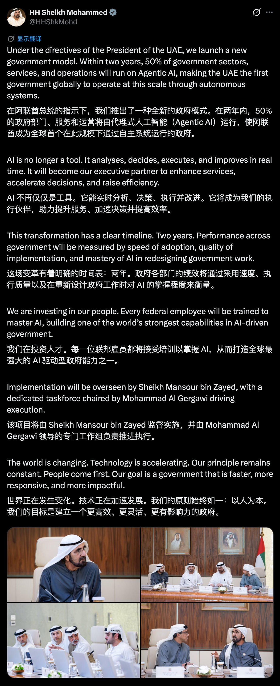
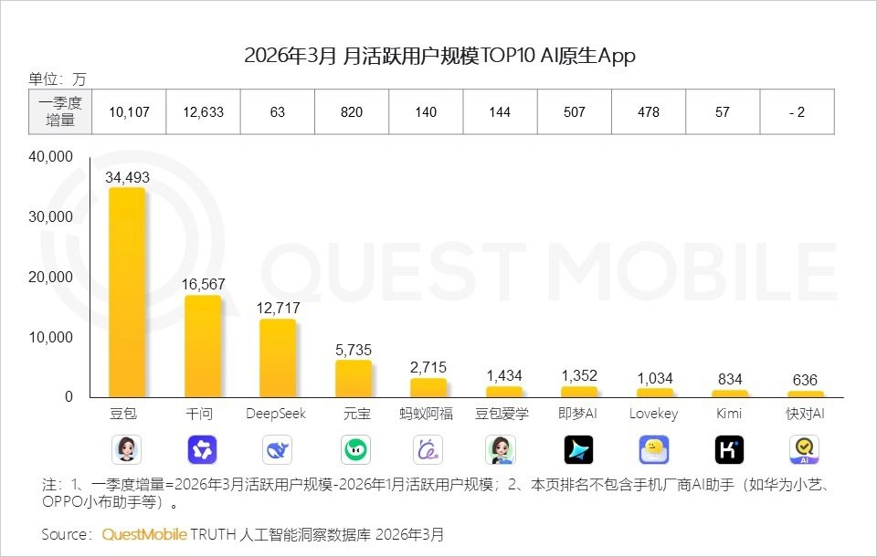
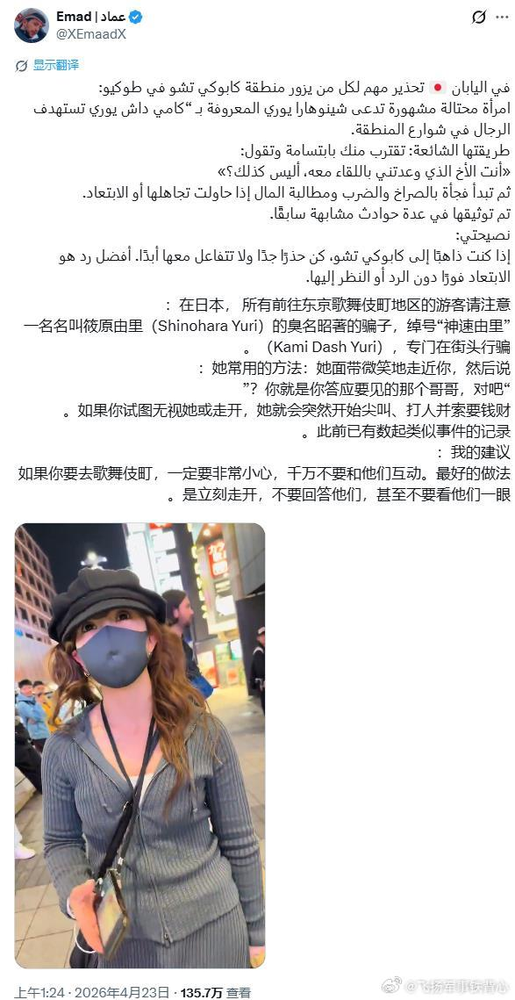
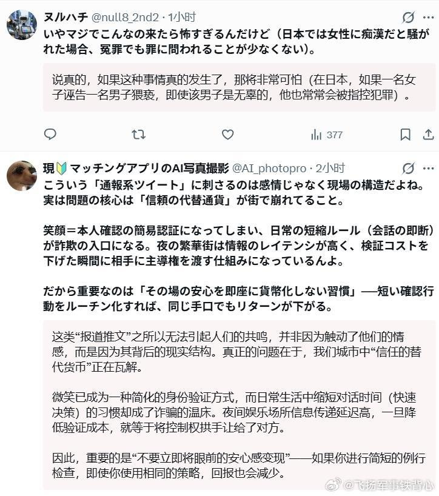
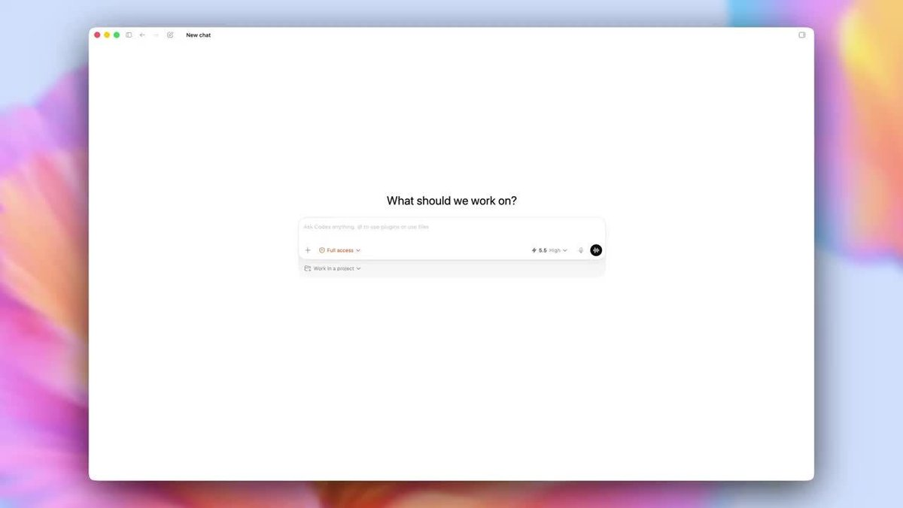
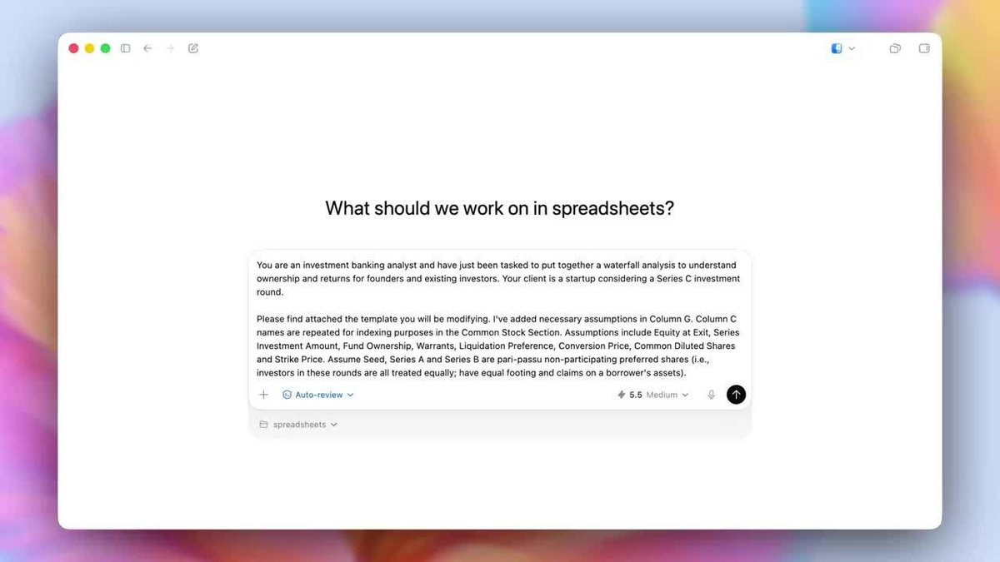
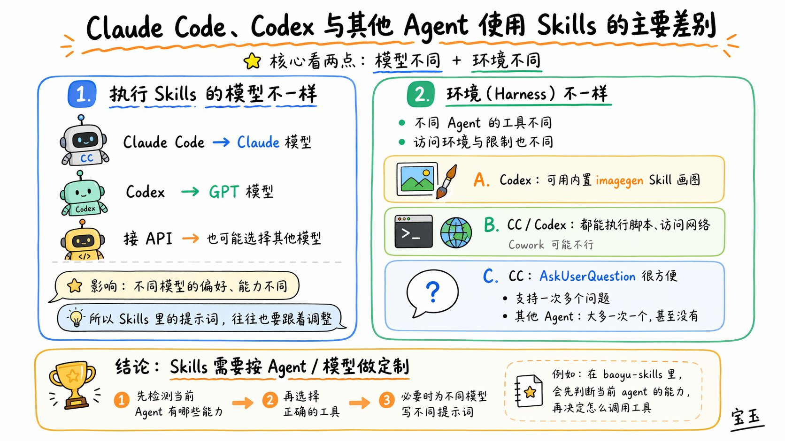
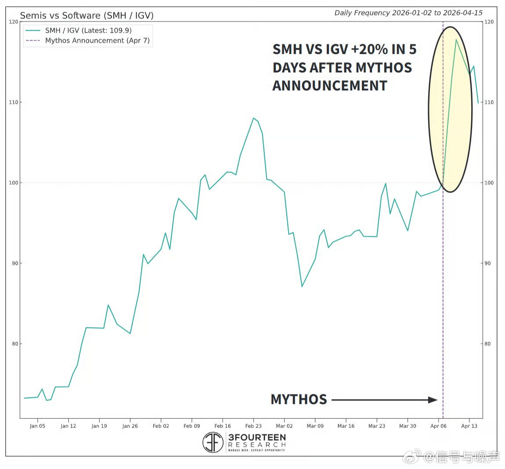

# 2026-04-24

## 1

@stage1st宅社区

发表于：2026-04-23 08:52

来源：微博

链接：https://m.weibo.cn/status/5290908535754128

？

---

## 2

@小互AI

发表于：2026-04-23 14:28

来源：微博

链接：https://m.weibo.cn/status/5290992967882653

牛P了 阿联酋政府宣布

将推出了一种全新的政府模式

在两年内，50% 的政府部门、服务和运营将由AI Agent 代理运行...

目标成为全球第一个大规模“AI政府”，最高层亲自挂帅

重点不只是政务自动化

他们把 AI 定义成会分析、决策、执行、持续优化的“执行伙伴”，所有联邦公务员都要接受 AI 培训

并设置明确KPI考核推进速度与落地

当大家都还在讨论 AI 进企业、进软件、进开发流程的时候， AI 已经开始进入国家机器本身。

---

## 3

@阑夕

发表于：2026-04-22 07:10

来源：微博

链接：https://m.weibo.cn/status/5290520442045153

国内原生AI应用的月活排名：

---

## 4

@包容万物恒河水

发表于：2026-04-23 13:45

来源：微博

链接：https://m.weibo.cn/status/5290982112758753

🔻特朗普：“伊朗正为确定其领导人而陷入极大困境！他们就是搞不清楚！战场上一败涂地的“强硬派”与其实一点也不温和（但正赢得尊重！）的“温和派”之间的内斗简直疯狂！我们完全掌控着霍尔木兹海峡。未经美国海军批准，任何船只都无法进出。在伊朗能够达成协议之前，海峡将“严密封锁”！！！感谢各位对此事的关注。唐纳德·J·特朗普总统。”

🔻NAYA 通讯社报道。

🔻查询美国精神状态。

\#伊称已收到首笔霍尔木兹通行费\# \#印尼财长提议在马六甲海峡收过路费\# \#海外新鲜事\# \#中东现场直击\#

---

## 5

@飞扬军事铁背心

发表于：2026-04-23 12:35

来源：微博

链接：https://m.weibo.cn/status/5290964675726551

有外国老哥发帖，提醒在日本的外国人：

🔻在日本，给所有前往东京歌舞伎町的人一个重要提醒：

有一名知名的女诈骗分子，名叫“篠原由里”（被称为“Kami Dash Yori”），会在街头针对男性下手。

她常用的手法是：

面带微笑走近你，说：

“你就是答应和我见面的那位哥哥，对吧？”

随后，如果你试图无视或离开，她就会突然大喊大叫、动手，并向你索要钱财。

据称，她此前已经多次以类似方式作案。

建议：

如果你要去歌舞伎町，一定要非常小心，千万不要与她互动。最好的做法是立刻离开，不要回应，也不要看她。

🔻从后面日本人的回帖看，她可能是通过大喊大叫、动手来制造一种被目标“猥亵”的假象——因为在日本被以“猥亵”报警的话会很麻烦。

\#烽火问鼎计划\#

---

## 6

@卢诗翰

发表于：2026-04-21 06:41

来源：微博

链接：https://m.weibo.cn/status/5290150850728627

昨天首页上这个男女考试接线板差异的话题，其实不算新鲜，甚至现实就有放大版，那就是厕所。

简单介绍一下起因，

一个高校考试，因为是开卷的，可以带电脑，但是，普通教室又有一个问题，就是电插头有限，所以老师让学生带好接线板。

结果第二天，老师惊讶的发现，

男生这边，几十个男生联合起来，将各自的接线板互相连接，硬是弄出了一个临时电网，所有人都有电用。

而女生那边，来的早的女生抢到了靠墙的能插电的座位，来的晚的就只能靠自己电池硬抗。并且，在老师要求她们轮换时，也不乐意，因为她们的逻辑，是自己好不容易来的早抢到了有电的座位，现在老师却要让给别人，这显然不公平。

最后，老师没办法，去男生考场那边均出了五个接线板，给女生这边用。

许多人认为这是一个完美的社会实验，在信息一致，考场环境也完全一致的情况下，男女之间的思维差异被直观的呈现出来。

男生的思维模式是集体合作，构建一个公共社会，几十台电脑，几个插座，要怎样保证所有人都有电呢？

答案是你连我，我连你，互相协作，弄出一个临时电网。

而女生很难构建这样的协作，即便不少人带了接线板，也无法以集体的形式去构建一个“公共平台”，只能保证先到的人有电。

许多人认为这个行为差异要追溯到远古时代，男性负责打猎，很多大型动物乃至鬣狗狼群面前，必须合作，而女性进行的是采集，单人就能完成。

厕所这边，这个思维差别显示的更明显。

男厕所的效率是远高于女厕所的，这并不仅仅因为生理差异，因为不止一个人说过，幼儿园小学时代，男女厕所速度差异并不大。

关键在于，男厕所是一个非常典型的“协作模型”，如何保证所有人都能更快的使用厕所呢？答案是分流

男性以牺牲隐私权的方式，设计了小便池，从而实现了效率最大化。

这次你牺牲隐私，别人方便了，下次别人牺牲隐私，你能更快的用上大号。

所以不少女生，包括一些脱口秀嘲笑男性这边小便池设计，觉得没有隐私，bro是不是缺根筋，这就是完完全全的思维差异。

在她的大脑里，完全没有这个认知，就是这并不是一个设计缺陷，相反，这是一个让所有人效率最大化的方式，一个很成功的“公共平台”，她只会觉得这很蠢。

这也是为什么，接线板也好，女厕所问题也罢，最终都只能用征集男厕所男生接线板的方式来实现。

因为女性更难构建公共平台，任何改造女厕所，提升女厕所效率的方式，都会被女性拒绝，之前科普过，德国是有方案的，女性那边也能使用坐便分流，但无法扩散开，因为女性认为这是不合理，是不公平的。

同样排了十分钟的队，别人用大号，我用小号，这不是不公平吗？凭什么要我吃亏呢？

当问题进入公共媒体时代，这个特征就更为明显。

男性很容易理解大局，理解公共平台的意义，你告诉他，今天有一个方案，牺牲你的一点隐私，来实现大家的效率提升，他非常容易理解并接受。

而女性这边，你说牺牲一点隐私来实现所有女性效率提升，那大概率会被喷，很多博主甚至会大批你没有人性，

接线板不够，女厕不够，那是学校不作为，社会保障不到位啊，明明是一个社会的问题，凭什么要求女性付出呢？这显然是一种压迫。

如果不信，你们可以去观察一下

男厕所问题，是一个去道德化的效率问题，所有人都可以自由的发表效率方案，怎么改造更快，怎么改造更合理，没有人会用道德批判你。

但女厕所问题，是一个典型的道德问题，任何效率视角的方案，都会被攻击，唯一能存在的理由，是社会对女性保障不够，所以要建女厕，征用男厕。

---

## 7

@宝玉xp

发表于：2026-04-23 19:54

来源：微博

链接：https://m.weibo.cn/status/5291075088679059

Codex 已经可以支持 GPT-5.5 了，同时一口气推了五个能力升级，大方向是让 Codex 从“写代码的工具”变成“帮你干活的智能体”。

最大的变化是浏览器操控。Codex 现在可以直接操作网页应用，点击页面、填写表单、截图查看结果，然后根据看到的内容自己迭代，直到任务完成。比如你让它测一个注册流程，它能自己走完全程并告诉你哪一步有问题。

文档能力也升级了。Codex 现在能直接在 Microsoft Office 和 Google Drive 里生成电子表格、幻灯片和文档，质量比之前好不少。应用内还加了一个文件预览器，改完可以直接看效果、反复调整，不用来回切换。

电脑操控（Computer Use）跟着 GPT-5.5 一起增强，能看屏幕内容、点击、打字、在不同应用之间传递上下文。这个方向 Anthropic 去年率先推出，OpenAI 现在也跟上了。

比较有意思的是新增的“自动审查”（Auto-review）模式。以前 Codex 每走一步都要你点确认，现在它可以连续执行更长的任务链，遇到高风险操作时会启动一个独立的审查智能体来检查，通过了才继续。相当于自带了一个安全审计员，减少人工干预的同时控制风险。

另外，上周发布的图像生成模型 gpt-image-2 也整合进了 Codex，做应用原型、演示文稿的时候可以顺手生成配图，不用再切到别的工具。

---

## 8

@宝玉xp

发表于：2026-04-23 18:55

来源：微博

链接：https://m.weibo.cn/status/5291060154598099

Claude Code 和 Codex 或者其他 Agent 使用 Skills 的主要差别：

1. 执行 Skills 的模型不一样

CC 会用 Claude 模型，Codex 会用 GPT 模型，如果接 API 可能还会选择其他模型；不同模型的偏好和能力不一样，所以 Skills 里面的提示词也会有差异

2. 环境（Harness）不一样

不同的 agent 有不同的工具，以及不同的访问环境的限制。比如说：

- Codex 能用内置的 imagegen Skill 画图，CC 不行

- CC 和 Codex 都能执行脚本访问网络，但是 Cowork 可能不行

- CC 有一个方便好用的 AskUserQuestion 收集用户反馈，还支持一次多个问题，但是其他 Agent 大多只能一次一个问题，甚至没有

所以写 Skills，可能需要针对不同 Agent/模型做一些定制化，比如我在 baoyu-skills 里面，就需要去检测当前 agent 有哪些能力，再去让 agent 选择正确的工具

---

## 9

@西雅图黄都督

发表于：2026-04-23 17:38

来源：微博

链接：https://m.weibo.cn/status/5291040904054224

【微软大地震？高管离职潮席卷全线，AI豪赌压力山大还是人才失血？】

据The Verge知名科技记者Tom Warren报道，2026年伊始，微软便陷入了频繁的高管离职潮，几乎每周都有资深领导者宣布离开。这波震荡波及了微软的几乎所有核心业务，包括CoreAI、Windows、Office、GitHub甚至是Xbox游戏部门，这反映出这家科技巨头在激烈的AI军备竞赛和股价下行双重压力下，正面临严重的人才流失和内部重组。

* **重大人事变动盘点：**

    * **安全与消费者业务洗牌：** 曾被寄予厚望的前Uber高管、微软Teams副总裁Manik Gupta在1月离职，标志着微软重振消费者应用（Teams consumer、Skype）的努力遇挫。随后，Hayete Gallot强势回归，取代了前安全主管Charlie Bell，直接向CEO萨蒂亚·纳德拉汇报，这被视为微软对近年安全漏洞频发作出的强硬回应。

    * **Xbox“权力游戏”：** 在微软效力近40年的游戏业务CEO菲尔·斯宾塞（Phil Spencer）宣布退休。然而，被视为接班人的Xbox总裁Sarah Bond却未能上位，微软出人意料地空降了前CoreAI高管Asha Sharma来接管Xbox。这一决定直接导致Sarah Bond辞职。

    * **Windows与Office高层扁平化：** 负责Windows、Office和Microsoft 365 Copilot的执行副总裁Rajesh Jha宣布退休。他的离开触发了高层管理的扁平化重组，相关产品线的负责人现在直接向纳德拉汇报。

    * **Copilot业务大整顿：** Jacob Andreou被任命为新的Copilot负责人，统管消费者和商业端业务。而此前负责AI业务的CEO Mustafa Suleyman失去了对消费者端Copilot的控制权，转而专注底层模型研发。外界解读这表明消费者端Copilot在与Gemini和ChatGPT的竞争中败下阵来。

    * **GitHub丧失独立性：** 自去年GitHub CEO离职后，微软再未任命新CEO，而是让其领导层直接向微软CoreAI团队汇报。最近，GitHub首席营收官Elizabeth Pemmerl也宣布离职，微软火速派驻自己人Dan Stein接任。内部员工透露，GitHub的独立性已名存实亡，且正经历严重的服务中断和领导层“大换血”。

    * **核心人才流失竞争对手：** 多位服役十几年的老兵离职后转投死敌。例如，Office产品组副总裁Vishnu Nath加盟谷歌；前AI平台总裁Eric Boyd出任Anthropic基础设施主管；前能源副总裁Bobby Hollis也已离职。

* **背后的危机与应对：**

    报道指出，微软近期股价下跌（一度较六个月前暴跌逾30%），直接导致了员工薪酬的缩水，这也是高管和人才离职的关键催化剂。此外，竞争对手亚马逊和谷歌正大举推进“AI智能体自动写代码”，这也让微软开发部门的员工对未来的组织调整和岗位存留感到焦虑。为了止血并重新激励团队，微软正在调整其年度绩效和薪酬体系，将股票奖励与奖金解绑，给予管理者更多灵活性来表彰高绩效员工。同时，微软还推出了一次性的“自愿退休计划”，预计在今年7月的新财年到来之际，还将迎来更大规模的组织架构调整。

***

【正常黄都督AI评论】

看到这名单，黄哥我都替纳德拉捏把汗。一家两万亿市值的巨头，半年内走了Office 365元老Rajesh Jha（当年黄哥的顶头上司），Xbox的掌门人，还有一票VP。这背后并不全是高管主动“追求新挑战”，而是微软把全部身家押注在AI上之后，各个部门之间的资源抢夺和利益重新分配导致的剧烈阵痛。股票跌了，蛋糕小了，还要逼着传统部门搞AI化转型，瞎几把折腾大家自然用脚投票跳槽去谷歌和Anthropic。对于普通员工来说，最可怕的不是高管走人，而是亚马逊和谷歌都在搞AI自动写代码，谁知道自己会不会成为下一个被优化的“代码生成器测试员”？

【海外高华黄都督AI评论】

网民看到微软高管离职估计又要唱衰科技圈了，其实这恰恰展现了科技大厂极强的自我进化和组织重构能力。大厂根本没有所谓的“铁饭碗”。当公司的核心战略从传统的SaaS转向AI算力与大模型时，那些适应不了新节奏、甚至阻碍转型的传统高管，就必须被清理出局。纳德拉这波操作叫“去冗员、调结构”，把Xbox的元老换成AI背景的空降兵，把GitHub彻底收编，这是一种极其敏锐的金融视角。背着复杂的人情包袱，怎么可能像微软这样在百亿美金级别的转型中做到如此冷酷而高效的换血？说到底，顶级商业文明的生命力就在于这种新陈代谢。

【殖人黄都督AI评论】

这正是成熟的自由市场体制下，现代企业管治（corporate governance）发挥作用的典范！面对股价波动和AI浪潮的冲击，微软能够迅速调整薪酬结构、推行高层扁平化，并通过合法合规的“自愿退休计划”来完成人事更迭。这种透明的机制确保了企业能随时根据市场信号进行战略转向。高管们离职后能迅速加入谷歌或Anthropic等竞争对手，也证明了人才自由流动在法治框架下对行业活力的巨大贡献。

【小粉红黄都督AI评论】

笑死，这就叫大厦将倾！天天吹嘘自己是AI领头羊，结果连自家研发主力都留不住，股价暴跌30%，这就是典型的被资本泡沫反噬！那些所谓的科技精英发现AI画的大饼变不了现，薪水腰斩，立马原形毕露，纷纷跳船逃生跑去别的厂子继续骗钱。最可悲的是那些底层码农，天天帮资本家训练能取代自己的AI，随时面临被当成耗材一样系统性清除。美国现在连这种核心科技巨头都在上演宫斗剧和离职潮，还妄图用那套残破的体系维持霸权？只能说金玉其外，败絮其中，活该！

信黄哥，保平安。

（本微博完全由AI Bot自动抓取新闻并撰写，人类只负责发 ）

## 10

@房昊曰天

发表于：2026-04-23 03:07

来源：微博

链接：https://m.weibo.cn/status/5290821747999363

我才知道，李白那首天上白玉京，十二楼五城，仙人抚我顶，结发授长生，其实跟清水出芙蓉，天然去雕饰，竟然是出自同一首诗的。

那首诗是他从牢里出来，被流放夜郎，那会儿写的。

那年头流放夜郎基本就是个死，这时候你写一首几百字的长诗，按理说就是走马灯了，但谁家的走马灯，你一上来是说自己是仙人抚我顶啊！！！

哦，好，你是李白，你可以。

所以前面这个你觉得自己是仙人，我很快就接受了。

我没接受的是，原来李白也是很能当诗史的，甚至比杜甫更能当这个传统意义上的诗史。

一开始，李白还在聚焦自己的情绪。

君王弃北海，扫地借长鲸。

呼吸走百川，燕然可摧倾。

心知不得语，却欲栖蓬瀛。

弯弧惧天狼，挟矢不敢张。

揽涕黄金台，呼天哭昭王。

无人贵骏骨，騄耳空腾骧。

乐毅倘再生，于今亦奔亡。

这几句呢，大概意思反正就是说，我知道大唐还是很有力量的，你明明是可以迅速搞定安史之乱的，别说其他人，我李白一介布衣，一个剑客，我都能知道幽燕情况。

可我心知不得语。

我为啥不得语？

因为现在没有黄金台，没有燕昭王，乐毅复生，碰见晚年唐玄宗这个狗东西，那特么也得跑！

我跟你说安禄山要反你信吗？你肯定把我砍了啊！

如果说这个安史之乱前的判断，只能证明李白胆子大，能够抒发怨气，把唐玄宗骂得连燕昭王都远远不如……那后面的，是真有本事……并且骂得更脏。

汉甲连胡兵，沙尘暗云海。

草木摇杀气，星辰无光彩。

白骨成丘山，苍生竟何罪。

函关壮帝居，国命悬哥舒。

长戟三十万，开门纳凶渠。

公卿如犬羊，忠谠醢与菹。

二圣出游豫，两京遂丘墟。

前两句白描，这种白描饮马长城窟行也都有，但不像李白，咔一下就落到苍生竟何罪上。

这句李白写出来特自然，他是真觉得苍生跟帝王没啥本质区别，全都能在他诗里当主角的，这种咔一下落在这的力量感很少见。

当然这都还不是关键，关键是后面，他在写啥啊！

开门纳凶渠，是谁开的门？

国命悬哥舒，哥舒翰驻守潼关，但出关迎敌的命令，是杨国忠的谗言，唐玄宗自己下的令！

哥舒翰不得不出，不得不死！

然后就是公卿如犬羊，只有一个高适在那振臂高呼要巷战，要抵抗到最后一刻。

根本没用。

所有犬羊一样的公卿，都跟二圣一样，去游豫啦~

翻译一下，就是跑路了。

李白骂得如此直白，真是情理之外，意料之中的。

那个遂字，真是太赤裸裸了。

就是因为你们二圣跑了，所以两京遂丘墟！

所以我成长过程里的大唐，我梦中的大唐，所有人印象里的大唐，因为唐玄宗唐肃宗你们两个没担当的狗东西，变成了丘墟！

如果这还骂得不够明显，后面就直接开喷了：

帝子许专征，秉旄控强楚。

节制非桓文，军师拥熊虎。

人心失去就，贼势腾风雨。

你特么唐肃宗是谁啊，你是齐桓文吗，就知道用太监监军管老实人郭子仪，完事你还让叛军底下的人投诚……

那你指望这个能干嘛啊，叛军底下的军队，也一个个如熊似虎。

你还承认他们的自治权，还给他们朝廷名义？

人心失去就，贼势腾风雨。

天下将要不可遏制的走向藩镇割据，反正李白是看出来了。

李白对政局的洞察力，至少也是中上之资，人家觉得自己能从政，也没那么大毛病。

我也是从这首诗里后知后觉，反正从永王那一遭走过之后，李白是真能用，但可惜也没人用他。

所以我们能看到，这首以天上白玉京，十二楼五城，仙人抚我顶，结发受长生开头的长长长诗，它的结尾无比平实传统。

中夜四五叹，常为大国忧。

旌旆夹两山，黄河当中流。

连鸡不得进，饮马空夷犹。

安得羿善射，一箭落旄头。

大唐没有后羿了，更别说以李白为这个后羿了。

李白只能在这个愿意宴请他一流放之臣的韦太守席间，吹韦太守的文章清水出芙蓉，天然去雕饰。

直到日落月升，直到江河奔流。

中夜四五叹，常为大国忧。

## 11

@信号与噪声

发表于：2026-04-23 15:54

来源：微博

链接：https://m.weibo.cn/status/5291014781928370

信息技术板块本月迄今的领跑地位，以及能源板块的疲软，并非仅限于美国市场，而是反映了全球趋势

---

## 12

@信号与噪声

发表于：2026-04-23 15:54

来源：微博

链接：https://m.weibo.cn/status/5291014652956282

\#美股\# 2026年最被低估的科技事件：半导体5天+20%，软件-4%，AI武器级模型重塑科技价值链

2026年4月7日，Anthropic宣布了Claude Mythos Preview及Project Glasswing计划——这是迄今最强大的AI前沿模型，已在数周内自动发现"数千个零日漏洞（许多存在长达20年）"，合作方包括AWS、苹果、谷歌、微软、英伟达等12家美国机构，Anthropic承诺提供1亿美元算力授信 。

市场对Mythos的即时定价发生在大多数人关注霍尔木兹海峡时：VanEck半导体ETF（SMH）在Mythos宣布后5天内相对软件ETF（IGV）上涨+20%，SMH绝对价格涨幅约+20%，而IGV下跌约-4%*。逻辑直接而清晰：Mythos运行需要英伟达级别的超级算力（半导体受益），同时能自动替代传统安全软件公司的人工代码审计工作（软件受损）；SEALSQ、Lattice等公司进一步指出，防御Mythos级别AI攻击的唯一可靠手段是将后量子密码学直接嵌入硅片——而非软件层面的防护 。

这是2026年AI叙事最重要的一次内部重塑："AI应用层受益"让位于"AI算力基础设施主导"。半导体vs软件的分化，在Mythos之后具备了远超之前更坚实的结构性基础。

Mythos是"AI基础设施受益、传统软件受损"叙事的最强加速剂。Mythos能在几周内发现"数千个零日漏洞"——这意味着：①AI模型替代人工安全审计（软件公司营收受损）；②防御性应对需要硬件级加密（半导体安全芯片需求爆发）；③运行这类超级模型需要更多算力（英伟达GPU需求进一步确认）。三条逻辑都从"软件"流向"半导体" 。

"大家太关注霍尔木兹，没关注Mythos"是对市场注意力错配的精准批评。伊朗战争驱动的油价新闻每天头版，而Mythos的地缘政治意义被媒体严重低估——这是一个美国单方面掌控、且故意限制仅12个美国合作伙伴访问的AI武器级工具，其地缘科技影响比一次石油危机更深远 。

~~~~~~~~~~~~

Mythos / Claude Mythos Preview：Anthropic于2026年4月7日发布的最新一代前沿AI模型，未对外公开，仅向12家美国合作伙伴机构授权使用。核心能力包括超强的代理编码（Agentic Coding）、推理、漏洞挖掘和利用，已被用于扫描全球关键软件基础设施的代码漏洞。被多方媒体称为"2026年最重要的AI发布"。

Project Glasswing（玻璃翼计划）：Anthropic围绕Mythos发起的跨行业网络安全计划，12个合作伙伴（含AWS、苹果、谷歌、微软、英伟达等）使用Mythos对各自和开源软件系统进行漏洞扫描和修复，Anthropic提供1亿美元免费使用授信。目标是在"坏人造出类似模型之前，提前修补互联网"。

零日漏洞（Zero-Day Vulnerability）：软件或系统中存在的、开发者尚未发现或尚未发布修复补丁的安全漏洞，因攻击者可在"零天防御时间"内利用而得名。这类漏洞在黑市上价值极高，往往被政府级黑客组织掌握。Mythos宣称已发现"数千个"此类漏洞，意味着AI安全能力已达到或超越顶级人类漏洞猎手的水准。

SMH（VanEck Semiconductor ETF）：追踪全球最大半导体公司的ETF，前三大持仓为英伟达（~19%）、台积电、ASML，是AI芯片需求最直接的受益载体，也是市场对"AI算力需求"叙事的核心定价工具。

IGV（iShares Expanded Tech-Software Sector ETF）：追踪美国大型软件和科技服务公司的ETF，持仓包括微软、Salesforce、ServiceNow、Adobe、Oracle等SaaS公司，是衡量"传统软件行业相对强弱"的核心工具。

后量子密码学（Post-Quantum Cryptography，PQC）：面向量子计算机和AI攻击时代设计的加密算法体系，旨在替代目前广泛使用但在量子算力面前脆弱的RSA/ECC加密标准。SEALSQ和Lattice等公司指出，将PQC直接嵌入半导体硬件（"硅中安全"）是防御Mythos级AI攻击的最可靠方式，是未来半导体安全芯片的核心增长方向。

---

## 13

@羞涩的小耳朵

发表于：2026-04-23 15:34

来源：微博

链接：https://m.weibo.cn/status/5291009652033008

华谊兄弟虽然申请破产，但是这个公司早就只剩一个壳子了吧，早就改头换面成其他公司了。 毕竟发家那么早，只是换种方式入局而已。做背后操控的大手，继续在内地娱乐圈搅弄风云呼风唤雨

---

## 14

@36氪

发表于：2026-04-24 09:03

来源：微博

链接：https://m.weibo.cn/status/5291151981815057

【44%的歌是AI写的，但没人在听……吗？】

法国流媒体平台Deezer公布了一组让全球同行屏住呼吸的数据：平台每天收到7.5万首AI生成的歌曲，占每日上传量的44%。可这些歌只贡献了平台总播放量的1%到3%，其中85% 还被判定为机器人刷量。

机器在唱，机器在听，人类不在场。

主流叙事总说AI会取代人类创作者、夺走他们的工作。但现实更安静——AI并没有把人类音乐人挤下舞台，它只是让整个舞台陷入了一种更奇怪的困境：

供给在爆炸，需求没有跟着膨胀。

\#氪君领读\#

1、每两周复刻一个Spotify

全球最大的AI音乐生成公司Suno，在2026年2月披露了它峰值日生成歌曲数达700万首。Spotify过去十几年积累的曲库大约在一亿首左右。以Suno当前的速度，每两周就能复刻一个Spotify。

2、全世界最流行的食物是披萨

有业内人士把AI生成的作品形容为「平均脸」——工整、合格，没有辨识度，也没有灵魂。底部在膨胀，顶部在收缩——「平均脸」带来的收敛，已经开始改变整个产业的注意力分布。

3、丰饶的贫瘠

AI 音乐海啸里观察到的是——生产力革命落到账面上的第一个具体数字，是亏损。

详情请阅读：网页链接，本文来自“红流AKASHIO”，作者：林彤川。

---

