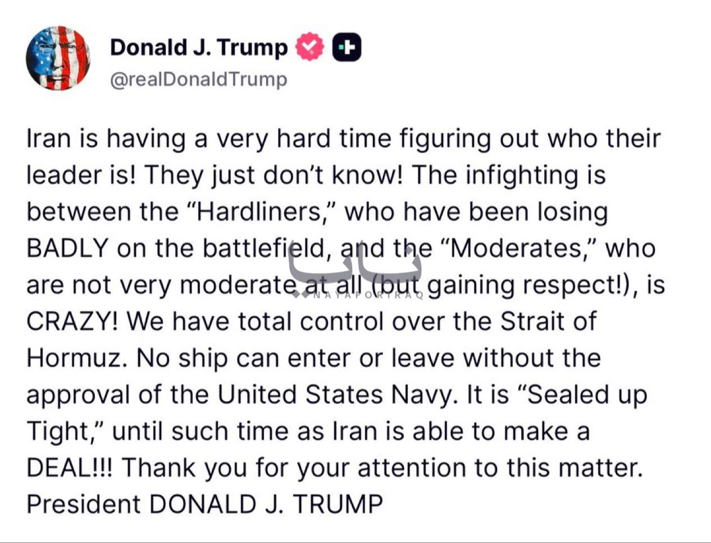

@包容万物恒河水
发表于：2026-04-23 13:45
来源：微博
链接：https://m.weibo.cn/status/5290982112758753

🔻特朗普：“伊朗正为确定其领导人而陷入极大困境！他们就是搞不清楚！战场上一败涂地的“强硬派”与其实一点也不温和（但正赢得尊重！）的“温和派”之间的内斗简直疯狂！我们完全掌控着霍尔木兹海峡。未经美国海军批准，任何船只都无法进出。在伊朗能够达成协议之前，海峡将“严密封锁”！！！感谢各位对此事的关注。唐纳德·J·特朗普总统。”
🔻NAYA 通讯社报道。
🔻查询美国精神状态。
\#伊称已收到首笔霍尔木兹通行费\# \#印尼财长提议在马六甲海峡收过路费\# \#海外新鲜事\# \#中东现场直击\#

---

