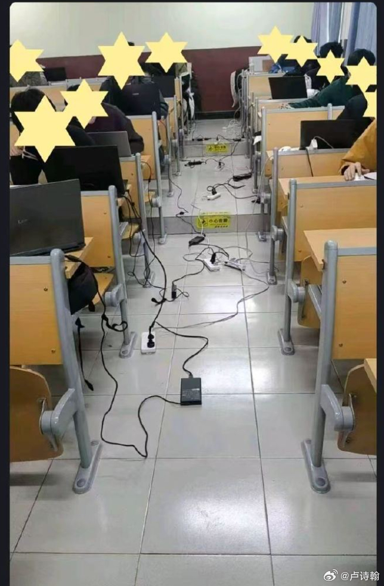
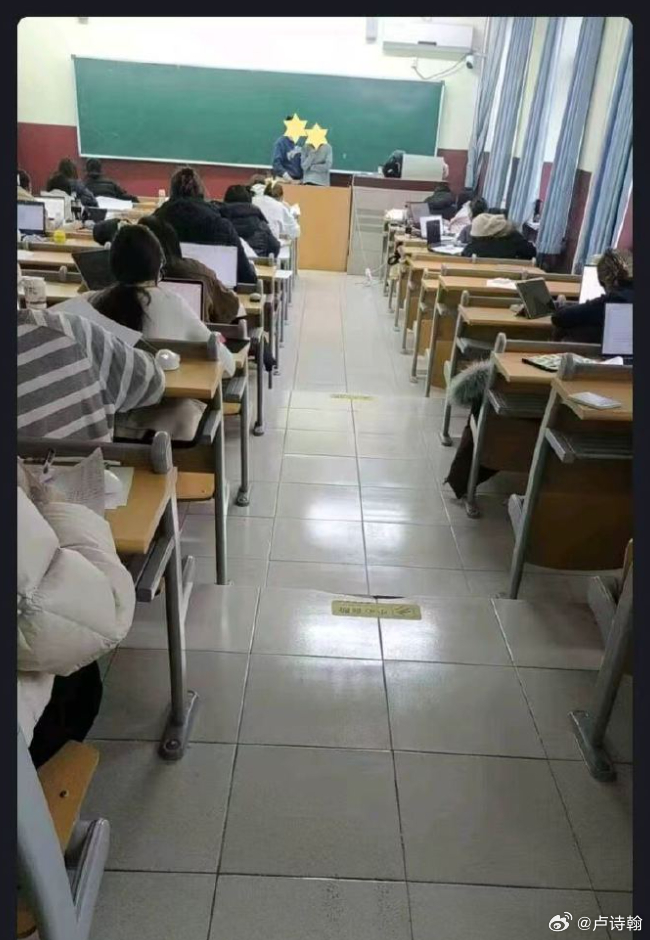
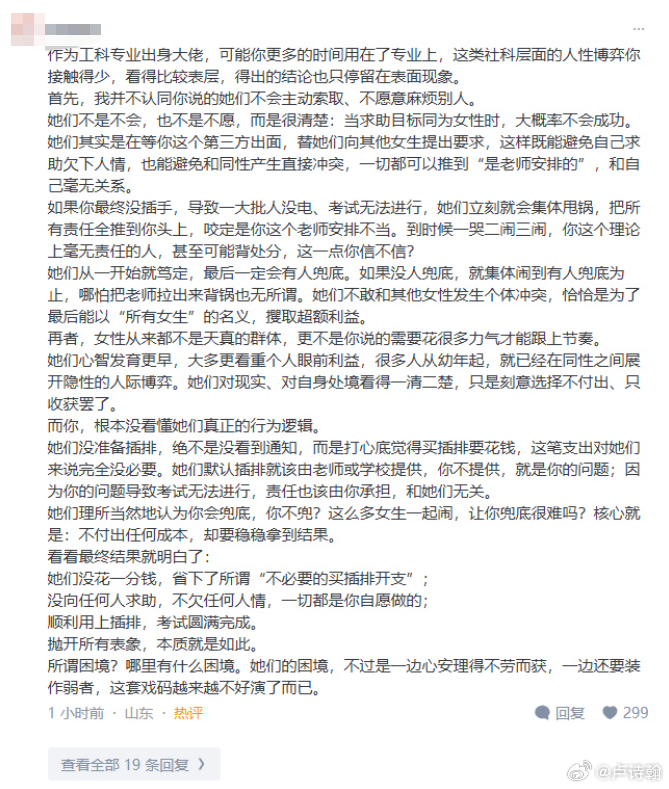

@卢诗翰
发表于：2026-04-21 06:41
来源：微博
链接：https://m.weibo.cn/status/5290150850728627

昨天首页上这个男女考试接线板差异的话题，其实不算新鲜，甚至现实就有放大版，那就是厕所。

简单介绍一下起因，
一个高校考试，因为是开卷的，可以带电脑，但是，普通教室又有一个问题，就是电插头有限，所以老师让学生带好接线板。
结果第二天，老师惊讶的发现，
男生这边，几十个男生联合起来，将各自的接线板互相连接，硬是弄出了一个临时电网，所有人都有电用。
而女生那边，来的早的女生抢到了靠墙的能插电的座位，来的晚的就只能靠自己电池硬抗。并且，在老师要求她们轮换时，也不乐意，因为她们的逻辑，是自己好不容易来的早抢到了有电的座位，现在老师却要让给别人，这显然不公平。
最后，老师没办法，去男生考场那边均出了五个接线板，给女生这边用。

许多人认为这是一个完美的社会实验，在信息一致，考场环境也完全一致的情况下，男女之间的思维差异被直观的呈现出来。
男生的思维模式是集体合作，构建一个公共社会，几十台电脑，几个插座，要怎样保证所有人都有电呢？
答案是你连我，我连你，互相协作，弄出一个临时电网。
而女生很难构建这样的协作，即便不少人带了接线板，也无法以集体的形式去构建一个“公共平台”，只能保证先到的人有电。
许多人认为这个行为差异要追溯到远古时代，男性负责打猎，很多大型动物乃至鬣狗狼群面前，必须合作，而女性进行的是采集，单人就能完成。

厕所这边，这个思维差别显示的更明显。
男厕所的效率是远高于女厕所的，这并不仅仅因为生理差异，因为不止一个人说过，幼儿园小学时代，男女厕所速度差异并不大。
关键在于，男厕所是一个非常典型的“协作模型”，如何保证所有人都能更快的使用厕所呢？答案是分流
男性以牺牲隐私权的方式，设计了小便池，从而实现了效率最大化。
这次你牺牲隐私，别人方便了，下次别人牺牲隐私，你能更快的用上大号。
所以不少女生，包括一些脱口秀嘲笑男性这边小便池设计，觉得没有隐私，bro是不是缺根筋，这就是完完全全的思维差异。
在她的大脑里，完全没有这个认知，就是这并不是一个设计缺陷，相反，这是一个让所有人效率最大化的方式，一个很成功的“公共平台”，她只会觉得这很蠢。

这也是为什么，接线板也好，女厕所问题也罢，最终都只能用征集男厕所男生接线板的方式来实现。
因为女性更难构建公共平台，任何改造女厕所，提升女厕所效率的方式，都会被女性拒绝，之前科普过，德国是有方案的，女性那边也能使用坐便分流，但无法扩散开，因为女性认为这是不合理，是不公平的。
同样排了十分钟的队，别人用大号，我用小号，这不是不公平吗？凭什么要我吃亏呢？

当问题进入公共媒体时代，这个特征就更为明显。
男性很容易理解大局，理解公共平台的意义，你告诉他，今天有一个方案，牺牲你的一点隐私，来实现大家的效率提升，他非常容易理解并接受。
而女性这边，你说牺牲一点隐私来实现所有女性效率提升，那大概率会被喷，很多博主甚至会大批你没有人性，
接线板不够，女厕不够，那是学校不作为，社会保障不到位啊，明明是一个社会的问题，凭什么要求女性付出呢？这显然是一种压迫。

如果不信，你们可以去观察一下
男厕所问题，是一个去道德化的效率问题，所有人都可以自由的发表效率方案，怎么改造更快，怎么改造更合理，没有人会用道德批判你。
但女厕所问题，是一个典型的道德问题，任何效率视角的方案，都会被攻击，唯一能存在的理由，是社会对女性保障不够，所以要建女厕，征用男厕。

---

