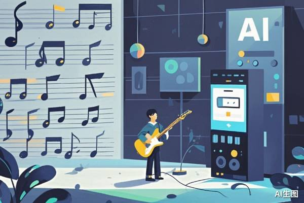

@36氪

发表于：2026-04-24 09:03

来源：微博

链接：https://m.weibo.cn/status/5291151981815057

【44%的歌是AI写的，但没人在听……吗？】

法国流媒体平台Deezer公布了一组让全球同行屏住呼吸的数据：平台每天收到7.5万首AI生成的歌曲，占每日上传量的44%。可这些歌只贡献了平台总播放量的1%到3%，其中85% 还被判定为机器人刷量。

机器在唱，机器在听，人类不在场。

主流叙事总说AI会取代人类创作者、夺走他们的工作。但现实更安静——AI并没有把人类音乐人挤下舞台，它只是让整个舞台陷入了一种更奇怪的困境：

供给在爆炸，需求没有跟着膨胀。

\#氪君领读\#

1、每两周复刻一个Spotify

全球最大的AI音乐生成公司Suno，在2026年2月披露了它峰值日生成歌曲数达700万首。Spotify过去十几年积累的曲库大约在一亿首左右。以Suno当前的速度，每两周就能复刻一个Spotify。

2、全世界最流行的食物是披萨

有业内人士把AI生成的作品形容为「平均脸」——工整、合格，没有辨识度，也没有灵魂。底部在膨胀，顶部在收缩——「平均脸」带来的收敛，已经开始改变整个产业的注意力分布。

3、丰饶的贫瘠

AI 音乐海啸里观察到的是——生产力革命落到账面上的第一个具体数字，是亏损。

详情请阅读：网页链接，本文来自“红流AKASHIO”，作者：林彤川。

---

