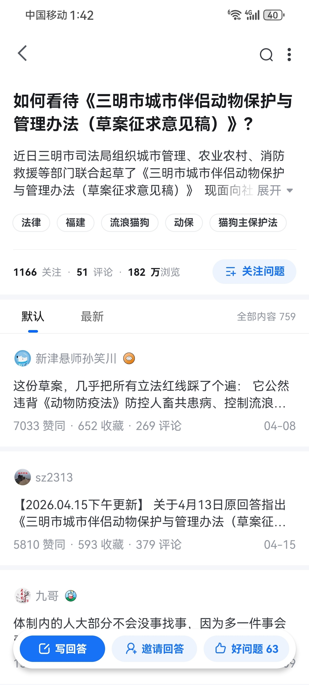

@李小粥的茶水间

发表于：2026-04-24 18:05

来源：微博

链接：https://m.weibo.cn/status/5291410115003237

\#全国首个伴侣动物立法草案被删除\# 这次某乎上了大分，三明争议极大的“伴侣动物立法草案”，半个月前先在某乎发酵热议，多个答主从法理、秩序、可行性多个层面进行抨击，时机也挺巧，恰逢平顶山校园流浪伤人的回旋镖事件。

一位高赞答主评论一针见血：“拿法律的严肃性给小众情绪买单”。

这也是某乎区别于其他中文社区最大的不同，对这类天然具有流量密码的话题，通常会从客观实际、可操作性、成本收益等理性分析出发，而非照搬西式白左的、或跟风情绪出发，

所以对诸多互联网争议话题，其风格和价值取向，与某些社区完全是两个极端。 \#全国首个伴侣动物立法草案引争议\#\#福建三明拟为伴侣动物立法\#

---

