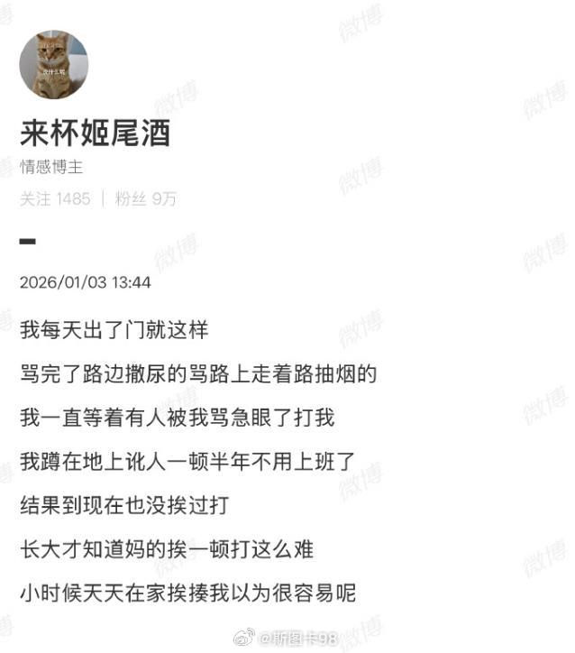

@斯图卡98

发表于：2026-04-25 15:06

来源：微博

链接：https://m.weibo.cn/status/5291613451453443

这是不是有预谋的挑事？

刚说过， 2025 年8月上海有个 女网红，自称 “禁烟大使”。“街头禁烟女网红”：专门蹲街拍路人，抢烟头、指责吵架、故意激怒对方拍视频上传网络。最后这个账号被抖音永久封禁 

像通过碰瓷吸烟这个赛道，早就是几年前打拳玩过的，两女专门找吸烟的人碰瓷，还报了警，事情一度上了热门，结果被网民扒了出来，这两女就是打拳的头目，专门到异地找男性烟民挑事  ，所以这事刚闹起来，很快就因被曝光打拳的背景消停了。 

而且近两年有关吸烟的热门，都不是当事人在自己单位、左邻右舍、亲戚朋友中禁烟的事。 都有一个共同点，都是在外面找陌生男性，从没有看到过一个女性去找女性吸烟这的事，同时用一个“命令”的口吻，并夹杂着拍摄、投诉等威胁恐吓手段，试图激怒吸烟者。都知道像吸烟，都是以温和的态度建议对方，结果这些女的直接来硬的，上来就是斥责，她们实在通过“禁烟”这个政治正确制造话题，占领道德制高点，借此争夺执法权

如果这种事能成，那今后会在多个领域上，搞出同样的事，道德审判权和擦边执法权

---

