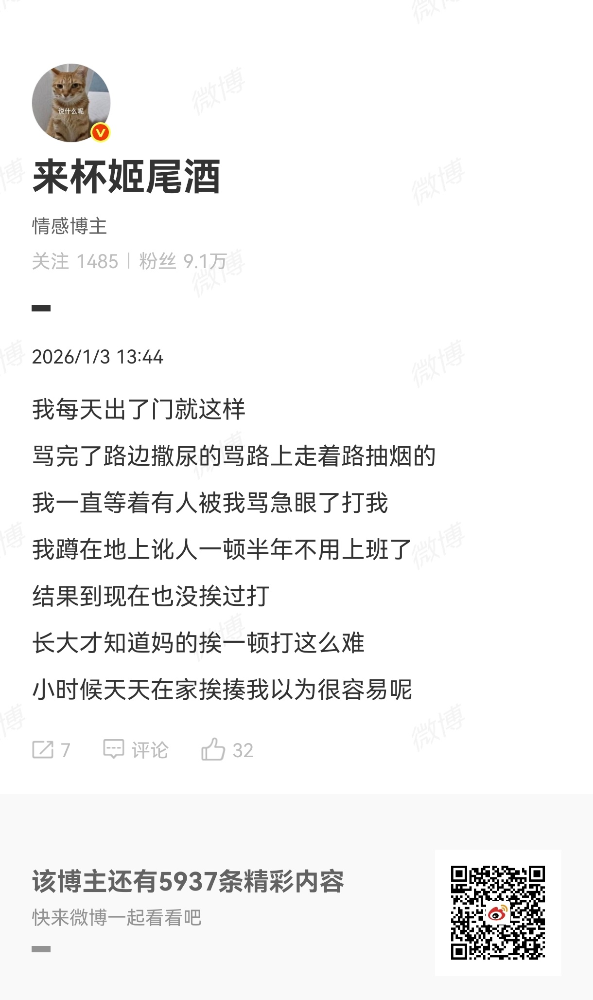
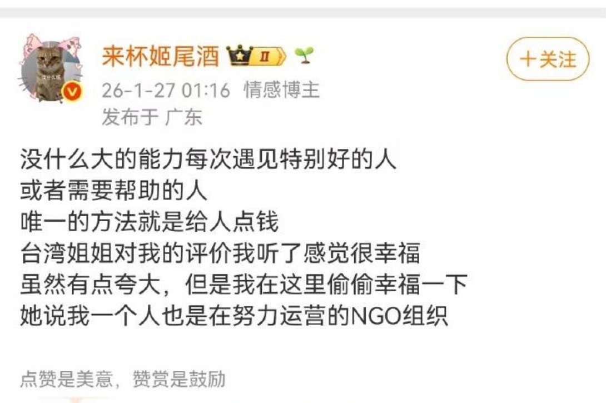
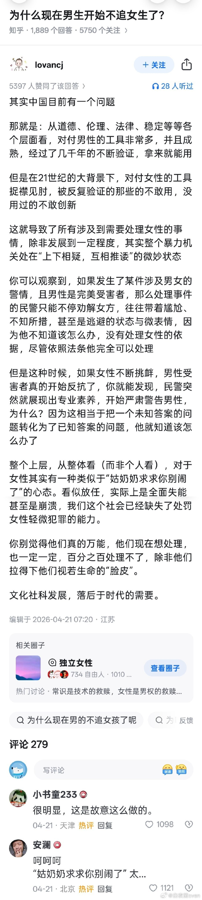

@2049年的世界
发表于：2026-04-25 16:06
来源：微博
链接：https://m.weibo.cn/status/5291623462482377

如果是抱着这样的挑衅心态的话，那怎么都会找到机会的。骂还不足以刺激对方（按图中说法是每天如此），那这次就变成饮料泼了。

那么这就是困境了，饮料泼人身上，到底该不该处理。不处理似乎不太合适，处理呢，在对方的舆论战中又完全没有应对能力，反而恐怕是正中下怀。

这么大一个漏洞，又如此方便操作，那以后“禁烟”的各个城市是不是要面临海量效仿者了？
反而如果城市不上赶着禁烟，不发布什么禁烟条例，则屁事没有，不会给自己找麻烦。
如果一个政策，结果是多做多错，多做多骂，做多舆情多，不做不错，不做没事，那它会是什么结果呢？

怎么办呢？很复杂。

---

