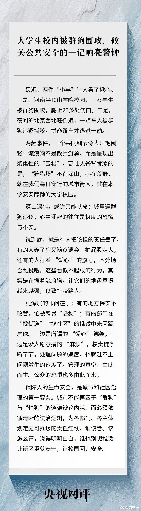
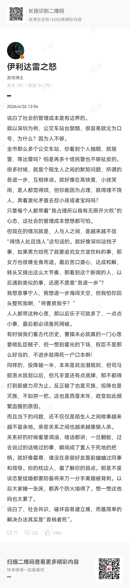

# 2026-04-26

## 1

@杨红旭聊房

发表于：2026-04-25 08:53

来源：微博

链接：https://m.weibo.cn/status/5291633520149480

关于老百姓玩钱这件事！

存款热+贷款冷，跌回十年前！

全国居民部门的贷款余额总规模，比上全国居民部门的存款余额规模，这就是贷存比。

贷存比往上走，说明了居民部门投资买房的意愿比存款的意愿更高；贷存比往下走，就说明居民贷款买房的意愿处于下滑状态。

我们可以看到，过去将近 20 年贷存比震荡式上升，最高点出现在 2021 年 12 月，顶峰是将近 69%，之后就开始震荡式往下走了。

今年 2 月降到了 48.2%，相当于回到了 2015 年 10 月，这个走势图正好跟中国楼市的景气度的变化完全一致。

目前全国的房价水平基本上回到了 2016 年初，这个就跟贷存比回归的历史时间节点比较近似。

而从幅度来看，贷存比跌了 30%，房价跌了 40%。所以说这个指标也是我们观察楼市走势变化的一个重要指标。

---

## 2

@挨踢牛魔王

发表于：2026-04-25 08:45

来源：微博

链接：https://m.weibo.cn/status/5291631424572249

最近谷歌、阿里推出了几个本地模型，效果不错。

有很多人介绍，但是就把模型拿出来说说，找不到其中的规律，其实大家看一眼就过去了。

我们先看谷歌的gemma 4，总共有这么几个参数型号：

E2B、E4B、26B A4B 和 31B。

阿里的Qwen 3.6是这么几个型号：

Qwen 3.6 总参数35B，激活参数3B，还有一个27B的稠密模型。

规律是什么呢？

就是一个本地模型，要达到能用的门槛，目前参数至少需要30B。

低于这个这个参数量，就只能完成一些简单任务和特定任务。

那么对于MOE的大模型呢？

就是看激活参数量。

简单的说，MOE大模型，总参数，就大概相当于你们单位有多少人。

激活参数量，就是干某个事情的有多少人。

比如说，腾讯，人很多，但是干大模型的到底有几个人？

这个人数才是激活参数量。

其它部门人再多，有点用处，但是并不是直接来干这个活的。

我们再看看腾讯发的hy3，这其实可以看做腾讯重新训练的一个试点：

总参数量 295B

激活参数量 21B

就是很聪明的把激活参数量定在21B，能干活，速度快，肯定是要看反馈。

情况好，再加大参数量。

对于主流的开源模型，我们再看它们的激活参数量：

DeepSeek-V4-Pro（总参数量 1.6T，激活参数量 49B）

DeepSeek-V4-Flash（总参数量 284B，激活参数量 13B）

49B激活参数，所以效果还挺不错的。

Kimi 2.6 1T，激活参数量32B，效果也不错。

GLM 5.1 总参数744B 参数，激活参数量40B。

所以，大家在选模型的时候，不光看总参数，还要看激活参数量。

从这个角度看，deepseek V4可以说是性价比很高了。

## 3

@有个梨GPT

发表于：2026-04-25 04:28

来源：微博

链接：https://m.weibo.cn/status/5291566772258849

我今天想明白了一个重要问题，率先发表在微博上。

----

邹衍是先秦时期最大的阴阳家。阴阳理论起源扑朔迷离，在春秋战国时期的各种著作中被广泛提及，邹衍之后系统化上升到哲学高度，后世游走在哲学和神鬼之间。

但我们先把学问的问题放一放，为先秦人民设身处地的想一想，阴阳二字我们不去附会其它含义，它和生产生活中最基本的种地和吃饭，的关系是什么。

----

众所周知，先秦时期的政治记事，使用月历，也就是阴历。阴历是没法用于耕种的，耕种只能用阳历，即24节气。节气可以用日影长度测得。

但是这也是一个理想说法，因为种子发芽的真正影响因素是土壤温度。但是温度是塔玛的分子热运动造成的，先秦时期的古人如何去测量这个温度？

----

答案是惊人的。通过音律。

律管的声学模型，频率是和声速成正比的；而空气，在0-40度范围内，温度每升高一度，声速提高约0.6米。15摄氏度的一个笛子，如果标定在440Hz的A（斗来咪法索啦的啦）上，到了25度，会升高8Hz，到了5度则会降低8Hz，这个变化对人耳来说，是显著的。换句话说，对音准有很好的分辨率的人来说，可以用来判断气温。即耕种的时机。

这就是邹衍在燕国著名的成就，所谓「邹衍吹律」的故事。他用吹律准确判定了农业耕种的时机。

----

古人如果要定律，即音准。虽然文字记载下有9寸管为黄钟（黄钟不是乐器，是类似中央C的音准）的说法，但是因为「寸」是没法绝对标定和保存的，不是可取之法。

可取的办法只能是金属乐器，因为合金保存的时间非常久远，一旦有标准音准，就可以多铸造一些，经过打磨都调成音高一样的。反过来用这种青铜乐器去校准9寸管的长度才是可取之法。

所以孔子去周朝听到的乐器，当然确实是音乐，而且确实是奢华生活的一部分，但是他们的起源，是为了定管的基准音高。

----

后汉书里记录了一种「葭灰占律」的候气法。过于隆重。有个三层密室，要涂过牲畜血，要摆上律管，装入葭灰（芦苇内膜烧的灰），春天地气上升之时葭灰会从律管里上升飞出。

这个候气法历史悠久，但实际上不科学，是哲学没法直接指导具体农业生产的的例子。后世到现代都无法重复。

我们能确定的事情是有律管用于土地测温的记载，是把律管埋入地下的。但是使用方法不是看什么地气上升，而是根据其音律的偏差知道土壤温度。

绝对的温度标定未必有很高的意义，因为人可以把种子放在碗里或自家院子里看它发芽来确定种植时间。律管测量解决的主要问题是，春天土壤的温度上升很慢，尤其是天气反复变化的春季，尤其是山区，完全有可能在气温宜人的时候，农田里土壤温度还在10度以下达不到播种的标准。

存在用金属定音乐器尝试标定绝对温度测量的可能性，但是更可能的，是比对土地温度和气温的偏差。例如，用两个同样的律管，一个插入土地，另一个留在空气里，都去吹响听音律是否相合，相合就是温度一致否则就不一致。或者，用更优雅的办法，如果两个律管长度一致，在空气中吹响一只，另一只会共鸣，那么如果把一只插入地下，撒入葭灰，那是可能吹响另一只，利用共鸣产生的震动让葭灰飘出来的。

这么神奇的物理现象被理解为神迹或者地气，都情有可原。而后人根据后汉书的记载盖三层房子，在房子里摆上十二律管撒入葭灰等待地气上升葭灰飘出来，这。。。。。大概只能用于证明没有什么地气了。

----

马王堆出土的12律管，给黄钟定调的长度不足18公分。专家们根据汉律认定这不对。文科生就是酱紫自信。

中国出土最早的笛子，是河南的贾湖骨笛，距今近9000年。很多人都认为这把中国音乐史推到了这个时间。但是贾湖骨笛是用鹤腿做的。上面有均匀打孔当然不能排除当时使用它的人曾经吹奏过音乐，但是这种骨笛的首要功能，是捕鸟用的，用笛声模仿鸟叫。

----

以上，律管，邹衍，阴阳，和农业耕种的关系。

## 4

@猩猩吸猩猩

发表于：2026-02-05 09:05

来源：微博

链接：https://m.weibo.cn/status/5263008000639389

最近，中国教育界的神话：衡水中学，神话破灭了！

网上流传的数据说，衡水中学的清北录取人数从 2019 年的 275 人，近几年稳步下跌，到 2025 年只有45人。

有正规媒体去考证这个数据，发现教育部网站公布的，清华北大保送名单中，衡水的学校，也急剧下滑！前些年，衡水的学校，占了河北省清华、北大保送的七八成，但到 2025 年大幅跌落，只有 3 人，被石家庄第二中学赶超。

衡水中学为什么走下神坛了？是军事化管理不搞了？是名师流失了？还是“两眼一睁，开始竞争”的鸡血不打了？都不是，师资还是那些师资，制度还是那个制度，鸡血还是照打。

这一些都没变，变的是河北省教育厅从2021年开始实施的一个招生制度。说白了，就是衡水中学，不再能去别的地区招尖子生啦！我告诉大家，哪个中学高考牛，其实就是生源牛，不是什么老师牛，教育牛，生源是第一位的。只要招不来尖子生，啥教育啥重点学校，都不行！

衡水中学走下神坛，就是因为河北省教育厅出的一个规定：从 2024 年开始，民办普通高中只允许在本地招生。就是教育厅的这个规定，一下子把衡水中学打回了原形。

衡水神话的终极秘密是啥呢？其实就是跨区，甚至跨省去抢尖子生。用高额奖学金等激励，把他们聚集到衡水中学。以前那么多考清华北大的，其实是靠这些民办学校中的非衡水籍学生撑起来的。

比如 2016 年衡水中学发布的高考喜报，当年139位毕业生考入清华北大，其中来自公办衡水中学的只有23人，占比不到二成。公办衡水中学的学生主要是本地生源。剩余的八成，都来自于专门掐外地尖子生的民办高中。

 衡水这个事儿，揭示了一个很多家长不愿面对的事实，就是，我们这个以高考为核心的教育，它的本质其实是筛选，而不是培养。

名校的秘密从来就不是教的好，而是把那些智力最发达的孩子给聚到一起了。

这些孩子，他们不来衡中、黄冈这样的名校，照样能考得很好，该上啥学校还是上啥学校。要是没那个智力条件，再怎么军事化管理，再怎么励志也没有用啊。

现在一些家长、老师被衡中教育理念洗脑后，不允许学生上课时转笔、抖脚，自习课不允许抬头，严禁发呆，其实都是有害无益，让孩子白白受了苦，白白遭罪！

铁哥我在这里强调一个血淋淋的事实：你的孩子考多少分，基本就是天生基因决定的，考试是一种天赋，连勤奋、细心都是天赋，很难改变的！

## 5

@学术大观察

发表于：2026-04-24 03:00

来源：微博

链接：https://m.weibo.cn/status/5291182180534204

荣鼎：官方的人口预估可能偏乐观

## 6

@李建秋的世界

发表于：2026-04-24 04:52

来源：微博

链接：https://m.weibo.cn/status/5291210416589863

很多问题不能细想，细想起来让人恐惧，只是我们把这个当成家常便饭。

比如说一个简单的现象：欧美对中国电动汽车加关税。

这个现象从逻辑上是不应该发生的。

道理很简单：中国人均GDP远低于欧美发达国家，汽车属于高度自动化的行业，且美国在能源上占据优势，无论如何，汽车这个行当中国不应该有巨大优势。

有很多人会从中国产业链完全来解释，其实不是。

产生巨大顺差，必然导致中国获得大量美元，必然导致人民币需求暴增，必然导致人民币大幅度升值，必然导致中国产品变贵，于是顺差收缩，达到平衡。

但是没有发生。

整个交易逻辑已经完全扭曲，其实光看SWIFT的交易就知道，实体贸易仅为30万亿左右，金融交易，每天都有7万亿，全年能到2555万亿，光看这个数据你就知道现在欧美已经虚成什么样。

我每次看到美国人在各种叫嚣开战，我都倒吸一口凉气：慈禧看起来都远比现在美国人正常

## 7

@卢诗翰

发表于：2026-04-25 14:37

来源：微博

链接：https://m.weibo.cn/status/5291720201734133

我是不认可无论如何这种叙事的，因为这个时代，每个人的无论如何都不一样

所以越是认可这种理论，越会引发社会撕裂

比如昨天的违停问题，

有人会说，无论如何，保安动手就是不对

但你也可以说，无论如何，违规停车是不对的

换成今天的禁烟问题呢？

——无论如何，吸烟是不对的，

那有人说，无论如何，动手就是不对，你怎么办呢？

所以无论如何这四个字是很有讲究的，

不同角色使用，往往意味着完全不一样的视角。

无论如何，保安动手不对，这意味你眼里动手是大问题，违停是小问题

无论如何，吸烟不对，意味着你眼里吸烟是大问题，动手反而成了小问题

所以你关注的是哪个“无论如何”呢？

## 8

@战甲装研菌

发表于：2026-04-26 09:02

来源：微博

链接：https://m.weibo.cn/status/5291870137880752

太好玩了，@深圳公安 和稀泥，反而现在被女拳围攻了！

这就是典型的"纵虎伤人，反被虎噬"。深圳公安本想靠和稀泥换太平，结果反而成了女拳群体的最新攻击目标，把自己拖进了更大的麻烦里。

这件事最值得玩味的就是整个逻辑链条的荒谬：

- 女子当街泼人，是赤裸裸的寻衅滋事，证据确凿，事实清楚

- 深圳公安不依法处罚，反而搞调解，本质就是偏袒施暴者，想用"各打五十大板"的方式蒙混过关

- 按说女权群体应该感谢警方的"网开一面"，结果她们反而觉得警方"不够偏袒"，反过来围攻公安，说警方"不保护女性"

这就是当下极端女权的真实嘴脸：她们要的从来不是"法律面前人人平等"，而是"女性违法可以免责"；她们要的从来不是公平，而是超额的特权。你已经偏帮她了，她还觉得你偏帮得不够；你已经纵容她违法了，她还觉得你压迫了她。

更讽刺的是，深圳公安这次的和稀泥，本质上是想迎合"保护女性"的政治正确，想避免被女权围攻。结果恰恰相反，你越是想讨好她们，她们越是觉得你心虚，越是得寸进尺。这群人从来不会因为你的让步而感恩，只会把你的让步当成软弱，然后变本加厉地索取更多。

这件事也给所有地方的执法部门敲响了警钟：在性别对立已经被极端女权严重激化的今天，"和稀泥式执法"已经行不通了。你想在中间当老好人，最后只会两边都不讨好，只会把矛盾引到自己身上。

唯一正确的做法，就是严格依法办事：泼人就是违法，该怎么处罚就怎么处罚，跟施暴者的性别没有任何关系。法律的归法律，是非的归是非，只有这样，才能真正止纷定争，才能真正赢得所有人的尊重。

现在深圳公安算是亲自体验了一把什么叫"请神容易送神难"。你一开始就不应该给她们法外开恩的错觉，现在好了，她们赖上你了，看你怎么收场。

---

## 9

@伊利达雷之怒

发表于：2026-04-26 12:02

来源：微博

链接：https://m.weibo.cn/status/5291923225185562

说白了社会的管理成本是有边界的。

就以深圳为例，公交车站台禁烟，很容易就沦为口号，为什么？因为人不够。

全市那么多个公交车站，你看到个人抽烟，就报警，等出警吗？怕是再多十倍民警也不够扯皮的。

很多时候，就是个陌生人之间的默契问题，所谓的各退一步，互相体谅。就好像在高铁里，小孩哭闹，是人都觉得烦，但你能因为占理，就得理不饶人，奔着激化矛盾去怼小孩或者宝妈吗？

只要每个人都带着“我占理所以我有无限开火权”的心态，这社会的管理成本想想都可怕。

但现在的情况就是，人与人之间，是越来越不信“得饶人处且饶人”这句话的。就好像深圳这档子事，如果男方咬死了就要追究女方泼饮料的事，那女方也很难全身而退。最后苦口婆心，达成和解，转头又搞出这么大节奏，那看到这个新闻的人，以后遇到类似的事，还愿不愿意“各退一步”？

我想息事宁人，我想退一步海阔天空，但我怕你回头整死我啊，“将曹爽我乎？”

人人都带这种心思，那以后乐子可就多了，一点点小事，最后都必须鱼死网破。

有时候我们看古代历史，曹操未必就真的一门心思要做乱臣贼子，但一想到霍光的下场，权臣不是那么好当的，不进步就得死一户口本啊！

同样的，投降输一半，本来是政治潜规则，但司马懿洛水放屁以后，但凡手里还有点底牌，那不都得打到筋疲力尽为止。反正输了也是灭族，投降也是灭族，不如拼一把。这也是西晋末年，政变如此频繁血腥的原因。

而且当下的问题，还不仅仅是陌生人之间做事越来越不留余地。亲密关系之间也越来越像狼人杀。

关系好的时候蜜里调油，啥话都讲；一旦翻脸，过去说过的话做过的事，瞬间成了置人于死地的把柄。就好像霍尊，谁没在亲朋好友面前蛐蛐过同事和领导。你的枕边人，最了解你的弱点。那是不是谈恋爱结婚都要防备将来万一分手离婚被背刺。以后大家睡一张床，都弄个防火墙得了。想一想这他妈也太累了。

说白了，社会共识，破坏容易建立难，而最简单的解决办法其实是“首祸者死”。

## 10

@专业戳轮胎熊律师

发表于：2026-04-25 02:30

来源：微博

链接：https://m.weibo.cn/status/5291537084715788

为什么我一直苦口婆心说

因为肉眼可见，中国在性别问题上，走上日本老路

从四个钱包开始，到债务堆积崩老头，几乎是一致的

而日本到了后期，厌女文化和氛围极其严重，男性开始有意识的围剿职场女性。

而且政府如果偏斜更严重，厌女氛围就会更甚，帮还帮不得。

更可怕的是，现在还有AI这个因素介入。

未来5-10年，AI极有可能替代一大群低端文科类岗位，而不是力工。

在教师编等传统女性就业蓄水池减少的情况下，这会是又一轮结构性失业的冲击。

找不到工作干脆嫁个人，与，高额彩礼不拿白不拿不然亏了，之间，又会形成一个新的矛盾。

你问我怎么办？

我也不知道

我就记得早年我谈教师缩编的时候，她们骂我恐吓女性……

## 11

@习五一

发表于：2026-04-26 13:03

来源：微博

链接：https://m.weibo.cn/status/5291940759471251

【\#大学生校内被群狗围攻\#，攸关公共安全的一记响亮警钟\#雪菲随笔\# 当“爱心”凌驾于公共安全之上，当管理在舆论暴力中溃败，普通人的生命安全便成为平衡伪善的代价。唯有以法治厘清权责边界，才能避免街道与校园沦为流浪动物的狩猎场。】\#流浪狗聚集围猎谁之过\#流浪狗在我们每日穿行的街区、本该安宁静谧的校园里，成群结队、扑咬路人。有人养了又扔，拍屁股走人；有人打着“爱心”旗号，不分场合乱投喂。看似小动作，喂大的不是善意，是流浪狗的领地意识，是扑向无辜路人的獠牙。更深层的问题是：保安不敢管，怕被网暴“虐狗”；部门之间“找街道”“找社区”，来回踢皮球。权责链条断了节，解决问题的速度，永远赶不上问题滋生的速度。

---

## 12

@2049年的世界

发表于：2026-04-26 16:03

来源：微博

链接：https://m.weibo.cn/status/5291978527083328

这个问题我以前也探讨过：一旦社会中的个体之间的关系变为“刚性约束”的，其协调和治理的成本将会飙升到很高的程度。

任何社会都无法支付这样的成本。

一个系统的输出功率是有限的，不可能“我写一条规则它就应该自动运行”。

社会之所以现在能运转，是依赖了大量的“柔性化带有灰度的互相迁就”的，这会大大降低运行成本。

一旦所有的规定都变得“刚性化”，“我占理就拥有无限开火权”，轻微违反一个规定的行为就必须得到禁绝。那根本无法实现，太昂贵了，是完全唯心主义式的幻想。

深圳在国内是禁烟搞的基本最严格的，吸烟率不但明显低于全国水平，也低于几个主要的大城市。社会治理本来就是细水长流，需要相当长时间和努力才能见效一点点的。

但放到微观层面，那肯定是想找吸烟的仍然能找到很多，如果这样碰瓷法，那永远都有漏洞可钻，然后引爆舆论。

其结果是，花大力气搞了这么一通，0.1个百分点0.1个百分点地一点点往下降。结果一次舆论全引爆，声名狼藉，全面被声讨，合着还不如没搞禁烟的城市。

再直白点，如果这条路走通了，三番五次搞这套，实际结果就会是现实中谁控烟更严格，哪个城市的管理者就倒霉。

为什么呢？你控烟严格，那肯定条例严苛，禁烟场合更多更细密，但吸烟率不可能短时间下降，这就导致“在公共场合寻找吸烟者”这个游戏变得更加容易，那么引发冲突的成功率也就更高，进而引爆舆论的效率和密度也就容易做的更高。

如果唯心化设置不切实际的需求功率（还是在一些已经被政治正确大幅调高了优先级的领域），压系统去实现，那最后的结果就是——滑丝了。

系统拧滑丝了，这个时候拧起来会非常顺畅，但螺丝钉也不往下走了。

此时整个流程看起来井井有条，一切都是合规的。但系统不推进了，不对外做功了。

美国西方社会的治理失灵，也不是一朝一夕养成的。

---

