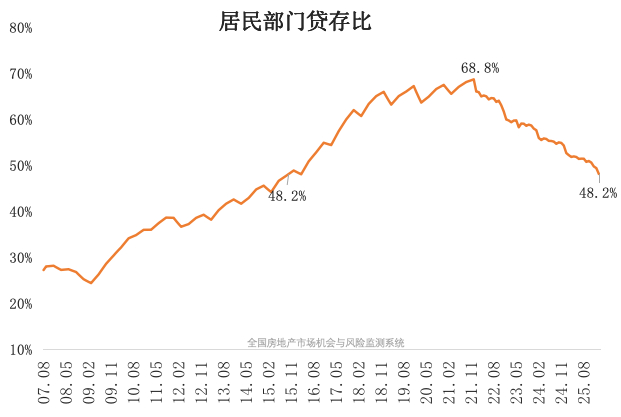

@杨红旭聊房

发表于：2026-04-25 08:53

来源：微博

链接：https://m.weibo.cn/status/5291633520149480

关于老百姓玩钱这件事！

存款热+贷款冷，跌回十年前！

全国居民部门的贷款余额总规模，比上全国居民部门的存款余额规模，这就是贷存比。

贷存比往上走，说明了居民部门投资买房的意愿比存款的意愿更高；贷存比往下走，就说明居民贷款买房的意愿处于下滑状态。

我们可以看到，过去将近 20 年贷存比震荡式上升，最高点出现在 2021 年 12 月，顶峰是将近 69%，之后就开始震荡式往下走了。

今年 2 月降到了 48.2%，相当于回到了 2015 年 10 月，这个走势图正好跟中国楼市的景气度的变化完全一致。

目前全国的房价水平基本上回到了 2016 年初，这个就跟贷存比回归的历史时间节点比较近似。

而从幅度来看，贷存比跌了 30%，房价跌了 40%。所以说这个指标也是我们观察楼市走势变化的一个重要指标。

---

