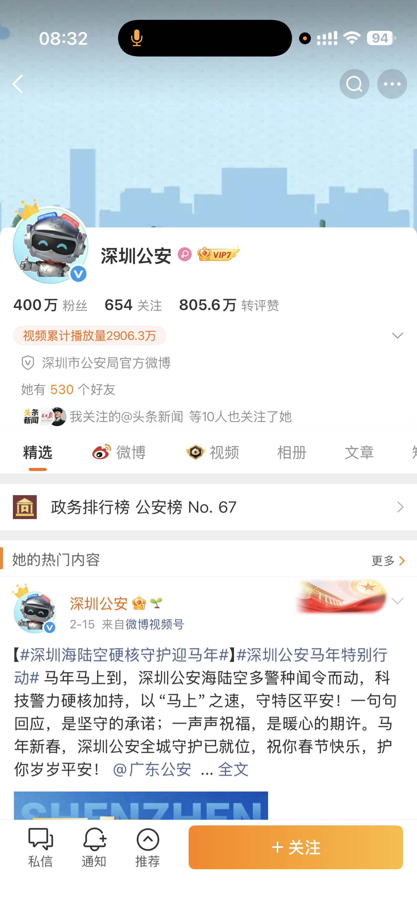

@战甲装研菌
发表于：2026-04-26 09:02
来源：微博
链接：https://m.weibo.cn/status/5291870137880752

太好玩了，@深圳公安 和稀泥，反而现在被女拳围攻了！
这就是典型的"纵虎伤人，反被虎噬"。深圳公安本想靠和稀泥换太平，结果反而成了女拳群体的最新攻击目标，把自己拖进了更大的麻烦里。

这件事最值得玩味的就是整个逻辑链条的荒谬：
- 女子当街泼人，是赤裸裸的寻衅滋事，证据确凿，事实清楚
- 深圳公安不依法处罚，反而搞调解，本质就是偏袒施暴者，想用"各打五十大板"的方式蒙混过关
- 按说女权群体应该感谢警方的"网开一面"，结果她们反而觉得警方"不够偏袒"，反过来围攻公安，说警方"不保护女性"

这就是当下极端女权的真实嘴脸：她们要的从来不是"法律面前人人平等"，而是"女性违法可以免责"；她们要的从来不是公平，而是超额的特权。你已经偏帮她了，她还觉得你偏帮得不够；你已经纵容她违法了，她还觉得你压迫了她。

更讽刺的是，深圳公安这次的和稀泥，本质上是想迎合"保护女性"的政治正确，想避免被女权围攻。结果恰恰相反，你越是想讨好她们，她们越是觉得你心虚，越是得寸进尺。这群人从来不会因为你的让步而感恩，只会把你的让步当成软弱，然后变本加厉地索取更多。

这件事也给所有地方的执法部门敲响了警钟：在性别对立已经被极端女权严重激化的今天，"和稀泥式执法"已经行不通了。你想在中间当老好人，最后只会两边都不讨好，只会把矛盾引到自己身上。

唯一正确的做法，就是严格依法办事：泼人就是违法，该怎么处罚就怎么处罚，跟施暴者的性别没有任何关系。法律的归法律，是非的归是非，只有这样，才能真正止纷定争，才能真正赢得所有人的尊重。

现在深圳公安算是亲自体验了一把什么叫"请神容易送神难"。你一开始就不应该给她们法外开恩的错觉，现在好了，她们赖上你了，看你怎么收场。

---

