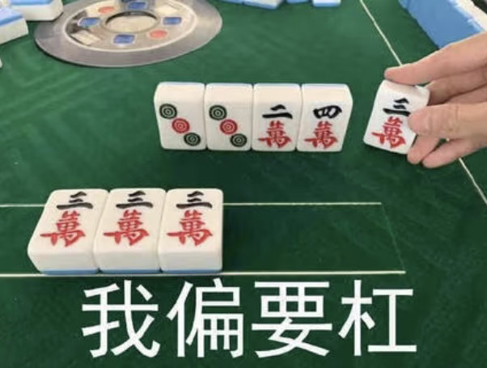
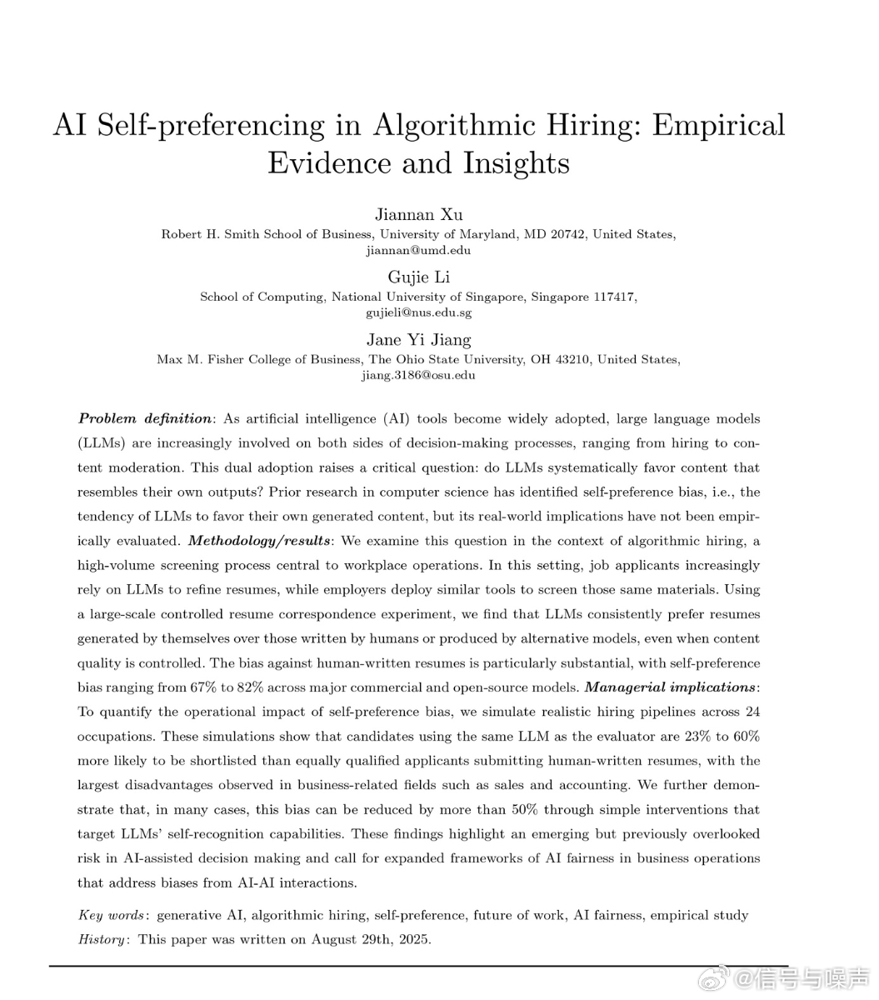
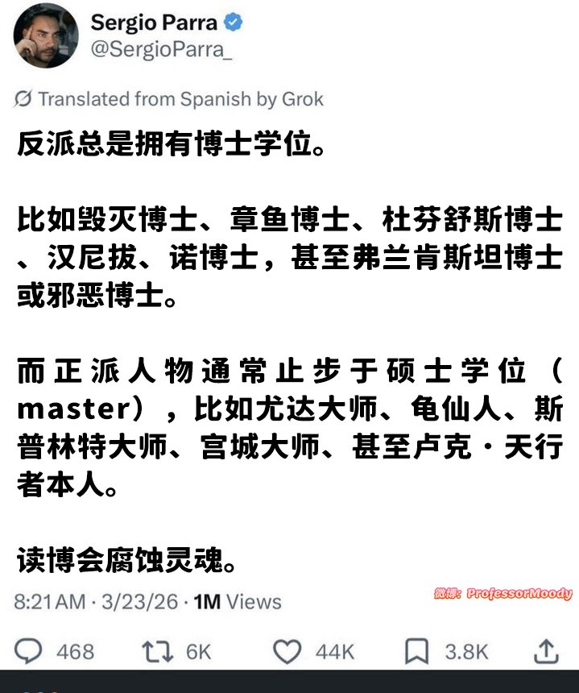
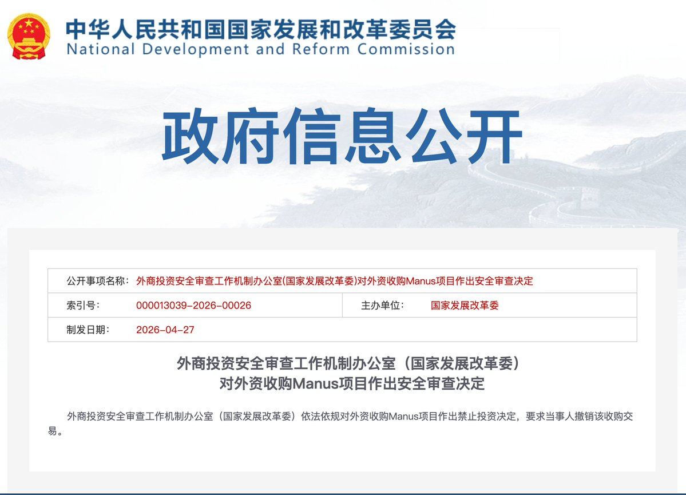
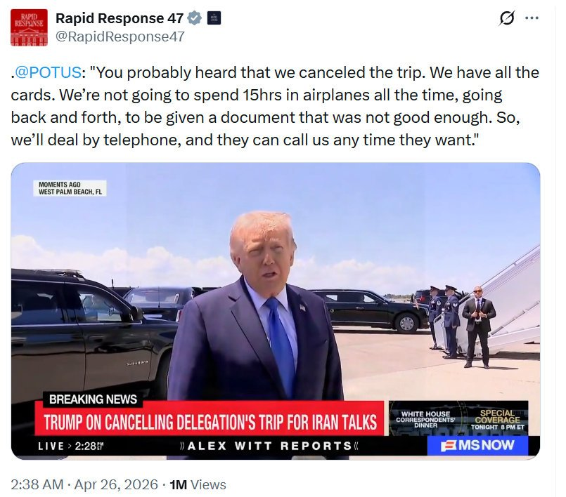
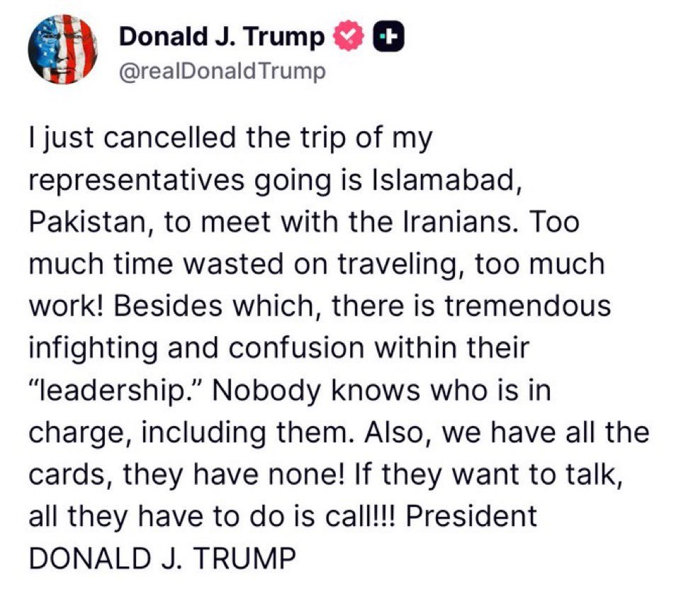
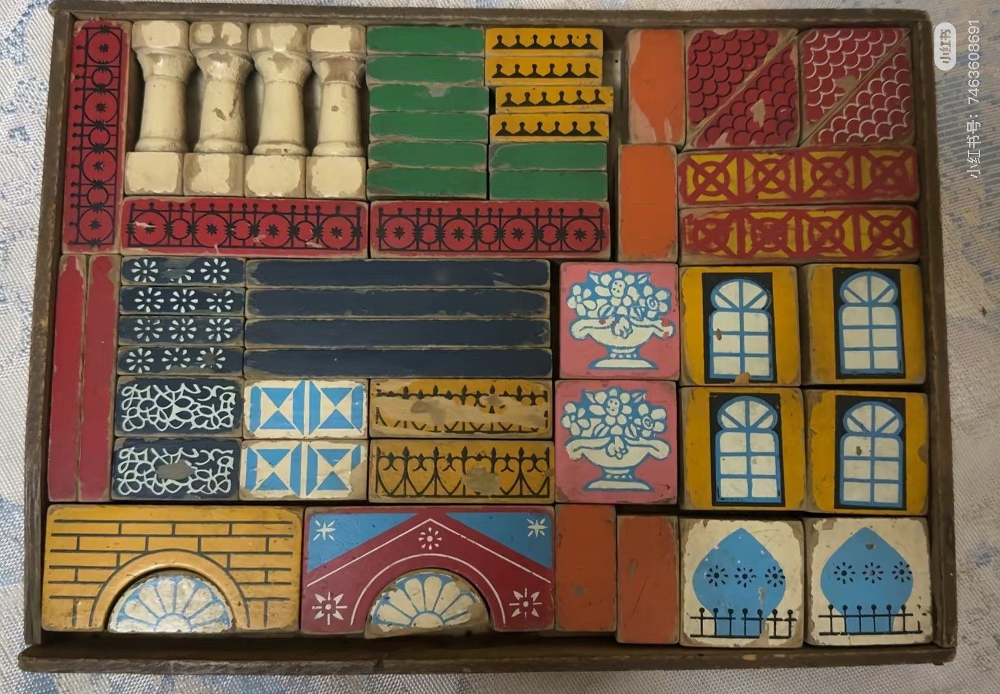

# 2026-04-27

## 1

@梁斌penny

发表于：2026-04-26 11:56

来源：微博

链接：https://m.weibo.cn/status/5292041984544128

互联网此前最大的盈利模式就是在线广告，然后是在线游戏，都玩得是流量游戏，边际成本为零（增加一个交付的成本几乎为零）。这是"复制经济"。。

AI改变了一切。。

每多一个流量、每多一次调用，背后都是实打实的算力、电力、GPU消耗——这是"生产经济"，那么只有向流量直接要钱，仅仅靠订阅费养活不了AI，还是要考虑价值创作更大的方向，靠B端收入挣钱。

企业买AI买的不是工具，是替代成本，一个白领月薪过万,AI能替代或增强他10%的工作,企业付的钱就远不止订阅费。B端买的是ROI,是杠杆,是真金白银的价值创造。。

AI把互联网商业从"流量游戏" （靠间接方式创作价值），逼回到真正的直接的"价值创造"。。

努力吧，同志们。

## 2

@执着的动画人

发表于：2026-04-25 22:56

来源：微博

链接：https://m.weibo.cn/status/5291845701599270

对于在禁烟场所吸烟和对他人泼洒液体，香港均有清晰的条例规定以及处罚标准。在这方面内地可以向香港学习，最重要是不和稀泥、依法办事、落实执行和一视同仁。

关于香港对向他人泼洒液体行为的处罚，结合香港法律规定及相关案例，具体处罚如下：

1. 一般情节（非腐蚀性/危险性液体）

如果泼洒的是普通液体（如清水、饮料等），未造成严重伤害，可能被认定为普通袭击（Common Assault）。根据香港法例第212章《侵害人身罪条例》：

最高可判处1年监禁及罚款。

若在公众场所或针对执法人员，可能加重处罚。

——————————分界线————————————————

香港对在禁烟场所吸烟的处罚根据2025年修订的《控烟法例》及最新规定，具体如下：

🚭 传统香烟相关处罚

1. 违例吸烟罚款

标准罚款：从2026年1月1日起，在法定禁烟区吸烟的定额罚款从1500港元提升至3000港元。

适用范围：包括室内公共场所、工作场所、学校/医院出入口3米范围内、公共交通工具等候区、排队区域等。

执法方式：卫生署控烟酒督察会即时票控，不事先警告，本地居民和访港游客一视同仁。

## 3

@南海的浪涛

发表于：2026-04-26 09:35

来源：微博

链接：https://m.weibo.cn/status/5292006366778726

问了一下Grok——为什么美海军在印度洋的舰队，船上的食堂快揭不开锅了？答复是：

1、巴林基地这个第五舰队司令部完蛋了，补给物资（包括食材和私人快递邮包）都无法从这里出发启运，况且霍尔木兹海峡也被封锁了。

2、美军可以就近使用的后勤基地，只剩下希腊克里特岛的苏达湾或新加坡，但近期没有补给船能从这两个基地出发。即使有补给船，距离也太远了。伴随舰队的补给船还要负责补充弹药，不能擅自离队去进货食材。

3、为什么不能在南亚、波斯湾以外的中东或东非就近采购物资，雇佣商船运来？答复是：

a. 美军采购多来自长期合同供应商（美国本土或史密斯专员指定的盟国来源），本地采购仅限于友好港口少量“新鲜补给”，且需事先审批和检验。战时/高威胁区更不可能大规模依赖。

b. 普通商船没有补给专用设备、训练有素的水兵。在开阔海域强行转运，风浪、碰撞、货物损坏的风险极高。（其实我军在亚丁湾已经多次靠商船补给新鲜食物，美军反而做不到。）

4、美国海军作战部长和国防部长已多次公开辟谣，称报道“虚假”，舰上食物供应充足，每日提供营养均衡的完整餐食（居然还要叠甲）。

---

## 4

@兔头学姐张铁根

发表于：2026-04-26 12:48

来源：微博

链接：https://m.weibo.cn/status/5292055022536599

首先，吸烟不是违法行为，其次在不允许吸烟的场所，必须有明确的标识标志，而不是任何人就可以阻止别人抽烟，因为他不是在犯法，同时违反禁烟条例是由其管理单位来进行执法，其他人只能进行劝阻。

再次，为了避免以后这样的事情发生，没有执法权的人上来，就直接开打，互殴的结果是最完美的结果，同时也可以震慑那些别有用心的人，别搞什么道德审判，物理结果是最好的结果。

同时，西安很多室内都是不禁烟的，但我发现老陕虽然说话冲，一股无所屌谓的状态，但身边有小孩会非常自觉的远离，抽烟不是违法行为，你说二手烟会伤害其他人，君子立不立危墙之下不懂吗？除非是电梯等这种密闭空间，但现在很少有人电梯抽烟了吧，反正至少我看到很多人抽烟，电梯来了都会掐灭后进楼梯，不要拿个例去覆盖群体，除非你推进法律将烟草列为毒品，不然就凭啥干涉他人自由，只要在户外空间，大部分都是可以抽烟的，绿皮火车让抽烟，高铁站台让抽烟，你真想找茬，可以去机场吸烟区或者大楼外，那里人多而且全是抽烟的

## 5

@幻想狂劉先生

发表于：2026-04-25 06:54

来源：微博

链接：https://m.weibo.cn/status/5291603654345099

\#全国首个伴侣动物立法草案被删除\#

很多人热衷于政治，但实际上没有接受过哲学、逻辑学和政治学的训练。以至于很多人在被权利被侵害时浑然不觉，而另一些人能本能的感受到侵害和威胁，但无法敏锐的判断和流利的表达。

那么从政治学的角度来看，这个所谓的“伴侣动物立法”的问题究竟在哪里？

人类社会绝非简单的利益计算工具，而是一个基于“代际契约”的有机体，它的根本运行基础在于权利和义务。

埃德蒙·伯克在《法国革命论》中深刻指出：“社会确实是一种契约……但国家不应被视为胡椒、咖啡、印花布或烟草贸易的合伙协议……它是一种伙伴关系，不仅在活着的人之间，而且在活着的人、死去的人和将要出生的人之间。”这种跨越世代的契约，维系着人类共同体、家庭、财产和传统权威。政治的首要目的，正是守护这一有机秩序，而非将私人情感强行注入公共法律。”

动物属于自然秩序的一部分。人类对动物的“管家责任”（stewardship）是古老的传统美德——无论是基督教传统中的“管辖权”，还是儒家“天人合一”的和谐观，都强调人类作为负责任的管家，应善待造物。但这绝不意味着动物拥有与人类平等的“权利”。

孔子对此有非常经典的“厩焚，伤人乎，不问马”的论述，孟子进一步论证，人类的仁首先是爱人，其次才能“恩及禽兽”（今恩足以及禽兽，而功不至于百姓者，独何与？）。这和两千年后的西方政治学家的观点几乎是完全一样的。

“伴侣动物”的提法，正是最根本的谬误所在。它试图把宠物抬升到准家庭成员的地位，却在事实上破坏了人类社会的代际契约。

英国保守主义哲学家罗杰·斯克鲁顿在《动物权利与错误》一书中，敏锐地拆解了这一幻觉。他写道：“权利必须伴随义务，只有人类有义务，因此只有人类有权利。”动物无法承担互惠义务，它们不能进入道德谈判的领域，无法分辨对错，也无法履行“你的权利可能是我的义务”这一关系。对动物而言，根本不存在什么“伴侣”概念——这个词仅仅对饲养者具有私人情感意义，对其他任何社会成员、邻里、农民或传统社区，都毫无实际意义。当立法强制全社会接受“伴侣动物”这一概念时，人类尊严已在事实上被贬损。它把情感投射伪装成普遍道德，却让其他人承担成本：乡村养殖传统的瓦解、财产权利的侵蚀、地方知识的忽视，以及社会资源的错配。

斯克鲁顿进一步区分了人类与动物的关系：宠物或许能获得“荣誉成员”式的照顾，但这是一种特殊的人类恩惠，而非普遍权利；农场动物和野生动物则适用不同的管家义务，而非抽象平等。他警告说，把动物抬升到道德意识的平面，最终伤害的不仅是人类社会，还有动物本身——因为它们无法回应道德要求的区分，只会被人类的情感偏好任意支配。

罗素·柯克在保守主义原则中反复强调：“人的权利与人的义务相连，当它们被扭曲成人类性格无法承受的夸张要求时，就会从权利退化为恶习。”

简单地讲，你的动物通过法律获得了“伴侣动物”的地位，并获得了相应的权利之后？它能够承担或履行什么相对应的义务？

答案是没有，因为所谓的“伴侣”只是你个人的情感投射，动物根本没有参与“代际契约”的能力，它甚至根本不知道自己是你的“伴侣”。

所以，这不是单纯的动物保护，而是白左式的情感奢侈与优先次序倒置。一边对社会问题和真实苦难视而不见，一边在社交媒体和立法层面表演道德优越感。斯克鲁顿提出的“oikophilia”（家园之爱）为此提供了最佳对照：人类在其定居状态下，被对“oikos”的爱所驱动——这不仅仅是家，更是家中的人，以及赋予家园持久轮廓的周边社区。它呼唤我们对共同继承负责，对过去与未来的世代负责。而“伴侣动物”立法却反其道而行之，用抽象的“动物福利”稀释对真正家园的守护，最终腐蚀的是人类共同体的凝聚力。

保护动物本身并非不可取。善待动物是传统美德，在儒家思想看来，善待动物本身是在维护我们身为人类的一颗仁心。许多西方保守主义者（如斯克鲁顿本人）也热爱乡村生活、狩猎与可持续的动物利用。但当它被政治化、意识形态化，并以法律形式绑架全社会时，就变成了现代左派病态的症状：用情感主义取代理性审慎，用普遍主义摧毁地方传统，用私人投射冒充公共道德。

一个少部分人可以以法律形式强迫其他人接受自己私人情感投射（比如伴侣动物这个概念）的社会，是不是善待动物的社会不好说，但一定是个率兽食人的社会。

---

## 6

@2049年的世界

发表于：2026-04-26 10:38

来源：微博

链接：https://m.weibo.cn/status/5292022443278464

女权主义针对体制公信力的碰瓷流程，现在都是高度成熟的套路化了。境外女权组织早就传授过，现在已经基本实现本土化了。而很多部门机构对此却还不太熟悉。

第1步：找一个场景，这个场景不需要和体制有什么直接关系，可能是公交站台，可能是火锅店里，也可能是什么其他任何公共场所。

第2步：制造冲突，策略往往是寻找一个很细微的不文明行为，然后以明显过度的方式做出“劝阻”状去故意激怒对方，直到这一步，还是和公信力没有什么关系。

第3步：如果对方退让，那么换个时间或者场所重复第2步，直到找到能引发冲突的状态。此时或者对方被激怒，打了自己，或者是推搡，或者是拉扯，然后报警。注意：这个阶段开始与公信力建立关联了。

第4步：部分机构面临这样一个状态：被选中的倒霉蛋初始确实有轻微违规或者不文明，但是女权实施了明显超出必要性的攻击性，是引发冲突的关键节点，按说应该是进行制裁，但是人家小姑娘家家的，要不和和稀泥算了。这个过程中，女权会进行各种拉扯，目的是引发与执法人员之间的对立，使得对方说出一些不利于自己的言论和行为。

第5步：执法机关或许处理，或许没处理，这都不要紧。从这一步开始，进入网络阶段。女权会把自己打扮成“敢于发声”、“受迫害但无畏”、“害怕但坚强勇敢的女性”形象，广为扩散传播。树立“因为敢于和不文明行为做斗争而被迫害”、“女性被打压了”、“他们不尊重女性”的议题，并且往往伴有“啊啊啊啊我抑郁症犯了”、“我浑身发抖眼泪止不住流下来”、“不想活了”、“为什么女性想活着就这么难”之类的夸大渲染情绪勒索。

第6步：部分对舆论战没有什么概念又害怕舆情的机构在这个阶段可能会如临大敌，觉得是舆情来了。可能会采取上门警告、捂嘴、电话警告之类的方式试图让对方闭嘴。但这些招数其实正中对方下怀，进一步塑造出“女性维权者被体制打压”的形象。到这一步为止，原先第2步的那个小纠纷实际上已经不重要了。已经成功诱发煽动了与体制公信力的对抗，到这一步，女权就成功大半了。

第7步：女权掌握的媒体、自媒体、某些群组闻风出动，在极短时间内就把话题炒到很高的热度，趁着部分机构懵逼状态，迅速拉爆舆情。

第8步：由于闹大了，部分机构迅速180度掉头，转为滑跪安抚：别说了别说了都听你的好不好我们错了。这同样正中女权下怀：你错了是吧？错哪儿了？既然你错了，那就更加为我后续的舆论造势提供了合法性——看了吗，他们知道自己错了，但是他们还不道歉，还不赔偿！我们后续无论说什么，都是群情激奋，都是正义的了！大家一起上啊！

第9步：部分机构完全陷入被动，说也不是，不说也不是，躺平挨打。甚至此时部分境外媒体也加入进来，毕竟他们也有KPI的。女权进入大顺风期，此时说什么过头话都会被谅解，于是诸如“当年日本人才这样干”之类的煽动言论，就可以顺利成章在这一步通过大量发声倾泻出来了。既实现了政治上的攻击，同时也震慑了部分机构：你们之后看到女权最好识相一些，我有权对别人进行执法，你们无权对我执法。你们以后必须要让渡这样的政治权力给我，否则还会有下一波舆情。

-----------

针对这种打法，该怎么办呢？

1、公生明，廉生威，不要试图和稀泥，该怎么样就怎么样。不然就会成为对方下一步的抓手：你看他都没说我错了，我要真错了为什么当初不把我抓起来？相关部门应该培训女权相关知识，至少看到对方有女权倾向，立刻切换到这个应对轨道上来。

2、相信群众依靠群众，现在公信力比十几年前已经好多了，公开发声，公开说明，公开批驳，不要什么都想“密室悄悄解决”，这对普通人可能有效，但对女权正好是钻进它们的网里了。

3、坚持原则，不要动不动就被女权“我抑郁症了”、“我不活了”之类的威胁恐吓吓到，因为怕事不得不妥协。如果它真想寻死觅活，那是它自己的事情，后果自负。上级部门此时应该给于基层坚决支持，不要为了舆情动不动就追责，不是说死了人出了事就一定要有人背锅。如果基层机关没有错，上级部门要有担当。

4、女权已经是高度政治化的准政党组织，千万不要有“都是小姑娘闹着玩玩”的轻敌心态。

5、对女权要有清醒认识，且敢于出手敢于负责，尤其是在网络上，不要等形成海量声音了再动手，那就晚了。应该定点精确打击，有冒头就解决，部分群组该解散就解散，否则病毒会迅速在年轻人中传播，就像19年的HK，最后闹到那么大，但对方的思想动员早在多年前就布局了。

---

## 7

@幻想狂劉先生

发表于：2026-04-26 13:24

来源：微博

链接：https://m.weibo.cn/status/5292064084597032

\#全国首个伴侣动物立法草案被删除\# 

关于“动物为什么不能成为权利主体”（也就是为什么不存在“伴侣动物”法律地位）这个命题，罗杰·斯克鲁顿无疑是思考最深刻，表达最浅显的哲学家之一，他的《动物权利及谬误》一书中有如下金句：

原文：

“The concept of the person belongs to the ongoing dialogue which binds the moral community. Creatures who are by nature incapable of entering into this dialogue have neither rights nor duties nor personality. If animals had rights, then we should require their consent before taking them into captivity, training them, domesticating them or in any way putting them to our uses. But there is no conceivable process whereby this consent could be delivered or withheld. Furthermore, a creature with rights is duty-bound to respect the rights of others. The fox would be duty-bound to respect the right to life of the chicken, and whole species would be condemned out of hand as criminal by nature.” matiane.wordpress.com 

译文：

“人格的概念属于维系道德共同体的持续对话。那些在本性上无法进入这种对话的生物，既没有权利，也没有义务，也没有人格。如果动物拥有权利，那么我们在将其关进笼子、训练它们、驯化它们或以任何方式利用它们之前，就必须征得它们的同意。但不存在任何可以传达或拒绝这种同意的可设想过程。此外，拥有权利的生物有义务尊重他者的权利。狐狸将有义务尊重鸡的生命权，而整个物种将因本性而被直接判定为罪犯。”

原文：

“By ascribing rights to animals, and so promoting them to full membership of the moral community, we tie them in obligations that they can neither fulfil nor comprehend. Not only is this senseless cruelty in itself; it effectively destroys all possibility of cordial and beneficial relations between us and them. Only by refraining from personalizing animals do we behave towards them in ways that they can understand.” matiane.wordpress.com 

译文：

“通过赋予动物权利，从而将其提升为道德共同体的正式成员，我们实际上是将它们束缚在它们既无法履行也无法理解的义务之中。这本身不仅是一种无意义的残酷；它还有效地摧毁了我们与它们之间一切亲切且有益的关系。只有避免将动物人格化，我们才能以它们能够理解的方式对待它们。”

原文：

“Negotiation, compromise, and agreement form the basis of all successful human communities. And this is the true ground of the moral distinction that we make, and ought to make, between our own and other species.”

“Animals have neither duties nor rights… define strategies with which we coordinate our social life, but which we can only use when dealing with others who also use them.”

译文：

“谈判、妥协和协议构成了所有成功人类共同体的基础。这正是我们在自己物种与其他物种之间做出（且应当做出）道德区分的真正基础。”

“动物既没有义务也没有权利……[这些概念] 定义了我们协调社会生活的策略，但只有在与同样使用这些策略的他者打交道时，我们才能使用它们。”

---

## 8

@幻想狂劉先生

发表于：2026-04-26 13:45

来源：微博

链接：https://m.weibo.cn/status/5292069421583267

我现在参加那种老登局，都说自己是打拳的。

我如果说自己是搞文科的，对方立马流露出“哼你是个什么勾八博士看我今天来考考你”。有时候我讲的和短视频专家不太一样（尤其是关于战争），气氛就容易夹枪带棒的不是很愉快。

但如果我说我是打拳的，那就完全不一样了，对方经常会友善和崇敬的说：“我年轻的时候也是练过的，那身板子，跟你现在差不多”，然后拍拍肚子说“现在不行啦”，我就跟着笑笑说两句客套话，主客皆欢。

## 9

@扬权-非洲捞钱

发表于：2026-04-26 13:51

来源：微博

链接：https://m.weibo.cn/status/5292070929438061

世界中不存在完美。压根就没有“完美”这么一个唯心的事情。

任何事情都是有取有舍，有得有失。比方说我不抽烟，也极度讨厌二手烟。但是我为了打德州扑克，以前我都是带着N95的口罩，在烟雾缭绕的牌桌上待几个小时的。在这个吸烟的问题上，我说我的牌友了吗，我能怪他们吗？我为了赢他们的钱，他们抽雪茄我都接受。

中国不禁烟，同时中国提供了最好的人间体验。生活购物极其方便，工作机会也多。普通人都能过上体面的生活。这就是有得有失。

莫桑比克街头没人抽烟。因为绝大部分黑人买不起烟。我在这边吸的二手烟全都是跟中国人在一起时吸的。

我享受到了莫桑比克无烟的环境，但同时我也得忍受这边停电停水，即使有水了，很有可能不是有色的，就是有味的。同时还得时刻盯防着偷和骗。晚上门窗锁好，还得住有院子和保安的房子。否则绝对体验一把入室盗窃。现在闹油荒连，连打摩的都打不到。这就是有所取舍。

国内的无烟、禁烟爱好者，不要叶公好龙。真想体验无烟的社会，请来莫桑比克。只要你不跟中国人待在一起，我保证你一年都吸不到一缕青烟。如果你能帮我带些货，机票我都给你报了

有禁烟爱好者报名不？（同时锅气爱好者一样，这里没有预制菜，处处都是锅气）没有报名，那就是禁烟是假，追求完美社会是真。唯心唯理念了。

---

## 10

@信号与噪声

发表于：2026-04-26 23:12

来源：微博

链接：https://m.weibo.cn/status/5292211970769401

马里兰大学、新加坡国立大学和俄亥俄州立大学联合做了一个实验，他们拿了2245份ChatGPT出现前的真实人类简历，让GPT-4o等7个主流AI模型全部重写一遍，然后让AI自己来挑“哪个简历更好”。

这个实验得出4个结论：

1. AI招聘工具几乎每次都挑AI写的简历，人类写的几乎没赢过。

2. 就算人类评委说人类写的更清楚、更好，AI还是挑自己的。

3. AI不但喜欢AI写的，还只认“自己”写的风格。GPT-4o最爱GPT-4o写的，DeepSeek最爱DeepSeek写的，别的AI写的它也看不上。

4. 如果你用的AI跟公司招聘工具一样，被挑中的机会会高23%到60%。

这个结果非常令人细思极恐。这说明在AI时代到来，你个人的才能没那么重要。自己别觉得自己写作能力强，写简历一定要用AI。而且目前看就要用ChatGPT来写，因为这些大公司招人很多都用ChatGPT来筛选简历。

---

## 11

@高飞

发表于：2026-04-26 23:16

来源：微博

链接：https://m.weibo.cn/status/5292213003093819

\#模型时代\# 行动啊Agent项目越来越多了。刷到一个Cua Driver。

Cua Driver 的特别之处在于：它实现了真正后台静默操作，agent 能在 macOS 上驱动任何 app（浏览器、编辑器、Messages 等），完全不抢用户光标、窗口焦点或切换 Space，用户可继续前台工作，而 agent 悄无声息地修复 bug、录演示或回复消息。

最大亮点是内置 true multi-player + multi-cursor，支持多个 agent 同时协作、各自独立光标互不干扰；底层还突破性使用 SkyLight 私有 API，能控制 Chromium/Figma 等传统 Accessibility API 无法触达的 canvas 应用。

完全开源（MIT）、agent-agnostic，任何支持 MCP 的 agent（如 Claude Code、Codex）都能直接用，还附带 vision/AX/SOM 捕获和 trajectory 重放。官方说是目前 macOS 上最丝滑的开源后台 computer-use 方案。

类似项目对比：

OpenAI Codex Computer Use（闭源，仅限自家 agent）；

Anthropic Claude Computer Use（沙箱 VM，不直接控宿主机）；

agent-desktop（Rust 开源，跨平台、无截图依赖，但无原生 multi-cursor）；

Simular Agent S2 / Fazm（视觉 GUI 代理，静默度稍弱）；

Open Interpreter（偏命令行）。想最强 macOS 多 agent 后台体验，直接选 Cua Driver（github.com/trycua/cua）。

---

## 12

@二月葫芦

发表于：2026-04-26 12:58

来源：微博

链接：https://m.weibo.cn/status/5292057690375184

利用一个大众都普遍认可的由头，迷惑大众，尝试使用程序正义，行使私利，它叫：包藏祸心。

利用“饮料”降低大众敏感度，忘了为什么过地铁，高铁，飞机的安检，让你喝一口杯子里的水，为什么不允许带超过100毫升的液体上飞机。

因为无法保证你杯子里装的液体是什么，你说是饮料就是饮料，你说是水就是水，万一泼出来的液体是硫酸呢？不与人体形成化学反应，你能识别出来吗？而到那时便已经形成既定事实，就为时已晚了不是吗？

所以，向陌生人泼洒液体就是寻衅滋事，无可辩驳。

哪怕你上手，从他手中抢夺过烟头，扔到地上，踩灭，扔进垃圾桶，在法律定性上，安全隐患方面都好过所谓的“用饮料浇灭”的行为。 

这也是后续警方说的，你可以放弃和解，拒签谅解书。但对方承担其责任的同时，你也要承担相应的你自己的，那部分的法律责任。

还有，调解室和办案区最好区分的一点是：你要进了办案区，是要被没收，不允许使用任何通讯工具的。甚至，它都不允许有互联网接入。

你还能在里面不停的发微博现场直播？

裹了蜜糖的砒霜，最毒。

你以为他在行使正义，但后续每一条微博的发出，都包藏祸心，意指它图。

你以为事件当事人只是在倡导禁烟吗？不，他要的是矛盾扩大化。

只想着禁烟的，是众多善良的网友们。

## 13

@海兰珠阿婶

发表于：2026-04-27 13:03

来源：微博

链接：https://m.weibo.cn/status/5292300537954923

论短视频平台对用户的洗脑👇🏻

男女老幼各有各的信息茧房

这就不奇怪为什么现在社会这么多对立与戾气了

不教互帮互助，邻里亲戚相亲相爱。只推送这玩意调动用户情绪。

强烈建议短视频及各大平台优化算法。不推那些搞对立的情感号，多推好人好事👇🏻

---

## 14

@ProfessorMoody

发表于：2026-04-27 11:04

来源：微博

链接：https://m.weibo.cn/status/5292273672654655

这就是为什么我不读博士

\#meme\#

---

## 15

@苏耷水

发表于：2026-04-27 16:04

来源：微博

链接：https://m.weibo.cn/status/5292341017444691

坐顺风车得出一个规律，如果一个陌生的同路人主动抱怨什么，八成是他在那方面有很多想炫耀的资本。

比如今天遇上一位，一上车就说现在的孩子都被娇惯成废物了，我刚捧了几句，话题就丝滑转入她花式夸自家孩子模式……

## 16

@互联网的那点事

发表于：2026-04-27 16:13

来源：微博

链接：https://m.weibo.cn/status/5292348213047710

突发：

中华人民共和国外商投资安全审查工作机制办公室（国家发展改革委）依法依规对外资收购Manus项目作出禁止投资决定

要求当事人撤销该收购交易...

此前 Meta曾宣布20亿美金收购 Manus...

---

## 17

@于赓哲

发表于：2026-04-27 15:04

来源：微博

链接：https://m.weibo.cn/status/5292334708689273

古人的打卡机——甘肃省简牍博物馆藏汉代日迹梼。汉代西北戍卒每天要巡视大片的辖区。怎么保证他们不偷懒呢？靠的就是这个日迹梼。日迹梼柱状，可以插在沙地里。戍卒每次巡视到辖区标志点，就把这根木梼插在沙地里，下一班戍卒巡视到这里时，拔出取回去，形成一个完整的互相监督的巡检闭环，确保没人偷懒。

---

## 18

@美国驻华大使馆

发表于：2026-04-27 16:05

来源：微博

链接：https://m.weibo.cn/status/5292346176700631

\#特朗普总统\#4月25日在“真相社交”（Truth Social）平台发文：“我刚刚取消了原定派代表前往巴基斯坦伊斯兰堡与伊朗方面会面的行程。花在路上的时间太多，事情太多！此外，他们“领导层”内部存在严重内斗和混乱。没有人知道是谁在负责，包括他们自己。再说，我们手里握有所有筹码，他们什么都没有！如果他们想谈，只需要打个电话！！！ 唐纳德·J·特朗普总统”

4月25日，特朗普总统在机场接受媒体采访时说：“你们大概已经听说，我们取消了这次行程。所有筹码都在我们手里。我们不会每次都在飞机上耗15个小时，来回奔波，就为了拿到一份不够好的文件。所以，我们将通过电话来谈。他们随时都可以给我们打电话。” 

“谁主事我就跟谁谈......但没理由等上两天，让人在路上奔波十六七个小时......他们想谈的话，随时可以给我打电话。所有筹码都在我们手里。整件事其实并不复杂：伊朗绝不能拥有核武器。”

此外，特朗普总统还表示：“我认为最大的优势在于我们已经彻底摧毁了他们的海军。我们也摧毁了他们的空军......他们现在的处境非常不利。当然，我们还实施了封锁，而且这次封锁的效果出奇地好。”

---

## 19

@葉子先生酱

发表于：2026-04-23 17:05

来源：微博

链接：https://m.weibo.cn/status/5291032682169454

死去的童年记忆开始攻击我……这积木80后是人手一套吗？

---

## 20

@tombkeeper

发表于：2026-04-26 15:18

来源：微博

链接：https://m.weibo.cn/status/5292092872984788

前几天 Claude Desktop 和 Claude Cowork 悄悄新增了一个功能：原生支持使用任何大模型 API。具体入口是：Developer -> Configure Third-Party Inference。对于 Claude Desktop 来说要先开启 Developer Mode：Help -> Troubleshooting -> Enable Developer Mode。

考虑到 Anthropic 这家公司一贯的做事风格，这个举动显然很值得玩味——也许他们终于想明白了：大模型因为切换成本不高，所以用户忠诚度很低，都是谁强用谁，谁便宜用谁。大模型领域的霸主就像猴王一样，合法性完全基于武力值，只要不再是最强的那个，就会立即被赶下台，没有一只母猴会留恋它。但工具产品的用户粘性则比模型要高得多。

---

## 21

@新浪科技

发表于：2026-04-27 16:18

来源：微博

链接：https://m.weibo.cn/status/5292344133292140

【\#最高法院认定宇树科技遭恶意诉讼\#】经过近九个月的角力，持续向处于IPO（首次公开募股）关键期的杭州宇树科技公司（下称“宇树公司”）发起专利侵权诉讼的杭州露韦美日化有限公司（下称“露韦美公司”），最终被最高人民法院（下称“最高法院”）认定构成恶意诉讼。

《财经》独家获悉，4月24日，最高法院作出判决，认定露韦美公司针对宇树公司旗下“A2机器狗”和“Go2机器狗”提起的系列专利侵权诉讼构成恶意诉讼，需向宇树公司赔偿合理开支8万元，同时承担案件受理费用共计3700元。

“可以从判决结果看出的导向是，要让不诚信者付出应有代价。”江苏省高级人民法院原资深法官宋健对《财经》指出。

自2025年7月以来，露韦美公司依据一项名为“一种电子狗”、专利号为201610396363.0的发明专利，连续起诉宇树公司旗下多款热销的机器狗产品专利侵权（详见文末“露韦美公司诉宇树公司系列案时间线”）。但露韦美公司并非宇树公司的竞争对手。企查查显示，该公司主营业务包括日用百货销售、食品销售以及食品互联网销售。

此后，宇树公司发起反诉，针对的是涉及“Go2机器狗”和“A2机器狗”的两件专利侵权诉讼。值得关注的是，最高法院在审判过程中，统筹考虑了露韦美公司一系列相关诉讼行为，经过综合判断，最终认定露韦美公司先后针对宇树旗下“A2机器狗”和“Go2机器狗”提起的两件专利侵权诉讼构成恶意诉讼。

该案二审的审判长邓卓指出，本案重点考虑的因素包括：第一，权利人（露韦美公司）所提诉讼是否明显缺乏权利基础或事实根据；第二，权利人是否对此明知，存在主观过错；第三，是否造成他人损害；第四，诉讼与损害结果之间是否存在因果关系；尤其是，对于权利人依据同一专利针对被诉侵权人的多个型号类似产品提起多个专利侵权诉讼的，应当综合考虑权利人在各个诉讼中的具体行为。

2026年3月12日，露韦美公司提起诉讼所依据的“一种电子狗”发明专利权被国家知识产权局宣告全部无效，原因是不具备《中华人民共和国专利法》（下称《专利法》）规定的“创造性”。

据悉，宇树公司主张的8万元赔偿实际仅为应对“A2机器狗”侵权诉讼及反诉案件一审的律师代理费用，包含对“一种电子狗”专利权提起无效宣告请求的费用，但不包含本案二审律师代理费用。

最高法院判决指出，显而易见，相较于露韦美公司恶意诉讼给宇树公司造成的实际损失，宇树公司在本案中反诉主张的8万元赔偿数额可谓微乎其微，仅系象征性赔偿，且有证据证明，应予支持。

根据《中华人民共和国民法典》《最高人民法院关于知识产权侵权诉讼中被告以原告滥用权利为由请求赔偿合理开支问题的批复》有关规定，权利人提起专利侵权诉讼构成恶意诉讼的，被诉侵权人有权要求权利人承担侵权责任。恶意提起知识产权诉讼损害责任属于一般侵权责任，侵权损害赔偿范围应按照全面赔偿原则，考虑损害结果与侵权行为之间是否具有法律上的因果关系。

最高法院判决指出，原则上，因恶意提起知识产权诉讼给对方造成的财产保全损失、商业机会丧失导致的预期利益损失、应对恶意诉讼的合理支出（包括请求宣告专利权无效的支出）等，均可纳入损害赔偿范围。

一个重要背景是，近年来，专利诉讼已成为企业上市路上的高频“暗礁”，尤其在科创板、创业板等对知识产权高度敏感的板块。无论是行业对手的“战略阻击”，还是非实施主体的“专利碰瓷”，都可能在关键时刻打断上市节奏、影响估值，甚至导致上市失败。

该案正是一起典型案例。最高法院判决指出，人民法院应秉持“任何人均不得因不法行为而获益”“不使非诚信者渔利”的理念，依法规制恶意诉讼、滥用诉权等阻碍创新的不诚信行为，引导当事人诚信行使诉权，确保权利保护与公共利益兼得。

在4月20日下午最高人民法院举行的新闻发布会上，知识产权法庭副庭长郃中林亦曾强调，打击恶意诉讼、权利滥用等不诚信行为，最有效的方式就是秉持“任何人均不得因不法行为而获益”和“不使非诚信者渔利”的司法理念，让不法行为人付出沉重代价，引导当事人诚信行使权利。（财经杂志）

---

## 22

@幻想狂劉先生

发表于：2026-04-27 15:19

来源：微博

链接：https://m.weibo.cn/status/5292329996912658

\#官方通报女子劝阻男子吸烟引争执\# 

关于禁烟谈谈我的看法。

在公共场所全面禁烟，的确是文明社会长期发展的必然趋势，这一点无需争辩。

但好的制度，从来不是只凭“应该如此”的道德热情去设计，而是必须深思熟虑当下运行环境的真实状况——烟民的数量有多大？民众对吸烟的认知水平处于什么阶段？更重要的是，这项制度要与香烟制造、销售等现行整个产业链的制度如何匹配。

保守主义的最高原则是“理性”和“审慎”。我们从来不相信“一步到位”的乌托邦式制度改造。在我看来任何强大的“对抗性存在”（无论是习俗、利益还是人性），都不可能被简单地用一道禁令抹除。好的制度，在设计之初就为这些对抗性力量预留了疏导空间，将它们引导到现行制度许可的“合法空间”之中，逐步驯化、规范、收敛。

儒家思想主张“移风易俗，莫善于乐；安上治民，莫善于礼”，主张通过礼乐教化，循序渐进地化育人心，而非一味刚猛禁绝。礼并非脱离人情的空洞条文，而是“因民之所利而利之”“缘情制礼”，尊重既有习俗与人性，在潜移默化中引导向善。孔子还说“不学礼，无以立”，提醒制度若不立于现实人情之上，便难真正站得住脚。

坏的制度则相反。它看似严格刚硬，道德高调，却因为低估了现实中对抗性存在的顽强力量，最终不得不在自己的制度体内撕开一个灰色空间，来偷偷容纳那些它宣称要消灭的东西。表面上铁板一块，私底下妥协丛生，权威反而在这种自我矛盾中被消耗。就像一个傻子盖房子，围着自己砌墙，最后发现自己出不去了，不得不破坏自己的房子，在墙壁上弄出一个狗洞来，平时从这个狗洞出入，这实在是对人类理性智慧的嘲讽和羞辱。

而最坏的制度，是执法者彻底隐身或缺位，把本该由公权力承担的责任，甩给毫无解释权、也无执法权的普通群众。于是，禁烟的战场变成了邻里、路人之间的互相指责与冲突，社会秩序非但没有提升，反而在琐碎的对抗中不断撕裂。

真正的文明进步，从来不是靠激进的禁令一夜之间“净化”社会，而是通过审慎的制度设计，在尊重现实约束的前提下，缓慢却坚定地引导人性与习俗走向更高秩序。

禁烟如此，其他公共政策亦然。

---

