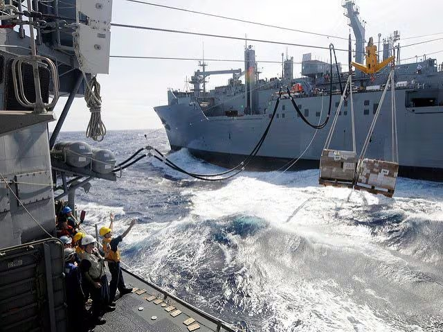
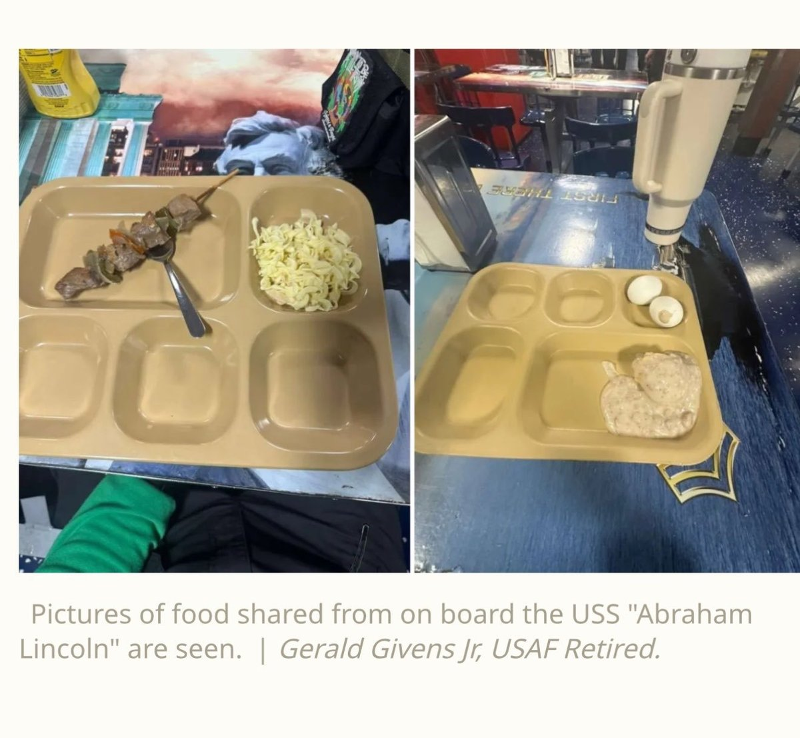
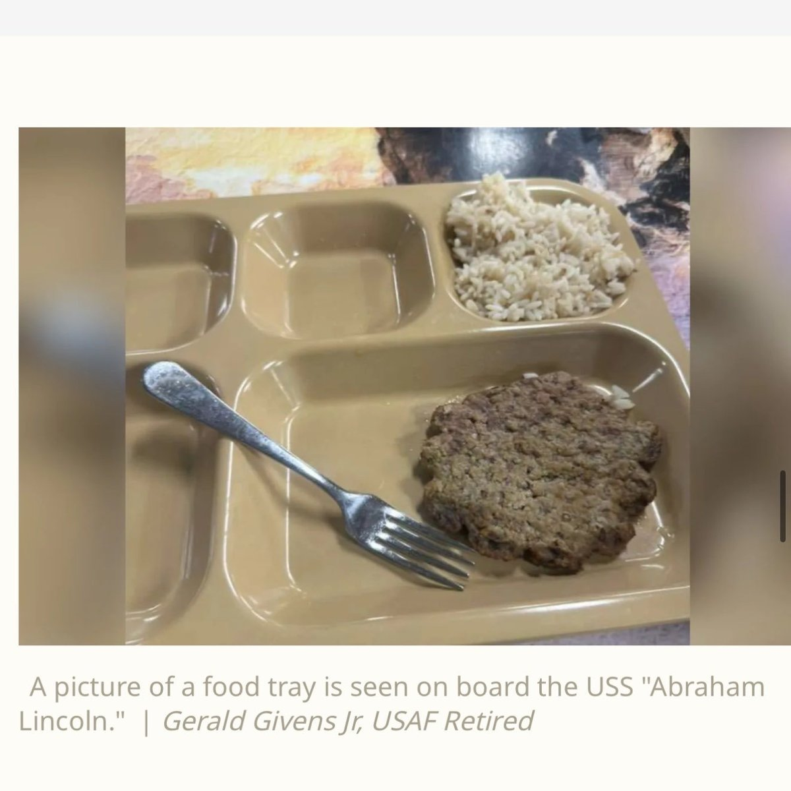

@南海的浪涛

发表于：2026-04-26 09:35

来源：微博

链接：https://m.weibo.cn/status/5292006366778726

问了一下Grok——为什么美海军在印度洋的舰队，船上的食堂快揭不开锅了？答复是：

1、巴林基地这个第五舰队司令部完蛋了，补给物资（包括食材和私人快递邮包）都无法从这里出发启运，况且霍尔木兹海峡也被封锁了。

2、美军可以就近使用的后勤基地，只剩下希腊克里特岛的苏达湾或新加坡，但近期没有补给船能从这两个基地出发。即使有补给船，距离也太远了。伴随舰队的补给船还要负责补充弹药，不能擅自离队去进货食材。

3、为什么不能在南亚、波斯湾以外的中东或东非就近采购物资，雇佣商船运来？答复是：

a. 美军采购多来自长期合同供应商（美国本土或史密斯专员指定的盟国来源），本地采购仅限于友好港口少量“新鲜补给”，且需事先审批和检验。战时/高威胁区更不可能大规模依赖。

b. 普通商船没有补给专用设备、训练有素的水兵。在开阔海域强行转运，风浪、碰撞、货物损坏的风险极高。（其实我军在亚丁湾已经多次靠商船补给新鲜食物，美军反而做不到。）

4、美国海军作战部长和国防部长已多次公开辟谣，称报道“虚假”，舰上食物供应充足，每日提供营养均衡的完整餐食（居然还要叠甲）。

---

