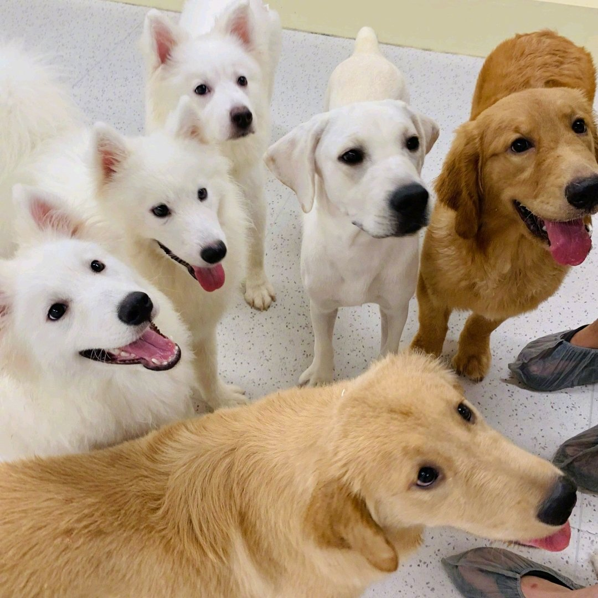

@幻想狂劉先生

发表于：2026-04-25 06:54

来源：微博

链接：https://m.weibo.cn/status/5291603654345099

\#全国首个伴侣动物立法草案被删除\#

很多人热衷于政治，但实际上没有接受过哲学、逻辑学和政治学的训练。以至于很多人在被权利被侵害时浑然不觉，而另一些人能本能的感受到侵害和威胁，但无法敏锐的判断和流利的表达。

那么从政治学的角度来看，这个所谓的“伴侣动物立法”的问题究竟在哪里？

人类社会绝非简单的利益计算工具，而是一个基于“代际契约”的有机体，它的根本运行基础在于权利和义务。

埃德蒙·伯克在《法国革命论》中深刻指出：“社会确实是一种契约……但国家不应被视为胡椒、咖啡、印花布或烟草贸易的合伙协议……它是一种伙伴关系，不仅在活着的人之间，而且在活着的人、死去的人和将要出生的人之间。”这种跨越世代的契约，维系着人类共同体、家庭、财产和传统权威。政治的首要目的，正是守护这一有机秩序，而非将私人情感强行注入公共法律。”

动物属于自然秩序的一部分。人类对动物的“管家责任”（stewardship）是古老的传统美德——无论是基督教传统中的“管辖权”，还是儒家“天人合一”的和谐观，都强调人类作为负责任的管家，应善待造物。但这绝不意味着动物拥有与人类平等的“权利”。

孔子对此有非常经典的“厩焚，伤人乎，不问马”的论述，孟子进一步论证，人类的仁首先是爱人，其次才能“恩及禽兽”（今恩足以及禽兽，而功不至于百姓者，独何与？）。这和两千年后的西方政治学家的观点几乎是完全一样的。

“伴侣动物”的提法，正是最根本的谬误所在。它试图把宠物抬升到准家庭成员的地位，却在事实上破坏了人类社会的代际契约。

英国保守主义哲学家罗杰·斯克鲁顿在《动物权利与错误》一书中，敏锐地拆解了这一幻觉。他写道：“权利必须伴随义务，只有人类有义务，因此只有人类有权利。”动物无法承担互惠义务，它们不能进入道德谈判的领域，无法分辨对错，也无法履行“你的权利可能是我的义务”这一关系。对动物而言，根本不存在什么“伴侣”概念——这个词仅仅对饲养者具有私人情感意义，对其他任何社会成员、邻里、农民或传统社区，都毫无实际意义。当立法强制全社会接受“伴侣动物”这一概念时，人类尊严已在事实上被贬损。它把情感投射伪装成普遍道德，却让其他人承担成本：乡村养殖传统的瓦解、财产权利的侵蚀、地方知识的忽视，以及社会资源的错配。

斯克鲁顿进一步区分了人类与动物的关系：宠物或许能获得“荣誉成员”式的照顾，但这是一种特殊的人类恩惠，而非普遍权利；农场动物和野生动物则适用不同的管家义务，而非抽象平等。他警告说，把动物抬升到道德意识的平面，最终伤害的不仅是人类社会，还有动物本身——因为它们无法回应道德要求的区分，只会被人类的情感偏好任意支配。

罗素·柯克在保守主义原则中反复强调：“人的权利与人的义务相连，当它们被扭曲成人类性格无法承受的夸张要求时，就会从权利退化为恶习。”

简单地讲，你的动物通过法律获得了“伴侣动物”的地位，并获得了相应的权利之后？它能够承担或履行什么相对应的义务？

答案是没有，因为所谓的“伴侣”只是你个人的情感投射，动物根本没有参与“代际契约”的能力，它甚至根本不知道自己是你的“伴侣”。

所以，这不是单纯的动物保护，而是白左式的情感奢侈与优先次序倒置。一边对社会问题和真实苦难视而不见，一边在社交媒体和立法层面表演道德优越感。斯克鲁顿提出的“oikophilia”（家园之爱）为此提供了最佳对照：人类在其定居状态下，被对“oikos”的爱所驱动——这不仅仅是家，更是家中的人，以及赋予家园持久轮廓的周边社区。它呼唤我们对共同继承负责，对过去与未来的世代负责。而“伴侣动物”立法却反其道而行之，用抽象的“动物福利”稀释对真正家园的守护，最终腐蚀的是人类共同体的凝聚力。

保护动物本身并非不可取。善待动物是传统美德，在儒家思想看来，善待动物本身是在维护我们身为人类的一颗仁心。许多西方保守主义者（如斯克鲁顿本人）也热爱乡村生活、狩猎与可持续的动物利用。但当它被政治化、意识形态化，并以法律形式绑架全社会时，就变成了现代左派病态的症状：用情感主义取代理性审慎，用普遍主义摧毁地方传统，用私人投射冒充公共道德。

一个少部分人可以以法律形式强迫其他人接受自己私人情感投射（比如伴侣动物这个概念）的社会，是不是善待动物的社会不好说，但一定是个率兽食人的社会。

---

