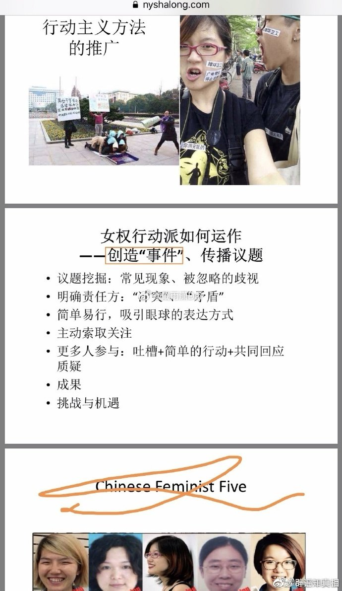

@2049年的世界

发表于：2026-04-26 10:38

来源：微博

链接：https://m.weibo.cn/status/5292022443278464

女权主义针对体制公信力的碰瓷流程，现在都是高度成熟的套路化了。境外女权组织早就传授过，现在已经基本实现本土化了。而很多部门机构对此却还不太熟悉。

第1步：找一个场景，这个场景不需要和体制有什么直接关系，可能是公交站台，可能是火锅店里，也可能是什么其他任何公共场所。

第2步：制造冲突，策略往往是寻找一个很细微的不文明行为，然后以明显过度的方式做出“劝阻”状去故意激怒对方，直到这一步，还是和公信力没有什么关系。

第3步：如果对方退让，那么换个时间或者场所重复第2步，直到找到能引发冲突的状态。此时或者对方被激怒，打了自己，或者是推搡，或者是拉扯，然后报警。注意：这个阶段开始与公信力建立关联了。

第4步：部分机构面临这样一个状态：被选中的倒霉蛋初始确实有轻微违规或者不文明，但是女权实施了明显超出必要性的攻击性，是引发冲突的关键节点，按说应该是进行制裁，但是人家小姑娘家家的，要不和和稀泥算了。这个过程中，女权会进行各种拉扯，目的是引发与执法人员之间的对立，使得对方说出一些不利于自己的言论和行为。

第5步：执法机关或许处理，或许没处理，这都不要紧。从这一步开始，进入网络阶段。女权会把自己打扮成“敢于发声”、“受迫害但无畏”、“害怕但坚强勇敢的女性”形象，广为扩散传播。树立“因为敢于和不文明行为做斗争而被迫害”、“女性被打压了”、“他们不尊重女性”的议题，并且往往伴有“啊啊啊啊我抑郁症犯了”、“我浑身发抖眼泪止不住流下来”、“不想活了”、“为什么女性想活着就这么难”之类的夸大渲染情绪勒索。

第6步：部分对舆论战没有什么概念又害怕舆情的机构在这个阶段可能会如临大敌，觉得是舆情来了。可能会采取上门警告、捂嘴、电话警告之类的方式试图让对方闭嘴。但这些招数其实正中对方下怀，进一步塑造出“女性维权者被体制打压”的形象。到这一步为止，原先第2步的那个小纠纷实际上已经不重要了。已经成功诱发煽动了与体制公信力的对抗，到这一步，女权就成功大半了。

第7步：女权掌握的媒体、自媒体、某些群组闻风出动，在极短时间内就把话题炒到很高的热度，趁着部分机构懵逼状态，迅速拉爆舆情。

第8步：由于闹大了，部分机构迅速180度掉头，转为滑跪安抚：别说了别说了都听你的好不好我们错了。这同样正中女权下怀：你错了是吧？错哪儿了？既然你错了，那就更加为我后续的舆论造势提供了合法性——看了吗，他们知道自己错了，但是他们还不道歉，还不赔偿！我们后续无论说什么，都是群情激奋，都是正义的了！大家一起上啊！

第9步：部分机构完全陷入被动，说也不是，不说也不是，躺平挨打。甚至此时部分境外媒体也加入进来，毕竟他们也有KPI的。女权进入大顺风期，此时说什么过头话都会被谅解，于是诸如“当年日本人才这样干”之类的煽动言论，就可以顺利成章在这一步通过大量发声倾泻出来了。既实现了政治上的攻击，同时也震慑了部分机构：你们之后看到女权最好识相一些，我有权对别人进行执法，你们无权对我执法。你们以后必须要让渡这样的政治权力给我，否则还会有下一波舆情。

-----------

针对这种打法，该怎么办呢？

1、公生明，廉生威，不要试图和稀泥，该怎么样就怎么样。不然就会成为对方下一步的抓手：你看他都没说我错了，我要真错了为什么当初不把我抓起来？相关部门应该培训女权相关知识，至少看到对方有女权倾向，立刻切换到这个应对轨道上来。

2、相信群众依靠群众，现在公信力比十几年前已经好多了，公开发声，公开说明，公开批驳，不要什么都想“密室悄悄解决”，这对普通人可能有效，但对女权正好是钻进它们的网里了。

3、坚持原则，不要动不动就被女权“我抑郁症了”、“我不活了”之类的威胁恐吓吓到，因为怕事不得不妥协。如果它真想寻死觅活，那是它自己的事情，后果自负。上级部门此时应该给于基层坚决支持，不要为了舆情动不动就追责，不是说死了人出了事就一定要有人背锅。如果基层机关没有错，上级部门要有担当。

4、女权已经是高度政治化的准政党组织，千万不要有“都是小姑娘闹着玩玩”的轻敌心态。

5、对女权要有清醒认识，且敢于出手敢于负责，尤其是在网络上，不要等形成海量声音了再动手，那就晚了。应该定点精确打击，有冒头就解决，部分群组该解散就解散，否则病毒会迅速在年轻人中传播，就像19年的HK，最后闹到那么大，但对方的思想动员早在多年前就布局了。

---

