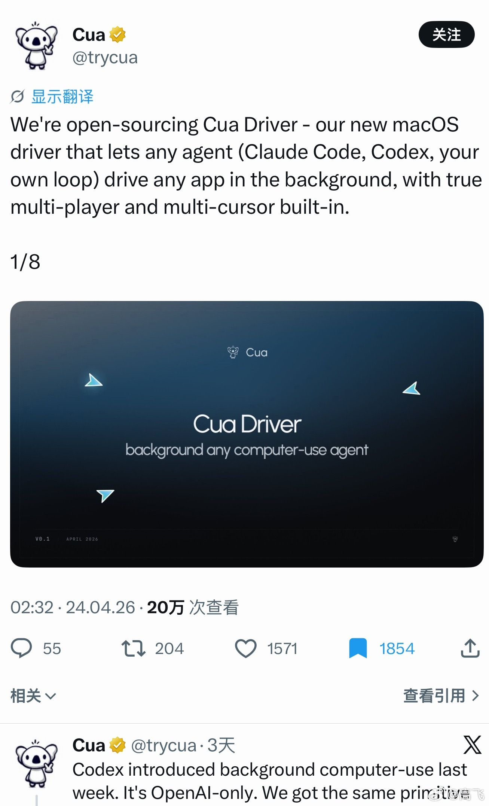

@高飞
发表于：2026-04-26 23:16
来源：微博
链接：https://m.weibo.cn/status/5292213003093819

\#模型时代\# 行动啊Agent项目越来越多了。刷到一个Cua Driver。

Cua Driver 的特别之处在于：它实现了真正后台静默操作，agent 能在 macOS 上驱动任何 app（浏览器、编辑器、Messages 等），完全不抢用户光标、窗口焦点或切换 Space，用户可继续前台工作，而 agent 悄无声息地修复 bug、录演示或回复消息。

最大亮点是内置 true multi-player + multi-cursor，支持多个 agent 同时协作、各自独立光标互不干扰；底层还突破性使用 SkyLight 私有 API，能控制 Chromium/Figma 等传统 Accessibility API 无法触达的 canvas 应用。

完全开源（MIT）、agent-agnostic，任何支持 MCP 的 agent（如 Claude Code、Codex）都能直接用，还附带 vision/AX/SOM 捕获和 trajectory 重放。官方说是目前 macOS 上最丝滑的开源后台 computer-use 方案。

类似项目对比：
OpenAI Codex Computer Use（闭源，仅限自家 agent）；
Anthropic Claude Computer Use（沙箱 VM，不直接控宿主机）；
agent-desktop（Rust 开源，跨平台、无截图依赖，但无原生 multi-cursor）；
Simular Agent S2 / Fazm（视觉 GUI 代理，静默度稍弱）；
Open Interpreter（偏命令行）。想最强 macOS 多 agent 后台体验，直接选 Cua Driver（github.com/trycua/cua）。

---

