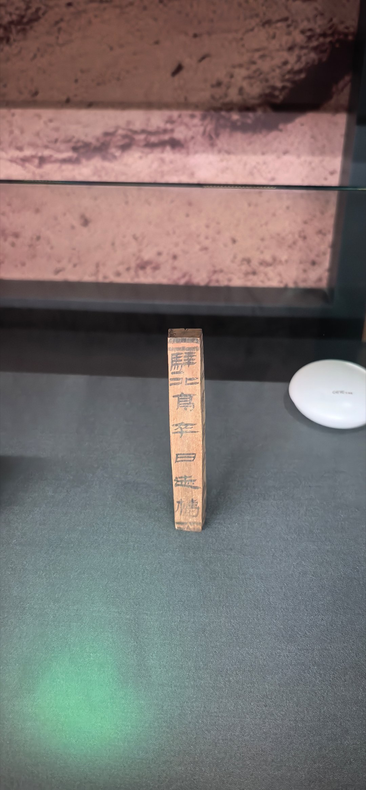

@于赓哲

发表于：2026-04-27 15:04

来源：微博

链接：https://m.weibo.cn/status/5292334708689273

古人的打卡机——甘肃省简牍博物馆藏汉代日迹梼。汉代西北戍卒每天要巡视大片的辖区。怎么保证他们不偷懒呢？靠的就是这个日迹梼。日迹梼柱状，可以插在沙地里。戍卒每次巡视到辖区标志点，就把这根木梼插在沙地里，下一班戍卒巡视到这里时，拔出取回去，形成一个完整的互相监督的巡检闭环，确保没人偷懒。

---

