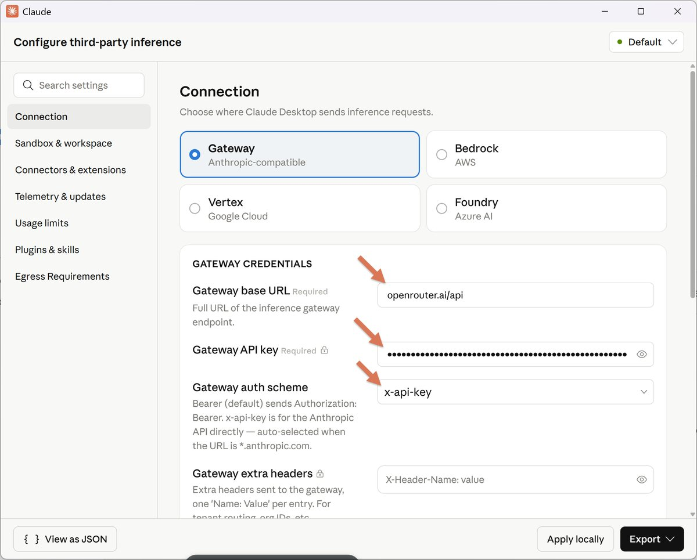

@tombkeeper

发表于：2026-04-26 15:18

来源：微博

链接：https://m.weibo.cn/status/5292092872984788

前几天 Claude Desktop 和 Claude Cowork 悄悄新增了一个功能：原生支持使用任何大模型 API。具体入口是：Developer -> Configure Third-Party Inference。对于 Claude Desktop 来说要先开启 Developer Mode：Help -> Troubleshooting -> Enable Developer Mode。

考虑到 Anthropic 这家公司一贯的做事风格，这个举动显然很值得玩味——也许他们终于想明白了：大模型因为切换成本不高，所以用户忠诚度很低，都是谁强用谁，谁便宜用谁。大模型领域的霸主就像猴王一样，合法性完全基于武力值，只要不再是最强的那个，就会立即被赶下台，没有一只母猴会留恋它。但工具产品的用户粘性则比模型要高得多。

---

