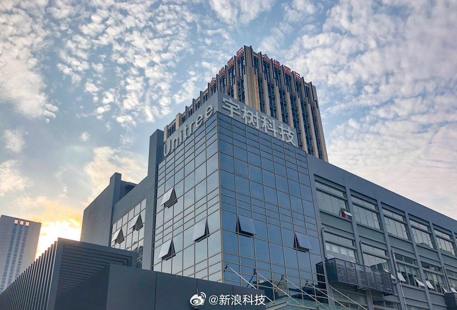

@新浪科技
发表于：2026-04-27 16:18
来源：微博
链接：https://m.weibo.cn/status/5292344133292140

【\#最高法院认定宇树科技遭恶意诉讼\#】经过近九个月的角力，持续向处于IPO（首次公开募股）关键期的杭州宇树科技公司（下称“宇树公司”）发起专利侵权诉讼的杭州露韦美日化有限公司（下称“露韦美公司”），最终被最高人民法院（下称“最高法院”）认定构成恶意诉讼。

《财经》独家获悉，4月24日，最高法院作出判决，认定露韦美公司针对宇树公司旗下“A2机器狗”和“Go2机器狗”提起的系列专利侵权诉讼构成恶意诉讼，需向宇树公司赔偿合理开支8万元，同时承担案件受理费用共计3700元。

“可以从判决结果看出的导向是，要让不诚信者付出应有代价。”江苏省高级人民法院原资深法官宋健对《财经》指出。

自2025年7月以来，露韦美公司依据一项名为“一种电子狗”、专利号为201610396363.0的发明专利，连续起诉宇树公司旗下多款热销的机器狗产品专利侵权（详见文末“露韦美公司诉宇树公司系列案时间线”）。但露韦美公司并非宇树公司的竞争对手。企查查显示，该公司主营业务包括日用百货销售、食品销售以及食品互联网销售。

此后，宇树公司发起反诉，针对的是涉及“Go2机器狗”和“A2机器狗”的两件专利侵权诉讼。值得关注的是，最高法院在审判过程中，统筹考虑了露韦美公司一系列相关诉讼行为，经过综合判断，最终认定露韦美公司先后针对宇树旗下“A2机器狗”和“Go2机器狗”提起的两件专利侵权诉讼构成恶意诉讼。

该案二审的审判长邓卓指出，本案重点考虑的因素包括：第一，权利人（露韦美公司）所提诉讼是否明显缺乏权利基础或事实根据；第二，权利人是否对此明知，存在主观过错；第三，是否造成他人损害；第四，诉讼与损害结果之间是否存在因果关系；尤其是，对于权利人依据同一专利针对被诉侵权人的多个型号类似产品提起多个专利侵权诉讼的，应当综合考虑权利人在各个诉讼中的具体行为。

2026年3月12日，露韦美公司提起诉讼所依据的“一种电子狗”发明专利权被国家知识产权局宣告全部无效，原因是不具备《中华人民共和国专利法》（下称《专利法》）规定的“创造性”。

据悉，宇树公司主张的8万元赔偿实际仅为应对“A2机器狗”侵权诉讼及反诉案件一审的律师代理费用，包含对“一种电子狗”专利权提起无效宣告请求的费用，但不包含本案二审律师代理费用。

最高法院判决指出，显而易见，相较于露韦美公司恶意诉讼给宇树公司造成的实际损失，宇树公司在本案中反诉主张的8万元赔偿数额可谓微乎其微，仅系象征性赔偿，且有证据证明，应予支持。

根据《中华人民共和国民法典》《最高人民法院关于知识产权侵权诉讼中被告以原告滥用权利为由请求赔偿合理开支问题的批复》有关规定，权利人提起专利侵权诉讼构成恶意诉讼的，被诉侵权人有权要求权利人承担侵权责任。恶意提起知识产权诉讼损害责任属于一般侵权责任，侵权损害赔偿范围应按照全面赔偿原则，考虑损害结果与侵权行为之间是否具有法律上的因果关系。

最高法院判决指出，原则上，因恶意提起知识产权诉讼给对方造成的财产保全损失、商业机会丧失导致的预期利益损失、应对恶意诉讼的合理支出（包括请求宣告专利权无效的支出）等，均可纳入损害赔偿范围。

一个重要背景是，近年来，专利诉讼已成为企业上市路上的高频“暗礁”，尤其在科创板、创业板等对知识产权高度敏感的板块。无论是行业对手的“战略阻击”，还是非实施主体的“专利碰瓷”，都可能在关键时刻打断上市节奏、影响估值，甚至导致上市失败。

该案正是一起典型案例。最高法院判决指出，人民法院应秉持“任何人均不得因不法行为而获益”“不使非诚信者渔利”的理念，依法规制恶意诉讼、滥用诉权等阻碍创新的不诚信行为，引导当事人诚信行使诉权，确保权利保护与公共利益兼得。

在4月20日下午最高人民法院举行的新闻发布会上，知识产权法庭副庭长郃中林亦曾强调，打击恶意诉讼、权利滥用等不诚信行为，最有效的方式就是秉持“任何人均不得因不法行为而获益”和“不使非诚信者渔利”的司法理念，让不法行为人付出沉重代价，引导当事人诚信行使权利。（财经杂志）

---

