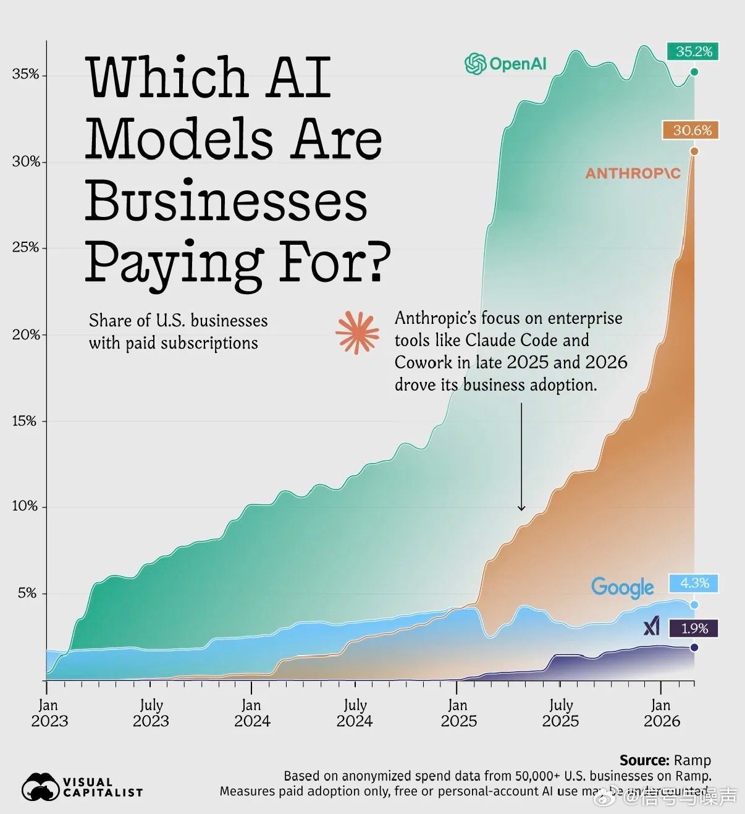
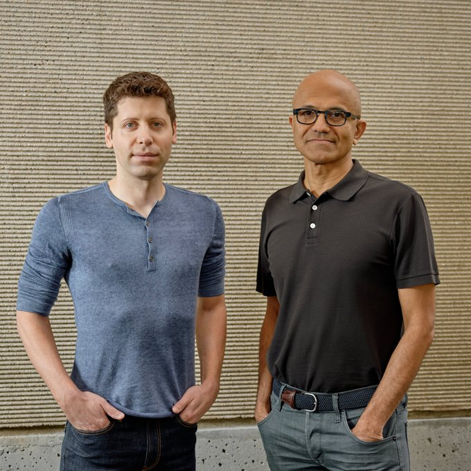
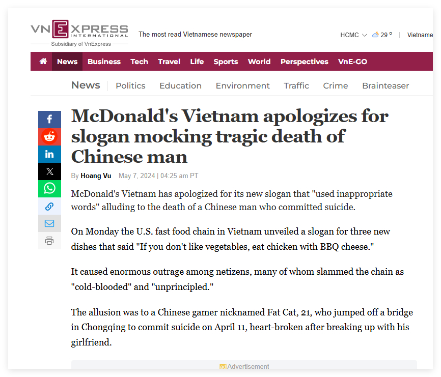
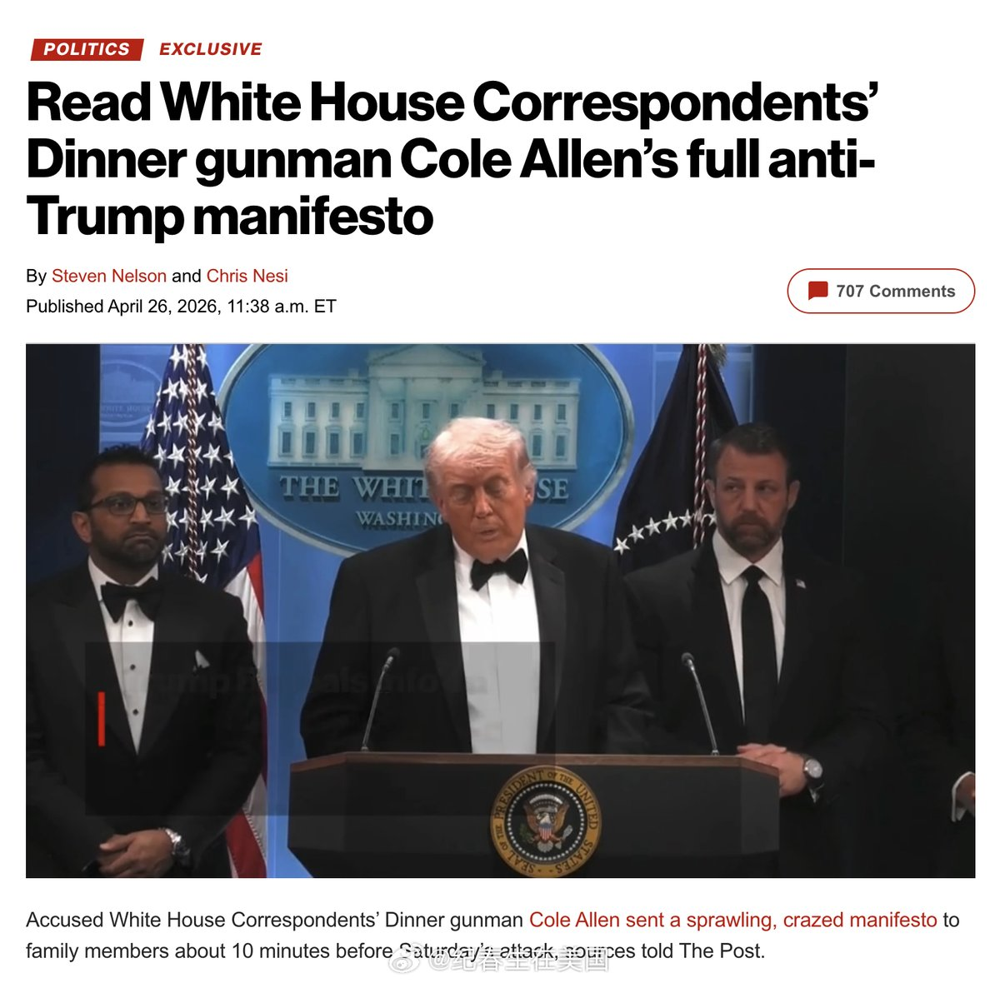
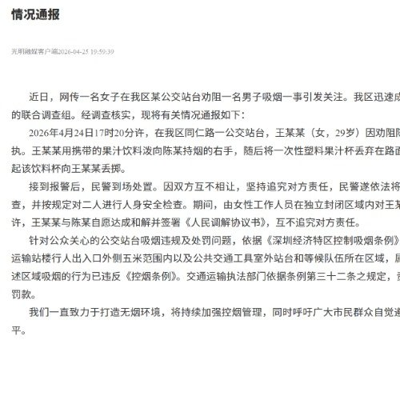
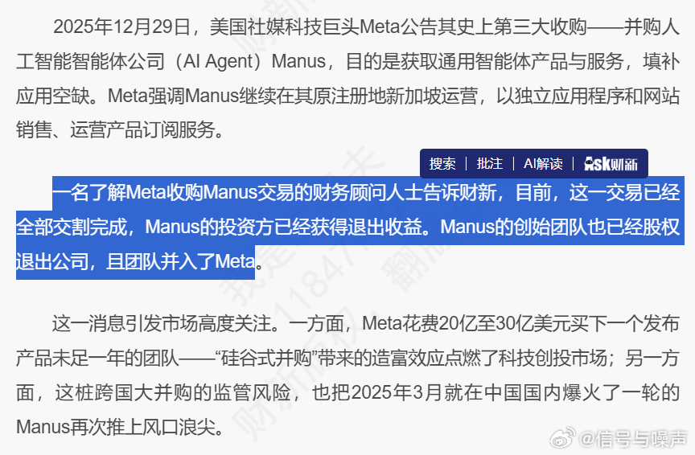
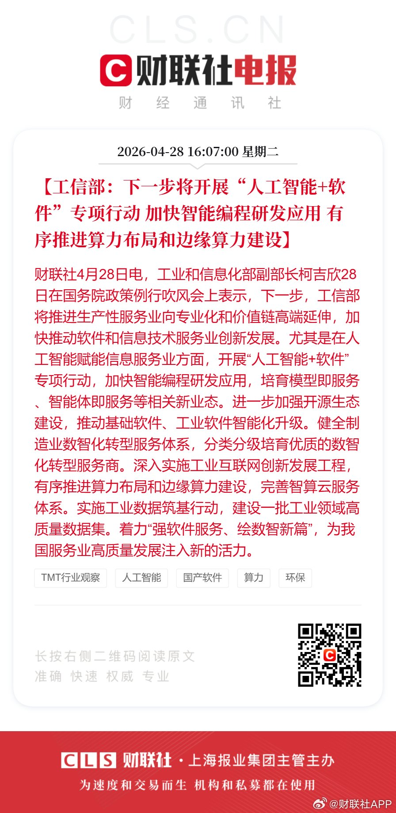

# 2026-04-28

## 1

@奥卡姆剃刀

发表于：2026-04-27 13:21

来源：微博

链接：https://m.weibo.cn/status/5292425694155479

几年前，我在家乡城市的一条河边风景道晨跑，遇到五六只野狗，它们不怀好意地盯着我，试探性地尾随。

我懂得，野狗聚堆后就会爆发捕猎天性，我是被盯上了。

于是我故意做出一些虚张声势的举动，例如张开双臂大声吼叫，好在它们放弃了我。

当时我拍下了这几条狗的照片，随后发了微博，说了这件事，有很多网友回复讨论。

不久就接到了本地警察的电话，了解情况后承诺处理，并客气地咨询能否删帖？

我知道他们的难处，马上配合删了贴，后续他们跟我反馈，说那几条野狗是一家农家乐散养的，已经处理了，但请我不要公开说，怕又引起舆情。

我现在公开说，是因为已经过去好几年了，不可能有舆情了。

本地公安知道我这个大V，我也帮忙做过一些正能量宣传，所以我们有很信任的交流，我能感觉到他们不怕凶神恶煞的歹徒，但对女⭕和狗奴团伙有些忌惮，毕竟这种近乎邪教的疯批很难对付。

躲着终归不是个办法，人家都打上门了，公安干警们抖擞精神吧。

---

## 2

@Barret李靖

发表于：2026-04-27 14:20

来源：微博

链接：https://m.weibo.cn/status/5292440497688073

以前用户装一个软件，是带着明确预期去长期使用的，投入了巨量的学习成本，很容易产生粘性。

现在 AI 会把软件拆成一个个开箱即用的能力模块，用户需要啥，AI 临时调一下，用完即走。

这就是 mcp/skills 为啥能火起来的原因，也是 hermes agent 的架构优势所在。

用户对软件的忠诚度，在持续下降。也可以预见，未来的软件，会成为月抛。

但一个有趣的现象是，claude code/codex 这类软件的用户粘性反倒越来越高了，这是为啥呢？

如果我们把软件理解为一种关系，以前是“我选择你，然后逐渐依赖你”，现在变成了“你每次都要重新证明你值得被用”。

这种关系是流动的，没有积累就没有未来。

在 cc/codex 的使用过程中，用户交互产生了海量数据，这些数据被 AI 重新提炼成能够解决问题的经验记忆和程序化记忆，而它们铸就了用户与软件之间的独特关系：

1）软件开始掌握用户场景的上下文，变得越来越懂用户；

2）软件不仅掌握了用户使用工具的惯性，还会引导、增强甚至改进工具的使用方法，用户在不知不觉中产生惯性依赖；

3）长期参与用户的关键决策，并把这些过程沉淀为可复用的经验和工作方式后，软件开始接管用户的思考路径，用户实际在按照软件提供的方式行动。

第三点很可怕，用户对软件的依赖从工具调用，转变为心智认同，工具开始塑造人。

codex 客户端近期推出的 compute use 和 browser use，也是在尝试重构用户的操作路径。

它不像 claude code，是通过 bash 来操控电脑，通过 chrome-devtools mcp 这类工具来操控浏览器，而是另辟蹊径，重构了新的体验来桥接模型层和工具层，一旦用户产生了路径依赖，也就很难再迁移到其他工具了。这两家模型公司都很会玩，😄

未来的软件生态，会无限贴合用户的需求和场景。好的软件，会是用户用出来的，而不是开发出来的。

---

## 3

@高飞

发表于：2026-04-27 14:30

来源：微博

链接：https://m.weibo.cn/status/5292443224508558

\#模型时代\# Ben Horowitz斯坦福CS 153 讲座：AI时代，资本的物理定律已经改变；"SaaS末日论"被华尔街夸大了；给年轻人的六条建议

再发一期CS 153讲座，来自Ben Horowitz，Andreessen Horowitz（a16z）联合创始人，也是《创业维艰》和《你的行为决定你是谁》两本畅销书的作者。

在创办a16z之前，他是Opsware的联合创始人兼CEO，2007年以16亿美元出售给惠普。2026年1月，a16z刚刚完成超过150亿美元的新一轮募资，占2025年全美风险投资总额的18%以上。

这期对话发生在斯坦福CS 153: Frontier Systems课堂上。CS 153是2026年春季学期斯坦福最热门的课程之一，500个席位仍有等候名单。课程由AMP PBC创始人Anjney Midha和前苹果高管Mike Abbott联合主讲，每周邀请一位前沿技术领域的全球领袖做客。Anjney此前在a16z做合伙人，负责前沿AI方向的投资，主导了对Mistral、Black Forest Labs等AI公司的投资，也是a16z GPU集群项目Oxygen的操盘人，后来独立创办了AMP PBC，专注于为AI团队提供算力和资本。本期他以"前下属"的身份采访老上司Ben Horowitz，从风投系统设计讲到AI时代的资本部署、团队文化和创业建议。

对话开场，Anjney播放了1985年的慈善单曲"We Are the World"，并以这首歌的制作人Quincy Jones来类比Ben Horowitz的领导力。Jones于2024年11月去世，享年91岁，生前以驾驭超级巨星级人才的能力闻名。Netflix纪录片《The Greatest Night in Pop》记录了这首歌的录制过程，其中有一个细节：午夜录音开始前，Jones在录音棚门框上贴了一张字条，写着"Leave your ego at the door"。Anjney说，如果要用一句话概括Ben Horowitz，他就是科技界的Quincy Jones。

一、风投系统设计：a16z如何打破行业旧范式

1、旧风投的两个过时假设

2009年a16z创立时，风投行业有两个根深蒂固的信念。第一个是风投本质上是投资生意，作为出资人的LP获得高回报，但创业者除了拿到钱之外几乎得不到什么实际帮助。第二个是历史数据支撑的"15家公司假说"：任何一年只有约15家科技公司能达到1亿美元收入，整个行业围绕争抢这15个席位运转。

Ben认为这两个假设都会被推翻。如果软件真的要"吞噬世界"，每一家有趣的新公司都会是科技公司，那么每年达到1亿美元收入的公司数量应该接近200家，而不是15家。这意味着风投必须扩大规模，而不是维持"篮球队规模"的精品模式。耶鲁捐赠基金的David Swensen曾说过，好的风投就像一支篮球队，五六个人就够了。Ben觉得这远远不够。

2、控制权集中，经济利益共享

传统风投是合伙制，合伙人共享经济收益和控制权。问题在于：共享控制权会让组织变革变得不可能。任何重组都是权力再分配，总有人反对，如果人人都有投票权，组织就无法有效调整。

a16z的做法是：经济利益可以共享，但控制权必须集中。这个设计让a16z能够不断进入新领域，比如专注国防和基础设施的American Dynamism、加密货币、生物科技，因为它可以随时改变组织结构，不需要全员同意。

3、投资决策必须是对话，不是演讲

Ben对投资决策流程有一条硬性原则：房间里的人数不能多到无法对话。30个人的房间不是对话，是演讲。

当团队成员之间有足够好的默契和化学反应时，7个人是一个高效的真相探寻对话的上限。如果默契不够，这个数字还要更小。a16z的应对方式是不断把公司拆分成更小的团队，每个团队负责市场的特定部分。

4、用Skype交易证明自己

a16z的第一支基金只有3亿美元。要让持有旧信念的机构投资者改变看法，唯一有效的方式是：赢。

第一个证明点是Skype收购案。a16z把第一支基金的四分之一投入了Skype buyout，所有人都觉得疯了。原因是eBay当时拥有Skype公司但不拥有核心IP，底层通信协议库掌握在创始人Janus Friis和Niklas Zennström手里。整个市场认为这是一个不可收购的资产。

但Ben认识这两位创始人，知道Skype是他们人生中最重要的标签。他们不会真的关掉这项服务，问题只是价格和条件。这笔交易做成之后，LP们的态度从"你们疯了"变成了"也许你们没那么疯"。

5、投人不投PPT：Databricks的反面教材

Ben还讲了一个关于投资判断的故事。伯克利教授Scott Shenker打电话给他说："我这有过去十年学术界最好的分布式系统专家，叫Matei Zaharia，你要不要见？"Ben说，听到这句话的时候他就知道自己要投了。

结果Ion Stoica来做路演，幻灯片做得像一堂完全听不懂的计算机科学课。Ben的合伙人们被吓到了。但因为那通电话，他还是投了。这就是Databricks。

二、网络效应：从"篮球队"到硅谷最大关系网

a16z投Skype和Facebook、Twitter等公司的经历，让团队对网络效应形成了深刻理解。Ben把这套理解反向应用到了风投公司自身的组织设计上。

1、为什么当年没人理解网络效应

互联网开启了大规模网络的时代，但早期投资人并不真正理解网络效应的威力。Facebook第一轮融资时，愿意出手的人寥寥无几，Peter Thiel因此拿到了极好的价格。Twitter也是类似情形。投资人不理解一个网络一旦达到规模，会变得几乎不可攻破。

Ben用简单的数学解释：网络的价值大致与节点数的平方成正比。5个节点，价值25；6个节点，价值36。当网络扩展到互联网的规模，没有人能再建一个竞争对手，永远不可能。

2、零薪水换网络建设

a16z的冷启动策略极其直接：合伙人不给自己发薪水，把所有管理费投入网络建设。

他们雇人去主动建立关系，目标是认识硅谷的每一个工程师、每一个高管、每一个采购技术产品的大公司。具体执行上，Ben利用了一个不对称优势。他之前的公司Opsware卖给了惠普，所以他认识惠普企业简报中心的人。他们每周打电话问："这周谁来简报中心？能给我们他们的联系方式吗？"然后邀请这些大公司来a16z的简报中心看创业公司演示，准备好甜甜圈和各种招待。

结果是：a16z比许多存在了50年的老牌风投更了解大型企业客户。

3、让竞争对手的仇恨成为护城河

a16z早期极具攻击性。Ben写过一篇博客叫"风投做的四件我不喜欢的事"，直接抨击整个行业。在一次公开采访中，他引用Lil Wayne的歌词说："当我看到另一个VC朝我比出和平手势，我只看到扳机和中指。"

整个风投圈都恨他。其他VC给a16z起了个外号叫"Aho"。但正因为他们太讨厌a16z，反而不愿意复制a16z正在做的事情。仇恨本身变成了竞争壁垒。Ben坦言不确定是否会再次这么激进，但承认结果是有效的。

三、AI时代：资本的物理定律已经改变

Ben把2009年到AI之前的整个职业生涯总结成一句话：你不能用砸钱解决问题。如果竞争对手领先你两年，你招一千个工程师也追不上，因为有些工作无法并行化，沟通开销会拖垮你。他最爱讲的笑话是："一个人年，也就是man year，是多少？是700个IBM员工午饭前的工作量。"意思是，人多到一定程度，实际产出趋近于零。

1、AI打破了"钱解决不了问题"的铁律

AI改变了这条规则。如果你有足够的GPU和数据，确实可以砸钱解决问题。资本竞赛变成了真实的竞争维度。代码不再像过去那样构成护城河，用户界面也不再是壁垒。创业者必须重新思考：什么才是你真正的差异化优势？

与此同时，需求是无限的。AI产品的体验远超以往任何软件。Ben说，过去的软件没有一个能做到这种程度，用户使用后立刻想要更多。想想以前买一套Siebel Systems的软件，光部署就要两年加上百万美元起步。当技术好到这种程度，需求就没有天花板。

2、"SaaS末日论"被华尔街夸大了

华尔街流行一种叙事：AI模型公司会一枪干掉所有SaaS公司。Ben认为这是典型的华尔街错误。"每次华尔街想一件事而硅谷想另一件事的时候，那个套利空间价值巨大，而且华尔街永远是错的。"

他以自己担任董事的Navan为例。Navan是一家企业差旅管理平台，2025年10月在纳斯达克上市。它的护城河不在代码或UI，而在于：它需要与全球每一家航空公司和酒店建立供应链关系，抓取网站会被起诉；需要集成客户公司的内部系统；销售对象是"差旅管理经理"这个极其垂直的岗位。Anthropic正在招聘自己的差旅管理经理来管理与Navan的关系，他们当然不会去建一个差旅管理产品。遍地是金砖的时候，没人会弯腰捡银砖。

Ben引用巴菲特的话：短期来看股市是投票机，长期来看是称重机。当前SaaS公司被群体性低估是因为叙事在主导，"SaaS末日"是个太好的故事，而且持有SaaS股票的基金经理都被解雇了，新上任的人谁也不想碰。但当季报持续表现良好时，称重机终会纠正投票机的错误。

他还讲了一个细节来说明不要轻易给公司判死刑。Stewart Butterfield当年做了一个运行在Flash上的iPad游戏叫Glitch，结果Steve Jobs宣布iPad禁用Flash，公司几乎死掉了，手上只剩600万美元。他把它变成了Slack。"在商业中只有一条不可饶恕的罪：烧光了钱。只要你没烧光钱，你又是一个特别的创始人，我就不会把你划掉。"

3、新的瓶颈不再是软件工程师，而是电力

过去风投面对的瓶颈是软件工程师的数量。现在瓶颈转移了，转向电力这样的基础设施资源。这改变了投资逻辑，也意味着私人市场中的超大型公司需要风投提供传统上从未提供过的能力：多国运营、多渠道销售、多产品管理。a16z的规模化设计正好为此准备。

4、软件工程岗位没有消失，连Anthropic自己都在疯狂招人

关于"AI会消灭程序员"的流行叙事，Ben直接反驳：所有数据都指向相反的方向。软件工程师的岗位增长速度依然快。而且他特别指出，Anthropic自己的工程招聘增长也很快，Dario Amodei说的那些话往往被断章取义。Dario实际说的是转型期某些低技能工作会被替代，从业者需要转岗。但推特上的传播把这个观点放大成了"所有人都要失业"。

四、文化是一套行为标准，不是一堆标语

Anjney提出一个观察：很多从外部看"必定成功"的团队，明星创始人、充足资本、好问题，在6到12个月内就挣扎、分裂、散伙了。原因是什么？

1、文化的定义：行动，不是信念

Ben引用武士道的说法："文化不是一套信念，是一套行动。"他说得更直接："我不在乎你怎么想，不在乎你的感受，不在乎你心里装着什么，我只在乎你做什么。"

具体的行为标准包括：是否来办公室？几点下班？别人问你问题，你是立刻回复还是一周后才回？是相信最好的想法胜出，还是谁是创始人谁说了算？这些必须明确约定，不能含糊。

有了标准，某人不达标时处理就简单了。没有标准，你只能生气，而生气会引发内斗和政治。有人提前走了，你不满但从没说过要加班，结局就是互相讨厌，然后遇到第一个难关就分裂。"Open AI出高价挖人，算了不干了，我回家了。"

2、决策权必须集中，全员投票行不通

Ben直言：在竞争中，一个人拍板永远比集体表决快。他反对联合CEO模式、反对"我们都平等"的组织原则、反对"完全扁平化"管理。公司需要一个人来打破僵局：你想往左，你想往右，我们往这走，不接受就离开。

他说硅谷在网络效应的"肥美时代"偏离了这个原则。CEO向员工妥协，让所有人投票决定公司价值观。结果并不好。

他也区分了公司和国家的不同。如果一个国王不为自己和亲信谋私利，纯粹追求公共利益，集权的效率可能比分权更高。问题在于，一旦换上一个不好的君主，集中的权力就成了灾难。所以国家必须通过分权制度来抵抗坏领导人，因为国家要存续数百年。公司不需要这么设计。惠普在创始人去世后走了下坡路，那就是公司完成了使命。但一个国家不能因为领导人更迭就崩溃。

3、年轻时不厉害不代表以后不厉害

Ben举了一个有趣的例子。他认识20岁时的Zuckerberg，坦率地说，"如果Facebook不是一个有网络效应的生意，光靠他当时的能力是撑不住的。他那时候真的不太行。"但Facebook的垂直起飞给了他成长的时间。现在的Zuckerberg和20岁时判若两人。

这个观察的启示是：不同的人在不同年龄达到最有效的状态。有些人需要一个自带增长动力的业务来给自己赢得成长时间，有些人需要先积累经验再出手。

4、主动拒绝的纪律：不做AI驱动的杠杆收购

a16z被提议做AI驱动的杠杆收购至少18次。杠杆收购，也就是LBO，是私募股权的经典打法。逻辑清楚：AI可以让传统企业大幅提效，就像电子表格催生了私募股权行业一样。但Ben拒绝了，原因有两个。

第一，文化冲突。风投的DNA是投资创业者、帮助他们高速增长。LBO的DNA是压低买入价、裁员提效、榨取利润。这是相反方向的运动，混在一个组织里会撕裂文化。

第二，人生选择。"我有机会资助那些推动人类前进的伟大新想法。LBO可能是个好生意，但不是我要做的事。"他说，伟大的公司不是为了赚钱而存在的，而是为了做比自己更大的事。如果你做到了，钱自然会来。

五、给年轻人的创业指南

1、把AI当成电力来理解

Ben建议学生把AI想象成电力出现之前的世界。当时天一黑就必须回家，整个生活被物理限制框住。掌握AI工具集，然后把它应用到你真正感兴趣的领域，生物、材料科学、火箭技术，甚至创意领域。他特别提到：一个在他那个年代只能算"还不错的吉他手"的人，现在可以独自制作一部带配乐的科幻电影。

2、解决问题，而不是构建公司

最好的创业想法不是从"我要创办一家公司"开始的，而是从"我要解决一个问题"开始的。Meta是Mark Zuckerberg在做Hot or Not的过程中偶然发现的更大机会。Dropbox来自Drew Houston厌倦了用USB转移文件。甚至Elon Musk也不是一开始就做Tesla，他的第一个项目更接近一个黄页竞品。

在解决问题的过程中，你很可能撞上一个更重要的问题。这类似科学发现中的意外，青霉素就是在做别的实验时意外发现的。Ben的建议是：先解决一个你自己真的有的问题。如果你有这个问题，说明它大概是真实的。解决它的过程中，更大的东西会自己浮现。

3、好点子长什么样：世界需要它存在，但如果你不做就没人做

Ben对好创业想法的判断标准只有一个：世界需要这个东西存在，但如果你不去做，它就不会出现。a16z自身就是这个标准的例子，世界不需要又一个普通风投，但需要一种不同的风投。OpenAI也是，AI领域不缺玩家，Google被认为会主导一切，但世界需要一个Google之外的替代选择。

4、"好主意不缺钱"，但别在宿舍里想太大

Ben说目前对好想法来说资本是无限的。但他同时警告了"宿舍问题"：学生的视野有限，和朋友深夜聊出来的想法听起来不错，但至少睡一觉再看看是否还觉得好。不要试图从一开始就没有经验地吞下整个地球，这对pitch deck有帮助，但对公司没帮助。

5、别听别人的职业建议，包括他的

"没人能给你好的职业建议。他们只能给自己好的职业建议。我能给我自己好的建议，但不能给你。尤其是你的朋友，他们给的是对他们自己有用的建议，不是对你。"

6、AI最大的风险不是AI本身

Ben认为AI最大的威胁来自美国自身的恐惧和过度监管，比如暂停数据中心建设。如果其他大国拥有超级智能而美国没有，或者反过来，任何一方独占这种能力都比双方均势更危险。恐惧本身制造的问题，可能比被恐惧的东西更严重。

---

## 4

@水獭otter

发表于：2026-04-27 14:30

来源：微博

链接：https://m.weibo.cn/status/5292443230799612

其实面相真的很重要。能看出很多东西。 最简单的：是第一感也好，第六感也好。一眼看到某个人，你感觉不好。不想和这个人有交往。往往是对的。

---

## 5

@信号与噪声

发表于：2026-04-27 14:52

来源：微博

链接：https://m.weibo.cn/status/5292448726130777

企业付费使用AI的比例：

Claude 近一年增长迅猛啊，都快追上ChatGPT 了。

1. OpenAI 增长最早、规模最大，目前约 35%+的美国企业在付费使用。

2. Anthropic 在 2025年后出现爆发式增长，主要靠企业工具（如Claude相关产品），目前已接近 30%。

3. Google 和 xAI 的企业付费渗透率明显落后，分别大约 4.3% 和 1.9%。

---

## 6

@邪能之槌

发表于：2026-04-26 22:42

来源：微博

链接：https://m.weibo.cn/status/5292204609767067

成都肖美丽事件，我就预言过，类似这种，一个女性，寻找轻微违规违法的男性，以显著超出必要限度的方式进行劝阻甚至羞辱，激怒对方，引发肢体冲突，诱使城市管理者下场进行围猎的方式，日后必将层出不穷。毕竟成本太低，而效果太好。

此时城市管理者一般会选择调解双方，毕竟一开始只是小事。即便后续引发了更剧烈的争执，但在一方为女性另一方为男性的情况下，习惯性地选择让男性退让。只要一这么选，好，接下来就必然走向失控。

哪怕在这个调解的过程中，已经一定程度偏向女性，但女性只需要小作文一写，必然引爆舆情。舆论场也会变成“虽然她......但你......”这种模板无限复读叠加。这个时候，事件的起因经过就已经不重要。情绪既然点燃，那么各种谣言也纷纷进入。此时的城市管理者，就会进入两难境地。事实上，到了这时候，绝大部分的城市管理者，都只会选择一退再退。而这群在一次次公共事件中得到练兵的嗜血兽，又会立刻转向下一个目标。

有的人过分乐观，以为其他城市会吸取深圳的教训，只能说想多了。他们只会得出“深圳这次对女方的偏向还不够”的结论，相信我。更不要指望90后，00后，这些更年轻的人会表现更好。系统是必然偏向保守的，能进入其中且如鱼得水获得话语权的人，则肯定是保守派。这个道理不用我多讲吧？

---

## 7

@幻想狂劉先生

发表于：2026-04-27 14:42

来源：微博

链接：https://m.weibo.cn/status/5292446100495778

我还是要不厌其烦的推荐这个研究：Bjarnegård, E., & Zetterberg, P. (2022). How autocrats weaponize women's rights. Journal of Democracy, 33(2), 60-75.2022

该研究以非洲某些极度腐败的失败专制国家为例，从政治学角度探讨了其在某些政治议题上表现出的与其国家制度和社会形态不相符的激进姿态（以女权为例）。结论是这是一种用“局部急促进步”的政治表演掩盖整体失败的政治技术。

因为社会向人体一样是一个整体，而你无法在脑袋前进的同时大踏步向后，那么真实的情况必然是你在倒退的过程中摇头晃脑，装作自己在前进的样子。

这个研究的对象是妇女权利，但其思路可以拓展到许多政治学领域。如果您已经看见我推荐过这个研究，那么我很抱歉打扰你。

---

## 8

@宝玉xp

发表于：2026-04-27 21:02

来源：微博

链接：https://m.weibo.cn/status/5292541712794380

OpenAI 和微软重新谈了合作协议，核心变化一句话概括：OpenAI 不再被绑在 Azure 上了。

根据新协议，微软仍然是 OpenAI 的主要云合作伙伴，OpenAI 的产品也会优先在 Azure 上线。但有个关键松绑：如果微软无法或选择不支持某些能力，OpenAI 可以把产品部署到任何云平台上。这等于给了 OpenAI 一张多云通行证。

另一个重要变化是 IP 授权。微软对 OpenAI 模型和产品的授权延续到 2032 年，但从独家变成了非独家。也就是说，OpenAI 可以把同样的技术授权给其他公司了。

钱的部分也理顺了：微软不再向 OpenAI 支付分成，而 OpenAI 向微软的分成持续到 2030 年，比例不变但设了总额上限。微软作为大股东继续享受 OpenAI 的增长红利。

【注：此前 OpenAI 和微软的关系一直很拧巴。微软既是投资人又是云服务商，还拿着独家 IP 授权，OpenAI 每赚一笔都要分给微软。这种深度捆绑在 OpenAI 还是非营利机构时没什么问题，但随着 OpenAI 转型为营利公司、筹备 IPO，这套架构越来越不合适。新协议本质上是在 IPO 之前把关系理清楚。】

对普通用户来说，最直接的影响是：以后用 ChatGPT 或 OpenAI API 的企业客户，不一定非得走 Azure 了。用 AWS 或 Google Cloud 的公司接入 OpenAI 的服务会更方便。对微软来说，虽然失去了独占地位，但作为股东的身份让它依然能从 OpenAI 的增长中获益，只是从"锁定"变成了"竞争"。

OpenAI 正在一步步把自己从微软的生态里松绑出来，而微软也在接受一个现实：与其死守排他协议，不如当一个赚钱的股东。

网页链接

---

## 9

@新浪科技

发表于：2026-04-27 10:41

来源：微博

链接：https://m.weibo.cn/status/5292385409958009

【\#阿里HappyHorse灰测\#，720P视频生成低至0.44元/秒 】阿里巴巴视频生成模型HappyHorse 1.0开启灰测。全球专业创作者和企业级客户可在HappyHorse官网和阿里云百炼平台注册使用，大众用户可在千问App体验。官网720P视频生成刊例价0.9元/秒。

HappyHorse 1.0依托原生多模态架构，采用音视频联合生成方案，面向广告、电商、短剧、社媒创意等内容生产场景，提供从智能生成到编辑的一体化创作能力。

HappyHorse官网是专业全能的AI视频创作平台，新用户注册享免费额度，720P和1080P的视频生成刊例价分别为0.9元/秒及1.6元/秒，专业会员包月价格叠加限时折扣后为0.44元/秒和0.78元/秒。

HappyHorse 1.0模型主要包括视频生成和视频编辑两大功能，其中视频生成涵盖了主流的文生视频、图生视频以及多图参考生视频的能力，视频编辑支持用对视频进行灵活的二次创作。模型支持15秒多镜头叙事、多画幅适配及1080P超分输出。

灰测阶段，HappyHorse1.0的模型能力仍在不断迭代升级。阿里悟空、MuleRun和JVS Claw等Agent平台也已接入。目前，HappyHorse官网已开启“超级创作者 · The First 100”活动，诚邀海内外AIGC创作者加入，用户可在官网填写问卷报名。（新浪科技）

---

## 10

@那些珍贵老照片

发表于：2026-04-27 21:00

来源：微博

链接：https://m.weibo.cn/status/5292541135290867

民国初期的北京

---

## 11

@李建秋的世界

发表于：2026-04-27 23:22

来源：微博

链接：https://m.weibo.cn/status/5292576963823895

有人跟我发越南麦当劳因为胖猫问题结果在越南被抵制。

这个事情我没发，主要是因为这是两年前的事情。

起因是：越南麦当劳推出了三款新菜品的广告语：“如果你不喜欢蔬菜，就吃配烧烤奶酪的鸡肉吧。”

然后越南人愤怒了，说麦当劳“冷血”且“毫无原则”。

主要原因就是胖猫去世前，他曾发布过一张猫的照片，并配文说：“我不想再吃蔬菜了，我想吃麦当劳。”

这个事情的出处，看图

原始新闻翻译如下：

麦当劳越南为嘲讽中国男子悲惨死亡的口号道歉

麦当劳越南为其新口号“使用不当措辞”道歉，该口号暗指一名中国男子的死亡。

周一，这家美国越南快餐连锁店发布了三道新菜的口号：“如果你不喜欢蔬菜，就吃配烧烤奶酪的鸡肉。”

这在网友中引发了巨大愤怒，许多人抨击该连锁店“冷血”和“无原则”。

该暗指是一位绰号“胖猫”的中国玩家，21岁，他在与女友分手后心碎，于4月11日在重庆跳桥。

在去世前，他曾发布过一张猫的照片和一条标题：“我不想再吃蔬菜了，我想吃麦当劳。”

据中国新闻网站报道，这名男子日夜工作，节省食物开销以给情人寄钱。据报道，他给了她51万元（约7万美元），她用这笔钱支付账单、开店和旅行。

越南网友对该口号表示愤怒，并呼吁抵制该品牌。

该连锁店在其Facebook页面上发布了道歉声明。

“麦当劳诚挚地向胖猫、他的家人和顾客道歉，并表示我们将删除所有平台上存在的冒犯性内容。

“麦当劳理解事件的严重性，这对我们的沟通过程来说是一个重要的教训。

---

## 12

@纪春生在美国

发表于：2026-04-26 23:20

来源：微博

链接：https://m.weibo.cn/status/5292214017329768

白宫记者协会晚宴枪手宣言全文：

“大家好，

今天的事情可能让很多人感到震惊。我先向所有被我辜负信任的人道歉。

我向父母道歉——我说自己要去面试，却没有说明那是‘通缉名单’上的面试。

我向同事和学生道歉——我说有私人紧急情况（等你们看到这段话的时候，我可能确实需要进急诊了，只不过是我自己造成的）。

我也向一路同行的人、处理我行李的工作人员，以及酒店里所有无辜的人道歉——仅仅因为我在场，就把你们置于危险之中。

我向过去所有遭受虐待或被杀害的人道歉，向那些在我行动之前就已受害的人道歉，也向未来可能继续受害的人道歉——无论我这次成功还是失败。

我不指望得到原谅，但如果有任何别的办法能让我接近目标，我都会选择那条路。再次致以诚挚的歉意。

接下来，说说我为什么这么做。

我是美国公民。

我的民选代表的行为，会反映在我身上。

而我已经不愿再让一个恋童、强奸犯和叛国者的罪行沾在我的手上。

（说实话，我很久以前就不愿意了，只是这是我第一次真正有机会做点什么。）

既然说到这里，我也简单讲一下我心里的行动原则（可能写得很乱，我又不是军人）。

政府官员（不包括 Patel）：属于目标，优先级从高到低

特勤局：只有在必要时才是目标，且尽量用非致命方式制服（也就是说，我希望他们穿着防弹衣，因为霰弹枪打躯干，对没穿防护的人杀伤很大）

酒店安保：尽量不作为目标（除非他们向我开枪）

国会警察：同上

国民警卫队：同上

酒店员工：绝对不是目标

宾客：也不是目标

为了尽量减少伤亡，我会使用霰弹而不是独头弹（穿墙能力更弱）

但如果真的别无选择，为了接近目标，我也可能会穿过现场大多数人（因为在我看来，他们选择参加一个‘恋童、强奸犯和叛国者’的演讲，本身就构成某种程度的共谋），但我真心希望不会走到那一步。

下面是对一些可能质疑的回应：

质疑一：作为基督徒，你应该“打另一边脸”。

回应：那是针对你自己被压迫的时候。我不是被关押营里强奸的人，不是被无审判处决的渔民，不是被炸死的学生、被饿死的孩子、被虐待的少女。

当别人被压迫时选择忍让，不是基督徒的行为，而是对压迫者的纵容。

质疑二：现在不是一个合适的时机。

回应：请那些这么想的人花点时间明白，这个世界不是围着你转的。当我看到有人被强奸、被杀害、被虐待时，难道我要因为别人觉得“不方便”就视而不见吗？

这是我能想到的最佳时机，也是成功概率最高的一次。

质疑三：你没有把他们全部解决。

回应：总得有个开始。

质疑四：你是半黑半白，不该由你来做这件事。

回应：我没看到别人站出来。

质疑五：“当纳的税给凯撒”。

回应：美国是法治国家，不是某一个或几个人说了算。如果官员和法官不遵守法律，那么任何人都没有义务服从他们违法的命令。

另外，我也想借这个机会感谢很多人，因为我大概再也没机会和你们说话了（除非特勤局离谱到极点）。

感谢我的家人——无论是血缘还是教会——31年来的爱。

感谢我的朋友，多年来的陪伴。

感谢我在各份工作中的同事，你们的积极和专业。

感谢我的学生，你们的热情和对学习的热爱。

也感谢我认识的所有人，无论线上还是线下——无论是短暂相识还是长久关系——你们的观点和启发。

谢谢你们的一切。

此致

Cole “coldForce” “Friendly Federal Assassin” Allen

附：说完这些煽情的话，我还真想问一句，特勤局到底在干嘛？抱歉，我要吐槽一下，语气就不那么正式了。

我本来以为，到处都是监控、房间被监听、每隔几米就有持枪特工、到处都是金属探测器。

结果呢？什么都没有。

没有安检。

不管是路上、酒店里，还是活动现场。

我一走进酒店，最明显的感觉就是一种傲慢。

我带着多件武器走进去，没有一个人觉得我可能是威胁。

现场的安保全都在外面，盯着抗议者和新到的人，好像根本没人考虑过——如果有人提前一天入住会怎么样。

这种程度的无能，简直离谱。我真心希望等这个国家有了真正有能力的领导后，这种情况能被彻底纠正。

说真的，如果我是伊朗特工，而不是美国公民，我甚至可以把一挺重机枪带进来，也不会有人发现。

离谱到极点。

如果有人好奇做这种事是什么感觉：很糟糕。我想吐，想哭，为那些我本来想做却再也做不了的事，为我辜负的所有信任；同时，一想到这个政府做过的一切，我又充满愤怒。

不推荐任何人尝试。

孩子们，好好读书吧。”

\#白宫记者晚宴2026\#\#热点现场\#\#海外新鲜事\#\#美国白宫晚宴枪击事件\#\#白宫记者晚宴发生枪击事件\#

---

## 13

@挨踢牛魔王

发表于：2026-04-27 23:50

来源：微博

链接：https://m.weibo.cn/status/5292583920076254

为什么要开源？

这个里面有很多好处，比如说可以构建生态，降低推广成本等等。

今天从另外一个角度说一说，就说说模型的训练。

其实开源对中国大模型的发展促进非常大，甚至可以说是决定性因素。

2022年11月30号，chatgpt爆火，但是就国内来说，没有多少团队训练过这么大的模型，可能连7B这么大的模型都没训练过。

可能智谱搞得早，有一些这方面的经验，如果我没记错的话，他们原来是BERT那个路线。

当时资料非常少，懂的人也少。

2023年2月左右，meta发布了llama1，这个是开源的。

虽然这个模型不怎么样，但是这就让国内创业团队、各个公司初步认识到训练模型具体是咋玩的。

2023年7月19日，meta发布了llama2，这是一个转折点，就是你只要按照它这个架构，可以训练出很大的模型，70B是没啥问题的。

llama真是早期的“奶妈”，是一个脚手架，这让很多人可以玩起来。

然后，很多点子就被激发出来了，各个公司都在架构上有自己的想法和创新。

比如说Qwen，很早就开始做开源模型了，这为各个研究者提供了一个试验的框架。

这是功不可没的。

deepseek的贡献比较大，可以说是决定性的。

他们参透了o1那种长思考模式，独立做出了成果，并且把整个过程和架构公布于众。

同时，还公开了很多基础设施的源码。

这个让国内、国外的研究者在模型的训练上取得的飞跃般的进展。

这个开源的风气也被带起来了。

很多公司参考了deepseek那个架构，就是比较稳。

kim对外开源了Muon优化器等技术，也是很不错的。

智谱、minimax也大量开源，各个公司参考学习，共同进步。

现在国产模型，已经迈过了1T规模的门槛。

如果论参数量的话，在1T这个规模上，国产模型可以说是无敌的。

claude等一些模型，可能比国产模型好，但是参数很可能是大于1T的。

开源，可以说大大加速了各个公司的研究进度。

如果没有开源，不会有这么快。

就目前而言，无论是从理论还是事实来看，训练大模型，已经没有秘密。

美团、京东、小米原本并不擅长大模型的，目前进展都很不错。

只要有2-3个懂的人，再带几百个悟性高的新手，有一定的卡，就能训练出来。

这就是开源的作用。

虽然训练大模型没有秘密，但是创新，还是有秘密的。

可能将来不知道又搞出什么创新来。

很多人说美国创新风气好，但是在AI领域，这个倒过来了。

中国大量开源，创新动力很强，美国的大模型，基本都是闭源的。

如果国产模型，用少得多的算力，达到了同样甚至更优的效果。

就不知道openai，anthropic那么高的估值，能不能撑得住?

\#国产开源大模型下载量破100亿次\#

---

## 14

@挨踢牛魔王

发表于：2026-04-28 09:04

来源：微博

链接：https://m.weibo.cn/status/5292602272515794

chatgpt-image-2还有一个很强的功能。

它是可以生成photoshop那种格式的psd文件的。

使用方法也很简单，就是你生成一张图片后，直接跟它说，生成psd文件。

那么这种文件，就是把你的图片，变成很多图层，通道的一张图。

你可以在photoshop里面直接编辑。

你这个你稍微了解一些photoshop，一看就懂。

哪里不满意，就自己手工修图。

应该说，这个功能还有些粗糙，但是基本可用了。

openai后面肯定会对这个进行优化的。

这是直接端了photoshop的老巢了。

---

## 15

@刘晓光Savvy

发表于：2026-04-28 11:04

来源：微博

链接：https://m.weibo.cn/status/5292634735382034

清王朝的确有一个历史功绩，在对外征伐方面。

当时新疆和蒙古地区兴起了一个全新的庞大帝国，叫准噶尔汗国，国力可能不如清国，但是军事能力几乎不亚于清国。

而且准噶尔的国运也很好，连续三代雄主。

巅峰时期国土面积700万公里，中亚很多国家都被他灭了。

而且不断的骚扰中原，试图效仿曾经的皇太极，成吉思汗等人，恢复黄金家族荣光，建立新大元。

清国正好在历史上也出现了一个偶然，也在同一个时期，连续诞生了3位雄主：康熙雍正乾隆。

从康熙朝开始两国不断摩擦不断升级。

康熙朝大汗噶尔丹打到内蒙，八旗不能敌。康熙亲征，打破主力，噶尔丹精锐净失，自杀。

侄子策妄阿拉布坦继位，帝国复苏，和雍正开始10年拉锯战。

策妄阿拉布坦死后，儿子噶尔丹策零继位，这位更是重量级。

引进了先进的火器，建立了完善的军工体系，吞并了中亚大片区域，一度把雍正的八旗大兵打得抱头鼠窜，消灭了好几万战兵。

但是之后雍正摇人摇来了蒙古精锐骑兵偷袭，取得了战场胜利，不过也无力再战，两国签订条约，维持和平，休战了20多年。

休战12年后，准噶尔国运到期，突然蔓延瘟疫，噶尔丹策零身死，死后诸子内乱，开始抢夺皇位，战乱连连。

10年后乾隆估摸着瘟疫差不多了，开始大举西征。

很多人认为乾隆最大的功劳在这里。

但实际上这时候的准噶尔汗国，10年经历数次大内乱，而且瘟疫大流行，国力连十分之一都不剩了。

乾隆没有打任何硬仗，轻松就灭了准噶尔，可以说是捡漏。

准噶尔灭国后清军撤出，投靠清国当带路党的本地贵族立刻反清重新复国，乾隆震怒，重新发兵。

这一次不再是消灭王庭劫掠一番后便撤军，而是开启了恐怖的种族灭绝政策。

本来准噶尔已经在瘟疫肆虐后奄奄一息，乾隆下令把车轮横着放，凡是高于车轮的男丁一个不留，女性和牲畜则全部被劫掠返回。

整个草原的主体民族被彻底消灭殆尽，可以说是一个不剩了，后来的新疆地区人都是外来移民。

这起军事行动彻底坐实了中国对新疆的主权，但是很多人忽略了对国际上的影响。

当时准噶尔给西方列强的感觉，还要超过清国，列强对清国这块肥肉都垂涎欲滴，那么庞大的市场和土地。

但是准噶尔他们认为非常强盛，不敢招惹，没想到那么强大的准噶尔短短10多年就被清国彻底灭绝，一个都不留。

这给西方列强造成的严重的冲击。

所以英国隔了30年后，才小心翼翼的接触清国。

并且不是像后来那么嚣张，直接派军舰扣关，而是先派了使臣过来，小心翼翼的接触。

结果接触过了，发现清国没有传闻中那么厉害，依旧没有敢把清国作为第一战略目标。

直到50年后，他们才终于确定，清国腐朽，无比落后，这个时候可以开始侵吞了。

---

## 16

@幻想狂劉先生

发表于：2026-04-27 13:10

来源：微博

链接：https://m.weibo.cn/status/5292423041516439

高铁站台当然是佐证我观点的一个很好的例子。大家都有这样的生活经验；某些大站停车下车的时候，烟民下车的第一个动作就是掏烟点火，站台上烟雾缭绕，简直要让你在几分钟之类把一路上欠的二手烟补齐。为什么呢？因为高铁本身禁烟，那么站台就变成了我说的这个“容留空间”，这时候如果你完全不考虑这些再把站台禁烟，这个空间就没有了。当你无法彻底消灭对抗性存在的时候，它就会自己在你这个体系里找到出路和空间。这时候你再美美隐身，那跟直接发动群众斗群众也没有区别了。当然了，你在预留制度空间的时候要尽量的让限制对象不舒服—比如你设置的吸烟区距离车门较远，很容易误车。一步一步的压缩这个空间，通过限制+引导达到最终的目的//@__无声铃鹿:火车站台是最该禁烟的商场等公共场所禁烟现在已经很好了，每次出火车站都要被熏死了。

---

## 17

@幻想狂劉先生

发表于：2026-04-27 08:15

来源：微博

链接：https://m.weibo.cn/status/5292348771927918

大家一定注意到这么一个现象，网络“民意”几乎是一边倒的倾向于严厉禁烟，支持“矫枉必过正”的高压禁绝的人不在少数，尤其是年轻人、女性尤为明显。但是在现实生活中，你会发现从直观经验和感受来看，烟民并未明显减少，而从数据上来看，烟民群体中30岁以下年轻人比例上升、女性比例上升是不争的事实。这种网络民意和现实环境的巨大差别，如果置于一个“房子盖了90%忘记留门”的制度环境中，非常容易出现霍布斯说的那种“所有人对所有人的战争”，也就是我们熟悉的群众斗群众//@sniper-china:民众幼稚化，决策极端化，可不是啥好事儿。

---

## 18

@信号与噪声

发表于：2026-04-28 13:04

来源：微博

链接：https://m.weibo.cn/status/5292667095220534

财新：一名了解Meta收购Manus交易的财务顾问人士告诉财新，目前，这一交易已经全部交割完成，Manus的投资方已经获得退出收益。Manus的创始团队也已经股权退出公司，且团队并入了Meta。

“我们不清楚交易最后能以何种方式被撤销，”财新采访的这位财务顾问人士表示

---

## 19

@信号与噪声

发表于：2026-04-28 14:04

来源：微博

链接：https://m.weibo.cn/status/5292684982095229

一个反直觉的实验：

小米团队把一个3B参数的端侧小模型接进了OpenClaw。

3B是什么量级？手机能跑、笔记本能跑、不需要任何云端服务的那种。通常大家的预期是：这个尺寸的模型能做的事很有限。

结果发现它能完成"以前完全想不到"的任务。

是模型突然变聪明了吗？不是。是OpenClaw这套Agent框架把它的上限拉高了。框架负责分解任务、管理上下文、在对的节点调用对的工具——模型只需要在每个局部任务上表现正常，整体就能超出预期。

这个结果说明了一件事：**很多人以为自己在等一个更强的模型，但其实缺的是一套跑通的Agent工作流。**

现在的Claude Sonnet、GPT-4o、Qwen，任何一个接进一套设计良好的框架，能做的事都会超过你的想象。等下一个更强的模型，不如今天开始建你自己的工作流。from群友

~~~~~~~~~

我用AI的感觉也是这样，好的agent能极大提高天花板，年初DeepSeek V3.2匹配好的agent输出结果很多比Claude、ChatGPT网页版还强

---

## 20

@36氪

发表于：2026-04-28 15:04

来源：微博

链接：https://m.weibo.cn/status/5292694978429284

【\#科学家建议为人类利益让AI内卷\#，称AI与人类价值观不可能一致】\#研究称AI与人类价值观不可能一致\#

据智慧科技迷消息，近日，英国牛津大学的科学家在数学上已经证明，人工智能和人类的价值观在利益上完美一致是不可能的，错位是必然的，伤害人类的利益也是必然的。为此，科学家建议让AI“内卷”竞争，让AI们彼此之间进行角色互检，互助或相互阻挠，从而防止单一AI取得主导地位，进而减少对人类的伤害。 智慧科技迷的微博视频

---

## 21

@理记

发表于：2026-04-28 15:05

来源：微博

链接：https://m.weibo.cn/status/5292694085828824

张雪峰骑电动车，其实我还见过生意做的挺大的老板骑电动车，当时去宁波拜访，他产品做的不错，年销售额两个亿左右吧，骑个电动车，我坐在后面，拉着我去吃饭。

我见过身价百亿的老板，几万员工，其实乘坐的车也不贵，都是国产新能源mpv，二三十万的样子，90%的汽车自媒体都比他们车好。

还有个老板，出门就是叫滴滴，要不就蹭我的车，你都想象不到。

我的感受吧，像刘强东马云马化腾那种知名度太高的，没必要刻意坐一般的车，让人觉得生意赔了。

但是实力特别强的老板，其实很少露富。你不能跟人性抗争，你露富了，就有人惦记你的财富。谋财也就罢了，现在不乏谋财害命的，那些老板都懂这道理。

不能说100%，大部分露富的，要不就是故意显摆，其实是惦记别人的钱。要不就是没啥生意可做，只是有点钱而已，交朋友也没意义。

婚恋市场很多女生希望找到经济条件好的，这无可厚非，但判断的标准千万别看朋友圈，在朋友圈里天天晒豪车名表奢侈生活的，一般都不大靠谱。

---

## 22

@财联社APP

发表于：2026-04-28 16:07

来源：微博

链接：https://m.weibo.cn/status/5292709147576951

【工信部：下一步将开展“人工智能+软件”专项行动 加快智能编程研发应用 有序推进算力布局和边缘算力建设】财联社4月28日电，工业和信息化部副部长柯吉欣28日在国务院政策例行吹风会上表示，下一步，工信部将推进生产性服务业向专业化和价值链高端延伸，加快推动软件和信息技术服务业创新发展。尤其是在人工智能赋能信息服务业方面，开展“人工智能+软件”专项行动，加快智能编程研发应用，培育模型即服务、智能体即服务等相关新业态。进一步加强开源生态建设，推动基础软件、工业软件智能化升级。健全制造业数智化转型服务体系，分类分级培育优质的数智化转型服务商。深入实施工业互联网创新发展工程，有序推进算力布局和边缘算力建设，完善智算云服务体系。实施工业数据筑基行动，建设一批工业领域高质量数据集。着力“强软件服务、绘数智新篇”，为我国服务业高质量发展注入新的活力。

---

## 23

@信号与噪声

发表于：2026-04-28 16:24

来源：微博

链接：https://m.weibo.cn/status/5292713465612824

\#美股\# 华尔街空头们表示："这市场简直毫无道理，美元暴跌、油价飙升、末日将至，它却屡创新高。"

市场的回应："利润使然。"

