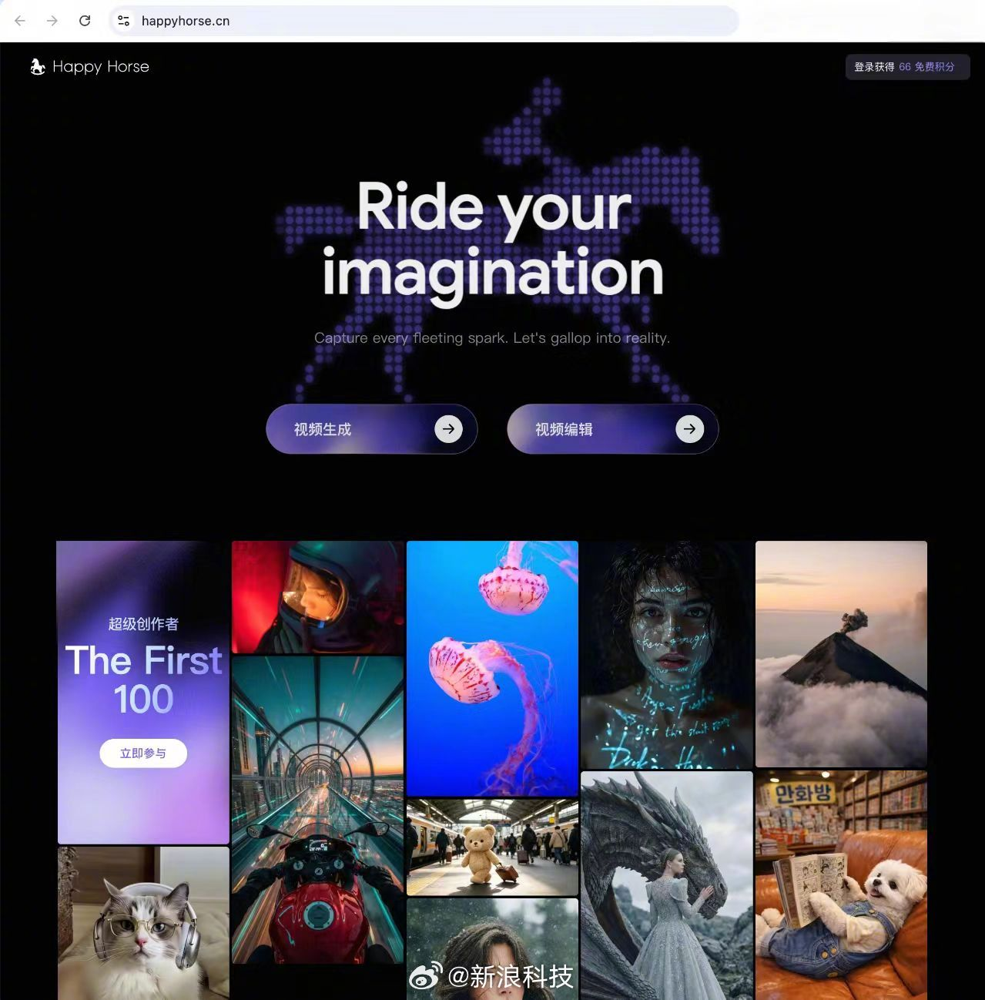

@新浪科技
发表于：2026-04-27 10:41
来源：微博
链接：https://m.weibo.cn/status/5292385409958009

【\#阿里HappyHorse灰测\#，720P视频生成低至0.44元/秒 】阿里巴巴视频生成模型HappyHorse 1.0开启灰测。全球专业创作者和企业级客户可在HappyHorse官网和阿里云百炼平台注册使用，大众用户可在千问App体验。官网720P视频生成刊例价0.9元/秒。

HappyHorse 1.0依托原生多模态架构，采用音视频联合生成方案，面向广告、电商、短剧、社媒创意等内容生产场景，提供从智能生成到编辑的一体化创作能力。

HappyHorse官网是专业全能的AI视频创作平台，新用户注册享免费额度，720P和1080P的视频生成刊例价分别为0.9元/秒及1.6元/秒，专业会员包月价格叠加限时折扣后为0.44元/秒和0.78元/秒。

HappyHorse 1.0模型主要包括视频生成和视频编辑两大功能，其中视频生成涵盖了主流的文生视频、图生视频以及多图参考生视频的能力，视频编辑支持用对视频进行灵活的二次创作。模型支持15秒多镜头叙事、多画幅适配及1080P超分输出。

灰测阶段，HappyHorse1.0的模型能力仍在不断迭代升级。阿里悟空、MuleRun和JVS Claw等Agent平台也已接入。目前，HappyHorse官网已开启“超级创作者 · The First 100”活动，诚邀海内外AIGC创作者加入，用户可在官网填写问卷报名。（新浪科技）

---

