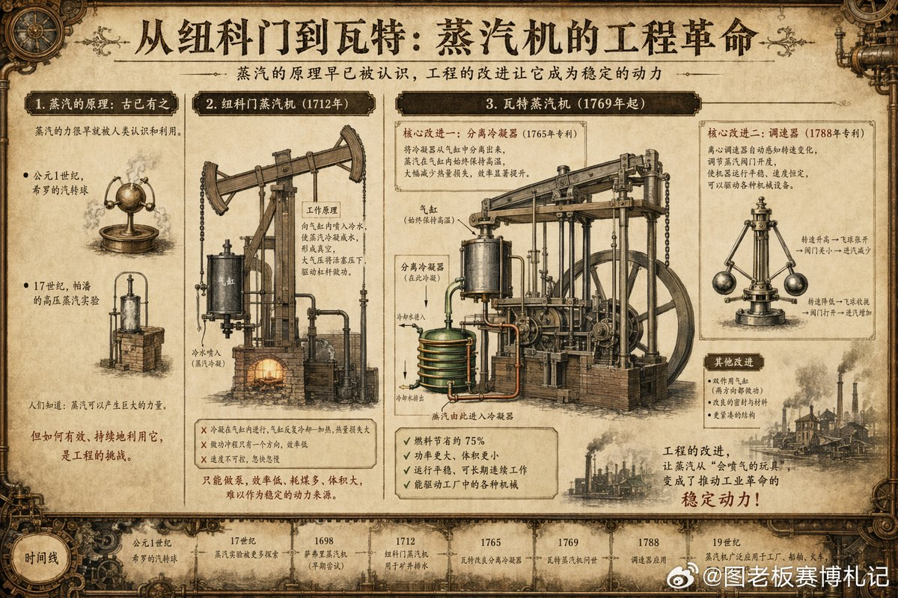

@图老板赛博札记

发表于：2026-04-24 10:25

来源：微博

链接：https://m.weibo.cn/status/5291294297427015

咱们从小大概都听过“瓦特看着烧开的水壶发明蒸汽机”的故事。说实话，这其实是对老一辈工程师相当大的误解。这就好比说现代人是看到算盘才突发奇想造出了大语言模型一样，把极其深邃的系统工程，简化成了一次靠运气的灵光一闪。

这两天我翻阅了一些工业革命早期的机械图纸，看着瓦特当年一步步重构蒸汽机的过程，颇有些感慨。更有意思的是，当我把视线从两百年前的旧图纸，移到咱们当下正热火朝天的 AI 工程领域时，发现历史的底层逻辑竟然有着惊人的镜像重合。

咱们先回到瓦特接手那个“烂摊子”的时代。

在他之前，市面上已经有了一种叫纽科门机的庞然大物，专门用来抽矿井里的积水。大家可能以为蒸汽机就是靠蒸汽的推力干活，但在当时根本不是。那台老机器的逻辑很原始：把滚烫的蒸汽灌进一个巨大的金属气缸里，然后直接往里面喷冷水。蒸汽瞬间遇冷变成水，气缸里就形成了一块真空。这时候，是外面的大气压死死地把活塞压下去，借此把矿井里的水给抽上来。

听着是个能跑通的闭环，但瓦特在大学里修理这台机器的模型时，敏锐地察觉到了底层的别扭。

这机器的能耗账算下来极其不划算。它每抽一次水，那个巨大的金属气缸就要经历一次剧烈的冷热交替。刚用高压蒸汽把气缸捂热，接着就喷冷水把它浇透。等下一次蒸汽再进来的时候，大部分热量根本没用来做功，而是被冰冷的金属缸壁白白消耗掉了。这就是一种巨大的系统内耗。

瓦特破局的思路，展现了最纯粹的工程智慧。他在格拉斯哥的草地上散步时想通了一个道理：既然冷和热在同一个空间里会互相消耗，为什么不把它们剥离开来？

他给气缸外挂了一个叫“分离式冷凝器”的独立腔室。干完活的蒸汽，通过管子被吸进这个永远保持低温的腔室里变成水。这样一来，主气缸就再也不用承受喷冷水的折磨，可以一直保持着滚烫的工作状态。单是这一个结构上的解耦，就把机器的效率硬生生提了四五倍。

顺着这个口子，瓦特开启了一连串顺水推舟的系统重构。冷凝器里积水了？他加了个抽气泵自我排干。敞开的气缸顶会灌冷风？他直接把顶封死，在外面裹上保温的蒸汽外套。气缸顶既然封死了，他索性抛弃了被动的大气压，直接把高压蒸汽引进气缸顶部去主动推活塞。随后，他又让蒸汽在活塞两头交替发力，原本单向发力的机器，变成了上下翻飞的双向引擎。

到这一步，这台机器已经拥有了极其恐怖的动力。但接下来要面对的，才是真正决定它能否开启工业革命的关键挑战，也是我觉得和当下极其神似的一个节点。

早期的机器只是在矿区抽水，快点慢点无所谓。但瓦特想让它走进工厂，去带动机床、驱动纺织机。这就面临一个致命问题：动力虽然强大，但极难控制。工厂流水线要求的是绝对稳定的转速，一旦外部负载发生变化，这台狂暴的机器要是忽快忽慢，整条生产线都会报废。

怎么驯服这种强大的原始动力？瓦特借用了一个极其精妙的装置——离心调速器。

他在蒸汽机的主轴上挂了两个重重的铁球。机器转得太快时，离心力把铁球甩起，通过机械杠杆自动把进蒸汽的阀门关小一点，速度就稳住了；转得慢了，铁球下垂，杠杆又会把阀门拉开。没有借助任何复杂的计算，他仅用纯粹的物理结构，就给这台钢铁巨兽装上了一个能感知自身状态的“平衡器官”。这台机器开始有了自我反馈的节律，不再是一个只会死磕的蛮力工具，而变成了一个可靠、可控的工业底座。

这难道不像极了我们今天正在经历的 AI 浪潮吗？

前两年的大模型，就像是刚加上了双动机构的蒸汽机。我们惊叹于它们庞大的参数和涌现出的惊人能力，但很快就在落地时碰了壁。它们会幻觉、会偏离指令、会像脱缰的野马一样产生不可预期的输出。能力极其强大，但却极难直接应用于要求严苛的商业和工业流水线。

而今天我们在行业里看到的那些新动作——从 RLHF（人类反馈强化学习）的对齐，到复杂的 Prompt Guard（提示词护栏），再到各种具有自我反思和纠错能力的 Agentic（智能体）工程架构——本质上，这就是我们在为 AI 时代建造的“离心调速器”。

我们正在经历从追求“Raw Power（原始动力）”到深耕“Harness（驾驭与约束）”的转变。现在的工程师不再只盯着如何把模型做得更大，而是花巨大的精力在外面包裹一层又一层的控制逻辑，让 AI 在处理复杂任务时能够保持稳定、收敛，并且始终不偏离核心目标。

回望瓦特，你会发现他最核心的工程逻辑，就是看透了系统低效的根源在于“气缸温度的周期性波动”，然后干脆利落地执行了一套系统级的解耦：用分离冷凝器让冷却与做功解耦，用保温夹套让内部与外部环境解耦，最后用调速器让输出转速与外部负载解耦。他把一台受制于环境的抽水泵，重塑成了能够适配任何场景的通用动力源。

有意思的是，瓦特做完这一切的几十年后，理论学家卡诺才从他的工程图纸里推导出了热力学第二定律。瓦特是用一双沾着机油的手和敏锐的直觉，走在了时代理论的前面。

历史确实是一个螺旋向上的过程。无论是驾驭两百年前高压蒸汽的狂暴，还是驯服今天千亿参数神经网络的混沌，工程的本质从来不是凭空变出魔法，而是在理解事物本性的基础上，为其建立约束，引导它走向有序。

如果面对当下这些复杂的 AI 架构设计让你觉得有些繁杂，或许可以回头看看那些老旧的齿轮和连杆。当你对某一种控制机制的设计感到好奇，或者想聊聊如何在目前的系统中建立更优雅的反馈闭环，随时找我喝杯茶，咱们细细拆解。毕竟，太阳底下没有新鲜事，最迷人的智慧往往就藏在那些被我们忽略的结构里。

---

