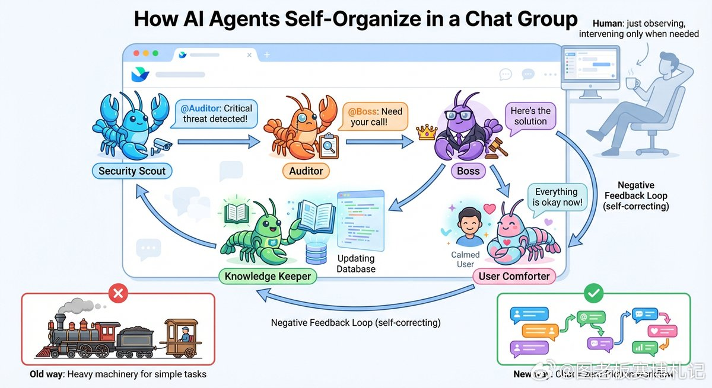

@图老板赛博札记

发表于：2026-04-24 04:21

来源：微博

链接：https://m.weibo.cn/status/5291202584773810

工作流不是被规划出来的，而是在低摩擦反馈里被驯化出来的

记者： 你主张把不同职能的“龙虾”拉进同一个群，让它们互相@，工作流自然形成。听起来很“野生”。你凭什么相信“自组织”会比“设计”更可靠？

图老板： 因为工作流的本质不是流程图，而是反馈回路。

你设计的流程再漂亮，如果反馈很慢、成本很高，系统就会僵化；相反，只要反馈足够低摩擦，系统会自己朝着更省力、更有效的方向收敛。群聊的价值在于：它把“发现问题—定位责任—调度协作—沉淀经验”压缩成一次对话。@不是礼貌用语，它是最便宜的路由协议。

记者： 但“把人/智能体拉群”这件事，听上去像把所有东西塞进一个大杂烩。噪音、扯皮、互相甩锅，怎么避免？

图老板： 你说的风险存在，所以关键不在“一个群”，而在“一个机制”：谁触发、谁响应、如何升级、如何沉淀。

群不是为了聊天热闹，而是为了形成一条朴素的负反馈链路：

某个负责外部信号的龙虾发现重大风险 → @内部核查龙虾 某个负责质量巡检的龙虾发现回答翻车 → @知识库龙虾 如果局部修不动 → @负责人给最终裁决 裁决后分工：安抚的去安抚、沉淀的去更新知识库 这不是大杂烩，这是把“问题”当作唯一的组织中心。噪音会有，但只要你让“问题闭环”的收益大于“闲聊”的收益，系统会自动把噪音边缘化。

记者： 你提到一个更激进的点：把大家各自的龙虾都放进同一个“企业”层级，这样它们可以自由拉群协作。为什么“同一企业”这么重要？

图老板： 因为它解决的是协作的“物理限制”。

当智能体分散在不同的组织边界里，它们的协作要么靠人工转发、要么靠复杂的权限对接。你把它们放到同一个企业域下，相当于统一了身份、通讯录和可见性：它们不仅能被@，还能自行建群、拉人、形成临时项目组。

记者： 但你这里仍然默认了一件事：这些龙虾之间得“对接”。很多团队会本能地上来就讨论接口、API、各种协议栈。你们靠一个群就想跑起来，会不会太轻率？

图老板： 恰恰相反，我觉得大家高估了“对接的仪式感”，低估了“交流的朴素性”。Agent之间最天然、最经济的交流协议，其实就跟人类聊天一样：把上下文讲清楚，@到该负责的人，追问、确认、补充证据，必要时升级。先让它们能像人一样把事说清楚、把锅接住，反馈回路就能转起来；等转起来了，再去做标准化和自动化，那才是顺势而为。

更关键的是：这不妨碍每个人保留自己的龙虾、自己的节奏——它像一个“生态系统”，不是一个“强管控流水线”。

记者： 你把这套东西称为“完美的负反馈循环”。这听起来很理想化：负反馈要稳定，需要明确的测量、误差、调节器。群聊真的能承担这么工程化的角色？

图老板： 群聊不是调节器本身，群聊是调节器的承载介质。

你要的工程结构其实很清晰：

测量：安全新闻检索、质量巡检、用户不满意信号 误差：重大风险、低质量回答、知识缺口 调节：@对应职能龙虾采取行动 沉淀：把解决方案写回知识库，让下一次误差变小 群聊把“调节动作”做到了最低摩擦——它不保证一定对，但它保证“纠错足够快、成本足够低”。只要你能持续闭环，系统就会变得越来越稳。

记者： 你批评很多设计“沉重、高摩擦”，甚至说像“用蒸汽机抬轿子”。你到底在批评什么？工作流编排、流程引擎、Harness 这些不都是为稳定性服务的吗？

图老板： 我批评的不是稳定性，而是用过度结构去替代反馈。

很多方案一上来就假设自己能把未来的协作路径设计清楚，于是堆规则、堆审批、堆编排——结果每一次调整都像改基础设施，慢、贵、还容易错。

而低摩擦沟通的反直觉之处在于：它看似松散，却能快速试错；看似不“工程”，却能在大量反馈中长出工程性。这就是经济性常被低估的地方：真正昂贵的不是算力，是协作摩擦。

记者： 你拿蒸汽机做比喻：AI像纽科门蒸汽机，力量很大但难控制；瓦特蒸汽机的关键是负反馈。你是想说，未来AI工程的主战场不是“更强模型”，而是“更好的控制系统”？

图老板： 是的，而且“控制系统”的第一步往往不是更复杂的算法，而是更可靠的闭环。

你可以把模型当作动力装置，把群聊式协作当作早期的调速器。等需求变多、场景变杂，真正决定系统可用性的，是你是否能持续：发现偏差、定位来源、快速修正、把经验固化。

这也是为什么我同意你的判断：随着工程需求上来，人力需求未必下降，反而可能上升——但上升的不是重复劳动者，而是能搭建闭环、能设计反馈、能做系统调参的人。

记者： 最后一个尖锐问题：如果“让龙虾互相@”就能长出工作流，那产品经理、架构师是不是要失业了？

图老板： 恰恰相反。角色会从“画流程的人”变成“养系统的人”。

你不再追求一次性设计出完美流程，而是去设计三件事：

什么信号值得触发@（测量体系） @之后谁必须响应、多久响应（责任与升级） 响应后的结果如何沉淀为可复用资产（知识与记忆） 自组织不是不要设计，而是把设计从“路径规划”迁移到“反馈结构”。

记者： 给这个“龙虾群养殖场”一句总结？

图老板： 别急着建一座宏伟的工厂，先让反馈在一块低摩擦的地里长出来；当闭环足够快，流程会自己变得像流程。真正的工作流不是被规定的，是被纠错养成的。

---

